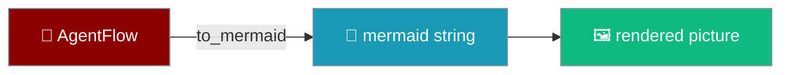
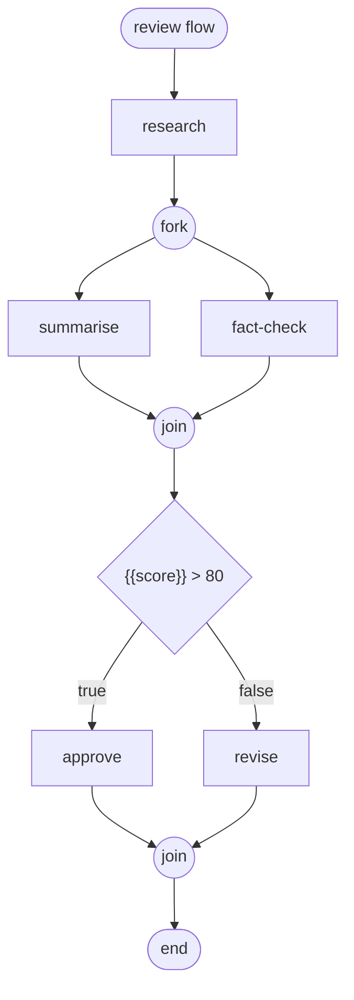
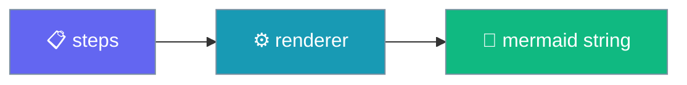
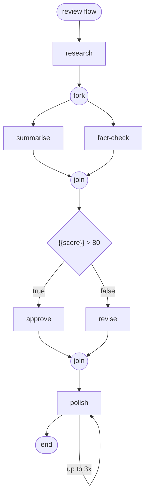
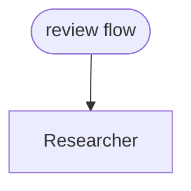

See your workflow before it runs.

```python
from praisonaiagents import Agent, AgentFlow

researcher = Agent(name="Researcher", instructions="Research the topic.")
writer     = Agent(name="Writer",     instructions="Write a summary.")

flow = AgentFlow(steps=[researcher, writer], name="review flow")
print(flow.to_mermaid())
```

`flow.to_mermaid()` reads the step list and returns a mermaid `graph TD` string — no execution, no cost.



## Quick Start

<Steps>
<Step title="Print a diagram">

```python
from praisonaiagents import Agent, AgentFlow

researcher = Agent(name="Researcher", instructions="Research the topic.")
writer     = Agent(name="Writer",     instructions="Write a summary.")

flow = AgentFlow(steps=[researcher, writer], name="review flow")
print(flow.to_mermaid())
```

Output:

```
graph TD
  n0(["review flow"])
  n1["Researcher"]
  n0 --> n1
  n2["Writer"]
  n1 --> n2
  n3([" end "])
  n2 --> n3
```

</Step>

<Step title="Preview a branching flow">

```python
from praisonaiagents import Agent, AgentFlow, Parallel, If

flow = AgentFlow(
    name="review flow",
    steps=[
        Agent(name="research"),
        Parallel(steps=[Agent(name="summarise"), Agent(name="fact-check")]),
        If(
            condition="{{score}} > 80",
            then_steps=[Agent(name="approve")],
            else_steps=[Agent(name="revise")],
        ),
    ],
)

print(flow.to_mermaid())
```

The string renders inline on GitHub and in docs:



</Step>
</Steps>

---

## How It Works

The renderer walks the step list — no run, no LLM calls.



A step's label resolves in order: `step.name` → `step.__name__` → `step.agent.name` → the string itself → the class name. Special characters are handled for you — a `"` becomes `'` and newlines become spaces, so a name can never break the graph.

---

## How Each Step Type Renders

Each step type maps to a mermaid shape.

| Step type | How it renders |
|-----------|----------------|
| Plain step (Agent, Task, callable, or string) | Rectangle node `["name"]` |
| `Parallel(steps=[...])` | `(("fork"))` → one edge per branch → `(("join"))` |
| `If(condition=..., then_steps=..., else_steps=...)` | Decision diamond `{"condition"}` with `\|"true"\|` and (if present) `\|"false"\|` edges, joined by `(("join"))` |
| `Route(routes={...})` | Router diamond `{"route"}` with one labelled edge per route key, joined by `(("join"))` |
| `Loop(...)` / `Repeat(...)` | Inner steps, then a labelled back-edge to the first inner node — `"over {items}"`, `"up to {n}x"`, or `"repeat"` |
| `Include(workflow=<Workflow>)` | Workflow inlined — its steps render in place |
| `Include(recipe="...")` | Stays a single opaque node — the recipe resolves only at runtime |

A control nested inside a branch (an `If` inside another `If`) enters at its own decision, not at its parent's exit, so it is never bypassed.

Full example combining `Parallel`, `If`, and `Repeat`:

```python
from praisonaiagents import Agent, AgentFlow, Parallel, If, Repeat

flow = AgentFlow(
    name="review flow",
    steps=[
        Agent(name="research"),
        Parallel(steps=[Agent(name="summarise"), Agent(name="fact-check")]),
        If(
            condition="{{score}} > 80",
            then_steps=[Agent(name="approve")],
            else_steps=[Agent(name="revise")],
        ),
        Repeat(Agent(name="polish"), max_iterations=3),
    ],
)

print(flow.to_mermaid())
```



---

## Common Patterns

Sanity-check a flow before running it:

```python
print(flow.to_mermaid())
flow.start("Latest breakthroughs in AI agents")
```

Save the diagram to a file:

```python
from pathlib import Path

Path("flow.mmd").write_text(flow.to_mermaid())
```

Embed in a README — paste the output inside a fenced `mermaid` block and GitHub renders it inline:

````markdown

````

---

## Best Practices

<AccordionGroup>
<Accordion title="Name your steps">
Give each step a `name=` so labels read cleanly. The fallback chain is `name` → `__name__` → `agent.name` → string → class name, so unnamed callables show up as their function or class name.
</Accordion>

<Accordion title="Prefer to_mermaid() over the telemetry trace for unrun flows">
Telemetry diagrams need a captured execution — they only exist after a flow has run. `to_mermaid()` works on the definition alone, so use it to check a flow you haven't run yet.
</Accordion>

<Accordion title="Nested controls stay connected">
An `If` inside an `If`, or a `Parallel` inside a route branch, works. The renderer wires each control through its own decision or fork, so nothing is bypassed.
</Accordion>

<Accordion title="Expand includes with a workflow, not a recipe">
`Include(workflow=...)` inlines the included steps because they are known at definition time. `Include(recipe="...")` stays a single node — the recipe resolves only at runtime. Use `workflow=` if you want it expanded in the picture.
</Accordion>
</AccordionGroup>

---

## Related

<CardGroup cols={2}>
<Card title="Workflows" icon="diagram-project" href="/features/workflows">
Build sequential, parallel, routed, and looped pipelines with AgentFlow.
</Card>
<Card title="Workflow Patterns" icon="sitemap" href="/features/workflow-patterns">
Reusable shapes for common orchestration scenarios.
</Card>
</CardGroup>
