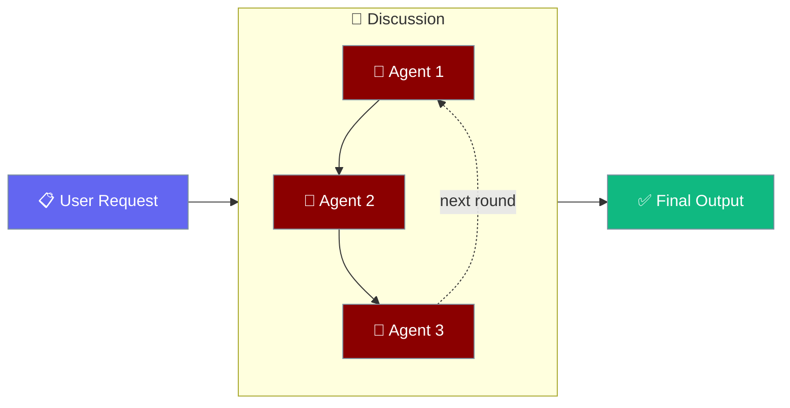
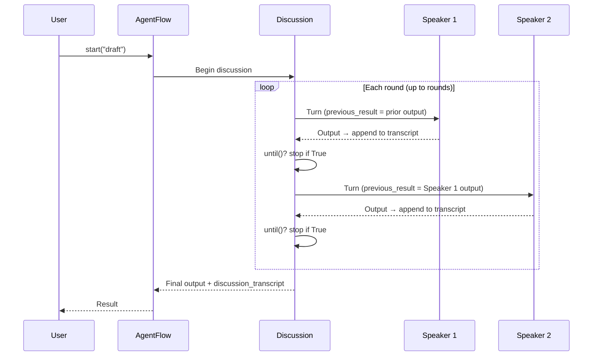
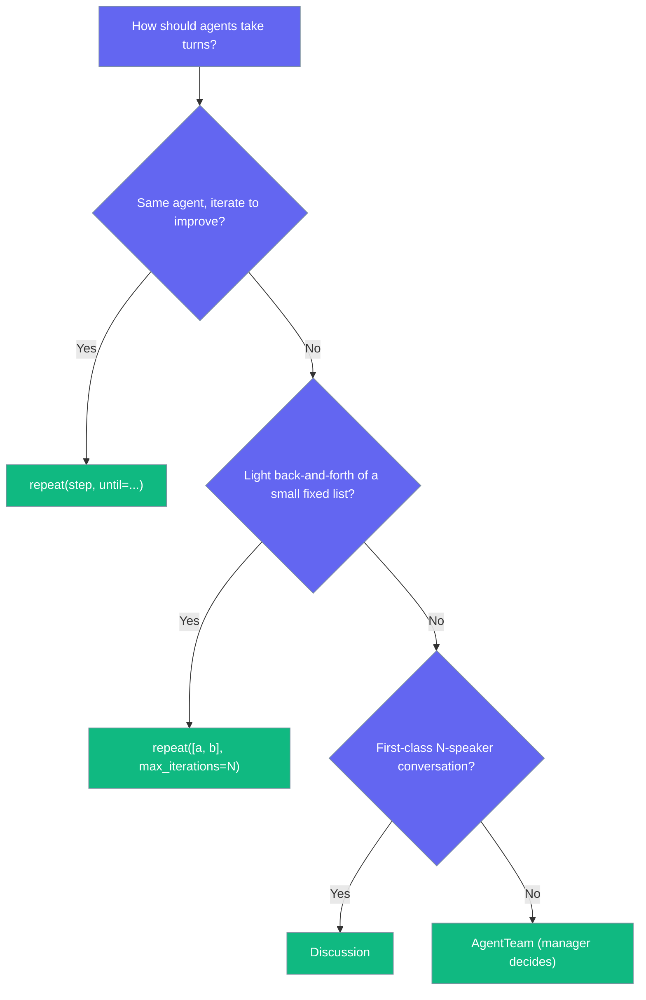

Discussion runs N agents in turn on a shared thread until a criterion is met — round-robin by default, with an optional stop condition.

```python
from praisonaiagents import Agent, AgentFlow, Discussion

critic = Agent(name="critic", instructions="Critique the draft rigorously")
author = Agent(name="author", instructions="Revise the draft")

flow = AgentFlow(
    agents=[critic, author],
    steps=[
        Discussion(
            [critic, author],
            rounds=3,
            until=lambda ctx: "AGREED" in (ctx.previous_result or ""),
        )
    ],
)
flow.start("Draft: Renewable energy is the only path forward.")
```

The user hands in a draft; the two agents take turns refining it until they agree.



## Quick Start

<Steps>
<Step title="Two agents, two rounds">
```python
from praisonaiagents import Agent, AgentFlow, Discussion

critic = Agent(name="critic", instructions="Critique the draft rigorously")
author = Agent(name="author", instructions="Revise the draft")

flow = AgentFlow(
    agents=[critic, author],
    steps=[Discussion([critic, author], rounds=2)],
)
flow.start("Draft: Renewable energy is the only path forward.")
```

Turn order: `['critic', 'author', 'critic', 'author']` — two full passes.
</Step>

<Step title="Add an early stop">
```python
from praisonaiagents import Agent, AgentFlow, Discussion

critic = Agent(name="critic", instructions="Critique the draft rigorously")
author = Agent(name="author", instructions="Revise the draft; say AGREED when satisfied")

flow = AgentFlow(
    agents=[critic, author],
    steps=[
        Discussion(
            [critic, author],
            rounds=3,
            until=lambda ctx: "AGREED" in (ctx.previous_result or ""),
        )
    ],
)
flow.start("Draft: Renewable energy is the only path forward.")
```

The loop exits as soon as any turn returns text containing `AGREED`.
</Step>
</Steps>

---

## How It Works



| Phase | What happens |
|---|---|
| 1. Compose | You list the speakers and set `rounds` |
| 2. Turn | The next speaker runs; its `previous_result` is the prior speaker's output |
| 3. Transcript | The turn is appended to `discussion_transcript` as `"{speaker}: {output}"` |
| 4. Evaluate | `until()` is checked after every turn; `True` stops immediately |
| 5. Return | Final output and the full transcript flow to the next step |

---

## API Reference

### Discussion

```python
Discussion(
    agents=None,                                          # Speakers who take turns (required, non-empty)
    rounds: int = 3,                                       # Full passes over the speaker list (>= 1)
    until=None,                                            # Early-stop predicate, checked after every turn
    select=None,                                           # Custom speaker selector: (turn_index, ctx) -> agent
    name: str = "discussion",                              # Label used in step names and verbose output
)
```

### Parameters

| Parameter | Type | Default | Description |
|-----------|------|---------|-------------|
| `agents` | `list` | required (non-empty) | Speakers who take turns. Each element can be an `Agent`, a `Task`, or a callable step handler. An empty list is refused at construction with `ValueError("Discussion needs at least one speaker...")`. |
| `rounds` | `int` | `3` | Number of full passes over the speaker list. Must be `>= 1` — an unbounded debate is explicitly refused as "a bill, not a feature". Zero or negative raises `ValueError("Discussion rounds must be >= 1.")`. |
| `until` | `Callable[[WorkflowContext], bool]` \| `None` | `None` | Early-stop predicate. Called **after every turn**. Returning `True` stops the discussion immediately. If `until()` raises, the exception is **not** swallowed — the discussion halts with `ValueError("Discussion until() raised ...")`. |
| `select` | `Callable[[int, WorkflowContext], Agent]` \| `None` | `None` | Custom speaker selector. Signature: `(turn_index, context) -> agent`. When set, consulted for **every turn** — a custom selector can repeat, skip, or reorder speakers. When `None`, round-robin is used (the default). |
| `name` | `str` | `"discussion"` | Label used in step names and verbose output. |

### Result Variables

| Variable | Type | Description |
|----------|------|-------------|
| `discussion_transcript` | `str` | Full running transcript, `"{speaker}: {output}"` lines joined by `\n`. Access via `result.get("variables")["discussion_transcript"]` on the run result, or as `{{discussion_transcript}}` in a later step's prompt/action. |

<Note>
The transcript lands on the **run result's** `variables` (i.e. `result.get("variables")` from `flow.run(...)`) — **not** on `flow.variables`, which stays the declared initial state a second run would start from.
</Note>

---

## Common Patterns

### Round-robin debate

Default behavior — position `i` in round `r` runs `agents[i]`, no selector needed.

```python
from praisonaiagents import Agent, AgentFlow, Discussion

optimist = Agent(name="optimist", instructions="Argue for the proposal")
skeptic = Agent(name="skeptic", instructions="Argue against the proposal")

flow = AgentFlow(
    agents=[optimist, skeptic],
    steps=[Discussion([optimist, skeptic], rounds=3)],
)
flow.start("Should we adopt a four-day work week?")
```

### Custom speaker selection

Set `select=` to choose the next speaker per turn. The signature is `(turn_index, context) -> agent`.

```python
from praisonaiagents import Agent, AgentFlow, Discussion

expert = Agent(name="expert", instructions="Answer with authority")
scribe = Agent(name="scribe", instructions="Summarize the last answer")

# Alternate, but let the expert always open each pair of turns
flow = AgentFlow(
    agents=[expert, scribe],
    steps=[
        Discussion(
            [expert, scribe],
            rounds=2,
            select=lambda turn, ctx: expert if turn % 2 == 0 else scribe,
        )
    ],
)
flow.start("Explain vector databases")
```

### Early stop with `until=`

Stop as soon as a consensus keyword appears in the latest turn.

```python
until=lambda ctx: "AGREED" in (ctx.previous_result or "")
```

### Using the transcript downstream

Follow the discussion with a summarizer whose prompt references `{{discussion_transcript}}`.

```python
from praisonaiagents import Agent, AgentFlow, Discussion

critic = Agent(name="critic", instructions="Critique the draft")
author = Agent(name="author", instructions="Revise the draft")
summarizer = Agent(
    name="summarizer",
    instructions="Summarize this debate:\n{{discussion_transcript}}",
)

flow = AgentFlow(
    agents=[critic, author, summarizer],
    steps=[
        Discussion([critic, author], rounds=2),
        summarizer,
    ],
)
flow.start("Draft: Renewable energy is the only path forward.")
```

---

## Refusals / Guardrails

Discussion is opinionated — it fails loudly rather than quietly wasting spend.

| Refusal | Why |
|---------|-----|
| Empty speaker list → `ValueError` at construction | Zero speakers would run zero turns and report success — the "flattering kind of failure". |
| `rounds < 1` → `ValueError` | Unbounded debate is a bill, not a feature. |
| Broken `until()` → wrapped `ValueError`, not silently ignored | Swallowing it would turn a bounded discussion into rounds of spend, and the symptom would arrive as a bill instead of an error. |

---

## Stop Propagation

<Note>
A speaker with `on_error="stop"` (the `Task` default) halts the **entire enclosing workflow**, not just the discussion — later steps do not run. This mirrors `route()`, `loop()`, `repeat()`, `parallel()`, and `if_()`. See [Workflow Error Handling](/features/workflow-error-handling).
</Note>

---

## Nesting

`Discussion` is a first-class workflow step and runs correctly inside `loop`, `parallel`, `route`, `if_`, and `repeat`.

```python
from praisonaiagents import Agent, AgentFlow, Discussion, loop

critic = Agent(name="critic", instructions="Critique this item")
author = Agent(name="author", instructions="Revise this item")

flow = AgentFlow(
    agents=[critic, author],
    steps=[loop(steps=[Discussion([critic, author], rounds=2)], over="items")],
    variables={"items": ["draft A", "draft B"]},
)
flow.start("Refine each draft")
```

See [Nested Workflows](/features/nested-workflows).

---

## Discussion vs. Repeat vs. AgentTeam

| Feature | `repeat()` | `Discussion` | `AgentTeam` (hierarchical) |
|---------|-----------|--------------|----------------------------|
| Same agent per iteration | ✔ | ✘ (rotates by default) | manager-delegated |
| Fixed list per iteration | ✔ (`repeat([a, b])`) | ✔ | ✔ (manager decides) |
| N agents in turn | light (fixed list) | ✔ (round-robin/custom) | ✔ (manager decides) |
| Shared transcript between speakers | ✘ | ✔ | ✔ |
| Early stop condition | ✔ (`until=`) | ✔ (`until=`) | based on manager |
| Custom next-speaker selector | n/a | ✔ (`select=`) | manager-driven |



---

## Best Practices

<AccordionGroup>
  <Accordion title="Keep rounds small">
    Start at 2–3; every additional round is a full pass over every speaker.
  </Accordion>
  <Accordion title="Give each speaker a distinct role">
    A critic + an author debate is more useful than two agents with identical instructions.
  </Accordion>
  <Accordion title="Use until= for consensus signals">
    A keyword like `AGREED` is more reliable than string-similarity heuristics.
  </Accordion>
  <Accordion title="Reference {{discussion_transcript}} explicitly">
    A summarizer that receives only `previous_result` sees just the final turn.
  </Accordion>
</AccordionGroup>

---

## Related

<CardGroup cols={2}>
  <Card title="Workflow Patterns" icon="diagram-project" href="/features/workflow-patterns">
    Overview of routing, parallel, loop, and repeat
  </Card>
  <Card title="Workflow Repeat" icon="rotate" href="/features/workflow-repeat">
    Repeat a step or fixed list of steps until a condition is met
  </Card>
  <Card title="Workflow Loop" icon="arrows-rotate" href="/features/workflow-loop">
    Iterate over lists and files
  </Card>
  <Card title="Workflow Error Handling" icon="shield-halved" href="/features/workflow-error-handling">
    How stop propagates through nested patterns
  </Card>
  <Card title="Nested Workflows" icon="layer-group" href="/features/nested-workflows">
    Compose Discussion inside loop, parallel, route, and repeat
  </Card>
</CardGroup>
