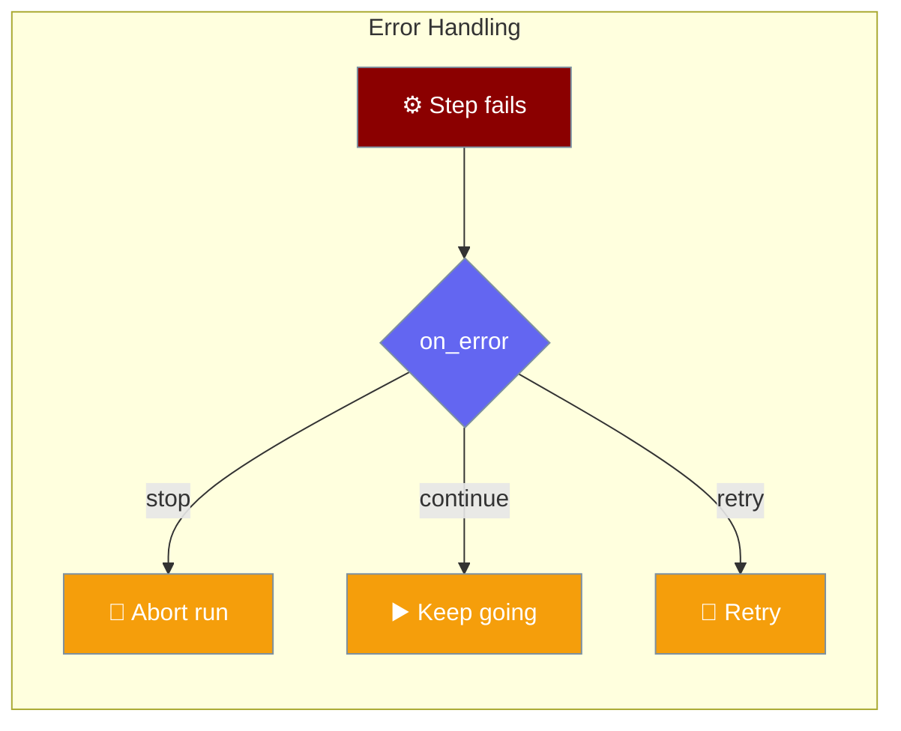
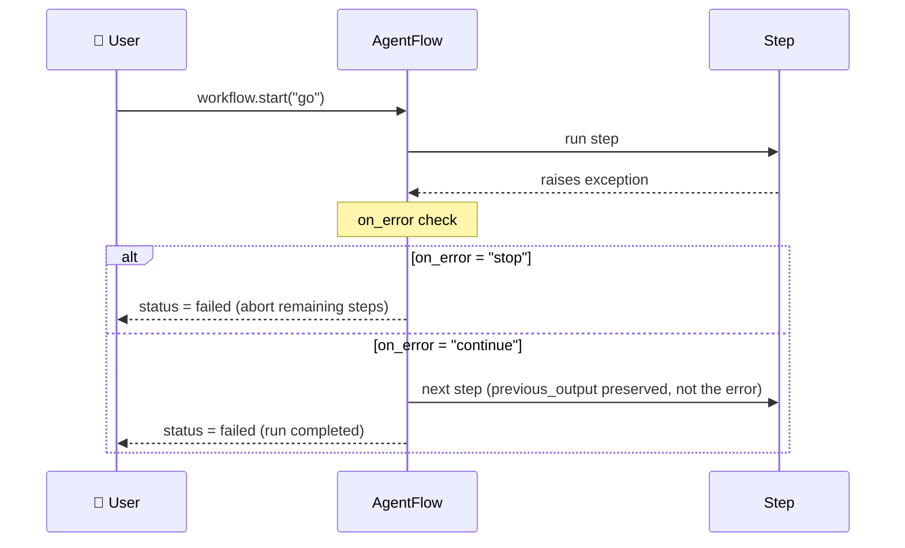
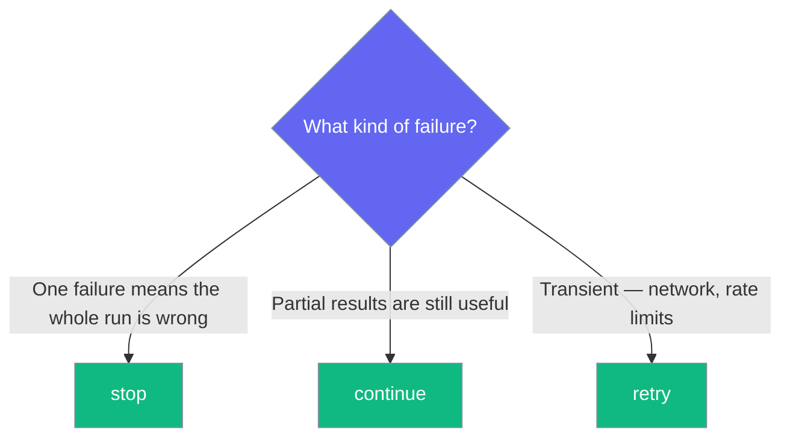

Every workflow step decides what happens when it fails. By default a failure stops the whole run — but you can also continue past it or retry.



The simplest failing pipeline: `on_error="stop"` (the `Task` default) aborts the run the moment a step raises.

```python
from praisonaiagents import Task, AgentFlow, WorkflowContext, StepResult

def boom(ctx: WorkflowContext) -> StepResult:
    raise RuntimeError("boom")

def after(ctx: WorkflowContext) -> StepResult:
    return StepResult(output="this never runs")

workflow = AgentFlow(steps=[
    Task(name="boom", handler=boom, max_retries=0),
    Task(name="after", handler=after),
])
result = workflow.start("go")

print(result["status"])  # "failed" — after() never ran
```

## How it Works

A step raises, `on_error` is consulted, and the run either aborts or keeps going — but the final status reflects the failure either way.



## Which mode when?

Pick the mode that matches how much a single failure should affect the run.



- **Stop** → data integrity matters; one failure means the whole run is wrong.
- **Continue** → batch processing; partial results are useful.
- **Retry** → transient failures like network blips or rate limits.

## `on_error` Options

| Value | Behavior |
|-------|----------|
| `"stop"` (default) | Failing step aborts the whole workflow, `status="failed"`. Downstream steps do not run. Exception is not fed to the next step. |
| `"continue"` | Failing step is recorded as `failed`; the workflow keeps going. Final `status="failed"` if any step failed. Exception is not fed to the next step. |
| `"retry"` | Same as `stop`, but only after `max_retries` are exhausted. |

## Retry Configuration

Set `max_retries` on flaky steps. Retries use exponential backoff of `2 ** (attempt - 1)` seconds between attempts.

```python
from praisonaiagents import Task, AgentFlow

class TransientError(Exception):
    is_retryable = True   # honoured by the retry machinery

flow = AgentFlow(steps=[
    Task(name="fetch", handler=fetch_data, max_retries=3, on_error="retry"),
])
flow.start("go")
```

- **`max_retries`** — how many extra attempts before the step is considered failed (default `3`).
- **`is_retryable`** — set `False` on your exception class to short-circuit retries for known non-retryable failures.
- Backoff between attempts is `2 ** (attempt - 1)` seconds.

## Guardrail Failures

A guardrail that never validates after exhausting its retries is treated like an exception — it surfaces as `step_error` and follows the same `on_error` rules. See [Guardrails](/features/guardrails) for validator configuration.

## Errors in Nested Patterns

As of PR [#4194](https://github.com/MervinPraison/PraisonAI/pull/4194), the same rules apply inside every nested pattern. A stopping step propagates out of the pattern and aborts the enclosing workflow.

<AccordionGroup>
  <Accordion title="In loop">
    Sequential and parallel iterations both honour `on_error`. A stopping iteration halts the enclosing workflow, not just the loop.

    ```python
    from praisonaiagents import Task, AgentFlow, WorkflowContext, StepResult, loop

    def boom(ctx: WorkflowContext) -> StepResult:
        raise RuntimeError("boom")

    def after(ctx: WorkflowContext) -> StepResult:
        return StepResult(output="this never runs")

    workflow = AgentFlow(
        steps=[
            loop(steps=[Task(name="boom", handler=boom, max_retries=0)], over="items"),
            Task(name="after", handler=after),
        ],
        variables={"items": ["only"]},
    )
    result = workflow.start("go")

    print(result["status"])                                     # "failed"
    print(any(s["step"] == "after" for s in result["steps"]))   # False
    ```
  </Accordion>

  <Accordion title="In parallel">
    The three `on_failure` modes now behave differently (see the table below).

    ```python
    from praisonaiagents import Task, AgentFlow, WorkflowContext, StepResult, parallel, loop

    def boom(ctx: WorkflowContext) -> StepResult:
        raise RuntimeError("boom")

    workflow = AgentFlow(steps=[
        parallel(
            [loop(steps=[Task(name="boom", handler=boom, max_retries=0)], over="items")],
            on_failure="fail_fast",
        )
    ], variables={"items": ["only"]})

    result = workflow.start("go")
    print(result["status"])  # "failed"
    ```
  </Accordion>

  <Accordion title="In when / if_">
    A stopping step inside a conditional branch stops the workflow, not just the branch.
  </Accordion>

  <Accordion title="In route">
    A stopping step inside the matched route stops the workflow.
  </Accordion>

  <Accordion title="In repeat">
    A stopping iteration ends the repeat loop and the workflow.
  </Accordion>
</AccordionGroup>

### `on_error="continue"` keeps running

```python
from praisonaiagents import Task, AgentFlow, WorkflowContext, StepResult, loop

def boom(ctx: WorkflowContext) -> StepResult:
    raise RuntimeError("boom")

workflow = AgentFlow(
    steps=[loop(
        steps=[Task(name="boom", handler=boom, on_error="continue", max_retries=0)],
        over="items",
    )],
    variables={"items": ["a", "b", "c"]},
)
result = workflow.start("go")

print(result["status"])  # "failed" — the run keeps going but reports failure
```

The exception text is never fed to the next step. A downstream step receives the last successful output (or the initial input), never `"Error: boom"`.

## Reading the Result

Inspect `result["status"]` and each step's `error` field to find what failed.

```python
result = workflow.start("go")
if result["status"] == "failed":
    for step in result["steps"]:
        if step.get("error"):
            print(f"{step['step']} failed: {step['error']}")
```

You can also read `workflow.step_statuses` for a per-step status map after the run.

## `parallel(on_failure=...)` Modes

| Mode | When any branch fails |
|------|-----------------------|
| `fail_fast` | Cancel remaining branches, raise `WorkflowStepError` immediately. |
| `fail_all` | Let all branches finish, then raise with the collected errors. |
| `partial_ok` | Record the failure, keep the other branches, return combined output. |

In every mode the whole run is marked `failed`. With `partial_ok`, the failing branch is recorded as `{"output": None, "error": str(e)}` — the exception text is not folded into the branch output.

As of PraisonAI [#4203](https://github.com/MervinPraison/PraisonAI/pull/4203), `Parallel` propagates a nested `on_error="stop"` → halts the workflow (matches `Route` / `Loop` / `Repeat` / `If`), even under `partial_ok`. The `None` recorded for the failed branch stays index-aligned with its step, so `parallel_outputs[i]` is always the result of `parallel_step.steps[i]`. See [Stop propagation from nested steps](/features/workflow-parallel#stop-propagation-from-nested-steps).

## Behavior Change

<Warning>
Runs that previously reported `completed` while containing a failed step now correctly report `failed`. If you built on the old (broken) behaviour you may see "new" failures appear — this is intentional, the old behaviour was silent data corruption. See PR [#4194](https://github.com/MervinPraison/PraisonAI/pull/4194).
</Warning>

## Best Practices

<AccordionGroup>
  <Accordion title="Default to stop">
    Use `on_error="stop"` unless you have a concrete reason to continue. It keeps a failed run from producing partially-correct output.
  </Accordion>

  <Accordion title="Handle per-item errors inside loops">
    Prefer per-item try/except inside your handler when you want fine-grained control inside `loop(parallel=True)` — convert an expected failure into a valid `StepResult` the rest of the run can consume.
  </Accordion>

  <Accordion title="Retry flaky steps, don't loop them">
    Set `max_retries` on steps that hit the network or LLM rate limits rather than wrapping them in `repeat`.
  </Accordion>

  <Accordion title="Check status before reusing output">
    Never feed a previous step's `output` to a downstream step without checking `result["status"]` first.
  </Accordion>
</AccordionGroup>

## Related

<CardGroup cols={2}>
  <Card title="Workflows" icon="diagram-project" href="/features/workflows">
    Build multi-step workflows with AgentFlow
  </Card>
  <Card title="Nested Workflows" icon="layer-group" href="/features/nested-workflows">
    Combine loops, parallel, and routing patterns
  </Card>
  <Card title="Guardrails" icon="shield-check" href="/features/guardrails">
    Validate step output and retry on failed checks
  </Card>
  <Card title="Workflow Manager API" icon="gear" href="/api-reference/workflow-manager">
    API reference for step statuses and error handling
  </Card>
</CardGroup>
