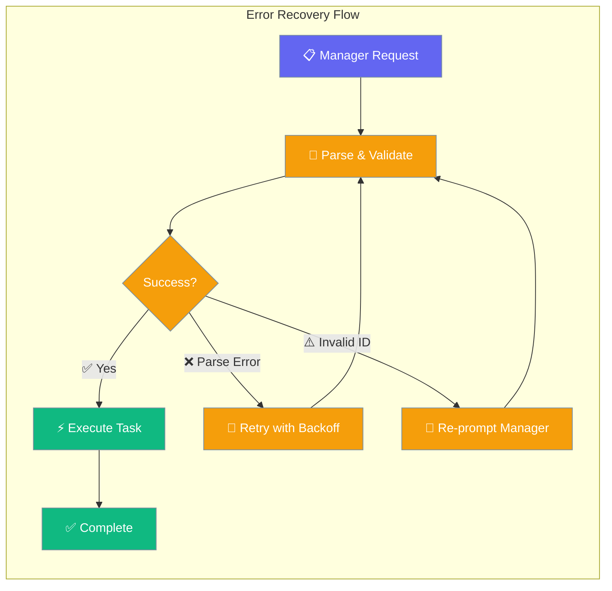

Hierarchical workflows automatically handle common failure modes with built-in retry mechanisms and intelligent error recovery.



## Quick Start

<Steps>
<Step title="Create Hierarchical Workflow">
```python
from praisonaiagents import Agent, Task, AgentTeam

# Create agents
researcher = Agent(
    name="Researcher",
    role="Research Analyst", 
    instructions="Conduct thorough research on topics"
)

writer = Agent(
    name="Writer",
    role="Content Writer",
    instructions="Write engaging content based on research"
)

# Create tasks
research_task = Task(
    description="Research AI trends",
    agent=researcher
)

write_task = Task(
    description="Write article about AI trends", 
    agent=writer
)

# Create team with hierarchical process (enables error recovery)
team = AgentTeam(
    agents=[researcher, writer],
    tasks=[research_task, write_task],
    process="hierarchical",
    manager_llm="gpt-4o"
)
```
</Step>

<Step title="Start Workflow">
```python
# Error recovery happens automatically
result = team.start()

# If manager has parse errors or selects invalid IDs,
# the system retries transparently
print(result)
```
</Step>
</Steps>

---

## How It Works

```mermaid
sequenceDiagram
    participant User
    participant PraisonAIAgents
    participant Manager as Manager LLM
    participant Worker as Worker Agent

    User->>PraisonAIAgents: start()
    
    loop Manager Retry (up to 3x)
        PraisonAIAgents->>Manager: Request task assignment
        Manager-->>PraisonAIAgents: Response (JSON)
        
        alt Parse Success
            PraisonAIAgents->>PraisonAIAgents: Validate task ID
            alt Valid Task ID
                PraisonAIAgents->>Worker: Execute task
                Worker-->>PraisonAIAgents: Task complete
            else Invalid Task ID (up to 3x)
                PraisonAIAgents->>Manager: Re-prompt with valid IDs
            end
        else Parse Error
            Note over PraisonAIAgents: Wait 2s, 4s, 8s (exponential backoff)
        end
    end
    
    PraisonAIAgents-->>User: Final result or error
    
    classDef user fill:#8B0000,stroke:#7C90A0,color:#fff
    classDef system fill:#189AB4,stroke:#7C90A0,color:#fff
    classDef llm fill:#10B981,stroke:#7C90A0,color:#fff
    
    class User user
    class PraisonAIAgents system
    class Manager,Worker llm
```

---

## Configuration Options

| Setting | Value | Description |
|---------|-------|-------------|
| `MAX_MANAGER_RETRIES` | `3` | Maximum parse error retries |
| `MAX_INVALID_SELECTIONS` | `3` | Maximum invalid ID re-prompts |
| Backoff timing | `2s, 4s, 8s` | Exponential backoff delays |

<Note>
These constants are not user-configurable today; they are SDK defaults designed for optimal reliability. Future versions may expose configuration options.
</Note>

### Error Recovery Types

<CardGroup cols={3}>
  <Card title="Parse Failures" icon="code">
    **When**: Manager LLM returns invalid JSON
    **Recovery**: Retry with exponential backoff
    **Max**: 3 attempts before abort
  </Card>
  
  <Card title="Invalid Task IDs" icon="list">
    **When**: Manager selects non-existent task
    **Recovery**: Re-prompt with valid ID list
    **Max**: 3 attempts before abort
  </Card>
  
  <Card title="Loop File Errors" icon="file">
    **When**: Cannot read loop input file
    **Recovery**: Mark task as failed with error
    **Visibility**: Error shown in TaskOutput
  </Card>
</CardGroup>

---


## Best Practices

<AccordionGroup>
  <Accordion title="Start simple">
    Enable the feature with a single parameter before adding configuration. Verify it works, then layer in options.
  </Accordion>
  <Accordion title="Use environment variables for secrets">
    Never hardcode API keys or tokens. Use `os.getenv("KEY_NAME")` to read from environment variables.
  </Accordion>
  <Accordion title="Test with minimal examples first">
    Copy the Quick Start example, run it, then extend it. This confirms your environment is set up correctly.
  </Accordion>
  <Accordion title="Check the logs">
    Set `verbose=True` on your agent to see detailed execution logs when debugging unexpected behavior.
  </Accordion>
</AccordionGroup>

## Related

<CardGroup cols={2}>
  <Card title="Process Types" icon="diagram-project" href="/docs/concepts/process">
    Understanding hierarchical processes
  </Card>
  
  <Card title="Hooks" icon="anchor" href="/docs/concepts/hooks">
    Custom error handling with hooks
  </Card>
</CardGroup>