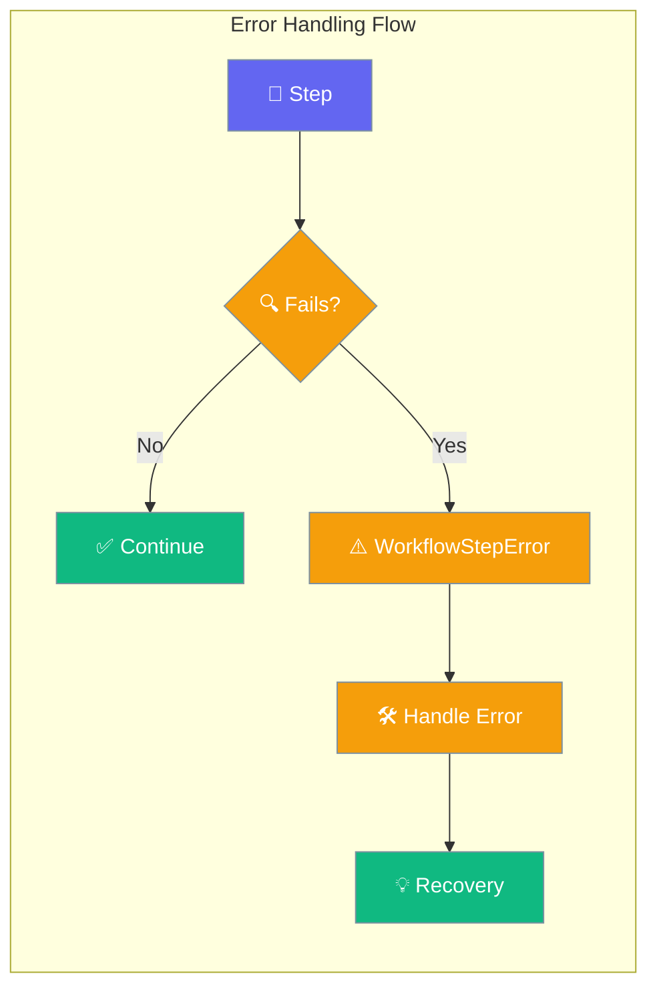
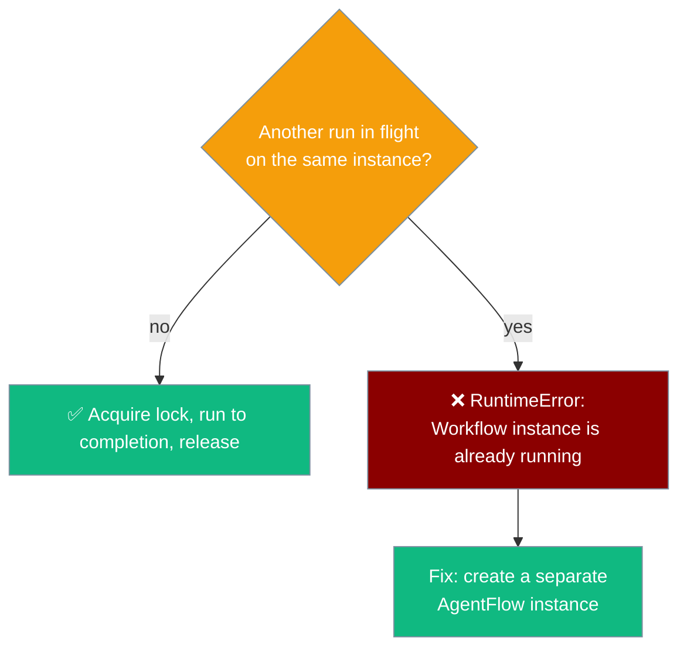
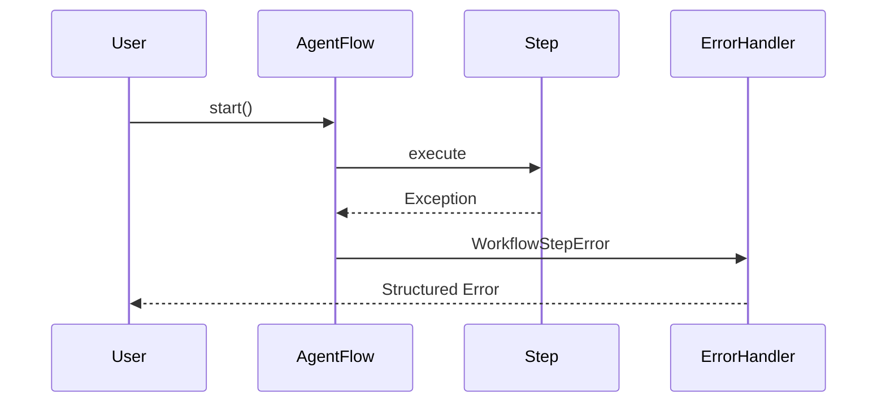
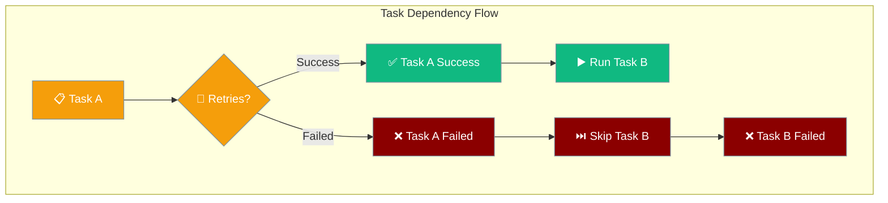

Workflow error handling provides structured exception handling for step failures, enabling robust parallel execution and graceful error recovery.

```python
from praisonaiagents import Agent, AgentFlow, WorkflowStepError

agent = Agent(name="Research Agent", instructions="Research topics that might fail")
workflow = AgentFlow(steps=[agent])

try:
    workflow.start("Research invalid topic")
except WorkflowStepError as e:
    print(f"Step failed: {e}")
```

The user runs a workflow; WorkflowStepError surfaces the failing step and root cause for recovery.



## Running the same workflow instance concurrently

An `AgentFlow` instance is not safe to `run()` (or `astart()`) concurrently on the same object — its per-run mutable state (`status`, `step_statuses`, `_handoff_chain`) would be corrupted. As of PraisonAI [#3086](https://github.com/MervinPraison/PraisonAI/pull/3086), a second concurrent call raises a clear error instead:

```python
from praisonaiagents import Agent, AgentFlow
import threading

flow = AgentFlow(steps=[Agent(name="Worker", instructions="Do the thing")])

def _worker():
    flow.run("input A")   # first thread wins the lock

t1 = threading.Thread(target=_worker)
t1.start()
try:
    flow.run("input B")   # ← RuntimeError while the first run is in flight
except RuntimeError as exc:
    print(exc)
    # This Workflow instance is already running; a Workflow is not safe to run()
    # concurrently on the same object. Create a separate Workflow instance per
    # concurrent run.
t1.join()
```

**Fix:** create one `AgentFlow` instance per concurrent run — either instantiate a fresh `AgentFlow(steps=[...])` on each call, or use a lightweight factory:

```python
from praisonaiagents import Agent, AgentFlow
import threading

def new_flow():
    return AgentFlow(steps=[Agent(name="Worker", instructions="Do the thing")])

# Safe: each thread has its own instance
threads = [threading.Thread(target=lambda x=x: new_flow().run(x)) for x in ("A", "B")]
for t in threads:
    t.start()
for t in threads:
    t.join()
```

<Note>
Sequential re-use of the same instance is fine — the lock is released in a `finally` when a run completes (successfully or not), so the next `run()` call proceeds normally.
</Note>



| Error | When it fires | Fix |
|-------|---------------|-----|
| `RuntimeError("This Workflow instance is already running; ...")` | Second `run()` / `astart()` starts on the same `AgentFlow` while the first is still in flight | Create a separate `AgentFlow` instance per concurrent run |

---

## Quick Start

<Steps>
<Step title="Basic Error Handling">
```python
from praisonaiagents import Agent, AgentFlow, WorkflowStepError

agent = Agent(
    name="Research Agent", 
    instructions="Research topics that might fail"
)

workflow = AgentFlow(steps=[agent])

try:
    result = workflow.start("Research invalid topic")
except WorkflowStepError as e:
    print(f"Workflow failed: {e}")
    print(f"Root cause: {e.cause}")
```
</Step>

<Step title="Handling Multiple Errors">
```python
from praisonaiagents import AgentFlow, parallel, WorkflowStepError

workflow = AgentFlow(steps=[
    parallel([agent_a, agent_b, agent_c], on_failure="fail_all"),
])

try:
    workflow.start("Process all branches")
except WorkflowStepError as e:
    print(f"Workflow failed: {e}")
    print(f"Root cause: {e.cause}")
    for err in e.errors:
        print(f"  Branch {err['step']}: {err['error']}")
```
</Step>
</Steps>

---

## How It Works



| Component | Role |
|-----------|------|
| **WorkflowStepError** | Main exception class for workflow failures |
| **cause** | Original exception that triggered the failure |
| **errors** | List of multiple errors (for parallel failures) |

---

## Configuration Options

| Attribute | Type | Default | Description |
|-----------|------|---------|-------------|
| `cause` | `Exception \| None` | `None` | The underlying exception that triggered the failure (first error in `fail_all` mode) |
| `errors` | `List[dict]` | `[]` | List of `{"step": int, "error": Exception}` for `fail_all` mode. Empty for `fail_fast` |

---

## Failed Task Propagation

When tasks fail after exhausting retries, dependent tasks are automatically skipped instead of running with `None` context:

### How It Works



### Example

```python
from praisonaiagents import Agent, Task, PraisonAIAgents

agent = Agent(name="Worker", instructions="Process data")

# Primary task that might fail
fetch_data = Task(
    description="Fetch data from unreliable API",
    agent=agent,
    max_retries=3
)

# Dependent task - will be skipped if fetch_data fails
process_data = Task(
    description="Process the fetched data",
    agent=agent,
    context=[fetch_data]  # Depends on fetch_data
)

workflow = PraisonAIAgents(
    agents=[agent], 
    tasks=[fetch_data, process_data]
)

result = workflow.start()

# Check task statuses
print(f"Fetch data status: {fetch_data.status}")
print(f"Process data status: {process_data.status}")

if fetch_data.status == "failed":
    # process_data.status will also be "failed" (skipped)
    print("Primary task failed, dependent task was skipped")
```

### Failure Propagation Rules

1. **Failed Task**: When a task fails after `max_retries`, its `status` is set to `"failed"`
2. **Dependent Detection**: Tasks with `context=[failed_task]` are identified as dependents  
3. **Skip Execution**: Dependent tasks are marked as `"failed"` without execution
4. **No None Propagation**: Dependent tasks don't receive `None` values from failed dependencies

### Process Integration

This behavior works consistently across all process types:

```python
# Sequential process - stops at first failure
workflow = PraisonAIAgents(
    agents=[agent],
    tasks=[task_a, task_b, task_c],
    process="sequential"  # Stops if task_a fails
)

# Workflow process - skips dependents of failed tasks  
workflow = PraisonAIAgents(
    agents=[agent],
    tasks=[fetch, process, save],
    process="workflow"  # Skips process+save if fetch fails
)
```

---

## Common Patterns

### Pattern 1: Single Step Recovery
```python
from praisonaiagents import Agent, AgentFlow, WorkflowStepError

def with_retry():
    for attempt in range(3):
        try:
            workflow = AgentFlow(steps=[unreliable_agent])
            return workflow.start("Task")
        except WorkflowStepError as e:
            if attempt == 2:  # Last attempt
                raise
            print(f"Attempt {attempt + 1} failed: {e}")
```

### Pattern 2: Parallel Error Analysis
```python
def analyze_parallel_failures(workflow_errors):
    """Analyze which parallel branches failed and why."""
    failed_branches = []
    for error_info in workflow_errors.errors:
        step_idx = error_info['step']
        error = error_info['error']
        failed_branches.append({
            'branch': step_idx,
            'error_type': type(error).__name__,
            'message': str(error)
        })
    return failed_branches
```

### Pattern 3: Graceful Degradation
```python
def robust_workflow(input_data):
    """Run workflow with fallback strategies."""
    try:
        # Try optimal path
        return run_full_workflow(input_data)
    except WorkflowStepError as e:
        if "timeout" in str(e).lower():
            # Fallback to simpler workflow
            return run_simple_workflow(input_data)
        else:
            # Log and re-raise for other errors
            logger.error(f"Workflow failed: {e}")
            raise
```

---

## Best Practices

<AccordionGroup>
<Accordion title="Always Catch Specific Errors">
Catch `WorkflowStepError` specifically rather than generic `Exception` to handle workflow failures appropriately while allowing other errors to bubble up.

```python
try:
    result = workflow.start("Task")
except WorkflowStepError as e:
    # Handle workflow-specific failures
    handle_workflow_error(e)
except Exception as e:
    # Handle unexpected errors
    logger.exception("Unexpected error")
    raise
```
</Accordion>

<Accordion title="Inspect Error Details">
Use the `cause` and `errors` attributes to understand what specifically went wrong and implement targeted recovery strategies.

```python
except WorkflowStepError as e:
    if isinstance(e.cause, TimeoutError):
        # Retry with longer timeout
        retry_with_timeout()
    elif isinstance(e.cause, ConnectionError):
        # Switch to backup service
        use_backup_service()
```
</Accordion>

<Accordion title="Log Error Context">
Include workflow context in error logs to help with debugging and monitoring.

```python
except WorkflowStepError as e:
    logger.error(
        "Workflow failed",
        extra={
            "workflow_id": workflow.id,
            "step_count": len(workflow.steps),
            "error_count": len(e.errors),
            "root_cause": str(e.cause)
        }
    )
```
</Accordion>

<Accordion title="Design for Partial Success">
When using parallel execution, design your aggregation logic to handle partial results gracefully.

```python
def smart_aggregator(ctx):
    """Aggregate results even with some failures."""
    outputs = ctx.variables.get("parallel_outputs", [])
    valid_results = [o for o in outputs if not o.startswith("Error:")]
    
    if len(valid_results) >= 2:  # Minimum threshold
        return aggregate_partial_results(valid_results)
    else:
        raise WorkflowStepError("Insufficient successful results")
```
</Accordion>
</AccordionGroup>

---

## Related

<CardGroup cols={2}>
<Card title="Workflow Parallel" icon="arrows-split-up-and-left" href="/docs/features/workflow-parallel">
  Parallel execution with failure strategies
</Card>
<Card title="Workflow Patterns" icon="diagram-project" href="/docs/features/workflow-patterns">
  Common workflow implementation patterns
</Card>
</CardGroup>