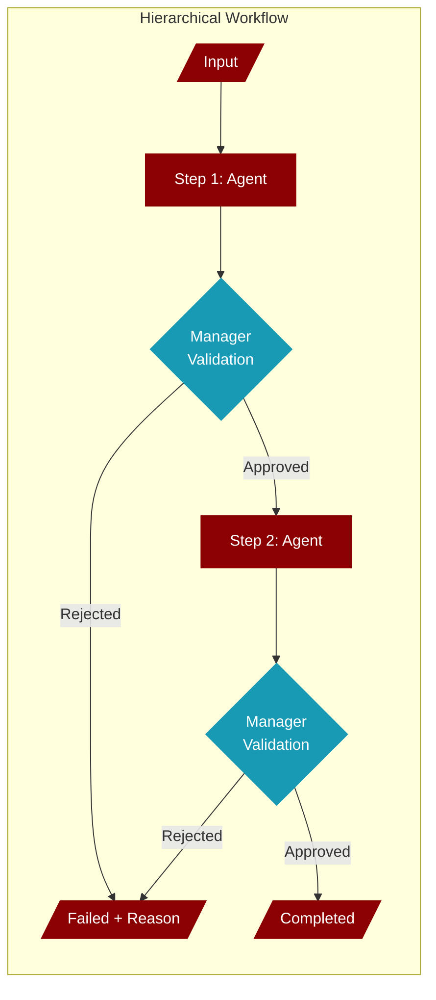
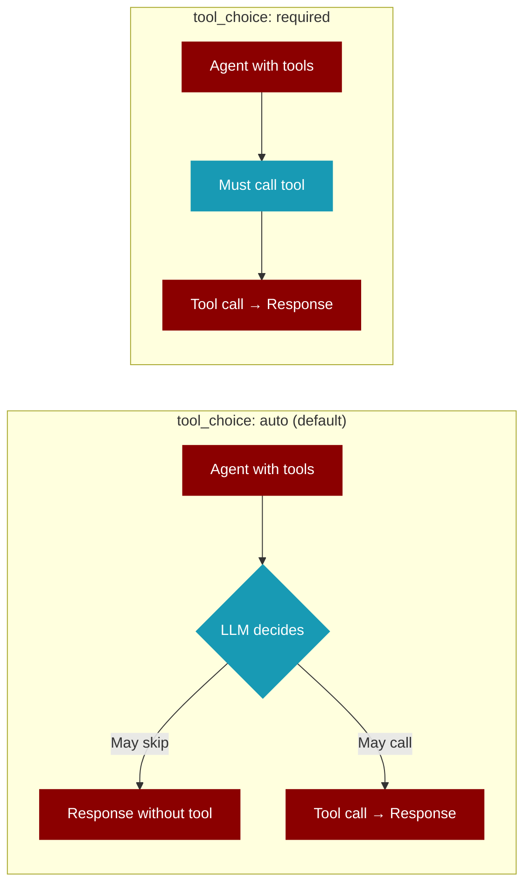

<Info>
Hierarchical workflows use a **manager agent** to validate each step's output before proceeding. If validation fails, the workflow stops gracefully with a clear failure reason.
</Info>

## How It Works



<CardGroup cols={2}>
  <Card title="Sequential (Default)" icon="arrow-right">
    Steps run one after another without validation
  </Card>
  <Card title="Hierarchical" icon="sitemap">
    Manager validates each step before proceeding
  </Card>
</CardGroup>

## Quick Start

<Tabs>
  <Tab title="Python">
```python
from praisonaiagents import Workflow, Agent

researcher = Agent(name="researcher", role="Research topics")
writer = Agent(name="writer", role="Write content")

workflow = Workflow(
    steps=[researcher, writer],
    process="hierarchical",  # Enable manager validation
    manager_llm="gpt-4o-mini"  # LLM for manager agent
)

result = workflow.run("Write about AI trends")

if result["status"] == "failed":
    print(f"Workflow failed: {result['failure_reason']}")
else:
    print(f"Output: {result['output']}")
```
  </Tab>
  <Tab title="YAML">
```yaml
name: research-workflow
process: hierarchical
manager_llm: gpt-4o-mini

agents:
  researcher:
    role: Research Analyst
    goal: Research topics thoroughly
    backstory: Expert researcher
  
  writer:
    role: Content Writer
    goal: Write engaging content
    backstory: Professional writer

steps:
  - agent: researcher
    action: Research the topic
  
  - agent: writer
    action: Write article based on research
```
  </Tab>
</Tabs>

## Parameters

<ParamField path="process" type="string" default="sequential">
  Workflow execution mode:
  - `sequential` - Steps run without validation (default)
  - `hierarchical` - Manager validates each step
</ParamField>

<ParamField path="manager_llm" type="string" default="null">
  LLM model for the manager agent. If not specified, uses the workflow's `default_llm`.
</ParamField>

## Manager Validation

The manager agent evaluates each step's output based on:

<Steps>
  <Step title="Task Completion">
    Does the output address the task?
  </Step>
  <Step title="Quality Check">
    Is the output meaningful (not an error)?
  </Step>
  <Step title="Expected Output">
    Does it meet the step's expected output criteria?
  </Step>
</Steps>

## Handling Failures

<CodeGroup>
```python Check Status
result = workflow.run("My task")

if result["status"] == "failed":
    # Workflow was rejected by manager
    print(f"Reason: {result['failure_reason']}")
    
    # Check which step failed
    for step in result["steps"]:
        if step["status"] == "failed":
            print(f"Failed step: {step['step']}")
elif result["status"] == "completed":
    print("All steps validated successfully!")
```

```python With Callbacks
def on_step_error(workflow, step, error):
    print(f"Step '{step.name}' failed: {error}")

workflow = Workflow(
    steps=[agent1, agent2],
    process="hierarchical",
    hooks={"on_step_error": on_step_error}
)
```
</CodeGroup>

## Result Structure

```python
{
    "output": "Final output from last step",
    "steps": [
        {"step": "researcher", "output": "...", "status": "completed"},
        {"step": "writer", "output": "...", "status": "failed", "failure_reason": "..."}
    ],
    "variables": {...},
    "status": "failed",  # or "completed"
    "failure_reason": "Manager rejected step 'writer': Output lacks detail"
}
```

## When to Use

<AccordionGroup>
  <Accordion title="Quality-Critical Workflows" icon="shield-check">
    When each step must meet quality standards before proceeding.
  </Accordion>
  <Accordion title="Multi-Agent Pipelines" icon="users">
    When agents depend on validated output from previous agents.
  </Accordion>
  <Accordion title="Production Workflows" icon="rocket">
    When you need graceful failure handling with clear reasons.
  </Accordion>
</AccordionGroup>

## Forcing Tool Usage

<Warning>
When agents have tools assigned, the LLM may skip calling them even with explicit instructions. Use `tool_choice: required` to **force** the LLM to call a tool before responding.
</Warning>



<Tabs>
  <Tab title="YAML">
```yaml
agents:
  researcher:
    role: Research Specialist
    goal: Find latest information
    tools:
      - search_web
    tool_choice: required  # Forces tool usage
    llm: gpt-4o-mini
```
  </Tab>
  <Tab title="Python">
```python
from praisonaiagents import Agent
from praisonaiagents.tools import search_web

researcher = Agent(
    name="researcher",
    role="Research Specialist",
    tools=[search_web],
    llm="gpt-4o-mini"
)
# Set tool_choice for YAML workflows
researcher._yaml_tool_choice = "required"
```
  </Tab>
</Tabs>

<ParamField path="tool_choice" type="string" default="auto">
  Controls when the LLM calls tools:
  - `auto` - LLM decides whether to call tools (default)
  - `required` - LLM **must** call a tool before responding
  - `none` - LLM cannot call tools
</ParamField>

<Tip>
Always use `tool_choice: required` for agents with tools in hierarchical workflows. This ensures the manager can validate that tools were actually used.
</Tip>

## Comparison

| Feature | Sequential | Hierarchical |
|---------|------------|--------------|
| **Validation** | None | After each step |
| **Failure Handling** | Continues on error | Stops with reason |
| **Performance** | Faster | Slightly slower |
| **Use Case** | Simple pipelines | Quality-critical flows |

<Tip>
Use `hierarchical` mode when you need **guaranteed quality** at each step. Use `sequential` mode for **faster execution** when validation isn't critical.
</Tip>

## Real-World Examples

<AccordionGroup>
  <Accordion title="Research & Writing Pipeline" icon="pen">
```python
from praisonaiagents import Workflow, Agent

researcher = Agent(
    name="researcher",
    role="Research Analyst",
    goal="Find accurate, up-to-date information",
    backstory="Expert researcher with attention to detail",
    llm="gpt-4o-mini"
)

writer = Agent(
    name="writer",
    role="Content Writer", 
    goal="Write engaging, clear content",
    backstory="Professional writer who creates compelling articles",
    llm="gpt-4o-mini"
)

editor = Agent(
    name="editor",
    role="Editor",
    goal="Polish and improve content quality",
    backstory="Experienced editor with keen eye for detail",
    llm="gpt-4o-mini"
)

workflow = Workflow(
    name="content-pipeline",
    steps=[researcher, writer, editor],
    process="hierarchical",
    manager_llm="gpt-4o-mini"
)

result = workflow.run("Write an article about AI in healthcare")
```
  </Accordion>
  
  <Accordion title="Data Analysis Pipeline" icon="chart-line">
```python
from praisonaiagents import Workflow, Agent

collector = Agent(
    name="collector",
    role="Data Collector",
    goal="Gather and prepare data",
    llm="gpt-4o-mini"
)

analyst = Agent(
    name="analyst",
    role="Data Analyst",
    goal="Analyze data and find insights",
    llm="gpt-4o-mini"
)

reporter = Agent(
    name="reporter",
    role="Report Writer",
    goal="Create clear reports from analysis",
    llm="gpt-4o-mini"
)

workflow = Workflow(
    name="data-pipeline",
    steps=[collector, analyst, reporter],
    process="hierarchical",
    manager_llm="gpt-4o-mini"
)

result = workflow.run("Analyze Q4 sales trends")

if result["status"] == "failed":
    print(f"Pipeline failed: {result['failure_reason']}")
```
  </Accordion>
  
  <Accordion title="Code Review Pipeline" icon="code">
```python
from praisonaiagents import Workflow, Agent

reader = Agent(
    name="code_reader",
    role="Code Reader",
    goal="Understand code structure",
    llm="gpt-4o-mini"
)

reviewer = Agent(
    name="reviewer",
    role="Code Reviewer",
    goal="Find issues and improvements",
    llm="gpt-4o-mini"
)

suggester = Agent(
    name="suggester",
    role="Improvement Suggester",
    goal="Suggest specific code improvements",
    llm="gpt-4o-mini"
)

workflow = Workflow(
    name="code-review-pipeline",
    steps=[reader, reviewer, suggester],
    process="hierarchical",
    manager_llm="gpt-4o-mini",
    output="verbose"  # See validation results
)

result = workflow.run("Review this Python module for best practices")
```
  </Accordion>
</AccordionGroup>
