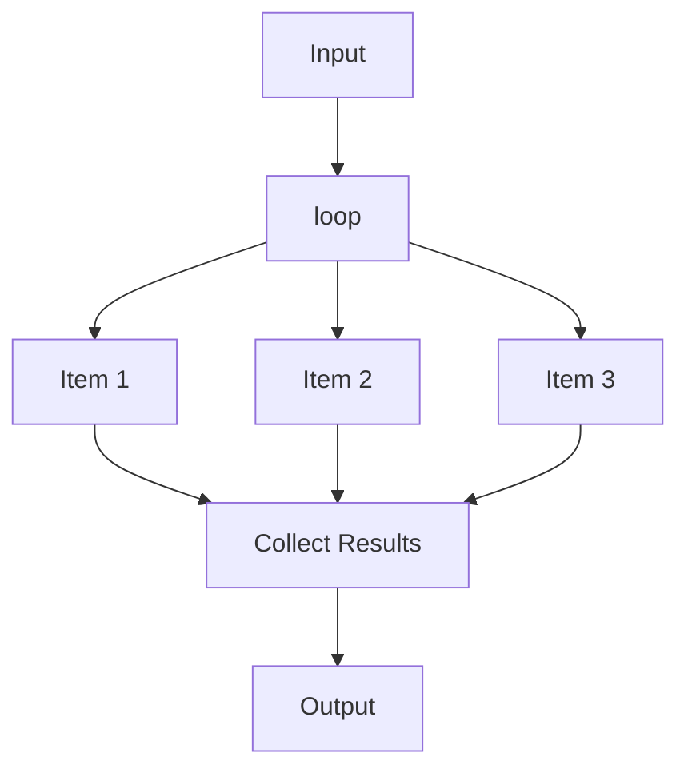

# Workflow Loop Processing

Execute a step for each item in a list, CSV file, or text file. This pattern is ideal for batch processing and data pipelines.



## Quick Start

### Loop Over List

```python
from praisonaiagents import Workflow, WorkflowContext, StepResult
from praisonaiagents import loop

def process_item(ctx: WorkflowContext) -> StepResult:
    item = ctx.variables["item"]
    index = ctx.variables["loop_index"]
    return StepResult(output=f"[{index}] Processed: {item}")

workflow = Workflow(
    steps=[loop(process_item, over="items")],
    variables={"items": ["apple", "banana", "cherry"]}
)

result = workflow.start("Process fruits", )
```

**Output:**
```
🔁 Looping over 3 items...
✅ process_item: [0] Processed: apple...
✅ process_item: [1] Processed: banana...
✅ process_item: [2] Processed: cherry...
```

### Loop Over CSV

```python
def process_row(ctx: WorkflowContext) -> StepResult:
    row = ctx.variables["item"]  # Dict with column names as keys
    name = row["name"]
    email = row["email"]
    return StepResult(output=f"Processed: {name} ({email})")

workflow = Workflow(steps=[
    loop(process_row, from_csv="users.csv")
])

result = workflow.start("Process users")
```

### Loop Over Text File

```python
def process_line(ctx: WorkflowContext) -> StepResult:
    line = ctx.variables["item"]  # String
    return StepResult(output=f"Line: {line}")

workflow = Workflow(steps=[
    loop(process_line, from_file="tasks.txt")
])
```

## API Reference

### loop()

```python
loop(
    step: Any,                       # Step to execute for each item
    over: Optional[str] = None,      # Variable name containing list
    from_csv: Optional[str] = None,  # CSV file path
    from_file: Optional[str] = None, # Text file path (one item per line)
    var_name: str = "item"           # Variable name for current item
) -> Loop
```

### Parameters

| Parameter | Type | Default | Description |
|-----------|------|---------|-------------|
| `step` | `Any` | required | Step to execute (function, Agent, WorkflowStep) |
| `over` | `Optional[str]` | `None` | Variable name containing list to iterate |
| `from_csv` | `Optional[str]` | `None` | Path to CSV file |
| `from_file` | `Optional[str]` | `None` | Path to text file |
| `var_name` | `str` | `"item"` | Variable name for current item |

### Context Variables

Inside the loop, these variables are available:

| Variable | Type | Description |
|----------|------|-------------|
| `item` (or custom) | `Any` | Current item being processed |
| `loop_index` | `int` | Current iteration index (0-based) |

### Result Variables

After loop completion:

| Variable | Type | Description |
|----------|------|-------------|
| `loop_outputs` | `List[str]` | All outputs from loop iterations |

## Examples

### Custom Variable Name

```python
workflow = Workflow(
    steps=[loop(process_user, over="users", var_name="user")],
    variables={"users": [{"name": "Alice"}, {"name": "Bob"}]}
)

def process_user(ctx: WorkflowContext) -> StepResult:
    user = ctx.variables["user"]  # Custom variable name
    return StepResult(output=f"Hello, {user['name']}!")
```

### CSV with Headers

Given `data.csv`:
```csv
name,email,role
Alice,alice@example.com,Admin
Bob,bob@example.com,User
```

```python
def process_csv_row(ctx: WorkflowContext) -> StepResult:
    row = ctx.variables["item"]
    # row = {"name": "Alice", "email": "alice@example.com", "role": "Admin"}
    return StepResult(output=f"{row['name']} is {row['role']}")

workflow = Workflow(steps=[
    loop(process_csv_row, from_csv="data.csv")
])
```

### With Agents

```python
from praisonaiagents import Agent

processor = Agent(
    name="Processor",
    role="Process items",
    instructions="Process the item: {{item}}"
)

workflow = Workflow(
    steps=[loop(processor, over="items")],
    variables={"items": ["task1", "task2", "task3"]}
)
```

### Chained Loops

```python
workflow = Workflow(steps=[
    loop(fetch_data, over="sources"),      # Fetch from each source
    loop(process_record, over="records"),  # Process each record
    summarize_all
])
```

### Loop with Aggregation

```python
def aggregate_results(ctx: WorkflowContext) -> StepResult:
    outputs = ctx.variables["loop_outputs"]
    total = len(outputs)
    return StepResult(output=f"Processed {total} items")

workflow = Workflow(steps=[
    loop(process_item, over="items"),
    aggregate_results
])
```

## Use Cases

| Use Case | Description |
|----------|-------------|
| **Batch Processing** | Process files, records, or data items |
| **Data Migration** | Transform and migrate data row by row |
| **Report Generation** | Generate reports for each entity |
| **Email Campaigns** | Send personalized emails to list |
| **API Calls** | Call API for each item in list |

## Best Practices

1. **Handle errors per item** - Don't let one failure stop the entire loop
2. **Log progress** - Use verbose mode or custom logging
3. **Batch large datasets** - Consider chunking for very large files
4. **Clean up resources** - Close files and connections properly

## Error Handling

```python
def safe_process(ctx: WorkflowContext) -> StepResult:
    try:
        item = ctx.variables["item"]
        # Process item...
        return StepResult(output=f"Success: {item}")
    except Exception as e:
        return StepResult(output=f"Error: {e}")
```

## See Also

- [Workflow Patterns Overview](/features/workflow-patterns)
- [Workflow Routing](/features/workflow-routing)
- [Parallel Execution](/features/workflow-parallel)
- [Evaluator-Optimizer](/features/workflow-repeat)
