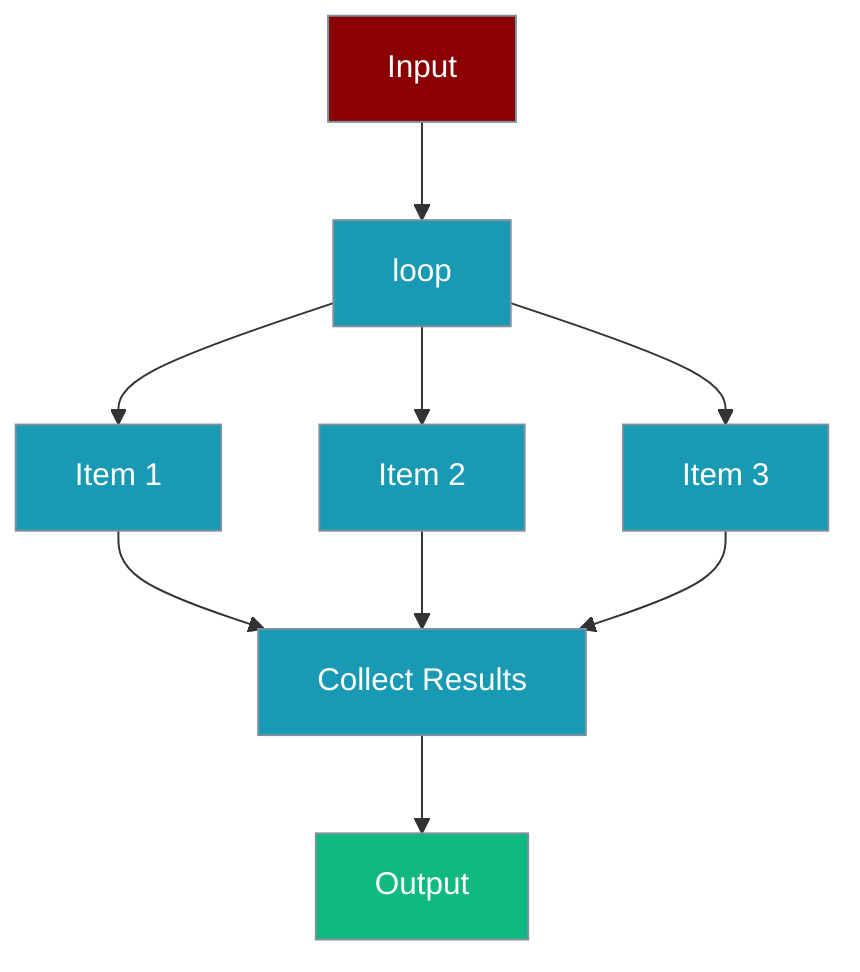

The `loop()` helper runs a step for each item in a list, CSV, or text file — ideal for batch processing and data pipelines.

```python
from praisonaiagents import Agent, AgentFlow, loop, WorkflowContext, StepResult

worker = Agent(name="Worker", instructions="Process one batch item at a time")

def process_item(ctx: WorkflowContext) -> StepResult:
    item = ctx.variables["item"]
    return StepResult(output=f"Processed: {item}")

workflow = AgentFlow(
    agents=[worker],
    steps=[loop(process_item, over="items")],
    variables={"items": ["alpha", "beta"]},
)
workflow.start("Run the batch loop")
```

The user triggers a batch job; each list item runs through the loop step.


```mermaid
graph TD
    A[Input] --> B[loop]
    B --> C[Item 1]
    B --> D[Item 2]
    B --> E[Item 3]
    C --> F[Collect Results]
    D --> F
    E --> F
    F --> G[Output]
    classDef agent fill:#8B0000,stroke:#7C90A0,color:#fff
    classDef tool fill:#189AB4,stroke:#7C90A0,color:#fff
    classDef success fill:#10B981,stroke:#7C90A0,color:#fff
    class A agent
    class B tool
    class C,D,E,F tool
    class G success

```

## Quick Start

<Steps>
<Step title="Loop Over a List">
```python
from praisonaiagents import AgentFlow, WorkflowContext, StepResult
from praisonaiagents import loop

def process_item(ctx: WorkflowContext) -> StepResult:
    item = ctx.variables["item"]
    index = ctx.variables["loop_index"]
    return StepResult(output=f"[{index}] Processed: {item}")

workflow = AgentFlow(
    steps=[loop(process_item, over="items")],
    variables={"items": ["apple", "banana", "cherry"]}
)

result = workflow.start("Process fruits")
```

**Output:**
```
🔁 Looping over 3 items...
✅ process_item: [0] Processed: apple...
✅ process_item: [1] Processed: banana...
✅ process_item: [2] Processed: cherry...
```
</Step>

<Step title="Loop Over a CSV">
```python
def process_row(ctx: WorkflowContext) -> StepResult:
    row = ctx.variables["item"]  # Dict with column names as keys
    name = row["name"]
    email = row["email"]
    return StepResult(output=f"Processed: {name} ({email})")

workflow = AgentFlow(steps=[
    loop(process_row, from_csv="users.csv")
])

result = workflow.start("Process users")
```
</Step>

<Step title="Loop Over a Text File">
```python
def process_line(ctx: WorkflowContext) -> StepResult:
    line = ctx.variables["item"]  # String
    return StepResult(output=f"Line: {line}")

workflow = AgentFlow(steps=[
    loop(process_line, from_file="tasks.txt")
])
```
</Step>
</Steps>

## API Reference

### loop()

```python
loop(
    step: Any,                       # Step to execute for each item
    over: Optional[str] = None,      # Variable name containing list
    from_csv: Optional[str] = None,  # CSV file path
    from_file: Optional[str] = None, # Text file path (one item per line)
    var_name: str = "item"           # Variable name for current item
) -> Loop
```

### Parameters

| Parameter | Type | Default | Description |
|-----------|------|---------|-------------|
| `step` | `Any` | required | Step to execute (function, Agent, Task) |
| `over` | `Optional[str]` | `None` | Variable name containing list to iterate |
| `from_csv` | `Optional[str]` | `None` | Path to CSV file |
| `from_file` | `Optional[str]` | `None` | Path to text file |
| `var_name` | `str` | `"item"` | Variable name for current item |

### Context Variables

Inside the loop, these variables are available:

| Variable | Type | Description |
|----------|------|-------------|
| `item` (or custom) | `Any` | Current item being processed |
| `loop_index` | `int` | Current iteration index (0-based) |

### Result Variables

After loop completion:

| Variable | Type | Description |
|----------|------|-------------|
| `loop_outputs` | `List[str]` | All outputs from loop iterations |

## Examples

### Custom Variable Name

```python
workflow = AgentFlow(
    steps=[loop(process_user, over="users", var_name="user")],
    variables={"users": [{"name": "Alice"}, {"name": "Bob"}]}
)

def process_user(ctx: WorkflowContext) -> StepResult:
    user = ctx.variables["user"]  # Custom variable name
    return StepResult(output=f"Hello, {user['name']}!")
```

### CSV with Headers

Given `data.csv`:
```csv
name,email,role
Alice,alice@example.com,Admin
Bob,bob@example.com,User
```

```python
def process_csv_row(ctx: WorkflowContext) -> StepResult:
    row = ctx.variables["item"]
    # row = {"name": "Alice", "email": "alice@example.com", "role": "Admin"}
    return StepResult(output=f"{row['name']} is {row['role']}")

workflow = AgentFlow(steps=[
    loop(process_csv_row, from_csv="data.csv")
])
```

### With Agents

```python
from praisonaiagents import Agent

processor = Agent(
    name="Processor",
    role="Process items",
    instructions="Process the item: {{item}}"
)

workflow = AgentFlow(
    steps=[loop(processor, over="items")],
    variables={"items": ["task1", "task2", "task3"]}
)
```

### Chained Loops

```python
workflow = AgentFlow(steps=[
    loop(fetch_data, over="sources"),      # Fetch from each source
    loop(process_record, over="records"),  # Process each record
    summarize_all
])
```

### Loop with Aggregation

```python
def aggregate_results(ctx: WorkflowContext) -> StepResult:
    outputs = ctx.variables["loop_outputs"]
    total = len(outputs)
    return StepResult(output=f"Processed {total} items")

workflow = AgentFlow(steps=[
    loop(process_item, over="items"),
    aggregate_results
])
```

## Use Cases

| Use Case | Description |
|----------|-------------|
| **Batch Processing** | Process files, records, or data items |
| **Data Migration** | Transform and migrate data row by row |
| **Report Generation** | Generate reports for each entity |
| **Email Campaigns** | Send personalized emails to list |
| **API Calls** | Call API for each item in list |

## Best Practices

<AccordionGroup>
  <Accordion title="Handle errors per item">
    Catch exceptions inside the loop body so one bad row does not stop the entire batch.
  </Accordion>
  <Accordion title="Log progress on large files">
    Enable verbose mode or custom logging when iterating thousands of records.
  </Accordion>
  <Accordion title="Chunk very large datasets">
    Split massive CSVs into batches to limit memory and simplify retries.
  </Accordion>
  <Accordion title="Clean up resources in finally blocks">
    Close files and connections even when individual items fail.
  </Accordion>
</AccordionGroup>

## Error Handling

```python
def safe_process(ctx: WorkflowContext) -> StepResult:
    try:
        item = ctx.variables["item"]
        # Process item...
        return StepResult(output=f"Success: {item}")
    except Exception as e:
        return StepResult(output=f"Error: {e}")
```

## Related

<CardGroup cols={2}>
<Card title="Workflow Patterns" icon="diagram-project" href="/docs/features/workflow-patterns">
  Overview of routing, parallel, loop, and repeat patterns
</Card>
<Card title="Workflow Routing" icon="code-branch" href="/docs/features/workflow-routing">
  Decision-based branching in workflows
</Card>
<Card title="Workflow Parallel" icon="arrows-split-up-and-left" href="/docs/features/workflow-parallel">
  Run independent steps concurrently
</Card>
<Card title="Workflow Repeat" icon="rotate" href="/docs/features/workflow-repeat">
  Repeat steps until a condition is met
</Card>
</CardGroup>
