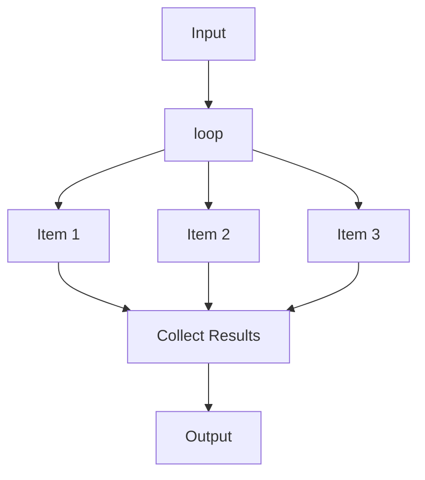

# Workflow Loop Processing

Execute a step for each item in a list, CSV file, or text file. This pattern is ideal for batch processing and data pipelines.


```mermaid
graph TD
    A[Input] --> B[loop]
    B --> C[Item 1]
    B --> D[Item 2]
    B --> E[Item 3]
    C --> F[Collect Results]
    D --> F
    E --> F
    F --> G[Output]
```

## Quick Start


<Steps>
<Step title="Simple Usage">
### Loop Over List

```python
from praisonaiagents import AgentFlow, WorkflowContext, StepResult
from praisonaiagents import loop

def process_item(ctx: WorkflowContext) -> StepResult:
    item = ctx.variables["item"]
    index = ctx.variables["loop_index"]
    return StepResult(output=f"[{index}] Processed: {item}")

workflow = AgentFlow(
    steps=[loop(process_item, over="items")],
    variables={"items": ["apple", "banana", "cherry"]}
)

result = workflow.start("Process fruits", )
```
</Step>

<Step title="With Configuration">
**Output:**
```
🔁 Looping over 3 items...
✅ process_item: [0] Processed: apple...
✅ process_item: [1] Processed: banana...
✅ process_item: [2] Processed: cherry...
```

### Loop Over CSV

```python
def process_row(ctx: WorkflowContext) -> StepResult:
    row = ctx.variables["item"]  # Dict with column names as keys
    name = row["name"]
    email = row["email"]
    return StepResult(output=f"Processed: {name} ({email})")

workflow = AgentFlow(steps=[
    loop(process_row, from_csv="users.csv")
])

result = workflow.start("Process users")
```

### Loop Over Text File

```python
def process_line(ctx: WorkflowContext) -> StepResult:
    line = ctx.variables["item"]  # String
    return StepResult(output=f"Line: {line}")

workflow = AgentFlow(steps=[
    loop(process_line, from_file="tasks.txt")
])
```
</Step>
</Steps>


## Best Practices

<AccordionGroup>
  <Accordion title="Start simple">
    Enable the feature with a single parameter before adding configuration. Verify it works, then layer in options.
  </Accordion>
  <Accordion title="Use environment variables for secrets">
    Never hardcode API keys or tokens. Use `os.getenv("KEY_NAME")` to read from environment variables.
  </Accordion>
  <Accordion title="Test with minimal examples first">
    Copy the Quick Start example, run it, then extend it. This confirms your environment is set up correctly.
  </Accordion>
  <Accordion title="Check the logs">
    Set `verbose=True` on your agent to see detailed execution logs when debugging unexpected behavior.
  </Accordion>
</AccordionGroup>

## Related

<CardGroup cols={2}>
  <Card title="Features Overview" icon="grid-2" href="/docs/features">
    Browse all PraisonAI features
  </Card>
  <Card title="Quick Start" icon="rocket" href="/docs/introduction">
    Get started with PraisonAI agents
  </Card>
</CardGroup>
