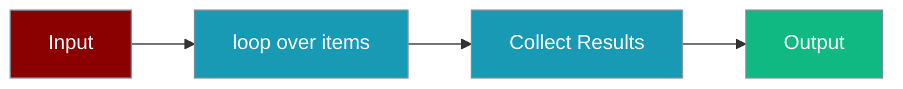
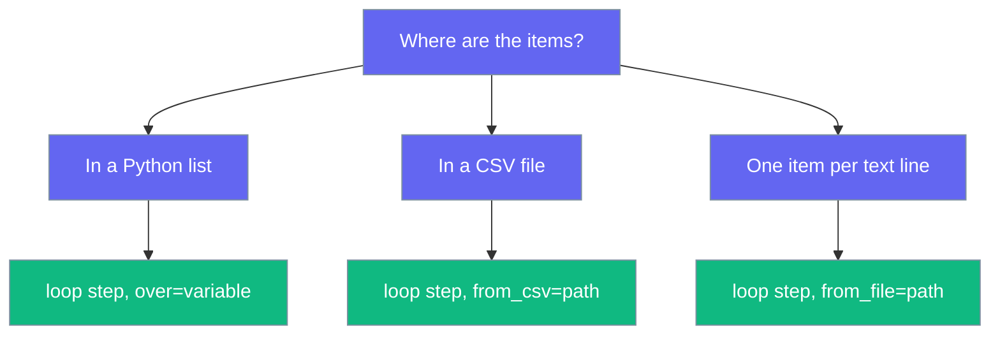
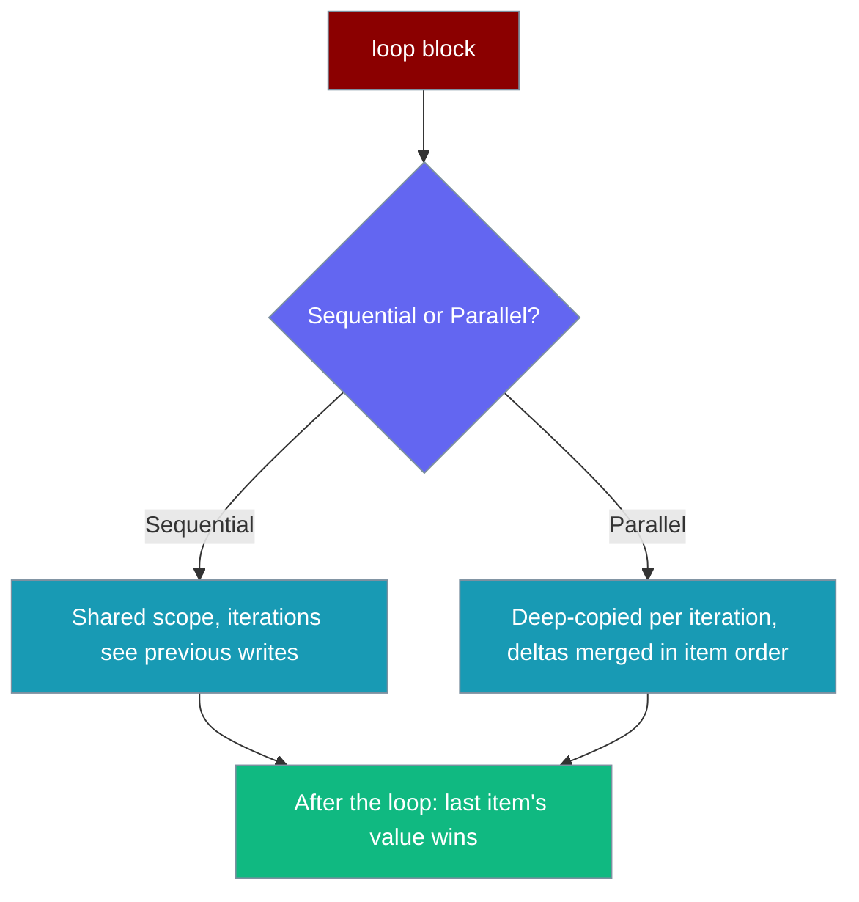

The `loop()` helper runs a step for each item in a list, CSV, or text file — ideal for batch processing and data pipelines.

<Note>
Steps inside this pattern inherit the same `max_retries`, `guardrails`, and `output_file` policies as top-level steps. See [Nested workflows → Retry, guardrails, and `output_file`](/docs/features/nested-workflows#retry-guardrails-and-output_file-inside-nested-steps).
</Note>

<Note>
As of PraisonAI [#4947](https://github.com/MervinPraison/PraisonAI/pull/4947), an `output_variable` set inside a `loop()` body is preserved after the loop block — keyed by that exact name. Earlier releases silently discarded it. This is the sibling fix to [#4932](https://github.com/MervinPraison/PraisonAI/pull/4932), which fixed the same defect in `parallel(...)`.
</Note>

```python
from praisonaiagents import Agent, AgentFlow, loop, WorkflowContext, StepResult

worker = Agent(name="Worker", instructions="Process one batch item at a time")

def process_item(ctx: WorkflowContext) -> StepResult:
    item = ctx.variables["item"]
    return StepResult(output=f"Processed: {item}")

workflow = AgentFlow(
    agents=[worker],
    steps=[loop(process_item, over="items")],
    variables={"items": ["alpha", "beta"]},
)
workflow.start("Run the batch loop")
```

The user triggers a batch job; each list item runs through the loop step.


```mermaid
graph LR
    In[Input] --> Loop[loop over items]
    Loop --> Collect[Collect Results]
    Collect --> Out[Output]

    classDef input fill:#8B0000,stroke:#7C90A0,color:#fff
    classDef process fill:#189AB4,stroke:#7C90A0,color:#fff
    classDef output fill:#10B981,stroke:#7C90A0,color:#fff
    class In input
    class Loop,Collect process
    class Out output
```

## Quick Start

<Steps>
<Step title="Loop Over a List">
```python
from praisonaiagents import AgentFlow, WorkflowContext, StepResult
from praisonaiagents import loop

def process_item(ctx: WorkflowContext) -> StepResult:
    item = ctx.variables["item"]
    index = ctx.variables["loop_index"]
    return StepResult(output=f"[{index}] Processed: {item}")

workflow = AgentFlow(
    steps=[loop(process_item, over="items")],
    variables={"items": ["apple", "banana", "cherry"]}
)

result = workflow.start("Process fruits")
```

**Output:**
```
🔁 Looping over 3 items...
✅ process_item: [0] Processed: apple...
✅ process_item: [1] Processed: banana...
✅ process_item: [2] Processed: cherry...
```
</Step>

<Step title="Loop Over a CSV">
```python
def process_row(ctx: WorkflowContext) -> StepResult:
    row = ctx.variables["item"]  # Dict with column names as keys
    name = row["name"]
    email = row["email"]
    return StepResult(output=f"Processed: {name} ({email})")

workflow = AgentFlow(steps=[
    loop(process_row, from_csv="users.csv")
])

result = workflow.start("Process users")
```
</Step>

<Step title="Loop Over a Text File">
```python
def process_line(ctx: WorkflowContext) -> StepResult:
    line = ctx.variables["item"]  # String
    return StepResult(output=f"Line: {line}")

workflow = AgentFlow(steps=[
    loop(process_line, from_file="tasks.txt")
])
```
</Step>
</Steps>

## Choosing an Iteration Source

Pick the parameter that matches where your items live.


```mermaid
graph TB
    Q[Where are the items?] --> A[In a Python list]
    Q --> B[In a CSV file]
    Q --> C[One item per text line]
    A --> R1[loop step, over=variable]
    B --> R2[loop step, from_csv=path]
    C --> R3[loop step, from_file=path]

    classDef decision fill:#6366F1,stroke:#7C90A0,color:#fff
    classDef option fill:#10B981,stroke:#7C90A0,color:#fff
    class Q,A,B,C decision
    class R1,R2,R3 option
```

## API Reference

### loop()

```python
loop(
    step: Any,                       # Step to execute for each item
    over: Optional[str] = None,      # Variable name containing list
    from_csv: Optional[str] = None,  # CSV file path
    from_file: Optional[str] = None, # Text file path (one item per line)
    var_name: str = "item"           # Variable name for current item
) -> Loop
```

### Parameters

| Parameter | Type | Default | Description |
|-----------|------|---------|-------------|
| `step` | `Any` | required | Step to execute (function, Agent, Task) |
| `over` | `Optional[str]` | `None` | Variable name containing list to iterate |
| `from_csv` | `Optional[str]` | `None` | Path to CSV file |
| `from_file` | `Optional[str]` | `None` | Path to text file |
| `var_name` | `str` | `"item"` | Variable name for current item |

### Context Variables

Inside the loop, these variables are available:

| Variable | Type | Description |
|----------|------|-------------|
| `item` (or custom) | `Any` | Current item being processed |
| `loop_index` | `int` | Current iteration index (0-based) |

### Result Variables

After loop completion:

| Variable | Type | Description |
|----------|------|-------------|
| `loop_outputs` | `List[str]` | All outputs from loop iterations, in item order |
| A body step's `output_variable` | `Any` | The **last item's** value — see [Named outputs from a loop body](#named-outputs-from-a-loop-body) |
| A body step's `StepResult.variables` writes | `Any` | Merged back into the enclosing scope; last item wins on collisions |

## Named outputs from a loop body

Every step inside `loop([...])` may set `output_variable`. As of PraisonAI [#4947](https://github.com/MervinPraison/PraisonAI/pull/4947), that write is visible to any step **after** the loop block, keyed by that exact name — not just as a positional entry in `loop_outputs`.

```python
from praisonaiagents import AgentFlow, Task, WorkflowContext, StepResult, loop

def process(ctx: WorkflowContext) -> StepResult:
    return StepResult(output=f"processed-{ctx.variables['item']}")

def after(ctx: WorkflowContext) -> StepResult:
    return StepResult(output=f"last was {ctx.variables['result']}")

workflow = AgentFlow(steps=[
    loop(steps=[Task(name="worker", handler=process, output_variable="result")],
         over="items"),
    Task(name="after", handler=after),
], variables={"items": ["a", "b", "c"]})

output = workflow.start("go")
print(output["variables"]["result"])          # "processed-c"  ← last item wins
print(output["variables"]["loop_outputs"])    # ["processed-a", "processed-b", "processed-c"]
```

The body step's own `output_variable` is stored under that exact name; the ordered `loop_outputs` list is still there for aggregators that want positional access.

A `StepResult.variables={"foo": ...}` write from inside the loop body works the same way: the key merges back into the enclosing scope after the loop.


```mermaid
graph TB
    L[loop block] --> Mode{Sequential or Parallel?}
    Mode -->|Sequential| Seq[Shared scope, iterations see previous writes]
    Mode -->|Parallel| Par[Deep-copied per iteration, deltas merged in item order]
    Seq --> Out[After the loop: last item's value wins]
    Par --> Out

    classDef block fill:#8B0000,stroke:#7C90A0,color:#fff
    classDef decision fill:#6366F1,stroke:#7C90A0,color:#fff
    classDef process fill:#189AB4,stroke:#7C90A0,color:#fff
    classDef result fill:#10B981,stroke:#7C90A0,color:#fff

    class L block
    class Mode decision
    class Seq,Par process
    class Out result
```

### Sequential vs parallel: same final scope

The two loop modes agree on the resulting variables scope. `parallel=True` is meant to be a **faster way to run the same loop**, not different semantics — so:

- Both end with the last item's value for a variable the body rewrites each iteration.
- Both propagate body writes (`output_variable` and `StepResult.variables`) back to the enclosing scope.
- Both keep loop control variables (`item` / `var_name`, `loop_index`, `item.<key>`) scoped to the loop.

The one thing sequential offers that parallel cannot is **accumulation across iterations**: since the sequential loop runs against the shared scope, iteration N reads iteration N-1's writes.

```python
from praisonaiagents import AgentFlow, Task, WorkflowContext, StepResult, loop

def accumulate(ctx: WorkflowContext) -> StepResult:
    so_far = ctx.variables.get("acc") or ""
    updated = so_far + ctx.variables["item"]
    return StepResult(output=updated, variables={"acc": updated})

workflow = AgentFlow(steps=[
    loop(steps=[Task(name="acc_step", handler=accumulate)],
         over="items", parallel=False),
], variables={"items": ["a", "b", "c"]})

result = workflow.start("go")
print(result["variables"]["acc"])           # "abc"
print(result["variables"]["loop_outputs"])  # ["a", "ab", "abc"]
```

This is deliberately unavailable in the parallel loop — its iterations run concurrently, so there is no "previous iteration" to read from.

### Iteration collisions are not warned about

Unlike `parallel(...)`, when the loop body rewrites the same `output_variable` on every iteration, **no warning is logged**. N iterations of one loop body necessarily write the body's `output_variable` N times — that is the normal shape of a loop, not an accident. The final value is the **last item's**, exactly as an unrolled sequence would produce.

Compare with `parallel(...)`, where two sibling branches writing the same variable **does** log a `WARNING` because that pattern almost always signals an authoring mistake. See [Named outputs from branches](/features/workflow-parallel#named-outputs-from-branches) for the parallel counterpart.

### Loop control variables stay loop-scoped

The variables the loop injects itself — `item` (or your custom `var_name`), `loop_index`, and flattened `item.<key>` accessors for dict items — are **loop machinery, not results**. They stay scoped to the loop in both modes:

- The sequential path restores whatever those names held **before** the loop (so a pre-existing `variables={"item": "ORIGINAL"}` is unaffected).
- The parallel path drops them from the merged delta.
- Even if a body step deliberately sets `output_variable="item"`, that write is stripped so the two modes agree.

```python
from praisonaiagents import AgentFlow, Task, WorkflowContext, StepResult, loop

def process(ctx: WorkflowContext) -> StepResult:
    return StepResult(output=f"processed-{ctx.variables['item']}")

def after(ctx: WorkflowContext) -> StepResult:
    return StepResult(output=f"last was {ctx.variables['result']}")

workflow = AgentFlow(steps=[
    loop(steps=[Task(name="worker", handler=process, output_variable="result")],
         over="items"),
    Task(name="after", handler=after),
], variables={"items": ["a", "b"], "item": "ORIGINAL"})

result = workflow.start("go")
print(result["variables"]["item"])          # "ORIGINAL" — untouched
print("loop_index" in result["variables"])  # False
```

## Examples

### Custom Variable Name

```python
workflow = AgentFlow(
    steps=[loop(process_user, over="users", var_name="user")],
    variables={"users": [{"name": "Alice"}, {"name": "Bob"}]}
)

def process_user(ctx: WorkflowContext) -> StepResult:
    user = ctx.variables["user"]  # Custom variable name
    return StepResult(output=f"Hello, {user['name']}!")
```

### CSV with Headers

Given `data.csv`:
```csv
name,email,role
Alice,alice@example.com,Admin
Bob,bob@example.com,User
```

```python
def process_csv_row(ctx: WorkflowContext) -> StepResult:
    row = ctx.variables["item"]
    # row = {"name": "Alice", "email": "alice@example.com", "role": "Admin"}
    return StepResult(output=f"{row['name']} is {row['role']}")

workflow = AgentFlow(steps=[
    loop(process_csv_row, from_csv="data.csv")
])
```

### With Agents

```python
from praisonaiagents import Agent

processor = Agent(
    name="Processor",
    role="Process items",
    instructions="Process the item: {{item}}"
)

workflow = AgentFlow(
    steps=[loop(processor, over="items")],
    variables={"items": ["task1", "task2", "task3"]}
)
```

### Chained Loops

```python
workflow = AgentFlow(steps=[
    loop(fetch_data, over="sources"),      # Fetch from each source
    loop(process_record, over="records"),  # Process each record
    summarize_all
])
```

### Loop with Aggregation

```python
def aggregate_results(ctx: WorkflowContext) -> StepResult:
    outputs = ctx.variables["loop_outputs"]
    total = len(outputs)
    return StepResult(output=f"Processed {total} items")

workflow = AgentFlow(steps=[
    loop(process_item, over="items"),
    aggregate_results
])
```

## Use Cases

| Use Case | Description |
|----------|-------------|
| **Batch Processing** | Process files, records, or data items |
| **Data Migration** | Transform and migrate data row by row |
| **Report Generation** | Generate reports for each entity |
| **Email Campaigns** | Send personalized emails to list |
| **API Calls** | Call API for each item in list |

## How It Works

```mermaid
sequenceDiagram
    participant User
    participant AgentFlow
    participant Loop
    participant StepHandler

    User->>AgentFlow: start("input")
    AgentFlow->>Loop: Resolve items list
    loop For each item
        Loop->>StepHandler: Execute with ctx.variables["item"]
        StepHandler-->>Loop: StepResult
    end
    Loop-->>AgentFlow: All item results
    AgentFlow-->>User: Final result
```

| Phase | What happens |
|---|---|
| 1. Resolve | `loop()` reads the `over` variable (list, CSV, or text file) from `ctx.variables` |
| 2. Iterate | Handler is called once per item; `ctx.variables["item"]` holds the current value |
| 3. Collect | All `StepResult` objects are gathered; `loop_index` tracks the current position |
| 4. Return | AgentFlow returns after the last item completes |

---

## Best Practices

<AccordionGroup>
  <Accordion title="Handle errors per item">
    Catch exceptions inside the loop body so one bad row does not stop the entire batch.
  </Accordion>
  <Accordion title="Log progress on large files">
    Enable verbose mode or custom logging when iterating thousands of records.
  </Accordion>
  <Accordion title="Chunk very large datasets">
    Split massive CSVs into batches to limit memory and simplify retries.
  </Accordion>
  <Accordion title="Clean up resources in finally blocks">
    Close files and connections even when individual items fail.
  </Accordion>
  <Accordion title="Read a body step's output_variable after the loop, not just loop_outputs">
    As of [#4947](https://github.com/MervinPraison/PraisonAI/pull/4947), a body step's `output_variable` is visible after the loop under that exact name — set to the last item's value. `loop_outputs` still holds the ordered list of every iteration's last-step output for aggregators that need positional access. Reach for the named variable when you only need the final value; reach for `loop_outputs` when you need all of them.
  </Accordion>
</AccordionGroup>

## Error Handling

```python
def safe_process(ctx: WorkflowContext) -> StepResult:
    try:
        item = ctx.variables["item"]
        # Process item...
        return StepResult(output=f"Success: {item}")
    except Exception as e:
        return StepResult(output=f"Error: {e}")
```

## Related

<CardGroup cols={2}>
<Card title="Workflow Patterns" icon="diagram-project" href="/features/workflow-patterns">
  Overview of routing, parallel, loop, and repeat patterns
</Card>
<Card title="Workflow Routing" icon="code-branch" href="/features/workflow-routing">
  Decision-based branching in workflows
</Card>
<Card title="Workflow Parallel" icon="arrows-split-up-and-left" href="/features/workflow-parallel">
  Run independent steps concurrently
</Card>
<Card title="Workflow Repeat" icon="rotate" href="/features/workflow-repeat">
  Repeat steps until a condition is met
</Card>
</CardGroup>
