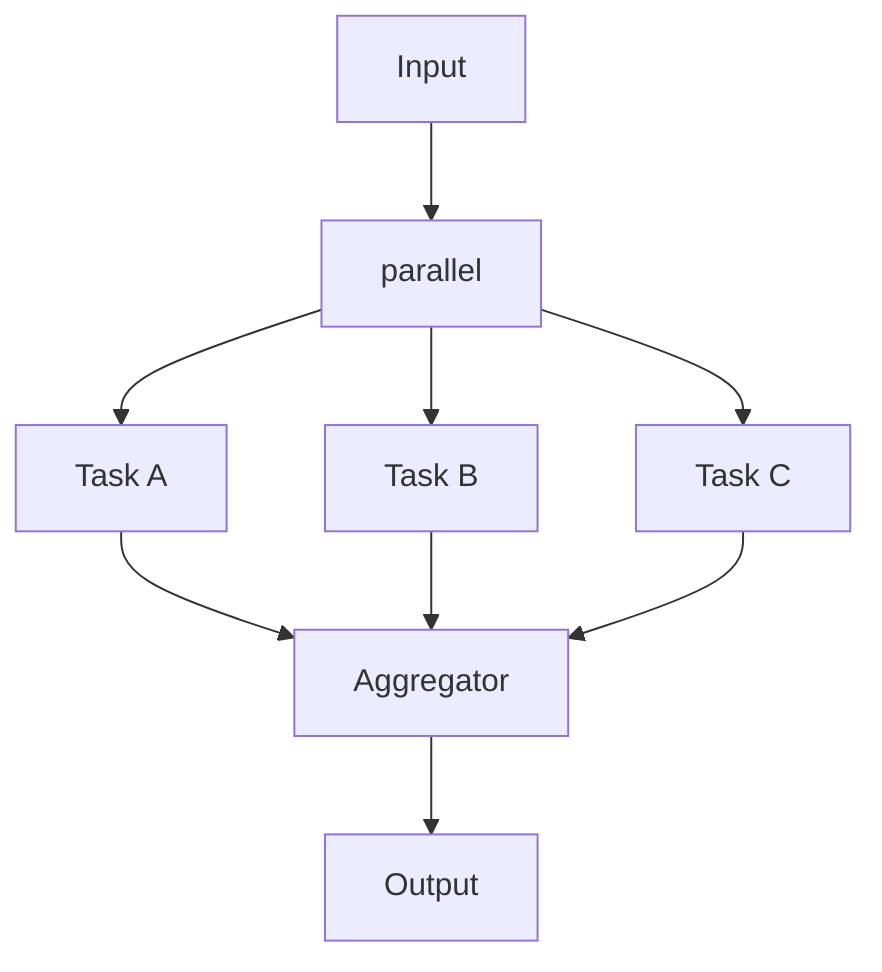

# Workflow Parallel Execution

Execute multiple steps concurrently and combine their results. This pattern is ideal for independent tasks that can run simultaneously.



## Quick Start

```python
from praisonaiagents import Workflow, WorkflowContext, StepResult
from praisonaiagents.workflows import parallel
import time

# Parallel workers
def research_market(ctx: WorkflowContext) -> StepResult:
    time.sleep(0.1)  # Simulate work
    return StepResult(output="📊 Market: Growth 15% YoY")

def research_competitors(ctx: WorkflowContext) -> StepResult:
    time.sleep(0.1)  # Simulate work
    return StepResult(output="🏢 Competitors: 3 major players")

def research_customers(ctx: WorkflowContext) -> StepResult:
    time.sleep(0.1)  # Simulate work
    return StepResult(output="👥 Customers: 85% satisfaction")

# Aggregator
def summarize(ctx: WorkflowContext) -> StepResult:
    outputs = ctx.variables.get("parallel_outputs", [])
    summary = "📋 SUMMARY:\n" + "\n".join(f"  • {o}" for o in outputs)
    return StepResult(output=summary)

# Create workflow
workflow = Workflow(steps=[
    parallel([research_market, research_competitors, research_customers]),
    summarize
])

result = workflow.start("Analyze business", verbose=True)
print(result["output"])
```

**Output:**
```
⚡ Running 3 steps in parallel...
✅ Parallel complete: 3 results
✅ summarize: 📋 SUMMARY:...

📋 SUMMARY:
  • 📊 Market: Growth 15% YoY
  • 🏢 Competitors: 3 major players
  • 👥 Customers: 85% satisfaction
```

## API Reference

### parallel()

```python
parallel(steps: List) -> Parallel
```

### Parameters

| Parameter | Type | Description |
|-----------|------|-------------|
| `steps` | `List` | List of steps to execute concurrently |

### Accessing Results

After parallel execution, results are available in `ctx.variables`:

| Variable | Type | Description |
|----------|------|-------------|
| `parallel_outputs` | `List[str]` | List of all outputs in order |

```python
def aggregator(ctx: WorkflowContext) -> StepResult:
    outputs = ctx.variables["parallel_outputs"]
    # outputs = ["Result A", "Result B", "Result C"]
    return StepResult(output=f"Combined: {len(outputs)} results")
```

## Examples

### With Agents

```python
from praisonaiagents import Agent

researcher = Agent(name="Researcher", role="Research topics")
analyst = Agent(name="Analyst", role="Analyze data")
writer = Agent(name="Writer", role="Write content")

workflow = Workflow(steps=[
    parallel([researcher, analyst, writer]),
    final_aggregator
])
```

### Mixed Steps

```python
workflow = Workflow(steps=[
    parallel([
        my_function,           # Function
        Agent(name="Bot"),     # Agent
        WorkflowStep(...)      # WorkflowStep
    ]),
    aggregator
])
```

### Nested Parallel

```python
workflow = Workflow(steps=[
    parallel([
        parallel([task_a1, task_a2]),  # Group A
        parallel([task_b1, task_b2])   # Group B
    ]),
    final_aggregator
])
```

## Performance

Parallel execution uses Python's `ThreadPoolExecutor`:

- **Concurrent I/O**: Ideal for API calls, file operations
- **Thread-safe**: Each step gets its own copy of variables
- **Automatic joining**: All results collected before next step

```python
# Performance comparison
# Sequential: 3 steps × 1s each = 3s total
# Parallel:   3 steps × 1s each = ~1s total (concurrent)
```

## Use Cases

| Use Case | Description |
|----------|-------------|
| **Multi-source Research** | Query multiple APIs simultaneously |
| **Data Processing** | Process independent data chunks |
| **Report Generation** | Generate sections in parallel |
| **Validation** | Run multiple validators concurrently |
| **A/B Comparison** | Run different approaches and compare |

## Best Practices

1. **Independent tasks only** - Parallel steps shouldn't depend on each other
2. **Handle errors gracefully** - One failure shouldn't break all tasks
3. **Aggregate results** - Always follow with a step that combines outputs
4. **Consider rate limits** - Don't overwhelm external APIs

## Error Handling

If a parallel step fails, its output will contain the error:

```python
def risky_step(ctx: WorkflowContext) -> StepResult:
    raise ValueError("Something went wrong")
    
# In parallel_outputs: ["Result A", "Error: Something went wrong", "Result C"]
```

## See Also

- [Workflow Patterns Overview](/features/workflow-patterns)
- [Workflow Routing](/features/workflow-routing)
- [Loop Processing](/features/workflow-loop)
- [Evaluator-Optimizer](/features/workflow-repeat)
