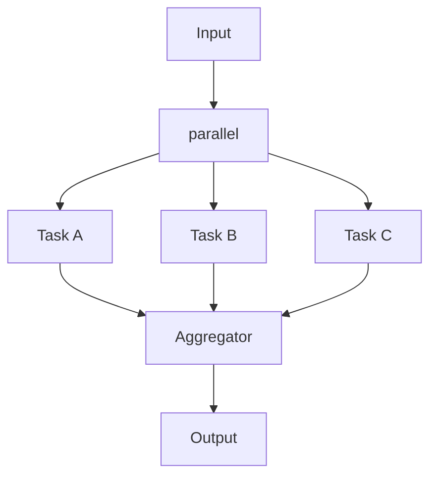

# Workflow Parallel Execution

Execute multiple steps concurrently and combine their results. This pattern is ideal for independent tasks that can run simultaneously.


```mermaid
graph TD
    A[Input] --> B[parallel]
    B --> C[Task A]
    B --> D[Task B]
    B --> E[Task C]
    C --> F[Aggregator]
    D --> F
    E --> F
    F --> G[Output]
```

## Quick Start


<Steps>
<Step title="Simple Usage">
```python
from praisonaiagents import AgentFlow, WorkflowContext, StepResult
from praisonaiagents import parallel
import time

# Parallel workers
def research_market(ctx: WorkflowContext) -> StepResult:
    time.sleep(0.1)  # Simulate work
    return StepResult(output="📊 Market: Growth 15% YoY")

def research_competitors(ctx: WorkflowContext) -> StepResult:
    time.sleep(0.1)  # Simulate work
    return StepResult(output="🏢 Competitors: 3 major players")

def research_customers(ctx: WorkflowContext) -> StepResult:
    time.sleep(0.1)  # Simulate work
    return StepResult(output="👥 Customers: 85% satisfaction")

# Aggregator
def summarize(ctx: WorkflowContext) -> StepResult:
    outputs = ctx.variables.get("parallel_outputs", [])
    summary = "📋 SUMMARY:\n" + "\n".join(f"  • {o}" for o in outputs)
    return StepResult(output=summary)

# Create workflow
workflow = AgentFlow(steps=[
    parallel([research_market, research_competitors, research_customers]),
    summarize
])

result = workflow.start("Analyze business", )
print(result["output"])
```
</Step>

<Step title="With Configuration">
**Output:**
```
⚡ Running 3 steps in parallel...
✅ Parallel complete: 3 results
✅ summarize: 📋 SUMMARY:...

📋 SUMMARY:
  • 📊 Market: Growth 15% YoY
  • 🏢 Competitors: 3 major players
  • 👥 Customers: 85% satisfaction
```
</Step>
</Steps>


## Best Practices

<AccordionGroup>
  <Accordion title="Start simple">
    Enable the feature with a single parameter before adding configuration. Verify it works, then layer in options.
  </Accordion>
  <Accordion title="Use environment variables for secrets">
    Never hardcode API keys or tokens. Use `os.getenv("KEY_NAME")` to read from environment variables.
  </Accordion>
  <Accordion title="Test with minimal examples first">
    Copy the Quick Start example, run it, then extend it. This confirms your environment is set up correctly.
  </Accordion>
  <Accordion title="Check the logs">
    Set `verbose=True` on your agent to see detailed execution logs when debugging unexpected behavior.
  </Accordion>
</AccordionGroup>

## Related

<CardGroup cols={2}>
  <Card title="Features Overview" icon="grid-2" href="/docs/features">
    Browse all PraisonAI features
  </Card>
  <Card title="Quick Start" icon="rocket" href="/docs/introduction">
    Get started with PraisonAI agents
  </Card>
</CardGroup>
