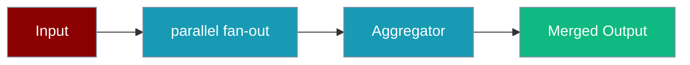
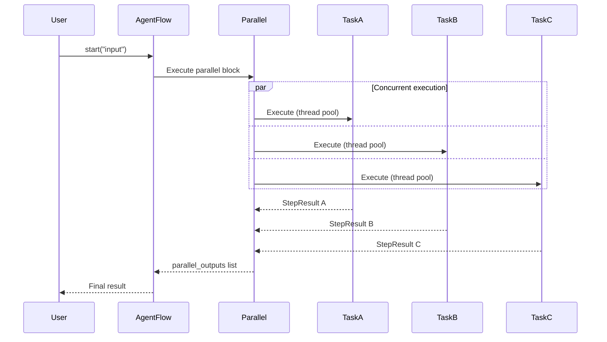
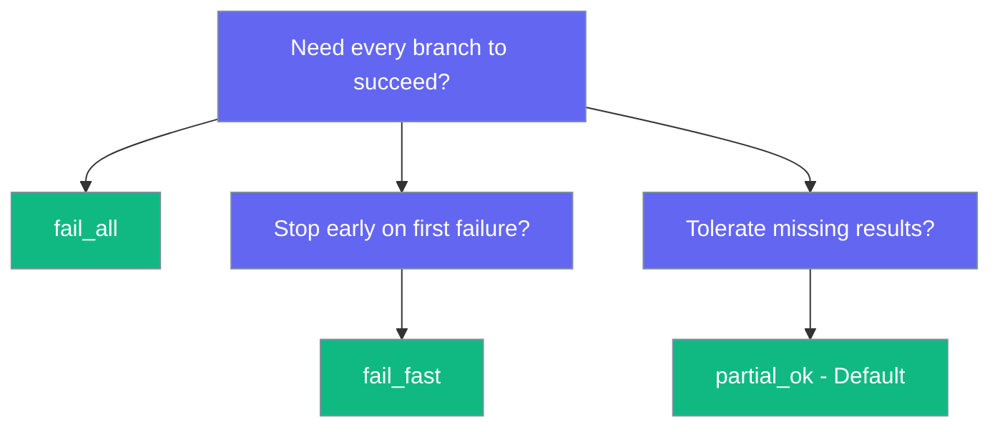

Execute multiple steps concurrently and combine their results. This pattern is ideal for independent tasks that can run simultaneously.

<Note>
Steps inside this pattern inherit the same `max_retries`, `guardrails`, and `output_file` policies as top-level steps. See [Nested workflows → Retry, guardrails, and `output_file`](/docs/features/nested-workflows#retry-guardrails-and-output_file-inside-nested-steps).
</Note>

```python
from praisonaiagents import Agent, AgentFlow, parallel, WorkflowContext, StepResult

coordinator = Agent(name="Coordinator", instructions="Merge parallel results")

def task_a(ctx: WorkflowContext) -> StepResult:
    return StepResult(output="Result A")

def task_b(ctx: WorkflowContext) -> StepResult:
    return StepResult(output="Result B")

workflow = AgentFlow(agents=[coordinator], steps=[parallel([task_a, task_b])])
workflow.start("Run independent tasks in parallel")
```

The user starts one workflow; independent steps run concurrently and merge results.


```mermaid
graph LR
    In[Input] --> Fan[parallel fan-out]
    Fan --> Agg[Aggregator]
    Agg --> Out[Merged Output]

    classDef input fill:#8B0000,stroke:#7C90A0,color:#fff
    classDef process fill:#189AB4,stroke:#7C90A0,color:#fff
    classDef output fill:#10B981,stroke:#7C90A0,color:#fff
    class In input
    class Fan,Agg process
    class Out output
```

## Quick Start

<Steps>
<Step title="Define parallel workers">
```python
from praisonaiagents import AgentFlow, WorkflowContext, StepResult
from praisonaiagents import parallel
import time

def research_market(ctx: WorkflowContext) -> StepResult:
    time.sleep(0.1)  # Simulate work
    return StepResult(output="📊 Market: Growth 15% YoY")

def research_competitors(ctx: WorkflowContext) -> StepResult:
    time.sleep(0.1)  # Simulate work
    return StepResult(output="🏢 Competitors: 3 major players")

def research_customers(ctx: WorkflowContext) -> StepResult:
    time.sleep(0.1)  # Simulate work
    return StepResult(output="👥 Customers: 85% satisfaction")

# Aggregator
def summarize(ctx: WorkflowContext) -> StepResult:
    outputs = ctx.variables.get("parallel_outputs", [])
    summary = "📋 SUMMARY:\n" + "\n".join(f"  • {o}" for o in outputs)
    return StepResult(output=summary)
```
</Step>

<Step title="Run parallel workflow">
```python
workflow = AgentFlow(steps=[
    parallel([research_market, research_competitors, research_customers]),
    summarize
])

result = workflow.start("Analyze business")
print(result["output"])
```
</Step>
</Steps>

**Output:**
```
⚡ Running 3 steps in parallel...
✅ Parallel complete: 3 results
✅ summarize: 📋 SUMMARY:...

📋 SUMMARY:
  • 📊 Market: Growth 15% YoY
  • 🏢 Competitors: 3 major players
  • 👥 Customers: 85% satisfaction
```

## API Reference

### parallel()

```python
parallel(
    steps: List, 
    max_workers: Optional[int] = None,
    on_failure: str = "partial_ok"
) -> Parallel
```

### Parameters

| Parameter | Type | Default | Description |
|-----------|------|---------|-------------|
| `steps` | `List` | — | List of steps to execute concurrently |
| `max_workers` | `Optional[int]` | `None` | Cap on `ThreadPoolExecutor` workers. Defaults to `min(3, len(steps))` |
| `on_failure` | `"partial_ok" \| "fail_fast" \| "fail_all"` | `"partial_ok"` | Failure-handling strategy |

### Accessing Results

After parallel execution, results are available in `ctx.variables`:

| Variable | Type | Description |
|----------|------|-------------|
| `parallel_outputs` | `List[str]` | List of all outputs in order |

```python
def aggregator(ctx: WorkflowContext) -> StepResult:
    outputs = ctx.variables["parallel_outputs"]
    # outputs = ["Result A", "Result B", "Result C"]
    return StepResult(output=f"Combined: {len(outputs)} results")
```

## Examples

### With Agents

```python
from praisonaiagents import Agent

researcher = Agent(name="Researcher", role="Research topics")
analyst = Agent(name="Analyst", role="Analyze data")
writer = Agent(name="Writer", role="Write content")

workflow = AgentFlow(steps=[
    parallel([researcher, analyst, writer]),
    final_aggregator
])
```

### Mixed Steps

```python
workflow = AgentFlow(steps=[
    parallel([
        my_function,           # Function
        Agent(name="Bot"),     # Agent
        Task(...)      # Task
    ]),
    aggregator
])
```

### Nested Parallel

```python
workflow = AgentFlow(steps=[
    parallel([
        parallel([task_a1, task_a2]),  # Group A
        parallel([task_b1, task_b2])   # Group B
    ]),
    final_aggregator
])
```

## Performance

Parallel execution uses Python's `ThreadPoolExecutor`:

- **Concurrent I/O**: Ideal for API calls, file operations
- **Thread-safe**: Each step gets its own copy of variables
- **Automatic joining**: All results collected before next step

```python
# Performance comparison
# Sequential: 3 steps × 1s each = 3s total
# Parallel:   3 steps × 1s each = ~1s total (concurrent)
```

## Use Cases

| Use Case | Description |
|----------|-------------|
| **Multi-source Research** | Query multiple APIs simultaneously |
| **Data Processing** | Process independent data chunks |
| **Report Generation** | Generate sections in parallel |
| **Validation** | Run multiple validators concurrently |
| **A/B Comparison** | Run different approaches and compare |

## How It Works


```mermaid
sequenceDiagram
    participant User
    participant AgentFlow
    participant Parallel
    participant TaskA
    participant TaskB
    participant TaskC

    User->>AgentFlow: start("input")
    AgentFlow->>Parallel: Execute parallel block
    par Concurrent execution
        Parallel->>TaskA: Execute (thread pool)
    and
        Parallel->>TaskB: Execute (thread pool)
    and
        Parallel->>TaskC: Execute (thread pool)
    end
    TaskA-->>Parallel: StepResult A
    TaskB-->>Parallel: StepResult B
    TaskC-->>Parallel: StepResult C
    Parallel-->>AgentFlow: parallel_outputs list
    AgentFlow-->>User: Final result
```

| Phase | What happens |
|---|---|
| 1. Fan-out | `parallel()` submits each step to a thread pool simultaneously |
| 2. Execute | Steps run concurrently; each receives the same workflow context |
| 3. Collect | All results gather into `ctx.variables["parallel_outputs"]` in completion order |
| 4. Continue | Next workflow step (aggregator) receives the merged outputs |

---

## Best Practices

<AccordionGroup>
  <Accordion title="Parallelise only independent steps">
    Branches must not depend on each other's output in the same parallel group.
  </Accordion>
  <Accordion title="Cap concurrency for external APIs">
    Rate-limited tools may need sequential execution or throttling despite parallel support.
  </Accordion>
  <Accordion title="Collect and inspect branch errors">
    Read the aggregated error list after `ParallelExecutionError` before retrying.
  </Accordion>
  <Accordion title="Keep branch outputs small">
    Large parallel results inflate context — summarise before merging downstream.
  </Accordion>
</AccordionGroup>

## Failure Handling

Choose how a parallel block reacts when a branch fails using the `on_failure` parameter.


```mermaid
graph TB
    A[Need every branch to succeed?] --> B[fail_all]
    A --> C[Stop early on first failure?]
    C --> D[fail_fast]
    A --> E[Tolerate missing results?]
    E --> F[partial_ok - Default]
    
    classDef decision fill:#6366F1,stroke:#7C90A0,color:#fff
    classDef strategy fill:#10B981,stroke:#7C90A0,color:#fff
    
    class A,C,E decision
    class B,D,F strategy
```

### Failure Strategies

| Strategy | Behavior | Use Case |
|----------|----------|----------|
| `partial_ok` | Continue with partial results. Failed branches return `"Error: <msg>"` | Data aggregation where some sources may be unavailable |
| `fail_fast` | Cancel remaining branches and raise `WorkflowStepError` on first failure | Critical workflows where any failure invalidates results |
| `fail_all` | Wait for all branches, then raise `WorkflowStepError` if any failed | Comprehensive error reporting and debugging |

### Examples

```python
from praisonaiagents import Agent, AgentFlow, parallel, WorkflowStepError

# partial_ok (default) — continue even if one branch fails
workflow = AgentFlow(steps=[
    parallel([agent_a, agent_b, agent_c]),
    aggregator,
])

# fail_fast — abort on first failure
workflow = AgentFlow(steps=[
    parallel([agent_a, agent_b, agent_c], on_failure="fail_fast"),
    aggregator,
])

# fail_all — gather all errors then fail
workflow = AgentFlow(steps=[
    parallel([agent_a, agent_b, agent_c], on_failure="fail_all"),
    aggregator,
])
```

### Error Handling with partial_ok

```python
def aggregator(ctx: WorkflowContext) -> StepResult:
    outputs = ctx.variables["parallel_outputs"]
    
    # Filter successful results
    successful = [o for o in outputs if not o.startswith("Error:")]
    errors = [o for o in outputs if o.startswith("Error:")]
    
    if len(successful) >= 2:  # Minimum threshold
        return StepResult(output=f"Processed {len(successful)} sources")
    else:
        return StepResult(output=f"Insufficient data: {len(errors)} failures")
```

### Exception Handling with fail_fast/fail_all

```python
try:
    result = workflow.start("Process all branches")
except WorkflowStepError as e:
    print(f"Workflow failed: {e}")
    print(f"Root cause: {e.cause}")
    for error in e.errors:
        print(f"  Branch {error['step']}: {error['error']}")
```

## Related

<CardGroup cols={2}>
  <Card title="Workflow Patterns" icon="diagram-project" href="/docs/features/workflow-patterns">
    Overview of routing, parallel, loop, and repeat
  </Card>
  <Card title="Workflow Routing" icon="route" href="/docs/features/workflow-routing">
    Decision-based branching
  </Card>
  <Card title="Workflow Loop" icon="arrows-rotate" href="/docs/features/workflow-loop">
    Iterate over lists and files
  </Card>
  <Card title="Workflow Repeat" icon="rotate" href="/docs/features/workflow-repeat">
    Repeat until a condition is met
  </Card>
</CardGroup>
