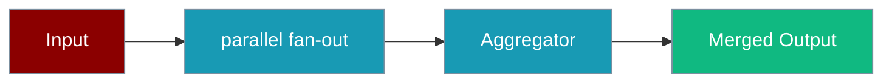
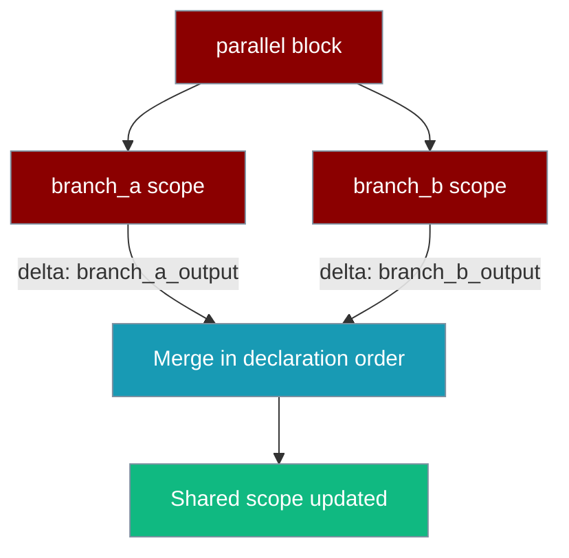
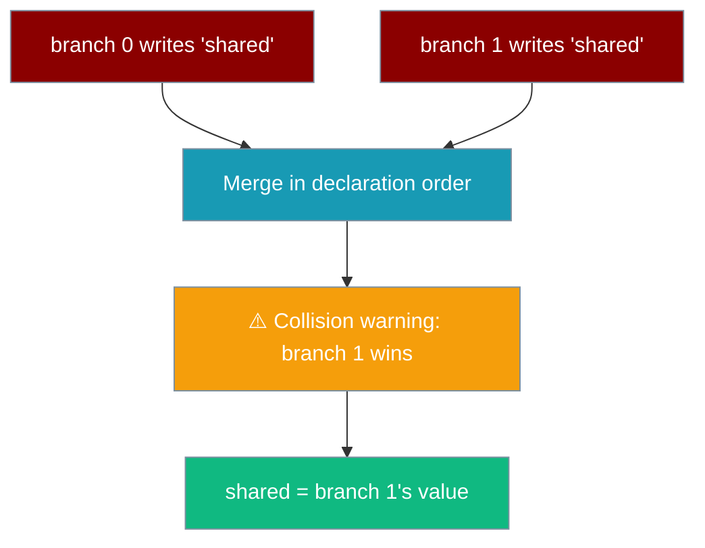
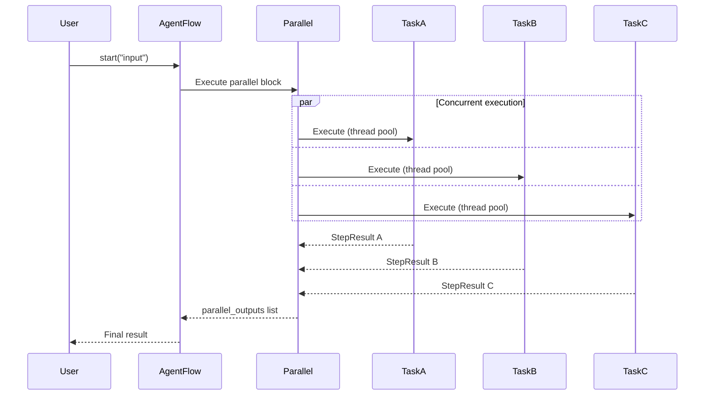
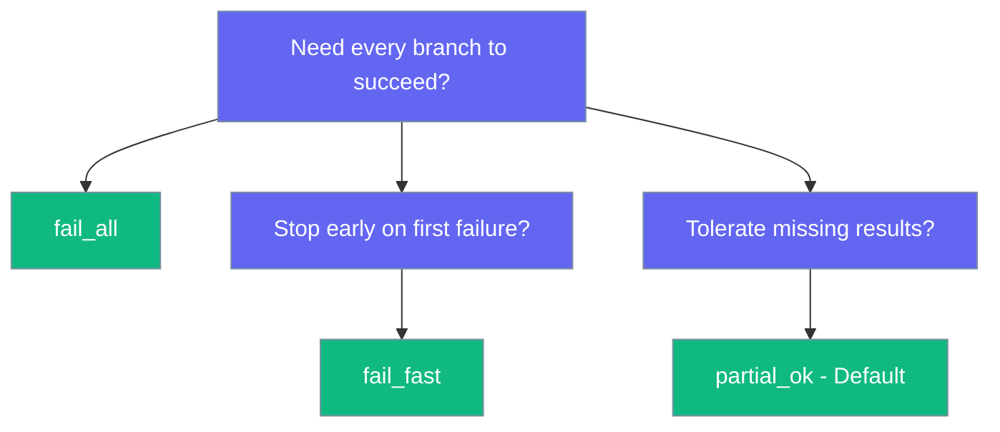

Execute multiple steps concurrently and combine their results. This pattern is ideal for independent tasks that can run simultaneously.

<Note>
Steps inside this pattern inherit the same `max_retries`, `guardrails`, and `output_file` policies as top-level steps. See [Nested workflows → Retry, guardrails, and `output_file`](/docs/features/nested-workflows#retry-guardrails-and-output_file-inside-nested-steps).
</Note>

<Note>
As of PraisonAI [#4932](https://github.com/MervinPraison/PraisonAI/pull/4932), an `output_variable` set inside a branch is preserved after the parallel block. Earlier releases silently discarded it.
</Note>

```python
from praisonaiagents import Agent, AgentFlow, parallel, WorkflowContext, StepResult

coordinator = Agent(name="Coordinator", instructions="Merge parallel results")

def task_a(ctx: WorkflowContext) -> StepResult:
    return StepResult(output="Result A")

def task_b(ctx: WorkflowContext) -> StepResult:
    return StepResult(output="Result B")

workflow = AgentFlow(agents=[coordinator], steps=[parallel([task_a, task_b])])
workflow.start("Run independent tasks in parallel")
```

The user starts one workflow; independent steps run concurrently and merge results.


```mermaid
graph LR
    In[Input] --> Fan[parallel fan-out]
    Fan --> Agg[Aggregator]
    Agg --> Out[Merged Output]

    classDef input fill:#8B0000,stroke:#7C90A0,color:#fff
    classDef process fill:#189AB4,stroke:#7C90A0,color:#fff
    classDef output fill:#10B981,stroke:#7C90A0,color:#fff
    class In input
    class Fan,Agg process
    class Out output
```

## Quick Start

<Steps>
<Step title="Define parallel workers">
```python
from praisonaiagents import AgentFlow, WorkflowContext, StepResult
from praisonaiagents import parallel
import time

def research_market(ctx: WorkflowContext) -> StepResult:
    time.sleep(0.1)  # Simulate work
    return StepResult(output="📊 Market: Growth 15% YoY")

def research_competitors(ctx: WorkflowContext) -> StepResult:
    time.sleep(0.1)  # Simulate work
    return StepResult(output="🏢 Competitors: 3 major players")

def research_customers(ctx: WorkflowContext) -> StepResult:
    time.sleep(0.1)  # Simulate work
    return StepResult(output="👥 Customers: 85% satisfaction")

# Aggregator
def summarize(ctx: WorkflowContext) -> StepResult:
    outputs = ctx.variables.get("parallel_outputs", [])
    summary = "📋 SUMMARY:\n" + "\n".join(f"  • {o}" for o in outputs)
    return StepResult(output=summary)
```
</Step>

<Step title="Run parallel workflow">
```python
workflow = AgentFlow(steps=[
    parallel([research_market, research_competitors, research_customers]),
    summarize
])

result = workflow.start("Analyze business")
print(result["output"])
```
</Step>
</Steps>

**Output:**
```
⚡ Running 3 steps in parallel...
✅ Parallel complete: 3 results
✅ summarize: 📋 SUMMARY:...

📋 SUMMARY:
  • 📊 Market: Growth 15% YoY
  • 🏢 Competitors: 3 major players
  • 👥 Customers: 85% satisfaction
```

## API Reference

### parallel()

```python
parallel(
    steps: List, 
    max_workers: Optional[int] = None,
    on_failure: str = "partial_ok"
) -> Parallel
```

### Parameters

| Parameter | Type | Default | Description |
|-----------|------|---------|-------------|
| `steps` | `List` | — | List of steps to execute concurrently |
| `max_workers` | `Optional[int]` | `None` | Cap on `ThreadPoolExecutor` workers. Defaults to `min(3, len(steps))` |
| `on_failure` | `"partial_ok" \| "fail_fast" \| "fail_all"` | `"partial_ok"` | Failure-handling strategy |

### Accessing Results

After parallel execution, results are available in `ctx.variables`:

| Variable | Type | Description |
|----------|------|-------------|
| `parallel_outputs` | `List[str]` | List of all outputs in order |

```python
def aggregator(ctx: WorkflowContext) -> StepResult:
    outputs = ctx.variables["parallel_outputs"]
    # outputs = ["Result A", "Result B", "Result C"]
    return StepResult(output=f"Combined: {len(outputs)} results")
```

<Note>
**Index alignment under `partial_ok`.** A failed branch contributes `None` at the same index as its step, so `parallel_outputs[i]` is always the result of `parallel_step.steps[i]`. As of PraisonAI [#4203](https://github.com/MervinPraison/PraisonAI/pull/4203), a downstream reader of `parallel_outputs[i]` can no longer silently receive a later branch's result once an earlier branch fails.
</Note>

## Named outputs from branches

Every step inside `parallel([...])` may set `output_variable`. As of PraisonAI [#4932](https://github.com/MervinPraison/PraisonAI/pull/4932), that write is visible to any step **after** the parallel block, keyed by that exact name — not just as a positional entry in `parallel_outputs`.

```python
from praisonaiagents import AgentFlow, Task, WorkflowContext, StepResult, parallel

def branch_a(ctx: WorkflowContext) -> StepResult:
    return StepResult(output="A")

def branch_b(ctx: WorkflowContext) -> StepResult:
    return StepResult(output="B")

def after(ctx: WorkflowContext) -> StepResult:
    a = ctx.variables["branch_a_output"]
    b = ctx.variables["branch_b_output"]
    return StepResult(output=f"{a} + {b}")

workflow = AgentFlow(steps=[
    parallel([
        Task(name="branch_a", handler=branch_a, output_variable="branch_a_output"),
        Task(name="branch_b", handler=branch_b, output_variable="branch_b_output"),
    ]),
    Task(name="after", handler=after),
])
result = workflow.start("go")
print(result["variables"]["branch_a_output"])  # "A"
print(result["variables"]["branch_b_output"])  # "B"
```

The branch's own `output_variable` is stored under that exact name; the ordered `parallel_outputs` list is still there for aggregators that want positional access.

Each branch runs against its own deep copy of the variables, so branches never race on one shared dict. After the block, only the keys a branch actually wrote merge back into the shared scope — untouched variables keep the parent's own object.


```mermaid
graph TB
    P[parallel block] --> BA[branch_a scope]
    P --> BB[branch_b scope]
    BA -->|delta: branch_a_output| M[Merge in declaration order]
    BB -->|delta: branch_b_output| M
    M --> S[Shared scope updated]

    classDef branch fill:#8B0000,stroke:#7C90A0,color:#fff
    classDef merge fill:#189AB4,stroke:#7C90A0,color:#fff
    classDef scope fill:#10B981,stroke:#7C90A0,color:#fff

    class P,BA,BB branch
    class M merge
    class S scope
```

### Two branches wrote the same variable

When two branches write the same `output_variable`, **declaration order wins** — the later branch overwrites the earlier, matching what running the same steps sequentially would produce. The result never depends on which thread finishes first.

```python
workflow = AgentFlow(steps=[
    parallel([
        Task(name="first",  handler=lambda ctx: StepResult(output="FROM-FIRST"),
             output_variable="shared"),
        Task(name="second", handler=lambda ctx: StepResult(output="FROM-SECOND"),
             output_variable="shared"),
    ]),
])
result = workflow.start("go")
print(result["variables"]["shared"])  # "FROM-SECOND"
# WARNING logged: Parallel branches 0 and 1 both wrote variable 'shared'...
```

A `WARNING` names the key and both branches. Silent last-writer-wins was the exact bug [#4932](https://github.com/MervinPraison/PraisonAI/pull/4932) removes, so a collision is reported rather than hidden.

<Tip>
If two branches want to write the same concept, give them distinct `output_variable` names (`branch_a_score`, `branch_b_score`) and combine them in the aggregator.
</Tip>

The same silent-loss defect existed inside `loop()` bodies and was fixed by the sibling PR [#4947](https://github.com/MervinPraison/PraisonAI/pull/4947). See [Named outputs from a loop body](/features/workflow-loop#named-outputs-from-a-loop-body) — loop bodies now propagate writes the same way, with the one difference that per-iteration collisions are not warned about (that would emit N-1 warnings for a correct workflow).


```mermaid
graph TB
    B0["branch 0 writes 'shared'"] --> M[Merge in declaration order]
    B1["branch 1 writes 'shared'"] --> M
    M --> W["⚠️ Collision warning: branch 1 wins"]
    W --> S["shared = branch 1's value"]

    classDef branch fill:#8B0000,stroke:#7C90A0,color:#fff
    classDef merge fill:#189AB4,stroke:#7C90A0,color:#fff
    classDef warn fill:#F59E0B,stroke:#7C90A0,color:#fff
    classDef scope fill:#10B981,stroke:#7C90A0,color:#fff

    class B0,B1 branch
    class M merge
    class W warn
    class S scope
```

## Examples

### With Agents

```python
from praisonaiagents import Agent

researcher = Agent(name="Researcher", role="Research topics")
analyst = Agent(name="Analyst", role="Analyze data")
writer = Agent(name="Writer", role="Write content")

workflow = AgentFlow(steps=[
    parallel([researcher, analyst, writer]),
    final_aggregator
])
```

### Mixed Steps

```python
workflow = AgentFlow(steps=[
    parallel([
        my_function,           # Function
        Agent(name="Bot"),     # Agent
        Task(...)      # Task
    ]),
    aggregator
])
```

### Nested Parallel

```python
workflow = AgentFlow(steps=[
    parallel([
        parallel([task_a1, task_a2]),  # Group A
        parallel([task_b1, task_b2])   # Group B
    ]),
    final_aggregator
])
```

## Performance

Parallel execution uses Python's `ThreadPoolExecutor`:

- **Concurrent I/O**: Ideal for API calls, file operations
- **Thread-safe**: Each step gets its own copy of variables
- **Automatic joining**: All results collected before next step

```python
# Performance comparison
# Sequential: 3 steps × 1s each = 3s total
# Parallel:   3 steps × 1s each = ~1s total (concurrent)
```

## Use Cases

| Use Case | Description |
|----------|-------------|
| **Multi-source Research** | Query multiple APIs simultaneously |
| **Data Processing** | Process independent data chunks |
| **Report Generation** | Generate sections in parallel |
| **Validation** | Run multiple validators concurrently |
| **A/B Comparison** | Run different approaches and compare |

## How It Works


```mermaid
sequenceDiagram
    participant User
    participant AgentFlow
    participant Parallel
    participant TaskA
    participant TaskB
    participant TaskC

    User->>AgentFlow: start("input")
    AgentFlow->>Parallel: Execute parallel block
    par Concurrent execution
        Parallel->>TaskA: Execute (thread pool)
    and
        Parallel->>TaskB: Execute (thread pool)
    and
        Parallel->>TaskC: Execute (thread pool)
    end
    TaskA-->>Parallel: StepResult A
    TaskB-->>Parallel: StepResult B
    TaskC-->>Parallel: StepResult C
    Parallel-->>AgentFlow: parallel_outputs list
    AgentFlow-->>User: Final result
```

| Phase | What happens |
|---|---|
| 1. Fan-out | `parallel()` submits each step to a thread pool simultaneously |
| 2. Execute | Steps run concurrently; each receives the same workflow context |
| 3. Collect | Results gather into `ctx.variables["parallel_outputs"]`, index-aligned with the branches; named `output_variable` writes merge back in declaration order |
| 4. Continue | Next workflow step (aggregator) receives the merged outputs and named variables |

---

## Best Practices

<AccordionGroup>
  <Accordion title="Parallelise only independent steps">
    Branches must not depend on each other's output in the same parallel group.
  </Accordion>
  <Accordion title="Cap concurrency for external APIs">
    Rate-limited tools may need sequential execution or throttling despite parallel support.
  </Accordion>
  <Accordion title="Collect and inspect branch errors">
    Read the aggregated error list after `ParallelExecutionError` before retrying.
  </Accordion>
  <Accordion title="Keep branch outputs small">
    Large parallel results inflate context — summarise before merging downstream.
  </Accordion>
  <Accordion title="Give sibling branches distinct output_variable names">
    Two branches writing the same `output_variable` collide — the later-declared branch silently overwrites the earlier one (with a warning). That class of silent loss is exactly what [#4932](https://github.com/MervinPraison/PraisonAI/pull/4932) fixes; distinct names (`branch_a_score`, `branch_b_score`) avoid it entirely.
  </Accordion>
</AccordionGroup>

## Failure Handling

Choose how a parallel block reacts when a branch fails using the `on_failure` parameter.


```mermaid
graph TB
    A[Need every branch to succeed?] --> B[fail_all]
    A --> C[Stop early on first failure?]
    C --> D[fail_fast]
    A --> E[Tolerate missing results?]
    E --> F[partial_ok - Default]
    
    classDef decision fill:#6366F1,stroke:#7C90A0,color:#fff
    classDef strategy fill:#10B981,stroke:#7C90A0,color:#fff
    
    class A,C,E decision
    class B,D,F strategy
```

### Failure Strategies

| Strategy | Behavior | Use Case |
|----------|----------|----------|
| `partial_ok` | Continue with partial results. Failed branches contribute `None` at the same index in `parallel_outputs`, index-aligned with the step. | Data aggregation where some sources may be unavailable |
| `fail_fast` | Cancel remaining branches and raise `WorkflowStepError` on first failure | Critical workflows where any failure invalidates results |
| `fail_all` | Wait for all branches, then raise `WorkflowStepError` if any failed | Comprehensive error reporting and debugging |

<Note>
**Variable merging on failure.** Under `partial_ok`, the variables a failed branch had already written before it failed are preserved — its own `output_variable` is never set (the failure path returns before that write), so a downstream reader cannot pick up a value the failure invented. Under `fail_fast` / `fail_all`, **nothing from any branch is merged**: the block raises before the merge runs. See [Named outputs from branches](#named-outputs-from-branches).
</Note>

### Examples

```python
from praisonaiagents import Agent, AgentFlow, parallel, WorkflowStepError

# partial_ok (default) — continue even if one branch fails
workflow = AgentFlow(steps=[
    parallel([agent_a, agent_b, agent_c]),
    aggregator,
])

# fail_fast — abort on first failure
workflow = AgentFlow(steps=[
    parallel([agent_a, agent_b, agent_c], on_failure="fail_fast"),
    aggregator,
])

# fail_all — gather all errors then fail
workflow = AgentFlow(steps=[
    parallel([agent_a, agent_b, agent_c], on_failure="fail_all"),
    aggregator,
])
```

### Error Handling with partial_ok

```python
def aggregator(ctx: WorkflowContext) -> StepResult:
    outputs = ctx.variables["parallel_outputs"]

    # A failed branch contributes None at its index
    successful = [o for o in outputs if o is not None]
    failures = [o for o in outputs if o is None]

    if len(successful) >= 2:  # Minimum threshold
        return StepResult(output=f"Processed {len(successful)} sources")
    else:
        return StepResult(output=f"Insufficient data: {len(failures)} failures")
```

### Stop propagation from nested steps

A branch step with `on_error="stop"` halts the **whole workflow**, not just the parallel block — even under `on_failure="partial_ok"`. As of PraisonAI [#4203](https://github.com/MervinPraison/PraisonAI/pull/4203), `parallel(...)` propagates a nested stop up to the enclosing workflow, matching `route()` / `loop()` / `repeat()` / `if_()`.

```python
from praisonaiagents import Task, parallel, AgentFlow

risky = Task(name="charge_customer", handler=charge, on_error="stop")   # halts on failure
safe  = Task(name="log_event", handler=log_event)

wf = AgentFlow(steps=[
    parallel([risky, safe], on_failure="partial_ok"),
    Task(name="ship_order", handler=ship),   # must NOT run if charge_customer failed
])
wf.run(input=order)
# charge_customer fails → workflow halts with status="failed"; ship_order never runs.
# Printed: 🛑 Workflow stopped by nested parallel step
```

```mermaid
sequenceDiagram
    participant WF as Workflow
    participant P as parallel()
    participant R as risky (on_error=stop)
    participant S as safe

    WF->>P: enter parallel block
    par
        P->>R: run risky
        R-->>P: raise → stop=True
    and
        P->>S: run safe
        S-->>P: ok
    end
    P-->>WF: {steps, outputs=[None, ok], stop=True}
    WF->>WF: status="failed"; break
    Note over WF: 🛑 Workflow stopped by nested parallel step
```

The interaction between the parallel block's `on_failure` mode and a branch step's `on_error` is:

| `on_failure` (parallel) | Branch step's `on_error` | Result |
|---|---|---|
| `partial_ok` | `continue` (default) | Branch error recorded, other branches keep running, workflow proceeds |
| `partial_ok` | `stop` | Branch error recorded, workflow halts with `status="failed"` **after the parallel block** |
| `fail_fast` | any | First failure raises `WorkflowStepError`, workflow halts |
| `fail_all` | any | All branches run, then `WorkflowStepError` raised if any failed |

### Exception Handling with fail_fast/fail_all

```python
try:
    result = workflow.start("Process all branches")
except WorkflowStepError as e:
    print(f"Workflow failed: {e}")
    print(f"Root cause: {e.cause}")
    for error in e.errors:
        print(f"  Branch {error['step']}: {error['error']}")
```

## Related

<CardGroup cols={2}>
  <Card title="Workflow Patterns" icon="diagram-project" href="/features/workflow-patterns">
    Overview of routing, parallel, loop, and repeat
  </Card>
  <Card title="Workflow Routing" icon="route" href="/features/workflow-routing">
    Decision-based branching
  </Card>
  <Card title="Workflow Loop" icon="arrows-rotate" href="/features/workflow-loop">
    Iterate over lists and files
  </Card>
  <Card title="Workflow Repeat" icon="rotate" href="/features/workflow-repeat">
    Repeat until a condition is met
  </Card>
  <Card title="Workflow Discussion" icon="comments" href="/features/workflow-discussion">
    N-agent conversation loop
  </Card>
</CardGroup>
