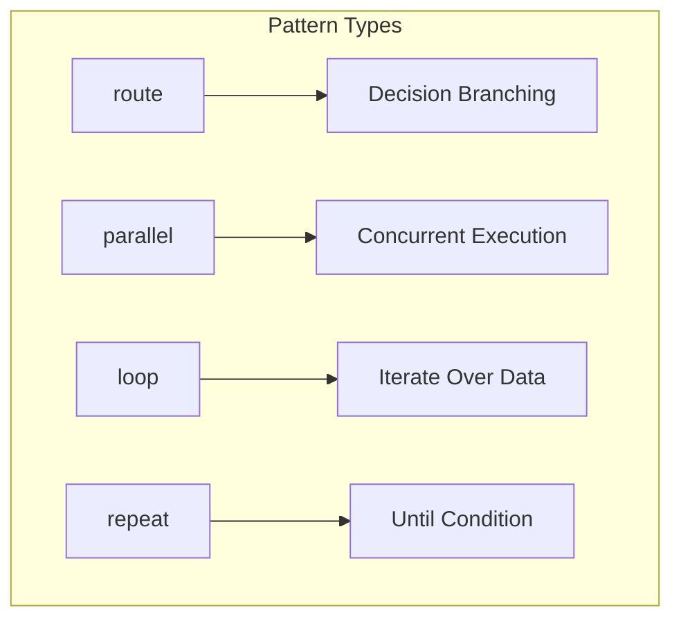
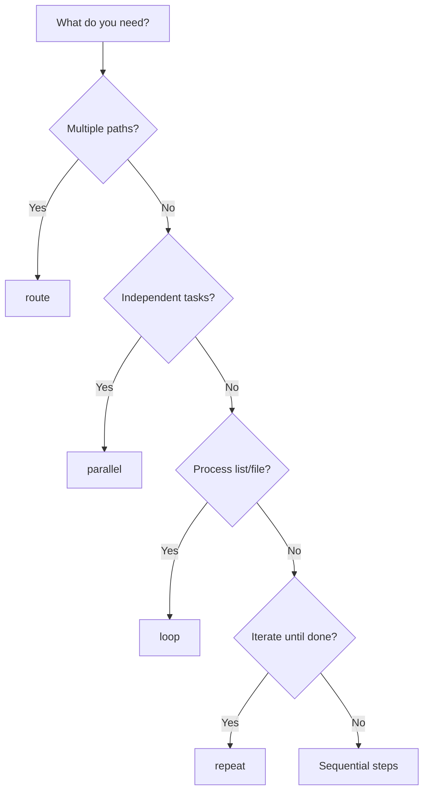

# Workflow Patterns

PraisonAI provides four powerful workflow patterns that can be combined to create complex, production-ready workflows.



## Quick Comparison

| Pattern | Purpose | Use When |
|---------|---------|----------|
| `route()` | Decision-based branching | Output determines next steps |
| `parallel()` | Concurrent execution | Independent tasks can run together |
| `loop()` | Iterate over data | Processing lists, CSV files |
| `repeat()` | Repeat until condition | Iterative improvement |

## Import

```python
from praisonaiagents import Workflow, WorkflowContext, StepResult
# Or use Pipeline (alias for Workflow)
from praisonaiagents import Pipeline
from praisonaiagents.workflows import route, parallel, loop, repeat
```

<Tip>
`Pipeline` and `Workflow` are the same class. Use whichever term you prefer!
</Tip>

## Pattern Overview

### 1. Routing (Decision Branching)

Route to different steps based on previous output:

```python
workflow = Workflow(steps=[
    classifier,
    route({
        "approve": [approve_handler],
        "reject": [reject_handler],
        "default": [fallback]
    })
])
```

📖 [Full Documentation →](/features/workflow-routing)

### 2. Parallel (Concurrent Execution)

Execute multiple steps at the same time:

```python
workflow = Workflow(steps=[
    parallel([research_a, research_b, research_c]),
    aggregator  # Combines results
])
```

📖 [Full Documentation →](/features/workflow-parallel)

### 3. Loop (Iterate Over Data)

Process each item in a list or file:

```python
# From list
workflow = Workflow(
    steps=[loop(processor, over="items")],
    variables={"items": ["a", "b", "c"]}
)

# From CSV
workflow = Workflow(steps=[
    loop(processor, from_csv="data.csv")
])
```

📖 [Full Documentation →](/features/workflow-loop)

### 4. Repeat (Evaluator-Optimizer)

Repeat until a condition is met:

```python
workflow = Workflow(steps=[
    repeat(
        generator,
        until=lambda ctx: "done" in ctx.previous_result,
        max_iterations=5
    )
])
```

📖 [Full Documentation →](/features/workflow-repeat)

## Combining Patterns

Patterns can be combined for complex workflows:

```python
workflow = Workflow(steps=[
    # Step 1: Parallel research from multiple sources
    parallel([
        research_market,
        research_competitors,
        research_customers
    ]),
    
    # Step 2: Route based on findings
    analyze_findings,
    route({
        "positive": [expand_analysis],
        "negative": [summarize_concerns],
        "default": [standard_report]
    }),
    
    # Step 3: Process each recommendation
    loop(process_recommendation, over="recommendations"),
    
    # Step 4: Refine until quality threshold
    repeat(
        refine_output,
        until=meets_quality_threshold,
        max_iterations=3
    ),
    
    # Step 5: Final output
    format_final_report
])
```

## Common Workflow Architectures

### Orchestrator-Worker

```python
workflow = Workflow(steps=[
    orchestrator,  # Decides which workers to use
    route({
        "type_a": [worker_a],
        "type_b": [worker_b],
        "type_c": [worker_c]
    }),
    synthesizer  # Combines worker outputs
])
```

### Fan-Out/Fan-In

```python
workflow = Workflow(steps=[
    splitter,  # Splits work into parts
    parallel([processor_1, processor_2, processor_3]),
    aggregator  # Combines results
])
```

### Batch Processing Pipeline

```python
workflow = Workflow(steps=[
    loop(validate_item, from_csv="input.csv"),
    loop(transform_item, over="validated_items"),
    loop(load_item, over="transformed_items"),
    generate_report
])
```

### Self-Improving Agent

```python
workflow = Workflow(steps=[
    initial_generator,
    repeat(
        improve_output,
        until=quality_check,
        max_iterations=5
    ),
    final_polish
])
```

## Pattern Selection Guide



## Best Practices

### 1. Start Simple

```python
# Start with sequential
workflow = Workflow(steps=[step1, step2, step3])

# Add patterns as needed
workflow = Workflow(steps=[
    step1,
    parallel([step2a, step2b]),  # Optimize with parallel
    step3
])
```

### 2. Handle Errors

```python
def safe_step(ctx: WorkflowContext) -> StepResult:
    try:
        # Your logic
        return StepResult(output="Success")
    except Exception as e:
        return StepResult(output=f"Error: {e}")
```

### 3. Use Verbose Mode

```python
result = workflow.start("input", )
# Shows step-by-step progress
```

### 4. Track State with Variables

```python
def my_step(ctx: WorkflowContext) -> StepResult:
    count = ctx.variables.get("count", 0) + 1
    return StepResult(
        output=f"Count: {count}",
        variables={"count": count}
    )
```

## API Reference

| Function | Signature |
|----------|-----------|
| `route()` | `route(routes: Dict[str, List], default: Optional[List] = None)` |
| `parallel()` | `parallel(steps: List)` |
| `loop()` | `loop(step, over=None, from_csv=None, from_file=None, var_name="item")` |
| `repeat()` | `repeat(step, until=None, max_iterations=10)` |

## See Also

<CardGroup cols={2}>
  <Card title="Workflow Routing" icon="route" href="/features/workflow-routing">
    Decision-based branching
  </Card>
  <Card title="Parallel Execution" icon="arrows-split-up-and-left" href="/features/workflow-parallel">
    Concurrent step execution
  </Card>
  <Card title="Loop Processing" icon="arrows-rotate" href="/features/workflow-loop">
    Iterate over data
  </Card>
  <Card title="Repeat Pattern" icon="rotate" href="/features/workflow-repeat">
    Evaluator-optimizer pattern
  </Card>
</CardGroup>
