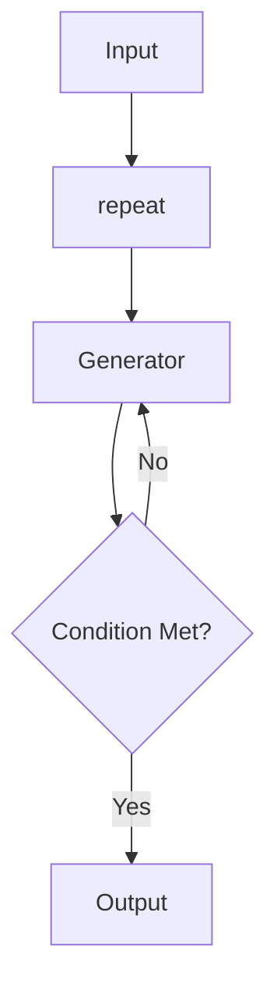

# Workflow Repeat (Evaluator-Optimizer)

Repeat a step until a condition is met. This pattern is ideal for iterative improvement, quality checking, and optimization workflows.



## Quick Start

```python
from praisonaiagents import Workflow, WorkflowContext, StepResult
from praisonaiagents import repeat

# Generator that improves each iteration
class ContentGenerator:
    def __init__(self):
        self.points = []
    
    def generate(self, ctx: WorkflowContext) -> StepResult:
        self.points.append(f"Point {len(self.points) + 1}")
        return StepResult(
            output=f"Generated {len(self.points)} points",
            variables={"point_count": len(self.points)}
        )

# Condition: stop when we have enough
def has_enough(ctx: WorkflowContext) -> bool:
    return ctx.variables.get("point_count", 0) >= 5

generator = ContentGenerator()

workflow = Workflow(steps=[
    repeat(generator.generate, until=has_enough, max_iterations=10)
])

result = workflow.start("Generate content", )
```

**Output:**
```
🔄 Repeating up to 10 times...
✅ generate: Generated 1 points...
✅ generate: Generated 2 points...
✅ generate: Generated 3 points...
✅ generate: Generated 4 points...
✅ generate: Generated 5 points...
✅ Repeat condition met at iteration 5
```

## API Reference

### repeat()

```python
repeat(
    step: Any,                                              # Step to repeat
    until: Optional[Callable[[WorkflowContext], bool]] = None,  # Stop condition
    max_iterations: int = 10                                # Maximum iterations
) -> Repeat
```

### Parameters

| Parameter | Type | Default | Description |
|-----------|------|---------|-------------|
| `step` | `Any` | required | Step to repeat (function, Agent, WorkflowStep) |
| `until` | `Optional[Callable]` | `None` | Function returning True to stop |
| `max_iterations` | `int` | `10` | Maximum number of iterations |

### Condition Function

The `until` function receives `WorkflowContext` and returns `bool`:

```python
def my_condition(ctx: WorkflowContext) -> bool:
    # Access previous output
    output = ctx.previous_result
    
    # Access variables
    count = ctx.variables.get("count", 0)
    
    # Return True to stop, False to continue
    return "done" in output.lower() or count >= 10
```

### Result Variables

After repeat completion:

| Variable | Type | Description |
|----------|------|-------------|
| `repeat_iterations` | `int` | Number of iterations executed |

## Examples

### Quality-Based Stopping

```python
def evaluate_quality(ctx: WorkflowContext) -> bool:
    output = ctx.previous_result or ""
    # Stop when output contains "excellent"
    return "excellent" in output.lower()

workflow = Workflow(steps=[
    repeat(improve_content, until=evaluate_quality, max_iterations=5)
])
```

### Counter-Based Stopping

```python
def generate_item(ctx: WorkflowContext) -> StepResult:
    count = ctx.variables.get("item_count", 0) + 1
    return StepResult(
        output=f"Item {count}",
        variables={"item_count": count}
    )

def has_enough_items(ctx: WorkflowContext) -> bool:
    return ctx.variables.get("item_count", 0) >= 10

workflow = Workflow(steps=[
    repeat(generate_item, until=has_enough_items, max_iterations=20)
])
```

### With Agents

```python
from praisonaiagents import Agent

improver = Agent(
    name="Improver",
    role="Content improver",
    instructions="Improve this content. Say 'DONE' when perfect."
)

def is_done(ctx: WorkflowContext) -> bool:
    return "DONE" in (ctx.previous_result or "")

workflow = Workflow(steps=[
    repeat(improver, until=is_done, max_iterations=5)
])
```

### Evaluator-Optimizer Pattern

Classic pattern with separate generator and evaluator:

```python
def generator(ctx: WorkflowContext) -> StepResult:
    # Generate or improve content
    current = ctx.previous_result or ""
    improved = f"{current}\n- New point added"
    return StepResult(output=improved)

def evaluator(ctx: WorkflowContext) -> bool:
    output = ctx.previous_result or ""
    # Check if we have enough points
    point_count = output.count("- ")
    return point_count >= 5

workflow = Workflow(steps=[
    repeat(generator, until=evaluator, max_iterations=10)
])
```

### With Early Stop

```python
def process_with_stop(ctx: WorkflowContext) -> StepResult:
    if "error" in ctx.input:
        return StepResult(output="Error detected", stop_workflow=True)
    return StepResult(output="Processed")

workflow = Workflow(steps=[
    repeat(process_with_stop, max_iterations=5)
])
```

## Use Cases

| Use Case | Description |
|----------|-------------|
| **Content Generation** | Generate until quality threshold met |
| **Optimization** | Iterate until optimal solution found |
| **Validation** | Retry until validation passes |
| **Data Collection** | Collect until enough data gathered |
| **Self-Correction** | Agent corrects itself until correct |

## Best Practices

1. **Always set max_iterations** - Prevent infinite loops
2. **Clear stopping conditions** - Make conditions unambiguous
3. **Track progress** - Use variables to track iteration state
4. **Handle edge cases** - Consider what happens at max iterations

## Comparison with Loop

| Feature | `loop()` | `repeat()` |
|---------|----------|------------|
| **Purpose** | Iterate over data | Iterate until condition |
| **Data source** | List, CSV, file | None (generates) |
| **Stopping** | When data exhausted | When condition met |
| **Use case** | Batch processing | Iterative improvement |

## See Also

- [Workflow Patterns Overview](/features/workflow-patterns)
- [Workflow Routing](/features/workflow-routing)
- [Parallel Execution](/features/workflow-parallel)
- [Loop Processing](/features/workflow-loop)
