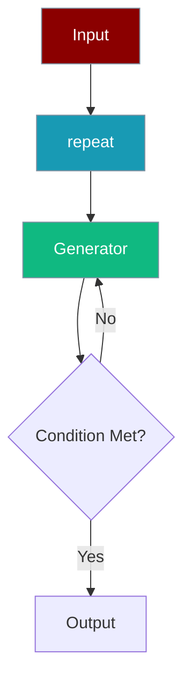
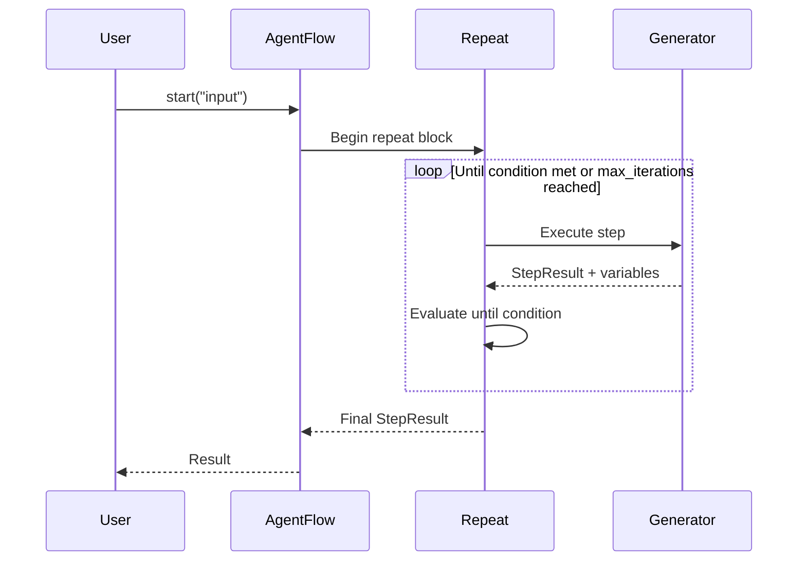

Repeat a step until a condition is met. This pattern is ideal for iterative improvement, quality checking, and optimization workflows.

```python
from praisonaiagents import Agent, AgentFlow, repeat, WorkflowContext, StepResult

editor = Agent(name="Editor", instructions="Improve the draft each iteration")

def refine(ctx: WorkflowContext) -> StepResult:
    n = ctx.variables.get("repeat_index", 0)
    return StepResult(output=f"Draft revision {n}")

workflow = AgentFlow(agents=[editor], steps=[repeat(refine, times=3)])
workflow.start("Iterate until quality is acceptable")
```

The user requests repeated refinement; the repeat helper runs the step N times.


```mermaid
graph TD
    A[Input] --> B[repeat]
    B --> C[Generator]
    C --> D{Condition Met?}
    D -->|No| C
    D -->|Yes| E[Output]
    classDef agent fill:#8B0000,stroke:#7C90A0,color:#fff
    classDef tool fill:#189AB4,stroke:#7C90A0,color:#fff
    classDef success fill:#10B981,stroke:#7C90A0,color:#fff
    class A agent
    class B tool
    class C success

```

## Quick Start

<Steps>
<Step title="Define generator and stop condition">
```python
from praisonaiagents import AgentFlow, WorkflowContext, StepResult
from praisonaiagents import repeat

class ContentGenerator:
    def __init__(self):
        self.points = []
    
    def generate(self, ctx: WorkflowContext) -> StepResult:
        self.points.append(f"Point {len(self.points) + 1}")
        return StepResult(
            output=f"Generated {len(self.points)} points",
            variables={"point_count": len(self.points)}
        )

# Condition: stop when we have enough
def has_enough(ctx: WorkflowContext) -> bool:
    return ctx.variables.get("point_count", 0) >= 5

generator = ContentGenerator()
```
</Step>

<Step title="Run repeat workflow">
```python
workflow = AgentFlow(steps=[
    repeat(generator.generate, until=has_enough, max_iterations=10)
])

result = workflow.start("Generate content")
```
</Step>
</Steps>

**Output:**
```
🔄 Repeating up to 10 times...
✅ generate: Generated 1 points...
✅ generate: Generated 2 points...
✅ generate: Generated 3 points...
✅ generate: Generated 4 points...
✅ generate: Generated 5 points...
✅ Repeat condition met at iteration 5
```

## API Reference

### repeat()

```python
repeat(
    step: Any,                                              # Step to repeat
    until: Optional[Callable[[WorkflowContext], bool]] = None,  # Stop condition
    max_iterations: int = 10                                # Maximum iterations
) -> Repeat
```

### Parameters

| Parameter | Type | Default | Description |
|-----------|------|---------|-------------|
| `step` | `Any` | required | Step to repeat (function, Agent, Task) |
| `until` | `Optional[Callable]` | `None` | Function returning True to stop |
| `max_iterations` | `int` | `10` | Maximum number of iterations |

### Condition Function

The `until` function receives `WorkflowContext` and returns `bool`:

```python
def my_condition(ctx: WorkflowContext) -> bool:
    # Access previous output
    output = ctx.previous_result
    
    # Access variables
    count = ctx.variables.get("count", 0)
    
    # Return True to stop, False to continue
    return "done" in output.lower() or count >= 10
```

### Result Variables

After repeat completion:

| Variable | Type | Description |
|----------|------|-------------|
| `repeat_iterations` | `int` | Number of iterations executed |

## Examples

### Quality-Based Stopping

```python
def evaluate_quality(ctx: WorkflowContext) -> bool:
    output = ctx.previous_result or ""
    # Stop when output contains "excellent"
    return "excellent" in output.lower()

workflow = AgentFlow(steps=[
    repeat(improve_content, until=evaluate_quality, max_iterations=5)
])
```

### Counter-Based Stopping

```python
def generate_item(ctx: WorkflowContext) -> StepResult:
    count = ctx.variables.get("item_count", 0) + 1
    return StepResult(
        output=f"Item {count}",
        variables={"item_count": count}
    )

def has_enough_items(ctx: WorkflowContext) -> bool:
    return ctx.variables.get("item_count", 0) >= 10

workflow = AgentFlow(steps=[
    repeat(generate_item, until=has_enough_items, max_iterations=20)
])
```

### With Agents

```python
from praisonaiagents import Agent

improver = Agent(
    name="Improver",
    role="Content improver",
    instructions="Improve this content. Say 'DONE' when perfect."
)

def is_done(ctx: WorkflowContext) -> bool:
    return "DONE" in (ctx.previous_result or "")

workflow = AgentFlow(steps=[
    repeat(improver, until=is_done, max_iterations=5)
])
```

### Evaluator-Optimizer Pattern

Classic pattern with separate generator and evaluator:

```python
def generator(ctx: WorkflowContext) -> StepResult:
    # Generate or improve content
    current = ctx.previous_result or ""
    improved = f"{current}\n- New point added"
    return StepResult(output=improved)

def evaluator(ctx: WorkflowContext) -> bool:
    output = ctx.previous_result or ""
    # Check if we have enough points
    point_count = output.count("- ")
    return point_count >= 5

workflow = AgentFlow(steps=[
    repeat(generator, until=evaluator, max_iterations=10)
])
```

### With Early Stop

```python
def process_with_stop(ctx: WorkflowContext) -> StepResult:
    if "error" in ctx.input:
        return StepResult(output="Error detected", stop_workflow=True)
    return StepResult(output="Processed")

workflow = AgentFlow(steps=[
    repeat(process_with_stop, max_iterations=5)
])
```

## Use Cases

| Use Case | Description |
|----------|-------------|
| **Content Generation** | Generate until quality threshold met |
| **Optimization** | Iterate until optimal solution found |
| **Validation** | Retry until validation passes |
| **Data Collection** | Collect until enough data gathered |
| **Self-Correction** | Agent corrects itself until correct |

## How It Works


```mermaid
sequenceDiagram
    participant User
    participant AgentFlow
    participant Repeat
    participant Generator

    User->>AgentFlow: start("input")
    AgentFlow->>Repeat: Begin repeat block
    loop Until condition met or max_iterations reached
        Repeat->>Generator: Execute step
        Generator-->>Repeat: StepResult + variables
        Repeat->>Repeat: Evaluate until condition
    end
    Repeat-->>AgentFlow: Final StepResult
    AgentFlow-->>User: Result
```

| Phase | What happens |
|---|---|
| 1. Start | `repeat()` records the initial `repeat_index = 0` in context variables |
| 2. Generate | The wrapped step runs and returns a `StepResult` |
| 3. Evaluate | The `until` callable receives the updated `WorkflowContext`; returns `True` to stop |
| 4. Repeat | If `until` returns `False` and `max_iterations` not reached, the step runs again |
| 5. Return | Final `StepResult` is passed to the next workflow step |

---

## Best Practices

<AccordionGroup>
  <Accordion title="Set a sensible max_iterations">
    Cap repeat loops to prevent runaway cost when exit conditions never trigger.
  </Accordion>
  <Accordion title="Write clear until conditions">
    Evaluator functions should return explicit booleans — avoid ambiguous string matching.
  </Accordion>
  <Accordion title="Use repeat for refinement, loop for batches">
    Repeat improves a single artefact; loop processes many items — do not confuse the two.
  </Accordion>
  <Accordion title="Log each iteration in staging">
    Inspect intermediate outputs when tuning evaluator-optimiser workflows.
  </Accordion>
</AccordionGroup>

## Comparison with Loop

| Feature | `loop()` | `repeat()` |
|---------|----------|------------|
| **Purpose** | Iterate over data | Iterate until condition |
| **Data source** | List, CSV, file | None (generates) |
| **Stopping** | When data exhausted | When condition met |
| **Use case** | Batch processing | Iterative improvement |

## Related

<CardGroup cols={2}>
  <Card title="Workflow Patterns" icon="diagram-project" href="/docs/features/workflow-patterns">
    Overview of routing, parallel, loop, and repeat
  </Card>
  <Card title="Workflow Loop" icon="arrows-rotate" href="/docs/features/workflow-loop">
    Iterate over lists and files
  </Card>
  <Card title="Workflow Routing" icon="route" href="/docs/features/workflow-routing">
    Decision-based branching
  </Card>
  <Card title="Workflow Parallel" icon="arrows-split-up-and-left" href="/docs/features/workflow-parallel">
    Run independent steps concurrently
  </Card>
</CardGroup>
