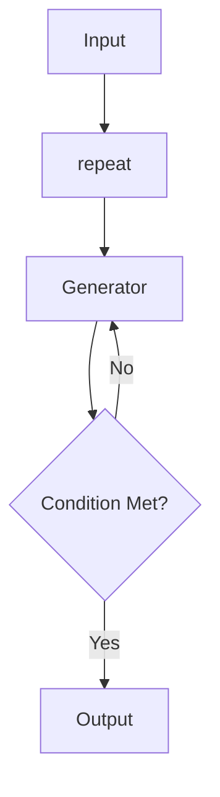

# Workflow Repeat (Evaluator-Optimizer)

Repeat a step until a condition is met. This pattern is ideal for iterative improvement, quality checking, and optimization workflows.


```mermaid
graph TD
    A[Input] --> B[repeat]
    B --> C[Generator]
    C --> D{Condition Met?}
    D -->|No| C
    D -->|Yes| E[Output]
```

## Quick Start


<Steps>
<Step title="Simple Usage">
```python
from praisonaiagents import AgentFlow, WorkflowContext, StepResult
from praisonaiagents import repeat

# Generator that improves each iteration
class ContentGenerator:
    def __init__(self):
        self.points = []
    
    def generate(self, ctx: WorkflowContext) -> StepResult:
        self.points.append(f"Point {len(self.points) + 1}")
        return StepResult(
            output=f"Generated {len(self.points)} points",
            variables={"point_count": len(self.points)}
        )

# Condition: stop when we have enough
def has_enough(ctx: WorkflowContext) -> bool:
    return ctx.variables.get("point_count", 0) >= 5

generator = ContentGenerator()

workflow = AgentFlow(steps=[
    repeat(generator.generate, until=has_enough, max_iterations=10)
])

result = workflow.start("Generate content", )
```
</Step>

<Step title="With Configuration">
**Output:**
```
🔄 Repeating up to 10 times...
✅ generate: Generated 1 points...
✅ generate: Generated 2 points...
✅ generate: Generated 3 points...
✅ generate: Generated 4 points...
✅ generate: Generated 5 points...
✅ Repeat condition met at iteration 5
```
</Step>
</Steps>


## Best Practices

<AccordionGroup>
  <Accordion title="Start simple">
    Enable the feature with a single parameter before adding configuration. Verify it works, then layer in options.
  </Accordion>
  <Accordion title="Use environment variables for secrets">
    Never hardcode API keys or tokens. Use `os.getenv("KEY_NAME")` to read from environment variables.
  </Accordion>
  <Accordion title="Test with minimal examples first">
    Copy the Quick Start example, run it, then extend it. This confirms your environment is set up correctly.
  </Accordion>
  <Accordion title="Check the logs">
    Set `verbose=True` on your agent to see detailed execution logs when debugging unexpected behavior.
  </Accordion>
</AccordionGroup>

## Related

<CardGroup cols={2}>
  <Card title="Features Overview" icon="grid-2" href="/docs/features">
    Browse all PraisonAI features
  </Card>
  <Card title="Quick Start" icon="rocket" href="/docs/introduction">
    Get started with PraisonAI agents
  </Card>
</CardGroup>
