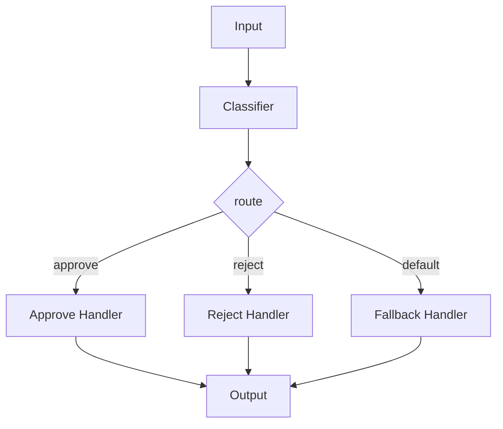

# Workflow Routing

Route workflows to different paths based on the output of a decision step. This pattern is also known as **Agentic Routing** or **Conditional Branching**.



## Quick Start

```python
from praisonaiagents import Workflow, WorkflowContext, StepResult
from praisonaiagents import route

# Decision maker - determines which route to take
def classify_request(ctx: WorkflowContext) -> StepResult:
    input_lower = ctx.input.lower()
    if "urgent" in input_lower:
        return StepResult(output="priority: high")
    elif "question" in input_lower:
        return StepResult(output="priority: support")
    return StepResult(output="priority: normal")

# Route handlers
def handle_high(ctx: WorkflowContext) -> StepResult:
    return StepResult(output="🚨 Escalating to senior team!")

def handle_support(ctx: WorkflowContext) -> StepResult:
    return StepResult(output="💬 Routing to help desk")

def handle_normal(ctx: WorkflowContext) -> StepResult:
    return StepResult(output="📋 Added to queue")

# Create workflow with routing
workflow = Workflow(steps=[
    classify_request,
    route({
        "high": [handle_high],
        "support": [handle_support],
        "normal": [handle_normal],
        "default": [handle_normal]
    })
])

result = workflow.start("This is URGENT!", )
print(result["output"])  # "🚨 Escalating to senior team!"
```

## API Reference

### route()

```python
route(
    routes: Dict[str, List],      # Key: pattern to match, Value: steps to execute
    default: Optional[List] = None # Fallback steps if no match
) -> Route
```

### Parameters

| Parameter | Type | Description |
|-----------|------|-------------|
| `routes` | `Dict[str, List]` | Dictionary mapping patterns to step lists |
| `default` | `Optional[List]` | Steps to execute if no pattern matches |

### How Matching Works

The router checks if any route key (case-insensitive) is contained in the previous step's output:

```python
# If previous output is "priority: high"
route({
    "high": [...],    # ✅ Matches - "high" is in "priority: high"
    "low": [...],     # ❌ No match
})
```

## Examples

### Multi-Step Routes

Each route can contain multiple steps:

```python
workflow = Workflow(steps=[
    classifier,
    route({
        "approve": [
            validate_approval,
            send_notification,
            update_database
        ],
        "reject": [
            log_rejection,
            notify_requester
        ]
    })
])
```

### Chained Routing

Routes can be chained for complex decision trees:

```python
workflow = Workflow(steps=[
    initial_classifier,
    route({
        "category_a": [
            sub_classifier_a,
            route({
                "sub_a1": [handler_a1],
                "sub_a2": [handler_a2]
            })
        ],
        "category_b": [handler_b]
    })
])
```

### With Agents

Routes can include Agent instances:

```python
from praisonaiagents import Agent

researcher = Agent(name="Researcher", role="Research topics")
writer = Agent(name="Writer", role="Write content")

workflow = Workflow(steps=[
    topic_classifier,
    route({
        "technical": [researcher, writer],
        "creative": [writer]
    })
])
```

## Use Cases

| Use Case | Description |
|----------|-------------|
| **Request Triage** | Route support tickets to appropriate teams |
| **Content Moderation** | Route content based on classification |
| **Approval Workflows** | Different paths for approved/rejected items |
| **A/B Testing** | Route to different processing pipelines |
| **Error Handling** | Route based on success/failure status |

## Best Practices

1. **Always include a default** - Handle unexpected outputs gracefully
2. **Use clear patterns** - Make route keys unambiguous
3. **Keep routes focused** - Each route should have a clear purpose
4. **Log decisions** - Track which routes are taken for debugging

## See Also

- [Workflow Patterns Overview](/features/workflow-patterns)
- [Parallel Execution](/features/workflow-parallel)
- [Loop Processing](/features/workflow-loop)
- [Evaluator-Optimizer](/features/workflow-repeat)
