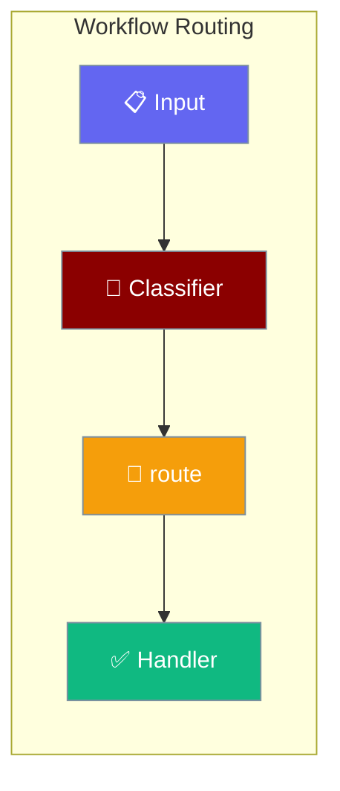
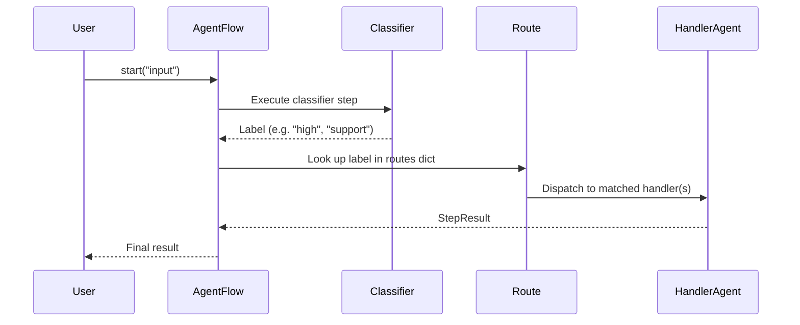

# Workflow Routing

Route workflows to different paths based on the output of a decision step. This pattern is also known as **Agentic Routing** or **Conditional Branching**.

```python
from praisonaiagents import Agent, AgentFlow, when

router = Agent(name="Router", instructions="Pick the next branch")
flow = AgentFlow(
    agents=[router],
    steps=[
        when(
            condition="{{score}} >= 50",
            then_steps=["high_path"],
            else_steps=["low_path"],
        )
    ],
    variables={"score": 72},
)
flow.start("Route by score")
```

The user supplies inputs; routing chooses the next branch at runtime.


```mermaid
graph LR
    subgraph "Workflow Routing"
        A[📋 Input] --> B[🧠 Classifier]
        B --> C[🔀 route]
        C --> D[✅ Handler]
    end

    classDef input fill:#6366F1,stroke:#7C90A0,color:#fff
    classDef agent fill:#8B0000,stroke:#7C90A0,color:#fff
    classDef process fill:#F59E0B,stroke:#7C90A0,color:#fff
    classDef success fill:#10B981,stroke:#7C90A0,color:#fff
    class A input
    class B agent
    class C process
    class D success
```

## Quick Start

<Steps>
<Step title="Define classifier and handlers">
```python
from praisonaiagents import AgentFlow, WorkflowContext, StepResult
from praisonaiagents import route

def classify_request(ctx: WorkflowContext) -> StepResult:
    input_lower = ctx.input.lower()
    if "urgent" in input_lower:
        return StepResult(output="priority: high")
    elif "question" in input_lower:
        return StepResult(output="priority: support")
    return StepResult(output="priority: normal")

# Route handlers
def handle_high(ctx: WorkflowContext) -> StepResult:
    return StepResult(output="🚨 Escalating to senior team!")

def handle_support(ctx: WorkflowContext) -> StepResult:
    return StepResult(output="💬 Routing to help desk")

def handle_normal(ctx: WorkflowContext) -> StepResult:
    return StepResult(output="📋 Added to queue")
```
</Step>

<Step title="Route by classifier output">
```python
workflow = AgentFlow(steps=[
    classify_request,
    route({
        "high": [handle_high],
        "support": [handle_support],
        "normal": [handle_normal],
        "default": [handle_normal]
    })
])

result = workflow.start("This is URGENT!")
print(result["output"])  # "🚨 Escalating to senior team!"
```
</Step>
</Steps>

## API Reference

### route()

```python
route(
    routes: Dict[str, List],      # Key: pattern to match, Value: steps to execute
    default: Optional[List] = None # Fallback steps if no match
) -> Route
```

### Parameters

| Parameter | Type | Description |
|-----------|------|-------------|
| `routes` | `Dict[str, List]` | Dictionary mapping patterns to step lists |
| `default` | `Optional[List]` | Steps to execute if no pattern matches |

### How Matching Works

The router checks if any route key (case-insensitive) is contained in the previous step's output:

```python
# If previous output is "priority: high"
route({
    "high": [...],    # ✅ Matches - "high" is in "priority: high"
    "low": [...],     # ❌ No match
})
```

## Examples

### Multi-Step Routes

Each route can contain multiple steps:

```python
workflow = AgentFlow(steps=[
    classifier,
    route({
        "approve": [
            validate_approval,
            send_notification,
            update_database
        ],
        "reject": [
            log_rejection,
            notify_requester
        ]
    })
])
```

### Chained Routing

Routes can be chained for complex decision trees:

```python
workflow = AgentFlow(steps=[
    initial_classifier,
    route({
        "category_a": [
            sub_classifier_a,
            route({
                "sub_a1": [handler_a1],
                "sub_a2": [handler_a2]
            })
        ],
        "category_b": [handler_b]
    })
])
```

### With Agents

Routes can include Agent instances:

```python
from praisonaiagents import Agent

researcher = Agent(name="Researcher", role="Research topics")
writer = Agent(name="Writer", role="Write content")

workflow = AgentFlow(steps=[
    topic_classifier,
    route({
        "technical": [researcher, writer],
        "creative": [writer]
    })
])
```

## Use Cases

| Use Case | Description |
|----------|-------------|
| **Request Triage** | Route support tickets to appropriate teams |
| **Content Moderation** | Route content based on classification |
| **Approval Workflows** | Different paths for approved/rejected items |
| **A/B Testing** | Route to different processing pipelines |
| **Error Handling** | Route based on success/failure status |

## How It Works


```mermaid
sequenceDiagram
    participant User
    participant AgentFlow
    participant Classifier
    participant Route
    participant HandlerAgent

    User->>AgentFlow: start("input")
    AgentFlow->>Classifier: Execute classifier step
    Classifier-->>AgentFlow: Label (e.g. "high", "support")
    AgentFlow->>Route: Look up label in routes dict
    Route->>HandlerAgent: Dispatch to matched handler(s)
    HandlerAgent-->>AgentFlow: StepResult
    AgentFlow-->>User: Final result
```

| Phase | What happens |
|---|---|
| 1. Classify | A step (function or agent) returns a string label as its output |
| 2. Match | `route()` looks up the label in the routes dict; uses `"default"` if no key matches |
| 3. Execute | The matched handler list runs sequentially within the chosen branch |
| 4. Continue | Execution resumes with the next workflow step after the route block |

---

## Best Practices

<AccordionGroup>
  <Accordion title="Always include a default route">
    Handle unexpected classifier output gracefully instead of failing the workflow.
  </Accordion>
  <Accordion title="Use unambiguous route keys">
    Short, distinct keys reduce mis-routing when LLM output is noisy.
  </Accordion>
  <Accordion title="Keep each route focused">
    One clear purpose per branch simplifies testing and observability.
  </Accordion>
  <Accordion title="Log routing decisions">
    Record which route was taken to debug triage and moderation pipelines.
  </Accordion>
</AccordionGroup>

## Related

<CardGroup cols={2}>
  <Card title="Workflow Patterns" icon="diagram-project" href="/docs/features/workflow-patterns">
    Overview of routing, parallel, loop, and repeat
  </Card>
  <Card title="Workflow Parallel" icon="arrows-split-up-and-left" href="/docs/features/workflow-parallel">
    Run independent steps concurrently
  </Card>
  <Card title="Workflow Loop" icon="arrows-rotate" href="/docs/features/workflow-loop">
    Iterate over lists and files
  </Card>
  <Card title="Workflow Repeat" icon="rotate" href="/docs/features/workflow-repeat">
    Repeat until a condition is met
  </Card>
</CardGroup>
