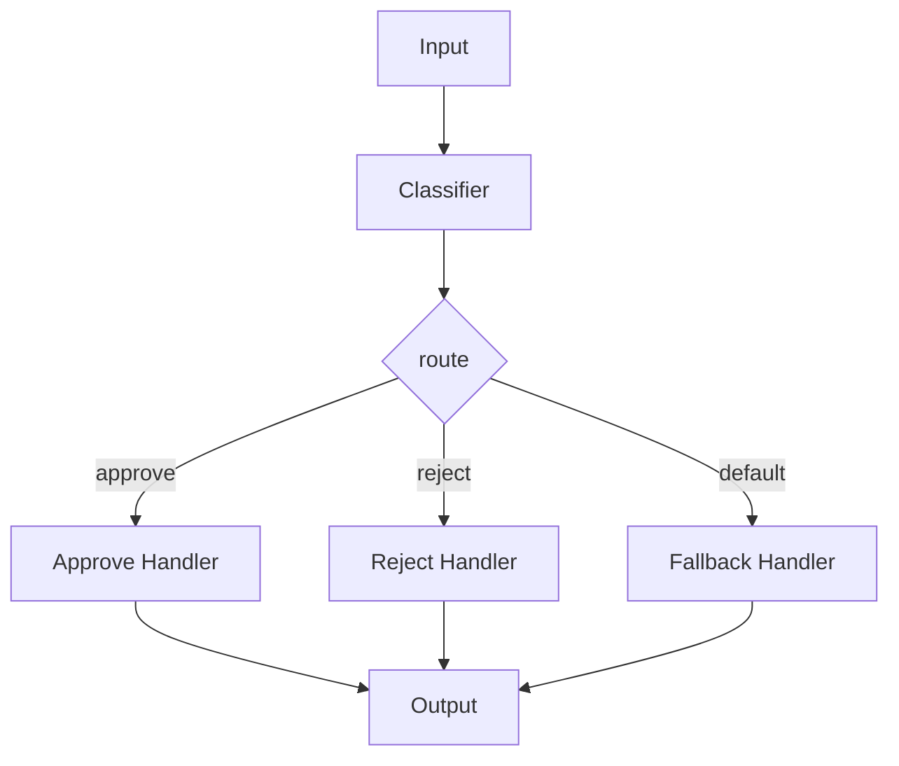

# Workflow Routing

Route workflows to different paths based on the output of a decision step. This pattern is also known as **Agentic Routing** or **Conditional Branching**.


```mermaid
graph TD
    A[Input] --> B[Classifier]
    B --> C{route}
    C -->|approve| D[Approve Handler]
    C -->|reject| E[Reject Handler]
    C -->|default| F[Fallback Handler]
    D --> G[Output]
    E --> G
    F --> G
```

## Quick Start


<Steps>
<Step title="Quick Start">
```python
from praisonaiagents import AgentFlow, WorkflowContext, StepResult
from praisonaiagents import route

# Decision maker - determines which route to take
def classify_request(ctx: WorkflowContext) -> StepResult:
    input_lower = ctx.input.lower()
    if "urgent" in input_lower:
        return StepResult(output="priority: high")
    elif "question" in input_lower:
        return StepResult(output="priority: support")
    return StepResult(output="priority: normal")

# Route handlers
def handle_high(ctx: WorkflowContext) -> StepResult:
    return StepResult(output="🚨 Escalating to senior team!")

def handle_support(ctx: WorkflowContext) -> StepResult:
    return StepResult(output="💬 Routing to help desk")

def handle_normal(ctx: WorkflowContext) -> StepResult:
    return StepResult(output="📋 Added to queue")

# Create workflow with routing
workflow = AgentFlow(steps=[
    classify_request,
    route({
        "high": [handle_high],
        "support": [handle_support],
        "normal": [handle_normal],
        "default": [handle_normal]
    })
])

result = workflow.start("This is URGENT!", )
print(result["output"])  # "🚨 Escalating to senior team!"
```
</Step>
</Steps>


## Best Practices

<AccordionGroup>
  <Accordion title="Start simple">
    Enable the feature with a single parameter before adding configuration. Verify it works, then layer in options.
  </Accordion>
  <Accordion title="Use environment variables for secrets">
    Never hardcode API keys or tokens. Use `os.getenv("KEY_NAME")` to read from environment variables.
  </Accordion>
  <Accordion title="Test with minimal examples first">
    Copy the Quick Start example, run it, then extend it. This confirms your environment is set up correctly.
  </Accordion>
  <Accordion title="Check the logs">
    Set `verbose=True` on your agent to see detailed execution logs when debugging unexpected behavior.
  </Accordion>
</AccordionGroup>

## Related

<CardGroup cols={2}>
  <Card title="Features Overview" icon="grid-2" href="/docs/features">
    Browse all PraisonAI features
  </Card>
  <Card title="Quick Start" icon="rocket" href="/docs/introduction">
    Get started with PraisonAI agents
  </Card>
</CardGroup>
