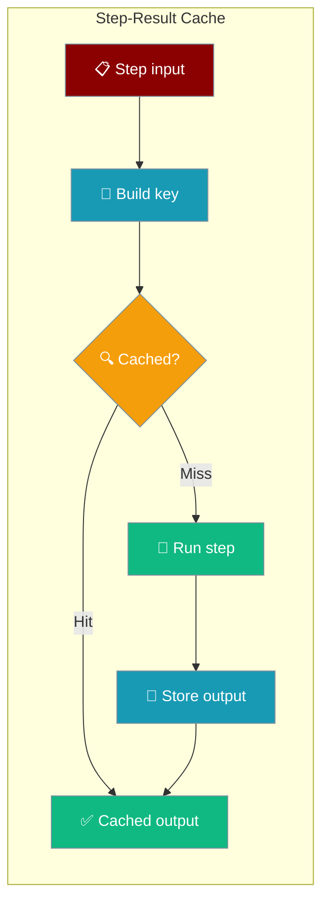
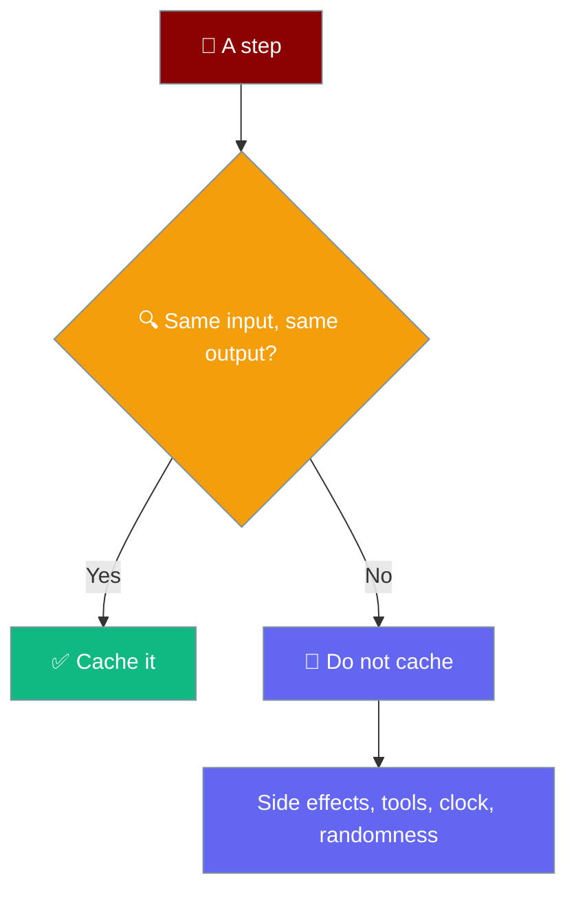
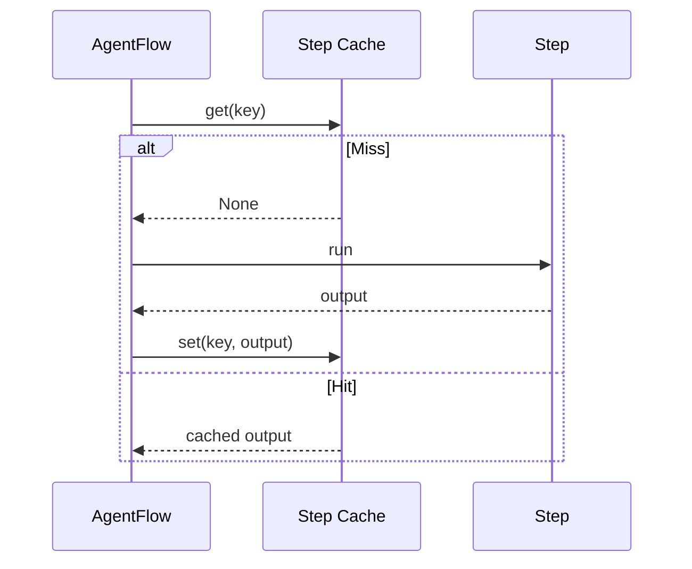

A workflow step-result cache stores a step's output keyed by its inputs, so a deterministic step reuses its answer instead of paying the full LLM cost on every run.

```python
from praisonaiagents import Agent, AgentFlow

formatter = Agent(name="Formatter", instructions="Format the text as clean JSON.")
summariser = Agent(name="Summariser", instructions="Summarise in one sentence.")

workflow = AgentFlow(steps=[formatter, summariser], cache=True)
workflow.start("Same input each time")
workflow.start("Same input each time")   # second call served from cache
```



<Note>
This caches **entire step outputs inside the workflow**, keyed by each step's actual inputs. It is different from [Prompt Cache Optimization](/features/prompt-cache-optimization), which caches **prompt prefixes at the LLM provider**.
</Note>

## Quick Start

<Steps>
<Step title="Enable with True">
Pass `cache=True` for a process-scoped LRU cache (default `max_entries=128`).

```python
from praisonaiagents import Agent, AgentFlow

formatter = Agent(name="Formatter", instructions="Format the text as clean JSON.")

workflow = AgentFlow(steps=[formatter], cache=True)
workflow.start("Same input each time")
workflow.start("Same input each time")   # served from cache
```
</Step>

<Step title="Tune the cache size">
Pass an `InMemoryStepCache` instance to set capacity or share one cache across flows.

```python
from praisonaiagents import Agent, AgentFlow
from praisonaiagents.workflows.step_cache import InMemoryStepCache

formatter = Agent(name="Formatter", instructions="Format the text as clean JSON.")

cache = InMemoryStepCache(max_entries=256)
workflow = AgentFlow(steps=[formatter], cache=cache)
workflow.start("Same input each time")
```
</Step>

<Step title="Bring your own cache">
Any object with `get()` and `set()` works — back the cache with Redis, disk, or anything else.

```python
from praisonaiagents import Agent, AgentFlow

class RedisStepCache:
    def __init__(self, client):
        self.client = client

    def get(self, key):
        raw = self.client.get(key)
        return None if raw is None else __import__("json").loads(raw)

    def set(self, key, value):
        self.client.set(key, __import__("json").dumps(value))

formatter = Agent(name="Formatter", instructions="Format the text as clean JSON.")

workflow = AgentFlow(steps=[formatter], cache=RedisStepCache(client))
workflow.start("Same input each time")
```
</Step>
</Steps>

<Note>
`InMemoryStepCache` is not re-exported at the top level. Import it from `praisonaiagents.workflows.step_cache`.
</Note>

---

## When to Cache

Cache deterministic steps; skip steps that call tools with side effects, read a clock, or depend on randomness.



---

## How It Works

On a miss the step runs and its output is stored; on a hit the cached output is returned without an LLM call.



The key is a stable SHA-256 (first 32 hex chars) built from four fields:

| Field | What it captures |
|-------|------------------|
| Step identity | String steps use their text; other steps use `.name` / `.__name__`, else `type(step).__name__:id(step)` |
| Previous output | The output of the prior step |
| Input text | The current step's rendered input |
| Variables | The workflow's variables at that point, tagged with each value's **type** |

<Note>
Variable **types** are part of the key, so `True` and `"True"` (or `1` and `"1"`) never collapse to the same entry. Two runs with the same prompt but different variables are different calls.
</Note>

---

## Correctness Guarantees

<AccordionGroup>
  <Accordion title="Opt-in only">
    Nothing caches unless `cache=` is set. Agent steps are not always deterministic, so silent caching would be wrong.
  </Accordion>
  <Accordion title="Failures are never cached">
    Only successful steps are stored. Caching a failure would serve it again on every re-run, turning a transient error into a permanent one.
  </Accordion>
  <Accordion title="Both executors covered">
    The linear executor and the pattern executor (used by `Parallel`, `If`, etc.) are both wrapped, so caching works regardless of where a step sits.
  </Accordion>
  <Accordion title="Bounded LRU">
    `InMemoryStepCache` caps at `max_entries` (default 128). An unbounded cache would be a memory leak on long-running flows.
  </Accordion>
  <Accordion title="Thread-safe">
    `InMemoryStepCache` uses an internal lock, so it is safe to share across `Parallel` branches.
  </Accordion>
  <Accordion title="Deep-copied snapshots">
    Values are deep-copied on `set` and on `get`, so a caller mutating a returned value cannot corrupt future hits.
  </Accordion>
</AccordionGroup>

On a cache hit, both `output` and the step's `output_variable` (or `{step_name}_output`) are restored, so downstream `{{step_name_output}}` substitutions still resolve on a fully-cached re-run.

---

## `InMemoryStepCache` Options

| Option | Type | Default | Description |
|--------|------|---------|-------------|
| `max_entries` | `int` | `128` | LRU capacity. Must be `> 0` (raises `ValueError` otherwise) |

Public attributes: `hits`, `misses`. Public methods: `get`, `set`, `clear`, `__len__`.

Accepted `cache=` values:

| Value | Meaning |
|-------|---------|
| `None` / `False` | No caching |
| `True` | Process-scoped `InMemoryStepCache()` (default `max_entries=128`) |
| An `InMemoryStepCache` instance | Use the given cache — share across flows, tune size |
| Any object with `get()` and `set()` | Custom cache (Redis, disk, etc.) |
| Anything else | `TypeError` at construction |

---

## Seeing Cache Hits

Turn on `verbose` to print a line for each hit.

```python
from praisonaiagents import Agent, AgentFlow

formatter = Agent(name="Formatter", instructions="Format the text as clean JSON.")

workflow = AgentFlow(steps=[formatter], cache=True, verbose=True)
workflow.start("Same input each time")
workflow.start("Same input each time")   # prints: ↩︎  cache hit: Formatter
```

---

## Best Practices

<AccordionGroup>
  <Accordion title="Cache deterministic steps only">
    Formatters, lookups, and summarisers over unchanged text are safe. Their output depends only on their input.
  </Accordion>
  <Accordion title="Skip steps with side effects">
    Do not cache steps that call tools with side effects or read a clock — a cached answer would skip the effect the caller expected.
  </Accordion>
  <Accordion title="Share one cache across flows">
    Create a single `InMemoryStepCache` and pass it to multiple `AgentFlow`s to reuse results across pipelines.
  </Accordion>
  <Accordion title="Use variables to force a re-run">
    Change a workflow variable when you *want* a fresh call — different variables produce a different key.
  </Accordion>
  <Accordion title="Bound the cache to your working set">
    Set `max_entries` to the number of results you actually reuse; a larger cache only wastes memory.
  </Accordion>
</AccordionGroup>

---

## Related

<CardGroup cols={2}>
  <Card title="Workflows" icon="diagram-project" href="/features/workflows">
    Build multi-step agent pipelines with AgentFlow.
  </Card>
  <Card title="Prompt Cache Optimization" icon="database" href="/features/prompt-cache-optimization">
    Different layer — provider prompt-prefix caching.
  </Card>
</CardGroup>
