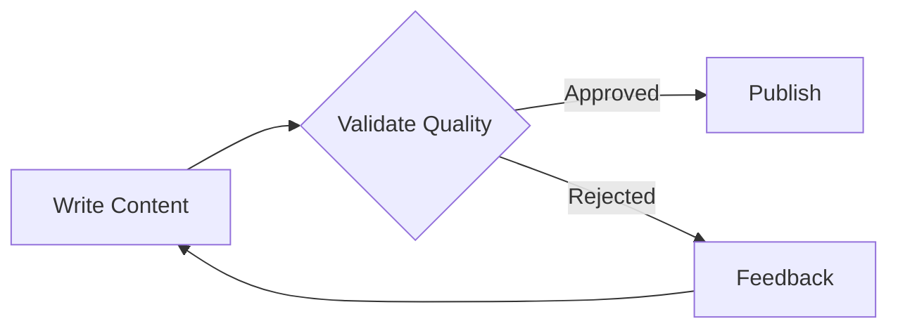

## Overview

The Workflow Validation Loop feature allows you to create workflows with built-in quality checks and automatic retry mechanisms. When a task fails validation, it can automatically retry with feedback from the validator, creating a continuous improvement loop until the output meets quality standards.



## Quick Start

Here's a simple example of implementing a validation loop where content is checked and retried if it doesn't meet quality standards:

```python
from praisonaiagents import Workflow, WorkflowStep, WorkflowContext, StepResult

# Guardrail function for validation
def validate_quality(result: StepResult) -> tuple[bool, str]:
    """Check if content meets quality standards."""
    content = result.output.lower()
    if len(content) < 100:
        return (False, "Content too short. Add more detail.")
    if "ai" not in content:
        return (False, "Content must discuss AI topics.")
    return (True, None)

# Step handlers
def write_content(ctx: WorkflowContext) -> StepResult:
    feedback = ctx.variables.get("validation_feedback", "")
    prompt = f"Write a blog post about AI trends. {feedback}"
    # In real usage, call an agent here
    return StepResult(output="AI is transforming industries...")

def publish_content(ctx: WorkflowContext) -> StepResult:
    return StepResult(output=f"Published: {ctx.previous_result}")

# Create workflow with guardrail
workflow = Workflow(
    steps=[
        WorkflowStep(
            name="write_content",
            handler=write_content,
            guardrails=validate_quality,  # Auto-retry on failure
            max_retries=3
        ),
        WorkflowStep(
            name="publish",
            handler=publish_content
        )
    ]
)

# Run the workflow
result = workflow.start("Write about AI")
print(result["output"])
```

## Key Features

### 1. Guardrails with Automatic Retry

Guardrails validate step outputs and automatically retry with feedback:

```python
from praisonaiagents import Workflow, WorkflowStep, StepResult
from praisonaiagents.workflows import route

def check_quality(result: StepResult) -> tuple[bool, str]:
    if "error" in result.output.lower():
        return (False, "Output contains errors. Please fix.")
    return (True, None)

workflow = Workflow(steps=[
    WorkflowStep(
        name="generate",
        action="Generate content about {{topic}}",
        guardrails=check_quality,
        max_retries=3  # Retry up to 3 times
    )
])
```

### 2. Routing for Decision Logic

Use `route()` for conditional branching based on output:

```python
from praisonaiagents import Workflow, WorkflowContext, StepResult
from praisonaiagents.workflows import route

def review_content(ctx: WorkflowContext) -> StepResult:
    # Analyze content and decide
    if "good" in ctx.previous_result:
        return StepResult(output="decision: approved")
    return StepResult(output="decision: needs_revision")

def edit_content(ctx: WorkflowContext) -> StepResult:
    return StepResult(output="Edited content")

def publish_content(ctx: WorkflowContext) -> StepResult:
    return StepResult(output="Published!")

workflow = Workflow(steps=[
    write_step,
    review_content,
    route({
        "approved": [publish_content],
        "needs_revision": [edit_content, review_content]
    })
])
```

### 3. Multi-Stage Validation

Create complex validation workflows with multiple checkpoints:

```python
from praisonaiagents import Agent, Task

# Define validation agents
tech_reviewer = Agent(
    name="TechnicalReviewer",
    role="Technical accuracy validator",
    goal="Ensure technical correctness and accuracy"
)

style_reviewer = Agent(
    name="StyleReviewer",
    role="Writing style validator",
    goal="Ensure clarity and proper writing style"
)

senior_reviewer = Agent(
    name="SeniorReviewer",
    role="Senior quality reviewer",
    goal="Perform final quality assurance"
)

# Multiple validation stages
technical_review = Task(
    name="technical_review",
    description="Check technical accuracy",
    expected_output="Technical validation result",
    agent=tech_reviewer,
    task_type="decision",
    condition={
        "approved": ["style_review"],
        "rejected": ["write_content"]
    }
)

style_review = Task(
    name="style_review",
    description="Check writing style and clarity",
    expected_output="Style validation result",
    agent=style_reviewer,
    task_type="decision",
    condition={
        "approved": ["final_review"],
        "rejected": ["edit_content"]
    }
)

final_review = Task(
    name="final_review",
    description="Final quality check",
    expected_output="Final approval decision",
    agent=senior_reviewer,
    task_type="decision",
    condition={
        "approved": ["publish"],
        "rejected": ["write_content"]
    }
)
```

## Advanced Usage

### Custom Validation Logic

Implement custom validation criteria:

```python
from praisonaiagents import Agent, Task, Agents

# Validator with specific criteria
validator = Agent(
    name="QualityValidator",
    role="Content quality assurance",
    goal="Ensure content meets all quality criteria",
    backstory="""You are a meticulous reviewer who checks for:
    1. Accuracy and factual correctness
    2. Clarity and readability
    3. Proper structure and flow
    4. Grammar and spelling
    5. Engagement and value to readers
    
    Provide specific, actionable feedback for improvements."""
)

# Task with detailed validation instructions
validate_task = Task(
    name="validate_with_criteria",
    description="""Review the content and evaluate:
    - Is the information accurate?
    - Is it well-structured?
    - Does it provide value?
    - Are there any errors?
    
    If any criteria fails, provide specific feedback for improvement.""",
    expected_output="Detailed validation report with pass/fail decision",
    agent=validator,
    task_type="decision",
    condition={
        "passed": ["publish"],
        "failed": ["revise_content"]
    }
)
```

### Validation with External Tools

Integrate external validation tools:

```python
from praisonaiagents import Agent, Task, Agents
from praisonaiagents.tools import tool

@tool("grammar_checker")
def check_grammar(text: str) -> dict:
    """Check grammar and return issues found"""
    # Integration with grammar checking service
    return {"errors": [], "suggestions": []}

@tool("plagiarism_checker")
def check_plagiarism(text: str) -> dict:
    """Check for plagiarism"""
    # Integration with plagiarism detection
    return {"similarity_score": 0.05, "sources": []}

validator = Agent(
    name="AutomatedValidator",
    role="Automated quality checker",
    tools=["grammar_checker", "plagiarism_checker"],
    goal="Ensure content quality using automated tools"
)
```

### Retry Limits and Escalation

Implement retry limits to prevent infinite loops:

```python
from praisonaiagents import Agent, Task

# Define required agents
validator = Agent(
    name="Validator",
    role="Content validator",
    goal="Validate content quality"
)

senior_reviewer = Agent(
    name="SeniorReviewer",
    role="Senior escalation reviewer",
    goal="Handle escalated reviews"
)

class ValidationWorkflow:
    def __init__(self, max_retries=3):
        self.max_retries = max_retries
        self.retry_count = 0
        self.validator = validator
        self.senior_reviewer = senior_reviewer
        
    def create_validation_task(self):
        return Task(
            name="validate_with_limit",
            description=f"Validate content (attempt {self.retry_count + 1}/{self.max_retries})",
            expected_output="Validation result",
            agent=self.validator,
            task_type="decision",
            condition={
                "approved": ["publish"],
                "rejected": ["retry_or_escalate"]
            }
        )
    
    def retry_or_escalate_task(self):
        self.retry_count += 1
        if self.retry_count >= self.max_retries:
            return Task(
                name="escalate_to_senior",
                description="Escalate to senior reviewer",
                expected_output="Senior review decision",
                agent=self.senior_reviewer
            )
        else:
            return self.create_validation_task()
```

## Best Practices

### 1. Clear Validation Criteria

Define specific, measurable validation criteria:

```python
validation_criteria = """
Evaluate the content based on:
1. Accuracy: All facts must be verifiable
2. Completeness: All required sections present
3. Clarity: Flesch reading score > 60
4. Length: Between 800-1200 words
5. Tone: Professional but engaging

Provide a score for each criterion and overall pass/fail.
"""
```

### 2. Structured Feedback

Ensure validators provide actionable feedback:

```python
validator = Agent(
    name="StructuredValidator",
    role="Quality reviewer",
    goal="Provide structured, actionable feedback",
    backstory="""When rejecting content, always provide:
    1. Specific issues found
    2. Examples of problems
    3. Clear suggestions for improvement
    4. Priority of fixes needed"""
)
```

### 3. Progress Tracking

Monitor validation cycles:

```python
from praisonaiagents.callbacks import Callback

class ValidationTracker(Callback):
    def __init__(self):
        self.validation_attempts = {}
        
    def on_task_start(self, task, **kwargs):
        if task.task_type == "decision":
            task_id = task.name
            self.validation_attempts[task_id] = \
                self.validation_attempts.get(task_id, 0) + 1
            print(f"Validation attempt #{self.validation_attempts[task_id]} for {task_id}")
    
    def on_task_complete(self, task, result, **kwargs):
        if task.task_type == "decision" and "rejected" in str(result).lower():
            print(f"Validation failed, feedback: {result}")

# Use callbacks with Workflow
from praisonaiagents import Workflow

workflow = Workflow(
    steps=[write_step, validate_step],
    on_step_complete=lambda name, result: print(f"Step {name}: {result.output[:50]}..."),
    on_step_error=lambda name, error: print(f"Step {name} failed: {error}")
)
```

## Common Patterns

### 1. Content Creation Pipeline

```python
# Define agents for content pipeline
writer = Agent(
    name="Writer",
    role="Content writer",
    goal="Create high-quality written content"
)

editor = Agent(
    name="Editor",
    role="Content editor",
    goal="Review and improve content quality"
)

qa_lead = Agent(
    name="QALead",
    role="Quality assurance lead",
    goal="Ensure final content quality"
)

# Full content creation pipeline with validation
draft_task = Task(
    name="create_draft",
    description="Create initial draft",
    expected_output="First draft",
    agent=writer
)

review_task = Task(
    name="review_draft",
    description="Review and provide feedback",
    expected_output="Review decision",
    agent=editor,
    task_type="decision",
    condition={
        "approved": ["polish_content"],
        "needs_work": ["create_draft"]
    }
)

polish_task = Task(
    name="polish_content",
    description="Polish the approved draft",
    expected_output="Polished content",
    agent=writer
)

final_check = Task(
    name="final_quality_check",
    description="Final quality assurance",
    expected_output="Final decision",
    agent=qa_lead,
    task_type="decision",
    condition={
        "approved": ["publish"],
        "rejected": ["polish_content"]
    }
)
```

### 2. Code Review Workflow

```python
# Define agents for code review workflow
developer = Agent(
    name="Developer",
    role="Software developer",
    goal="Implement features with high code quality"
)

senior_developer = Agent(
    name="SeniorDeveloper",
    role="Senior code reviewer",
    goal="Ensure code quality and standards"
)

qa_engineer = Agent(
    name="QAEngineer",
    role="Quality assurance engineer",
    goal="Test functionality and ensure quality"
)

# Code review with validation loop
code_task = Task(
    name="implement_feature",
    description="Implement the new feature",
    expected_output="Implemented code",
    agent=developer
)

code_review = Task(
    name="review_code",
    description="Review code for quality and standards",
    expected_output="Code review decision",
    agent=senior_developer,
    task_type="decision",
    condition={
        "approved": ["test_code"],
        "changes_requested": ["implement_feature"]
    }
)

test_task = Task(
    name="test_code",
    description="Run tests and verify functionality",
    expected_output="Test results",
    agent=qa_engineer,
    task_type="decision",
    condition={
        "passed": ["deploy"],
        "failed": ["implement_feature"]
    }
)
```

## Troubleshooting

### Common Issues

1. **Infinite Loops**: Always implement retry limits or escalation paths
2. **Context Loss**: Ensure feedback is properly propagated between retries
3. **Unclear Criteria**: Define specific, measurable validation criteria

### Debugging Tips

Enable verbose logging to track validation flows:

```python
from praisonaiagents import Workflow

workflow = Workflow(
    steps=[write_step, validate_step],
      # Enable detailed logging
)

result = workflow.start("Write content", )
```

## See Also

- [Autonomous Workflows](/features/autonomous-workflow) - For environment-based feedback
- [Self Reflection](/features/selfreflection) - For agent self-improvement
- [Callbacks](/features/callbacks) - For monitoring validation cycles