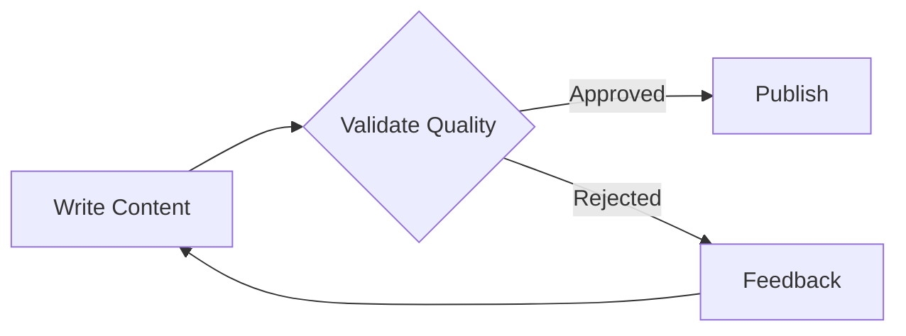

## Overview

The Workflow Validation Loop feature allows you to create workflows with built-in quality checks and automatic retry mechanisms. When a task fails validation, it can automatically retry with feedback from the validator, creating a continuous improvement loop until the output meets quality standards.


```mermaid
graph LR
    A[Write Content] --> B{Validate Quality}
    B -->|Approved| C[Publish]
    B -->|Rejected| D[Feedback]
    D --> A
```

## Quick Start


<Steps>
<Step title="Quick Start">
Here's a simple example of implementing a validation loop where content is checked and retried if it doesn't meet quality standards:

```python
from praisonaiagents import AgentFlow, Task, WorkflowContext, StepResult

# Guardrail function for validation
def validate_quality(result: StepResult) -> tuple[bool, str]:
    """Check if content meets quality standards."""
    content = result.output.lower()
    if len(content) < 100:
        return (False, "Content too short. Add more detail.")
    if "ai" not in content:
        return (False, "Content must discuss AI topics.")
    return (True, None)

# Step handlers
def write_content(ctx: WorkflowContext) -> StepResult:
    feedback = ctx.variables.get("validation_feedback", "")
    prompt = f"Write a blog post about AI trends. {feedback}"
    # In real usage, call an agent here
    return StepResult(output="AI is transforming industries...")

def publish_content(ctx: WorkflowContext) -> StepResult:
    return StepResult(output=f"Published: {ctx.previous_result}")

# Create workflow with guardrail
workflow = AgentFlow(
    steps=[
        Task(
            name="write_content",
            handler=write_content,
            guardrails=validate_quality,  # Auto-retry on failure
            max_retries=3
        ),
        Task(
            name="publish",
            handler=publish_content
        )
    ]
)

# Run the workflow
result = workflow.start("Write about AI")
print(result["output"])
```
</Step>
</Steps>


## Best Practices

<AccordionGroup>
  <Accordion title="Start simple">
    Enable the feature with a single parameter before adding configuration. Verify it works, then layer in options.
  </Accordion>
  <Accordion title="Use environment variables for secrets">
    Never hardcode API keys or tokens. Use `os.getenv("KEY_NAME")` to read from environment variables.
  </Accordion>
  <Accordion title="Test with minimal examples first">
    Copy the Quick Start example, run it, then extend it. This confirms your environment is set up correctly.
  </Accordion>
  <Accordion title="Check the logs">
    Set `verbose=True` on your agent to see detailed execution logs when debugging unexpected behavior.
  </Accordion>
</AccordionGroup>

## Related

<CardGroup cols={2}>
  <Card title="Features Overview" icon="grid-2" href="/docs/features">
    Browse all PraisonAI features
  </Card>
  <Card title="Quick Start" icon="rocket" href="/docs/introduction">
    Get started with PraisonAI agents
  </Card>
</CardGroup>
