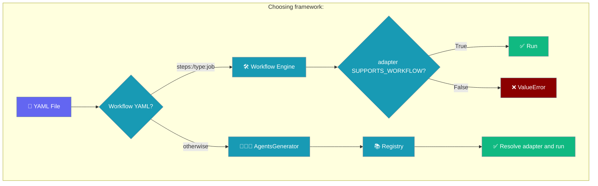
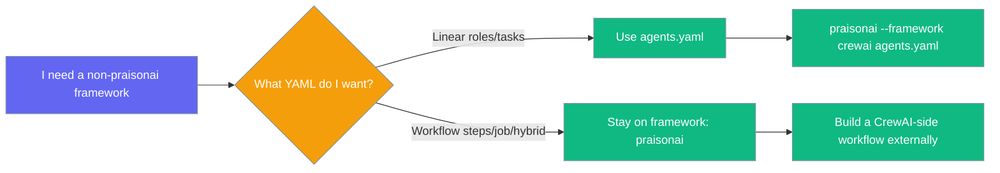
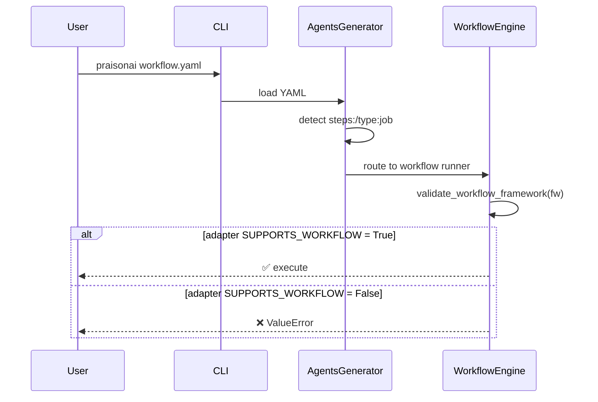

The `framework:` key in YAML picks which execution backend runs your agents — but the rules differ between **agents.yaml** and **workflow YAML**.

```python
from praisonaiagents import Agent, PraisonAIAgents

agent = Agent(name="Writer", instructions="Write helpful posts")
PraisonAIAgents(agents=[agent]).start("Write about caching")
```

The user picks a YAML file; `framework:` selects the backend that runs the workflow.



## Quick Start

<Steps>
<Step title="agents.yaml — any registered framework">

```yaml
framework: crewai
topic: Write a blog post
roles:
  writer:
    role: Writer
    goal: Write engaging posts
    backstory: Senior editor
    tasks:
      draft:
        description: Write a post about {topic}
        expected_output: A 500-word post
```

```bash
praisonai agents.yaml
```

</Step>

<Step title="workflow YAML — needs SUPPORTS_WORKFLOW">

```yaml
framework: praisonai
type: job
steps:
  - id: research
    agent: researcher
  - id: write
    agent: writer
    depends_on: [research]
```

```bash
praisonai workflow.yaml
```

</Step>
</Steps>

---

## Which file uses which?

| YAML shape | Engine | `framework:` choices |
|---|---|---|
| `roles:` / `topic:` (agents.yaml) | `AgentsGenerator` + registry | Any registered adapter (`crewai`, `praisonai`, `autogen`, plus entry-point plugins) |
| `steps:` + `workflow:` (workflow YAML) | Native Workflow engine | Any adapter whose `SUPPORTS_WORKFLOW = True` (built-in `praisonai` qualifies) |
| `type: job` / `type: hybrid` (workflow YAML) | Native Workflow engine | Any adapter whose `SUPPORTS_WORKFLOW = True` (built-in `praisonai` qualifies) |

Workflow YAML dispatch requires an adapter whose `SUPPORTS_WORKFLOW = True`. The built-in `praisonai` adapter has it. Third-party adapters opt in by setting the flag on their subclass — see [Capability Flags](/docs/features/framework-adapter-plugins#capability-flags).

If `framework:` is omitted, agents.yaml defaults via `FrameworkAdapterRegistry.pick_default()` and workflow YAML defaults to `praisonai`.

---

## What you'll see if the framework isn't workflow-capable

Selecting a framework whose adapter has `SUPPORTS_WORKFLOW = False` raises:

```
ValueError: framework='crewai' in workflow YAML is not supported for workflow execution.
The workflow engine requires an adapter whose SUPPORTS_WORKFLOW flag is set (the native 'praisonai' adapter does).
Use a non-workflow agents.yaml with a supported registered framework, or set framework: praisonai. Frameworks supporting workflow execution: praisonai.
```

The trailing list names every registered adapter whose `SUPPORTS_WORKFLOW` flag is `True`, so it grows as you install workflow-capable plugins.

---

## Make a custom framework workflow-capable

Set `SUPPORTS_WORKFLOW = True` on your adapter subclass to accept workflow YAML dispatch:

```python
from praisonaiagents import BaseFrameworkAdapter

class MyWorkflowFrameworkAdapter(BaseFrameworkAdapter):
    name = "myframework"
    SUPPORTS_WORKFLOW = True

    def is_available(self) -> bool:
        return True

    def run(self, config, llm_config, topic, *,
            tools_dict=None, agent_callback=None,
            task_callback=None, cli_config=None) -> str:
        return f"myframework ran: {topic}"
```

Once registered, `myframework` is accepted in workflow YAML and appears in the "Frameworks supporting workflow execution" list. See [Capability Flags](/docs/features/framework-adapter-plugins#capability-flags).

---

## What to do



---

## Programmatic check

```python
from praisonai.framework_adapters.workflow_framework import (
    validate_workflow_framework,
    framework_from_config,
)

cfg = {"framework": "praisonai", "steps": []}
fw = framework_from_config(cfg)         # "praisonai"
validate_workflow_framework(fw)         # no-op when valid; raises ValueError otherwise
```

`framework_from_config({})` returns `"praisonai"` (safe default). `framework_from_config({"framework": "CrewAI"})` returns `"crewai"` (lowercased before validation).

`validate_workflow_framework()` reads the adapter's `SUPPORTS_WORKFLOW` flag from the default registry. Pass `registry=` to test against an isolated registry:

```python
from praisonai.framework_adapters.registry import FrameworkAdapterRegistry

reg = FrameworkAdapterRegistry()
reg.register("myframework", MyWorkflowFrameworkAdapter)
validate_workflow_framework("myframework", registry=reg)   # passes when SUPPORTS_WORKFLOW = True
```

---

## How It Works



---

## Best Practices

<AccordionGroup>

<Accordion title="Use agents.yaml for multi-framework work">
If you need CrewAI, AutoGen, or a custom framework, write your config as `roles:`/`topic:` agents.yaml. The `framework:` key there accepts any registered adapter.
</Accordion>

<Accordion title="Omit framework: in workflow YAML">
The default is `praisonai`, so you can omit the `framework:` key entirely in workflow YAML. This avoids accidentally setting an unsupported value.
</Accordion>

<Accordion title="Validate early in custom code">
Call `validate_workflow_framework(fw)` immediately after parsing config if you're building tooling around workflow YAML. It raises `ValueError` with an actionable message before any execution starts. Pass `registry=` to validate against an isolated registry in tests.
</Accordion>

<Accordion title="Set SUPPORTS_WORKFLOW to enable workflow YAML">
A custom adapter cannot run workflow YAML until it sets `SUPPORTS_WORKFLOW = True` (class-level). Leaving it `False` keeps the adapter agents.yaml-only and blocks workflow dispatch with a clear error.
</Accordion>

<Accordion title="Check registry choices before building CLI menus">
Use `list_framework_choices()` from `praisonai.framework_adapters.registry` to populate dropdowns or CLI help text — it includes entry-point plugins automatically.

```python
from praisonai.framework_adapters.registry import list_framework_choices

choices = list_framework_choices()
print(choices)  # ['crewai', 'praisonai', 'autogen', 'my_plugin']
```
</Accordion>

</AccordionGroup>

---

## Related

<CardGroup cols={2}>
<Card icon="puzzle-piece" href="/docs/features/framework-adapter-plugins">
  Add new execution backends via Python entry points
</Card>
<Card icon="file-code" href="/docs/features/yaml-workflows">
  Full workflow YAML reference
</Card>
</CardGroup>
