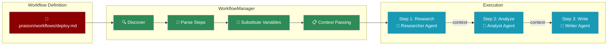

# Workflows

Create and execute reusable multi-step workflows with advanced features like context passing between steps, per-step agent configuration, and async execution. Define complex task sequences in markdown files and execute them programmatically.


```mermaid
graph LR
    subgraph "Workflow Definition"
        MD["📄 .praison/workflows/deploy.md"]
    end
    
    subgraph "WorkflowManager"
        DISCOVER["🔍 Discover"]
        PARSE["📝 Parse Steps"]
        VARS["🔄 Substitute Variables"]
        CTX["📋 Context Passing"]
    end
    
    subgraph "Execution"
        STEP1["Step 1: Research<br/>🤖 Researcher Agent"]
        STEP2["Step 2: Analyze<br/>🤖 Analyst Agent"]
        STEP3["Step 3: Write<br/>🤖 Writer Agent"]
    end
    
    MD --> DISCOVER
    DISCOVER --> PARSE
    PARSE --> VARS
    VARS --> CTX
    CTX --> STEP1
    STEP1 -->|"context"| STEP2
    STEP2 -->|"context"| STEP3
    
    classDef def fill:#8B0000,stroke:#7C90A0,color:#fff
    classDef manager fill:#2E8B57,stroke:#7C90A0,color:#fff
    classDef exec fill:#189AB4,stroke:#7C90A0,color:#fff
    
    class MD def
    class DISCOVER,PARSE,VARS,CTX manager
    class STEP1,STEP2,STEP3 exec
```

## Key Features

| Feature | Description |
|---------|-------------|
| **Context Passing** | Automatically pass outputs from previous steps to subsequent steps |
| **Per-Step Agents** | Configure different agents with unique roles for each step |
| **Per-Step Tools** | Assign specific tools to each step |
| **Async Execution** | Execute workflows asynchronously with `aexecute()` |
| **Variable Substitution** | Use `{{previous_output}}` and `{{step_name_output}}` |
| **Planning Mode** | Enable planning mode at workflow level |

## Quick Start


<Steps>
<Step title="Simple Usage">
<CodeGroup>
```python Agentic Workflow
from praisonaiagents import Agent, AgentFlow

# Create agents with specific roles
researcher = Agent(
    name="Researcher",
    role="Research Analyst",
    goal="Research and provide information about topics",
    instructions="You are a research analyst. Provide concise, factual information."
)

writer = Agent(
    name="Writer", 
    role="Content Writer",
    goal="Write engaging content based on research",
    instructions="You are a content writer. Write clear, engaging content."
)

# Create workflow with agents as steps
workflow = AgentFlow(steps=[researcher, writer])

# Run workflow - agents process sequentially
result = workflow.start("What are the key benefits of AI agents?")
print(result["output"])
```
</Step>

<Step title="With Configuration">
```python Multi-Agent Pipeline
from praisonaiagents import Agent, AgentFlow

# Create specialized agents
analyst = Agent(
    name="Analyst",
    role="Data Analyst",
    goal="Analyze data and extract insights",
    instructions="Analyze the given topic and provide key insights."
)

strategist = Agent(
    name="Strategist",
    role="Strategy Expert", 
    goal="Develop strategies based on analysis",
    instructions="Based on the analysis, develop actionable strategies."
)

presenter = Agent(
    name="Presenter",
    role="Presentation Expert",
    goal="Create clear presentations",
    instructions="Summarize the strategies into a clear presentation format."
)

# Sequential workflow: Analyst -> Strategist -> Presenter
workflow = AgentFlow(steps=[analyst, strategist, presenter])
result = workflow.start("Market trends in AI industry 2024")
print(result["output"])
```

```python With Callbacks
from praisonaiagents import Agent, AgentFlow

researcher = Agent(name="Researcher", role="Researcher", goal="Research topics")
writer = Agent(name="Writer", role="Writer", goal="Write content")

workflow = AgentFlow(
    steps=[researcher, writer],
    hooks={
        "on_step_complete": lambda name, r: print(f"✅ {name} completed")
    }
)

result = workflow.start("Explain quantum computing")
```
</CodeGroup>
</Step>
</Steps>


## Best Practices

<AccordionGroup>
  <Accordion title="Start simple">
    Enable the feature with a single parameter before adding configuration. Verify it works, then layer in options.
  </Accordion>
  <Accordion title="Use environment variables for secrets">
    Never hardcode API keys or tokens. Use `os.getenv("KEY_NAME")` to read from environment variables.
  </Accordion>
  <Accordion title="Test with minimal examples first">
    Copy the Quick Start example, run it, then extend it. This confirms your environment is set up correctly.
  </Accordion>
  <Accordion title="Check the logs">
    Set `verbose=True` on your agent to see detailed execution logs when debugging unexpected behavior.
  </Accordion>
</AccordionGroup>

## Related

<CardGroup cols={2}>
  <Card title="Features Overview" icon="grid-2" href="/docs/features">
    Browse all PraisonAI features
  </Card>
  <Card title="Quick Start" icon="rocket" href="/docs/introduction">
    Get started with PraisonAI agents
  </Card>
</CardGroup>
