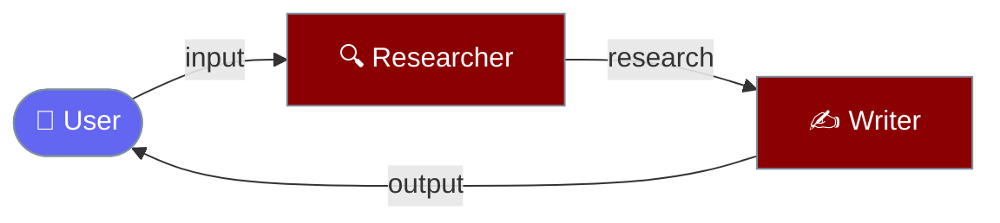
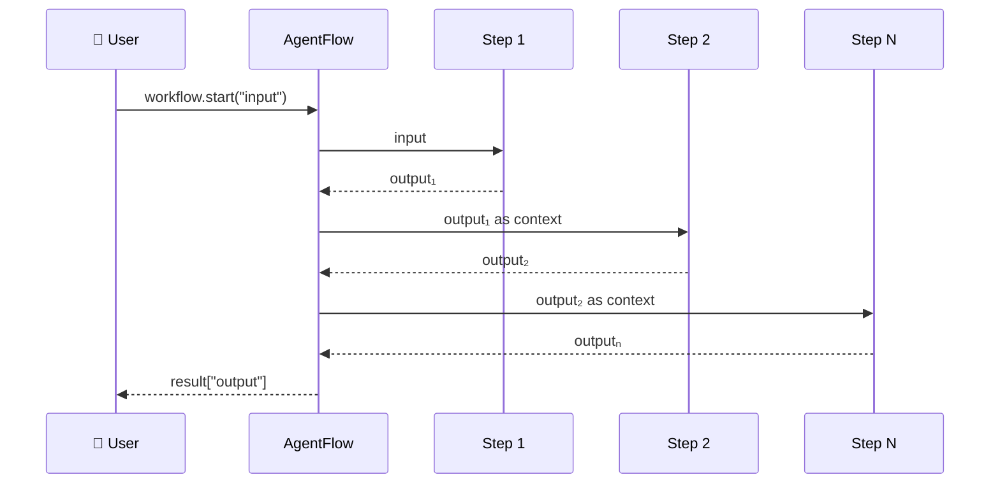
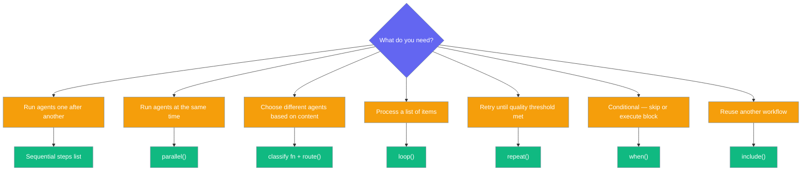
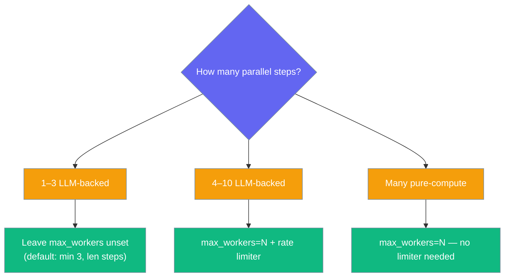
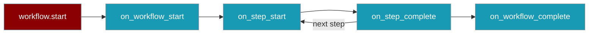
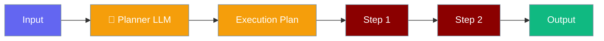
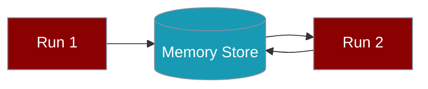
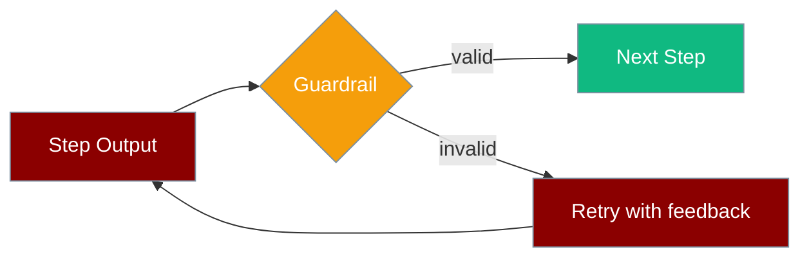
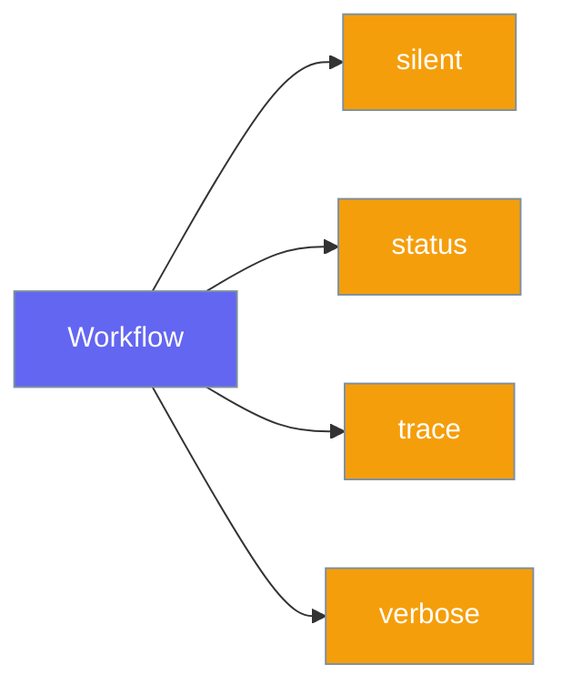
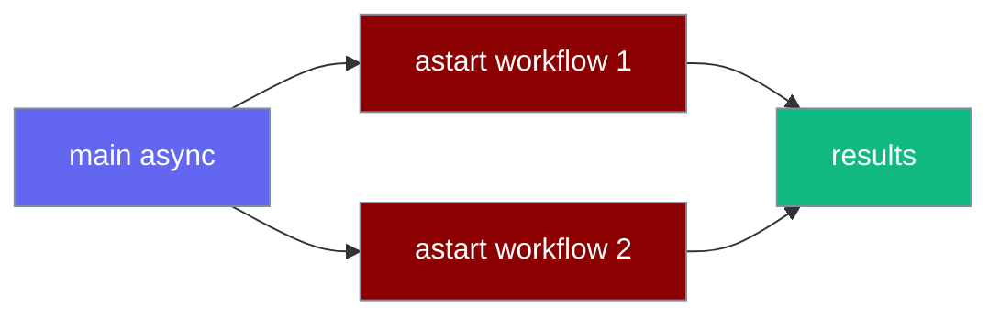

```python
from praisonaiagents import Agent, AgentFlow

researcher = Agent(name="Researcher", instructions="Research the given topic thoroughly.")
writer     = Agent(name="Writer",     instructions="Write a concise summary of the research.")

workflow = AgentFlow(steps=[researcher, writer])
result   = workflow.start("Latest breakthroughs in AI agents")
print(result["output"])
```

AgentFlow runs agents as sequential steps, passing each output into the next as context.


```mermaid
graph LR
    U([👤 User]) -->|input| R[🔍 Researcher]
    R -->|research| W[✍️ Writer]
    W -->|output| U

    classDef user    fill:#6366F1,stroke:#7C90A0,color:#fff
    classDef agent   fill:#8B0000,stroke:#7C90A0,color:#fff
    classDef result  fill:#10B981,stroke:#7C90A0,color:#fff
    class U user
    class R,W agent
```

## Quick Start

<Steps>
<Step title="Sequential pipeline">

```python
from praisonaiagents import Agent, AgentFlow

analyst    = Agent(name="Analyst",    instructions="Analyze the topic and extract key insights.")
strategist = Agent(name="Strategist", instructions="Develop actionable strategies from the analysis.")
presenter  = Agent(name="Presenter",  instructions="Summarize strategies into a clear presentation.")

workflow = AgentFlow(steps=[analyst, strategist, presenter])
result   = workflow.start("Market trends in AI industry 2024")
print(result["output"])
```

</Step>

<Step title="Parallel research">

```python
from praisonaiagents import Agent, AgentFlow, parallel

market     = Agent(name="Market",     instructions="Research market trends.")
competitor = Agent(name="Competitor", instructions="Research competitor landscape.")
customer   = Agent(name="Customer",   instructions="Research customer needs.")
aggregator = Agent(name="Aggregator", instructions="Synthesize all research into a unified report.")

workflow = AgentFlow(steps=[
    parallel([market, competitor, customer], max_workers=3),
    aggregator,
])
result = workflow.start("AI industry 2024")
print(result["output"])
```

</Step>

<Step title="Conditional routing">

```python
from praisonaiagents import Agent, AgentFlow, WorkflowContext, StepResult, route

tech      = Agent(name="TechExpert",  instructions="Answer technical questions in depth.")
creative  = Agent(name="Creative",    instructions="Write engaging creative content.")
general   = Agent(name="General",     instructions="Provide a helpful general-purpose answer.")

def classify(ctx: WorkflowContext) -> StepResult:
    text = ctx.input.lower()
    if any(k in text for k in ("code", "python", "api", "debug")):
        return StepResult(output="technical")
    if any(k in text for k in ("story", "poem", "creative")):
        return StepResult(output="creative")
    return StepResult(output="default")

workflow = AgentFlow(steps=[
    classify,
    route({"technical": [tech], "creative": [creative], "default": [general]}),
])
result = workflow.start("Write a Python function to sort a list")
print(result["output"])
```

</Step>
</Steps>

---

## How It Works


```mermaid
sequenceDiagram
    participant U as 👤 User
    participant W as AgentFlow
    participant S1 as Step 1
    participant S2 as Step 2
    participant S3 as Step N

    U->>W: workflow.start("input")
    W->>S1: input
    S1-->>W: output₁
    W->>S2: output₁ as context
    S2-->>W: output₂
    W->>S3: output₂ as context
    S3-->>W: outputₙ
    W-->>U: result["output"]
```

Each step receives the previous step's output as context. Context passing is automatic — no extra code required.

---

## Which Pattern to Use?


```mermaid
graph TB
    Q{What do you need?} --> A[Run agents one after another]
    Q --> B[Run agents at the same time]
    Q --> C[Choose different agents based on content]
    Q --> D[Process a list of items]
    Q --> E[Retry until quality threshold met]
    Q --> F[Conditional — skip or execute block]
    Q --> G[Reuse another workflow]

    A --> A1["Sequential steps list"]
    B --> B1["parallel()"]
    C --> C1["classify fn + route()"]
    D --> D1["loop()"]
    E --> E1["repeat()"]
    F --> F1["when()"]
    G --> G1["include()"]

    classDef q    fill:#6366F1,stroke:#7C90A0,color:#fff
    classDef need fill:#F59E0B,stroke:#7C90A0,color:#fff
    classDef ans  fill:#10B981,stroke:#7C90A0,color:#fff
    class Q q
    class A,B,C,D,E,F,G need
    class A1,B1,C1,D1,E1,F1,G1 ans
```

---

## Pattern Helpers

| Pattern | Import | Purpose |
|---------|--------|---------|
| `parallel(steps, max_workers=N)` | `from praisonaiagents import parallel` | Run steps concurrently |
| `route({"label": [steps]})` | `from praisonaiagents import route` | Branch on step output |
| `loop(fn, over="var")` | `from praisonaiagents import loop` | Iterate over a list variable |
| `repeat(fn, until=cond)` | `from praisonaiagents import repeat` | Evaluator-optimizer loop |
| `when(condition, then_steps, else_steps)` | `from praisonaiagents import when` | Conditional block |
| `include(workflow=wf)` | `from praisonaiagents import include` | Embed a sub-workflow |

```python
from praisonaiagents import AgentFlow, Agent, WorkflowContext, StepResult
from praisonaiagents import route, parallel, loop, repeat, when, include

agent_a = Agent(name="A", instructions="Handle task A.")
agent_b = Agent(name="B", instructions="Handle task B.")
worker  = Agent(name="Worker", instructions="Process one item.")

sub_flow = AgentFlow(name="sub", steps=[agent_b])

def classify(ctx: WorkflowContext) -> StepResult:
    return StepResult(output="a" if "a" in ctx.input.lower() else "b")

def process_item(ctx: WorkflowContext) -> StepResult:
    item = ctx.variables.get("item", "")
    return StepResult(output=f"Processed: {item}")

workflow = AgentFlow(
    steps=[
        classify,
        route({"a": [agent_a], "default": [agent_b]}),
        parallel([agent_a, agent_b], max_workers=2),
        loop(process_item, over="items"),
        repeat(worker, until=lambda ctx: len(ctx.previous_result or "") > 50, max_iterations=3),
        when(condition="{{score}} > 80", then_steps=[agent_a], else_steps=[agent_b]),
        include(workflow=sub_flow),
    ],
    variables={"items": ["AI", "ML", "NLP"]},
)
```

---

## `parallel()` and `max_workers`

`max_workers` caps concurrent steps in `parallel()` and `loop(parallel=True)`.


```mermaid
graph TB
    Q2{How many parallel steps?} --> L[1–3 LLM-backed]
    Q2 --> M[4–10 LLM-backed]
    Q2 --> H[Many pure-compute]

    L --> L1["Leave max_workers unset<br/>(default: min 3, len steps)"]
    M --> M1["max_workers=N + rate limiter"]
    H --> H1["max_workers=N — no limiter needed"]

    classDef q    fill:#6366F1,stroke:#7C90A0,color:#fff
    classDef opt  fill:#F59E0B,stroke:#7C90A0,color:#fff
    classDef ans  fill:#10B981,stroke:#7C90A0,color:#fff
    class Q2 q
    class L,M,H opt
    class L1,M1,H1 ans
```

| `max_workers` value | Effective concurrency |
|---|---|
| `None` (default) | `min(3, len(steps))` |
| `1` | Sequential — useful for rate-limited providers |
| `N ≤ len(steps)` | `N` |
| `N > 3` | Honored; an info log is emitted |

---

## Workflow Hooks


```mermaid
graph LR
    START[workflow.start] --> WS[on_workflow_start]
    WS --> SS[on_step_start]
    SS --> SC[on_step_complete]
    SC -->|next step| SS
    SC --> WC[on_workflow_complete]

    classDef event fill:#189AB4,stroke:#7C90A0,color:#fff
    classDef flow  fill:#8B0000,stroke:#7C90A0,color:#fff
    class WS,SS,SC,WC event
    class START flow
```

```python
from praisonaiagents import Agent, AgentFlow, WorkflowHooksConfig

researcher = Agent(name="Researcher", instructions="Research the topic.")
writer     = Agent(name="Writer",     instructions="Write a summary.")

workflow = AgentFlow(
    steps=[researcher, writer],
    hooks=WorkflowHooksConfig(
        on_workflow_start=lambda w, i: print(f"🚀 Starting: {i}"),
        on_step_start=lambda name, ctx: print(f"▶ {name}"),
        on_step_complete=lambda name, r: print(f"✅ {name}: {str(r.output)[:60]}"),
        on_step_error=lambda name, e: print(f"❌ {name}: {e}"),
        on_workflow_complete=lambda w, r: print(f"🎉 Done: {r['status']}"),
    ),
)
result = workflow.start("AI trends 2024")
```

**`WorkflowHooksConfig` options:**

| Option | Type | Default | Description |
|--------|------|---------|-------------|
| `on_workflow_start` | `Callable` | `None` | Called once before the first step |
| `on_workflow_complete` | `Callable` | `None` | Called once after the last step |
| `on_step_start` | `Callable` | `None` | Called before each step |
| `on_step_complete` | `Callable` | `None` | Called after each step succeeds |
| `on_step_error` | `Callable` | `None` | Called when a step raises an exception |

---

## Planning & Reasoning


```mermaid
graph LR
    IN[Input] --> P[🧠 Planner LLM]
    P --> PLAN[Execution Plan]
    PLAN --> S1[Step 1] --> S2[Step 2] --> OUT[Output]

    classDef input  fill:#6366F1,stroke:#7C90A0,color:#fff
    classDef plan   fill:#F59E0B,stroke:#7C90A0,color:#fff
    classDef step   fill:#8B0000,stroke:#7C90A0,color:#fff
    classDef out    fill:#10B981,stroke:#7C90A0,color:#fff
    class IN input
    class P,PLAN plan
    class S1,S2 step
    class OUT out
```

```python
from praisonaiagents import Agent, AgentFlow

researcher = Agent(name="Researcher", instructions="Research the topic.")
writer     = Agent(name="Writer",     instructions="Write a summary.")

workflow = AgentFlow(
    steps=[researcher, writer],
    planning=True,  # or a dict: {"llm": "gpt-4o", "reasoning": True}
)
result = workflow.start("Research and write about AI trends")
```

Pass `planning=True` to enable it, or a dict to tune the planner:

```python
workflow = AgentFlow(
    steps=[researcher, writer],
    planning={"llm": "gpt-4o", "reasoning": True},
)
```

| Option | Type | Default | Description |
|--------|------|---------|-------------|
| `enabled` | `bool` | `True` | Enable planning mode |
| `llm` | `str` | `None` | LLM for planning (defaults to workflow LLM) |
| `reasoning` | `bool` | `False` | Enable chain-of-thought reasoning |

<AccordionGroup>
  <Accordion title="Advanced: WorkflowPlanningConfig class">
    <Note>
    Prefer the `bool` or `dict` form above. Use `WorkflowPlanningConfig` when you want typed, IDE-friendly configuration.
    </Note>

    ```python
    from praisonaiagents import Agent, AgentFlow, WorkflowPlanningConfig

    researcher = Agent(name="Researcher", instructions="Research the topic.")
    writer     = Agent(name="Writer",     instructions="Write a summary.")

    workflow = AgentFlow(
        steps=[researcher, writer],
        planning=WorkflowPlanningConfig(enabled=True, llm="gpt-4o", reasoning=True),
    )
    result = workflow.start("Research and write about AI trends")
    ```
  </Accordion>
</AccordionGroup>

---

## Memory Integration


```mermaid
graph LR
    R1[Run 1] --> MEM[(Memory Store)]
    MEM --> R2[Run 2]
    R2 --> MEM

    classDef run fill:#8B0000,stroke:#7C90A0,color:#fff
    classDef mem fill:#189AB4,stroke:#7C90A0,color:#fff
    class R1,R2 run
    class MEM mem
```

```python
from praisonaiagents import Agent, AgentFlow

researcher = Agent(name="Researcher", instructions="Research the topic.")
writer     = Agent(name="Writer",     instructions="Continue from previous research.")

workflow = AgentFlow(
    steps=[researcher, writer],
    memory={"backend": "chroma", "config": {"persist": True, "collection": "my_workflow"}},
)

result1 = workflow.start("Research AI trends")
result2 = workflow.start("Continue the research on LLMs")
```

Pass `memory=True` for the default file backend, or a dict to pick a backend:

| Option | Type | Default | Description |
|--------|------|---------|-------------|
| `backend` | `str` | `"file"` | Memory backend (`"file"`, `"chroma"`, `"redis"`) |
| `user_id` | `str` | `None` | User identifier for memory scoping |
| `session_id` | `str` | `None` | Session identifier |
| `config` | `dict` | `None` | Backend-specific configuration |

<AccordionGroup>
  <Accordion title="Advanced: WorkflowMemoryConfig class">
    <Note>
    Prefer the `bool` or `dict` form above. Use `WorkflowMemoryConfig` when you want typed, IDE-friendly configuration.
    </Note>

    ```python
    from praisonaiagents import Agent, AgentFlow, WorkflowMemoryConfig

    researcher = Agent(name="Researcher", instructions="Research the topic.")
    writer     = Agent(name="Writer",     instructions="Continue from previous research.")

    workflow = AgentFlow(
        steps=[researcher, writer],
        memory=WorkflowMemoryConfig(backend="chroma", config={"persist": True, "collection": "my_workflow"}),
    )
    result = workflow.start("Research AI trends")
    ```
  </Accordion>
</AccordionGroup>

---

## Guardrails & Validation


```mermaid
graph LR
    STEP[Step Output] --> G{Guardrail}
    G -->|valid| NEXT[Next Step]
    G -->|invalid| RETRY[Retry with feedback]
    RETRY --> STEP

    classDef step  fill:#8B0000,stroke:#7C90A0,color:#fff
    classDef guard fill:#F59E0B,stroke:#7C90A0,color:#fff
    classDef next  fill:#10B981,stroke:#7C90A0,color:#fff
    class STEP,RETRY step
    class G guard
    class NEXT next
```

```python
from praisonaiagents import AgentFlow, Task, WorkflowContext, StepResult

def generate_content(ctx: WorkflowContext) -> StepResult:
    return StepResult(output=f"Article about: {ctx.input}")

def validate_output(result: StepResult):
    if len(result.output) < 50:
        return (False, "Content too short — please expand to at least 50 characters.")
    return (True, None)

workflow = AgentFlow(steps=[
    Task(
        name="generator",
        handler=generate_content,
        guardrails=validate_output,
        max_retries=3,
    )
])
result = workflow.start("AI breakthroughs 2024")
```

---

## Output Modes


```mermaid
graph LR
    WF[Workflow] --> SL[silent]
    WF --> ST[status]
    WF --> TR[trace]
    WF --> VB[verbose]

    classDef wf   fill:#6366F1,stroke:#7C90A0,color:#fff
    classDef mode fill:#F59E0B,stroke:#7C90A0,color:#fff
    class WF wf
    class SL,ST,TR,VB mode
```

<CodeGroup>
```python silent (default)
from praisonaiagents import Agent, AgentFlow

workflow = AgentFlow(
    steps=[Agent(name="A", instructions="Answer the question.")],
    output="silent",
)
result = workflow.start("What is AI?")
```

```python status
from praisonaiagents import Agent, AgentFlow

workflow = AgentFlow(
    steps=[Agent(name="A", instructions="Answer the question.")],
    output="status",
)
result = workflow.start("What is AI?")
```

```python trace
from praisonaiagents import Agent, AgentFlow

workflow = AgentFlow(
    steps=[Agent(name="A", instructions="Answer the question.")],
    output="trace",
)
result = workflow.start("What is AI?")
```

```python verbose
from praisonaiagents import Agent, AgentFlow

workflow = AgentFlow(
    steps=[Agent(name="A", instructions="Answer the question.")],
    output="verbose",
)
result = workflow.start("What is AI?")
```
</CodeGroup>

| Preset | Description |
|--------|-------------|
| `silent` | No output (default, lowest overhead) |
| `minimal` | Final answer only |
| `status` | Tool calls + final output inline |
| `trace` | Timestamped execution trace |
| `verbose` | Full Rich panels |
| `debug` | Trace + metrics |

---

## Async Execution


```mermaid
graph LR
    M[main async] --> A1[astart workflow 1]
    M --> A2[astart workflow 2]
    A1 --> R[results]
    A2 --> R

    classDef main fill:#6366F1,stroke:#7C90A0,color:#fff
    classDef wf   fill:#8B0000,stroke:#7C90A0,color:#fff
    classDef res  fill:#10B981,stroke:#7C90A0,color:#fff
    class M main
    class A1,A2 wf
    class R res
```

```python
import asyncio
from praisonaiagents import Agent, AgentFlow

workflow = AgentFlow(steps=[
    Agent(name="Researcher", instructions="Research the topic."),
    Agent(name="Writer",     instructions="Summarize the research."),
])

async def main():
    result = await workflow.astart("AI trends 2024")
    print(result["output"])

asyncio.run(main())
```

---

## Status Tracking

```python
from praisonaiagents import Agent, AgentFlow, WorkflowContext, StepResult

def step1(ctx: WorkflowContext) -> StepResult:
    return StepResult(output="step1 done")

def step2(ctx: WorkflowContext) -> StepResult:
    return StepResult(output="step2 done")

workflow = AgentFlow(steps=[step1, step2])
result = workflow.start("input")

print(workflow.status)         # "completed"
print(workflow.step_statuses)  # {"step1": "completed", "step2": "completed"}
```

---

## Variable Substitution

Every `action` string processes placeholders in this order:

```mermaid
graph TB
    A["action string"] --> B["Replace custom variables<br/>{{topic}}, {{step_name_output}}"]
    B --> C{Previous output exists?}
    C -->|No| F["Replace {{input}}<br/>(arg → YAML default_input → empty)"]
    C -->|Yes| D{"Contains {{previous_output}}?"}
    D -->|Yes| E1["Replace in place"]
    D -->|No|  E2["Auto-append as context"]
    E1 --> F
    E2 --> F
    F --> G["Final prompt → Agent"]

    classDef in   fill:#6366F1,stroke:#7C90A0,color:#fff
    classDef proc fill:#F59E0B,stroke:#7C90A0,color:#fff
    classDef dec  fill:#189AB4,stroke:#7C90A0,color:#fff
    classDef out  fill:#10B981,stroke:#7C90A0,color:#fff
    class A in
    class B,E1,E2,F proc
    class C,D dec
    class G out
```

| Placeholder | Resolves to |
|---|---|
| `{{your_variable}}` | Value from `variables={}` or earlier step's `output_variable` |
| `{{previous_output}}` | Previous step output — auto-appended if omitted |
| `{{step_name_output}}` | Named step output |
| `{{input}}` | Value passed to `workflow.start(...)` / `workflow.run(input=...)`, or the YAML top-level `input:` field (`workflow.default_input`) when no argument is provided. |

<Note>
For YAML workflows loaded via `YAMLWorkflowParser`, the top-level `input:` field is stored as `workflow.default_input` and used automatically when `start()` / `run()` is called with no argument. See [Workflow Input Resolution](/features/yaml-workflows#workflow-input-resolution) for the full precedence ladder.
</Note>

```python
from praisonaiagents import Agent, AgentFlow, Task

researcher = Agent(name="Researcher", instructions="Research the topic.")
writer     = Agent(name="Writer",     instructions="Write a one-line tweet.")

workflow = AgentFlow(steps=[
    Task(name="research", agent=researcher, action="Research {{input}}"),
    Task(name="summary",  agent=writer,     action="Summarise: {{previous_output}}"),
    Task(name="tweet",    agent=writer,     action="Write a one-line tweet."),
])
workflow.start("AI agents")
```

<Note>
`{{today}}`, `{{now}}`, and `{{uuid}}` are provided by the separate [Dynamic Variables](/features/dynamic-variables) mechanism, not the workflow template engine.
</Note>

---

## WorkflowManager

`WorkflowManager` discovers and executes markdown-defined workflows from `.praisonai/workflows/`.

<Note>
`AgentFlow` is the primary workflow surface. `WorkflowManager` is a secondary API for running markdown-defined workflows.
</Note>

```python
from praisonaiagents import Agent, WorkflowManager

agent   = Agent(name="Assistant", instructions="Execute workflow steps.")
manager = WorkflowManager()

workflows = manager.list_workflows()
result    = manager.execute(
    workflow_name="deploy",
    default_agent=agent,
    variables={"environment": "staging"},
)
print(result)
```

### Checkpoints

```python
result = manager.execute("research-pipeline", default_agent=agent,
                         checkpoint="my-checkpoint")
result = manager.execute("research-pipeline", default_agent=agent,
                         resume="my-checkpoint")
```

### Async

```python
import asyncio
from praisonaiagents import Agent, WorkflowManager

agent   = Agent(name="Assistant", instructions="Execute workflow steps.")
manager = WorkflowManager()

result = asyncio.run(
    manager.aexecute("research-pipeline", default_agent=agent, variables={"topic": "AI"})
)
```

---

## Workflow File Format

Markdown files with YAML frontmatter define multi-step workflows for `WorkflowManager`:

````markdown
---
name: Research Pipeline
default_llm: gpt-4o-mini
planning: true
variables:
  topic: AI trends
---

## Step 1: Research
Research the topic thoroughly.

```agent
role: Researcher
goal: Find comprehensive information
instructions: Expert researcher with broad domain knowledge
```

```action
Search for information about {{topic}}
```

output_variable: research_data

## Step 2: Analyze

```agent
role: Analyst
goal: Analyze data patterns
```

```action
Analyze: {{research_data}}
```
````

<Warning>
`if_()` is deprecated. Use `when()` instead for conditional steps. `if_()` will be removed in a future release.
</Warning>

---

## Best Practices

<AccordionGroup>
  <Accordion title="Use specialized agents per step">
    Give each step a distinct agent with a focused role — Researcher, Analyst, Writer. Agents with clear instructions outperform generalist ones.
  </Accordion>
  <Accordion title="Set max_workers for parallel steps">
    LLM-backed parallel steps hit rate limits fast. Start with `max_workers=3` and increase only after testing.
  </Accordion>
  <Accordion title="Name your steps for debugging">
    Use `Task(name="...")` for every step. Named steps appear in `workflow.step_statuses` and execution history.
  </Accordion>
  <Accordion title="Guardrails over hope">
    Add `guardrails=` to steps that produce structured output (reports, JSON, code). Short feedback loops via `max_retries` cost less than prompt engineering.
  </Accordion>
  <Accordion title="Prefer when() over complex routing">
    Use `when(condition="{{score}} > 80", ...)` for simple thresholds. Reserve `route()` for multi-branch decisions.
  </Accordion>
  <Accordion title="Keep steps atomic">
    One step → one responsibility. Easier to debug, retry, and replace.
  </Accordion>
</AccordionGroup>

---

## Related

<CardGroup cols={2}>
  <Card title="YAML Workflows" icon="file-code" href="/features/yaml-workflows">
    Define complex workflows in YAML files
  </Card>
  <Card title="Nested Workflows" icon="layer-group" href="/features/nested-workflows">
    Combine loops, parallel, and routing patterns
  </Card>
  <Card title="Hybrid Workflows" icon="shuffle" href="/features/hybrid-workflows">
    Mix deterministic shell steps with agent steps
  </Card>
  <Card title="Job Workflows" icon="list-check" href="/features/job-workflows">
    Ordered pipelines of shell commands and agent steps
  </Card>
</CardGroup>
