# Workflows

Create and execute reusable multi-step workflows with advanced features like context passing between steps, per-step agent configuration, and async execution. Define complex task sequences in markdown files and execute them programmatically.

```mermaid
graph LR
    subgraph "Workflow Definition"
        MD["📄 .praison/workflows/deploy.md"]
    end
    
    subgraph "WorkflowManager"
        DISCOVER["🔍 Discover"]
        PARSE["📝 Parse Steps"]
        VARS["🔄 Substitute Variables"]
        CTX["📋 Context Passing"]
    end
    
    subgraph "Execution"
        STEP1["Step 1: Research<br/>🤖 Researcher Agent"]
        STEP2["Step 2: Analyze<br/>🤖 Analyst Agent"]
        STEP3["Step 3: Write<br/>🤖 Writer Agent"]
    end
    
    MD --> DISCOVER
    DISCOVER --> PARSE
    PARSE --> VARS
    VARS --> CTX
    CTX --> STEP1
    STEP1 -->|"context"| STEP2
    STEP2 -->|"context"| STEP3
    
    classDef def fill:#8B0000,stroke:#7C90A0,color:#fff
    classDef manager fill:#2E8B57,stroke:#7C90A0,color:#fff
    classDef exec fill:#189AB4,stroke:#7C90A0,color:#fff
    
    class MD def
    class DISCOVER,PARSE,VARS,CTX manager
    class STEP1,STEP2,STEP3 exec
```



## Key Features

| Feature | Description |
|---------|-------------|
| **Context Passing** | Automatically pass outputs from previous steps to subsequent steps |
| **Per-Step Agents** | Configure different agents with unique roles for each step |
| **Per-Step Tools** | Assign specific tools to each step |
| **Async Execution** | Execute workflows asynchronously with `aexecute()` |
| **Variable Substitution** | Use `{{previous_output}}` and `{{step_name_output}}` |
| **Planning Mode** | Enable planning mode at workflow level |

## Quick Start

<CodeGroup>
```python Agentic Workflow
from praisonaiagents import Agent, Workflow

# Create agents with specific roles
researcher = Agent(
    name="Researcher",
    role="Research Analyst",
    goal="Research and provide information about topics",
    instructions="You are a research analyst. Provide concise, factual information."
)

writer = Agent(
    name="Writer", 
    role="Content Writer",
    goal="Write engaging content based on research",
    instructions="You are a content writer. Write clear, engaging content."
)

# Create workflow with agents as steps
workflow = Workflow(steps=[researcher, writer])

# Run workflow - agents process sequentially
result = workflow.start("What are the key benefits of AI agents?")
print(result["output"])
```

```python Multi-Agent Pipeline
from praisonaiagents import Agent, Workflow

# Create specialized agents
analyst = Agent(
    name="Analyst",
    role="Data Analyst",
    goal="Analyze data and extract insights",
    instructions="Analyze the given topic and provide key insights."
)

strategist = Agent(
    name="Strategist",
    role="Strategy Expert", 
    goal="Develop strategies based on analysis",
    instructions="Based on the analysis, develop actionable strategies."
)

presenter = Agent(
    name="Presenter",
    role="Presentation Expert",
    goal="Create clear presentations",
    instructions="Summarize the strategies into a clear presentation format."
)

# Sequential workflow: Analyst -> Strategist -> Presenter
workflow = Workflow(steps=[analyst, strategist, presenter])
result = workflow.start("Market trends in AI industry 2024")
print(result["output"])
```

```python With Callbacks
from praisonaiagents import Agent, Workflow

researcher = Agent(name="Researcher", role="Researcher", goal="Research topics")
writer = Agent(name="Writer", role="Writer", goal="Write content")

workflow = Workflow(
    steps=[researcher, writer],
    on_step_complete=lambda name, r: print(f"✅ {name} completed")
)

result = workflow.start("Explain quantum computing")
```
</CodeGroup>

## Workflow Class API

The `Workflow` class provides a powerful programmatic API for creating workflows with functions, agents, and pattern helpers.

### Basic Usage

```python
from praisonaiagents import Workflow, WorkflowContext, StepResult
from praisonaiagents.workflows import route, parallel, loop, repeat

# Define step functions
def step1(ctx: WorkflowContext) -> StepResult:
    return StepResult(output="result")

# Create workflow with callbacks
workflow = Workflow(
    steps=[step1, step2],
    on_workflow_start=lambda w, i: print(f"Starting: {i}"),
    on_workflow_complete=lambda w, r: print(f"Done: {r['status']}"),
    on_step_start=lambda name, ctx: print(f"Step: {name}"),
    on_step_complete=lambda name, r: print(f"{name}: {r.output}"),
    on_step_error=lambda name, e: print(f"Error in {name}: {e}")
)

# Run
result = workflow.start("input")
```

### Workflow with Agents

Use Agent objects directly as workflow steps:

<CodeGroup>
```python Sequential Agents
from praisonaiagents import Agent, Workflow

researcher = Agent(name="Researcher", role="Research expert", tools=[tavily_search])
writer = Agent(name="Writer", role="Content writer")
editor = Agent(name="Editor", role="Editor")

workflow = Workflow(steps=[researcher, writer, editor])
result = workflow.start("Research and write about AI")
```

```python Parallel Agents
from praisonaiagents import Agent, Workflow
from praisonaiagents.workflows import parallel

agent1 = Agent(name="Researcher1", role="Market researcher")
agent2 = Agent(name="Researcher2", role="Competitor researcher")
agent3 = Agent(name="Researcher3", role="Customer researcher")
aggregator = Agent(name="Aggregator", role="Summarizer")

workflow = Workflow(steps=[
    parallel([agent1, agent2, agent3]),
    aggregator
])
result = workflow.start("Research the market")
```

```python Route to Agents
from praisonaiagents import Agent, Workflow
from praisonaiagents.workflows import route

tech_agent = Agent(name="TechExpert", role="Technical expert")
creative_agent = Agent(name="Creative", role="Creative writer")
general_agent = Agent(name="General", role="General assistant")

workflow = Workflow(steps=[
    classifier_function,
    route({
        "technical": [tech_agent],
        "creative": [creative_agent],
        "default": [general_agent]
    })
])
result = workflow.start("Help me with this task")
```
</CodeGroup>

### Planning & Reasoning

```python
workflow = Workflow(
    steps=[researcher, writer, editor],
    planning=True,           # Create execution plan before running
    planning_llm="gpt-4o",   # LLM for planning
    reasoning=True,          # Enable chain-of-thought reasoning
    verbose=True
)
result = workflow.start("Research and write about AI trends")
```

### Tools per Step

<CodeGroup>
```python Via WorkflowStep
from praisonaiagents import Workflow, WorkflowStep

workflow = Workflow(steps=[
    WorkflowStep(
        name="research",
        action="Research {{topic}}",
        tools=[tavily_search, web_scraper]
    ),
    WorkflowStep(
        name="write",
        action="Write article based on: {{previous_output}}",
        tools=[file_writer]
    )
])
```

```python Via agent_config
from praisonaiagents import Workflow, WorkflowStep

workflow = Workflow(steps=[
    WorkflowStep(
        name="research",
        action="Research {{topic}}",
        agent_config={
            "name": "Researcher",
            "role": "Expert",
            "tools": [tavily_search]
        }
    )
])
```
</CodeGroup>

### Guardrails & Validation

```python
from praisonaiagents import Workflow, WorkflowStep

def validate_output(result):
    """Returns (is_valid, feedback_message)"""
    if "error" in result.output.lower():
        return (False, "Please fix the error and try again")
    return (True, None)

workflow = Workflow(steps=[
    WorkflowStep(
        name="generator",
        handler=generate_content,
        guardrails=validate_output,  # Validation function
        max_retries=3               # Auto-retry on failure
    )
])
```

### Output Options

<CodeGroup>
```python Output to File
from praisonaiagents import Workflow, WorkflowStep

workflow = Workflow(steps=[
    WorkflowStep(
        name="generator",
        action="Generate report",
        output_file="output/{{name}}_report.txt"
    )
])
```

```python With Images (Vision)
workflow = Workflow(steps=[
    WorkflowStep(
        name="analyzer",
        action="Analyze this image",
        images=["image.jpg", "diagram.png"]
    )
])
```

```python Pydantic Output
from pydantic import BaseModel

class Report(BaseModel):
    title: str
    content: str
    score: float

workflow = Workflow(steps=[
    WorkflowStep(
        name="generator",
        action="Generate structured report",
        output_pydantic=Report
    )
])
```
</CodeGroup>

### Memory Integration

```python
workflow = Workflow(
    steps=[researcher, writer],
    memory_config={
        "provider": "chroma",
        "persist": True,
        "collection": "my_workflow"
    }
)

# First run
result1 = workflow.start("Research AI")

# Second run - remembers first run
result2 = workflow.start("Continue the research")
```

### Async Execution

```python
import asyncio
from praisonaiagents import Workflow

workflow = Workflow(steps=[step1, step2])

async def main():
    result = await workflow.astart("input")
    print(result)

asyncio.run(main())
```

### Status Tracking

```python
workflow = Workflow(steps=[step1, step2, step3])
result = workflow.start("input")

# Check workflow status
print(workflow.status)  # "not_started" | "running" | "completed"

# Check individual step statuses
print(workflow.step_statuses)  # {"step1": "completed", "step2": "completed", "step3": "skipped"}
```

### Pattern Helpers Reference

| Pattern | Description | Example |
|---------|-------------|---------|
| `route()` | Decision-based branching | `route({"yes": [step_a], "no": [step_b]})` |
| `parallel()` | Concurrent execution | `parallel([step1, step2, step3])` |
| `loop()` | Iterate over list/CSV | `loop(handler, over="items")` |
| `repeat()` | Evaluator-optimizer | `repeat(gen, until=condition, max_iterations=5)` |

```python
from praisonaiagents import Workflow
from praisonaiagents.workflows import route, parallel, loop, repeat

workflow = Workflow(steps=[
    classifier,
    route({"tech": [tech_agent], "creative": [creative_agent]}),
    parallel([worker1, worker2, worker3]),
    loop(processor, over="items"),
    repeat(generator, until=lambda r: "done" in r, max_iterations=5)
])
```

### YAML Workflow Configuration

Define workflows in YAML format with agents and all patterns:

```yaml
# .praison/workflows/research.yaml
name: Research Workflow
description: Research and write content with multiple patterns

agents:
  researcher:
    role: Research Expert
    goal: Find accurate information
    tools: [tavily_search, web_scraper]
  
  writer:
    role: Content Writer
    goal: Write engaging content
    tools: [file_writer]
  
  editor:
    role: Editor
    goal: Polish and refine content

  tech_expert:
    role: Technical Expert
    goal: Handle technical queries

  creative_writer:
    role: Creative Writer
    goal: Handle creative content

steps:
  # Step 1: Sequential agent execution
  - agent: researcher
    action: Research {{topic}}
    output_variable: research_data

  # Step 2: Routing based on content type
  - name: classifier
    action: Classify this content as technical or creative
    route:
      technical: [tech_handler]
      creative: [creative_handler]
      default: [general_handler]

  # Step 3: Parallel execution
  - name: parallel_research
    parallel:
      - agent: researcher
        action: Research market trends
      - agent: researcher
        action: Research competitors
      - agent: researcher
        action: Research customers

  # Step 4: Loop over items
  - agent: writer
    action: Write article about {{item}}
    loop_over: topics
    loop_var: item

  # Step 5: Repeat until condition (evaluator-optimizer)
  - agent: editor
    action: Review and improve the content
    repeat:
      until: "quality score > 8"
      max_iterations: 3

  # Step 6: Final output with file save
  - agent: writer
    action: Write final report based on {{previous_output}}
    output_file: output/{{topic}}_report.md

variables:
  topic: AI trends
  topics:
    - Machine Learning
    - Neural Networks
    - Natural Language Processing

# Workflow-level settings
planning: true
planning_llm: gpt-4o
verbose: true
memory_config:
  provider: chroma
  persist: true
```

### Complete Python Example with All Patterns

```python
from praisonaiagents import Agent, Workflow, WorkflowStep, WorkflowContext, StepResult
from praisonaiagents.workflows import route, parallel, loop, repeat
from pydantic import BaseModel

# Define output schema
class Report(BaseModel):
    title: str
    content: str
    score: float

# Create agents
researcher = Agent(name="Researcher", role="Research expert", tools=[tavily_search])
writer = Agent(name="Writer", role="Content writer")
editor = Agent(name="Editor", role="Editor")
tech_agent = Agent(name="TechExpert", role="Technical expert")
creative_agent = Agent(name="Creative", role="Creative writer")

# Define handler functions
def classifier(ctx: WorkflowContext) -> StepResult:
    content = ctx.previous_result or ctx.input
    if "code" in content.lower() or "technical" in content.lower():
        return StepResult(output="technical")
    return StepResult(output="creative")

def validate_quality(result: StepResult) -> tuple[bool, str]:
    """Guardrail: Returns (is_valid, feedback)"""
    if len(result.output) < 100:
        return (False, "Content too short, please expand")
    return (True, None)

def process_item(ctx: WorkflowContext) -> StepResult:
    item = ctx.variables.get("item", "")
    return StepResult(output=f"Processed: {item}")

# Create comprehensive workflow
workflow = Workflow(
    steps=[
        # 1. Sequential agents
        researcher,
        writer,
        
        # 2. Routing based on classifier output
        classifier,
        route({
            "technical": [tech_agent],
            "creative": [creative_agent],
            "default": [writer]
        }),
        
        # 3. Parallel execution
        parallel([
            WorkflowStep(name="market", action="Research market"),
            WorkflowStep(name="competitors", action="Research competitors"),
            WorkflowStep(name="customers", action="Research customers")
        ]),
        
        # 4. Loop over items
        loop(process_item, over="items"),
        
        # 5. Repeat until condition (evaluator-optimizer)
        repeat(
            WorkflowStep(name="refine", handler=editor.chat),
            until=lambda ctx: "excellent" in ctx.previous_result.lower(),
            max_iterations=3
        ),
        
        # 6. Final step with guardrail and output options
        WorkflowStep(
            name="final_report",
            handler=lambda ctx: StepResult(output=writer.chat(f"Write report: {ctx.previous_result}")),
            guardrails=validate_quality,
            max_retries=2,
            output_file="output/report.md",
            output_pydantic=Report
        )
    ],
    
    # Workflow configuration
    variables={"items": ["AI", "ML", "NLP"]},
    planning=True,
    planning_llm="gpt-4o",
    reasoning=True,
    verbose=True,
    
    # Callbacks
    on_workflow_start=lambda w, i: print(f"🚀 Starting workflow: {i}"),
    on_step_start=lambda name, ctx: print(f"▶️ Step: {name}"),
    on_step_complete=lambda name, r: print(f"✅ {name}: {str(r.output)[:50]}..."),
    on_step_error=lambda name, e: print(f"❌ Error in {name}: {e}"),
    on_workflow_complete=lambda w, r: print(f"🎉 Workflow completed: {r['status']}")
)

# Execute
result = workflow.start("Research and write about AI trends")

# Check status
print(f"Status: {workflow.status}")
print(f"Step statuses: {workflow.step_statuses}")
print(f"Final output: {result['output']}")
```

## Workflow File Format

Workflows are defined in markdown files with YAML frontmatter:

````markdown
---
name: Research Pipeline
description: Multi-agent research and writing workflow
default_llm: gpt-4o-mini
planning: true
planning_llm: gpt-4o
variables:
  topic: AI trends
---

## Step 1: Research
Research the topic thoroughly.

```agent
role: Researcher
goal: Find comprehensive information
instructions:  # Canonical: use 'instructions' instead of 'backstory' Expert researcher with 10 years experience
```

```tools
tavily_search
web_browser
```

output_variable: research_data

```action
Search for information about {{topic}}
```

## Step 2: Analyze
Analyze the research findings.

```agent
role: Analyst
goal: Analyze data patterns
```

context_from: [Research]
retain_full_context: false

```action
Analyze: {{research_data}}
```

## Step 3: Write Report
Write the final report.

```agent
role: Writer
goal: Write engaging content
```

```action
Write a comprehensive report based on {{previous_output}}
```
````

### Frontmatter Options

| Option | Type | Description |
|--------|------|-------------|
| `name` | string | Workflow name |
| `description` | string | Workflow description |
| `default_llm` | string | Default LLM for all steps |
| `planning` | boolean | Enable planning mode |
| `planning_llm` | string | LLM for planning |
| `variables` | object | Default variables |

### Step Options

| Option | Type | Description |
|--------|------|-------------|
| `context_from` | list | Specific steps to include context from |
| `retain_full_context` | boolean | Include all previous outputs (default: true) |
| `output_variable` | string | Store output in custom variable name |
| `output_file` | string | Save step output to file |
| `loop_over` | string | Variable name to iterate over |
| `loop_var` | string | Variable name for current item in loop |

### Pattern Blocks

Use code blocks to define workflow patterns:

| Block | Description |
|-------|-------------|
| `` ```route `` | Define routing conditions |
| `` ```parallel `` | Define parallel execution steps |
| `` ```images `` | Define images for vision tasks |
| `` ```repeat `` | Define repeat/iteration settings |

### Route Pattern Example

````markdown
## Step 1: Classifier
Classify the request.

```action
Classify this request
```

```route
technical: [Tech Handler]
creative: [Creative Handler]
default: [General Handler]
```
````

### Parallel Pattern Example

````markdown
## Step 1: Research
Research in parallel.

```parallel
- Market Research
- Competitor Analysis
- Customer Survey
```

```action
Research the topic
```
````

### Loop Pattern Example

````markdown
## Step 1: Process Items
Process each item.

loop_over: items
loop_var: current_item

```action
Process {{current_item}}
```
````

### Images Pattern Example

````markdown
## Step 1: Analyze Image
Analyze the provided images.

```images
image1.jpg
image2.png
```

```action
Analyze these images
```
````

### Output File Example

````markdown
## Step 1: Generate Report
Generate and save a report.

output_file: output/report.txt

```action
Generate the report
```
````

## Storage Structure

```
project/
├── .praison/
│   └── workflows/
│       ├── deploy.md        # Deployment workflow
│       ├── test.md          # Testing workflow
│       ├── review.md        # Code review workflow
│       └── release.md       # Release workflow
```

## Variable Substitution

Use `{{variable}}` syntax for dynamic values:

```python
from praisonaiagents.memory import WorkflowManager

manager = WorkflowManager()

# Variables defined in workflow file are defaults
# Override at execution time
result = manager.execute(
    "deploy",
    default_agent=agent,
    variables={
        "environment": "staging",  # Override default
        "branch": "feature/new-ui",
        "version": "1.2.3"  # Additional variable
    }
)
```

## Context Passing

Workflow steps automatically pass context to subsequent steps. Use special variables to access previous outputs:

| Variable | Description |
|----------|-------------|
| `{{previous_output}}` | Output from the immediately previous step |
| `{{step_name_output}}` | Output from a specific step (e.g., `{{research_output}}`) |

```python
from praisonaiagents.memory import WorkflowManager, Workflow, WorkflowStep

workflow = Workflow(
    name="pipeline",
    steps=[
        WorkflowStep(
            name="research",
            action="Research AI trends",
            output_variable="research_data"  # Store as custom variable
        ),
        WorkflowStep(
            name="analyze",
            action="Analyze: {{research_data}}",  # Use custom variable
            context_from=["research"],  # Only include research context
            retain_full_context=False  # Don't include all previous outputs
        ),
        WorkflowStep(
            name="write",
            action="Write based on {{previous_output}}"  # Use last step's output
        )
    ]
)
```

### Context Control Options

| Option | Default | Description |
|--------|---------|-------------|
| `context_from` | All previous | List of step names to include context from |
| `retain_full_context` | `True` | Include all previous outputs vs only specified |
| `output_variable` | `{step_name}_output` | Custom variable name for step output |

## Conditional Steps

Add conditions to skip steps based on context:

````markdown
## Step 3: Deploy to Staging
Only deploy to staging for non-production.

```condition
{{environment}} != production
```

```action
Deploy to staging environment.
```
````

## Callbacks

Monitor workflow execution with callbacks:

```python
from praisonaiagents.memory import WorkflowManager

manager = WorkflowManager()

def on_step(step, index):
    print(f"Starting step {index + 1}: {step.name}")

def on_result(step, result):
    print(f"Completed {step.name}: {result[:100]}...")

result = manager.execute(
    "deploy",
    executor=lambda prompt: agent.chat(prompt),
    on_step=on_step,
    on_result=on_result
)
```

## Error Handling

Configure how steps handle errors:

````markdown
---
name: Resilient Workflow
---

## Step 1: Optional Cleanup
This step can fail without stopping the workflow.

```action
on_error: continue
max_retries: 2
```

Clean up temporary files.

## Step 2: Critical Build
This step must succeed.

```action
on_error: stop
```

Build the application.
````

| Error Mode | Behavior |
|------------|----------|
| `stop` | Stop workflow on failure (default) |
| `continue` | Continue to next step on failure |
| `retry` | Retry the step up to `max_retries` times |

## Async Execution

Use `aexecute()` for async workflow execution:

```python
import asyncio
from praisonaiagents import Agent
from praisonaiagents.memory import WorkflowManager

manager = WorkflowManager()

async def run_workflows():
    # Run multiple workflows concurrently
    results = await asyncio.gather(
        manager.aexecute("research", default_llm="gpt-4o-mini"),
        manager.aexecute("analysis", default_llm="gpt-4o-mini"),
    )
    return results

# With async executor
async def async_executor(prompt):
    # Your async logic here
    await asyncio.sleep(0.1)
    return f"Processed: {prompt}"

async def main():
    result = await manager.aexecute(
        "deploy",
        executor=async_executor,
        variables={"environment": "staging"}
    )
    print(result)

asyncio.run(main())
```

## Execute Parameters

| Parameter | Type | Description |
|-----------|------|-------------|
| `workflow_name` | str | Name of workflow to execute |
| `executor` | callable | Optional function to execute steps |
| `default_agent` | Agent | Default agent for steps without config |
| `default_llm` | str | Default LLM model |
| `memory` | Memory | Shared memory instance |
| `planning` | bool | Enable planning mode |
| `stream` | bool | Enable streaming output |
| `verbose` | int | Verbosity level (0-3) |
| `variables` | dict | Variables to substitute |
| `on_step` | callable | Callback before each step |
| `on_result` | callable | Callback after each step |

## Programmatic API

```python
from praisonaiagents.memory import WorkflowManager, Workflow, WorkflowStep

manager = WorkflowManager(workspace_path="/path/to/project")

# Get a specific workflow
workflow = manager.get_workflow("deploy")
print(f"Workflow: {workflow.name}")
print(f"Steps: {[s.name for s in workflow.steps]}")

# Get statistics
stats = manager.get_stats()
print(f"Total workflows: {stats['total_workflows']}")
print(f"Total steps: {stats['total_steps']}")

# Reload workflows from disk
manager.reload()
```

## Best Practices

<AccordionGroup>
  <Accordion title="Use per-step agents for specialized tasks">
    Configure different agents with specific roles for each step. A Researcher agent for gathering data, an Analyst for processing, and a Writer for output.
  </Accordion>
  <Accordion title="Control context passing">
    Use `context_from` to limit which previous outputs are included. This reduces token usage and keeps agents focused on relevant information.
  </Accordion>
  <Accordion title="Use output_variable for clarity">
    Name your outputs with `output_variable` for clearer variable substitution in subsequent steps.
  </Accordion>
  <Accordion title="Keep steps focused">
    Each step should do one thing well. Break complex tasks into multiple steps for better error handling and visibility.
  </Accordion>
  <Accordion title="Use async for parallel workflows">
    Use `aexecute()` with `asyncio.gather()` to run multiple independent workflows concurrently.
  </Accordion>
  <Accordion title="Set appropriate error handling">
    Use `on_error: continue` for optional steps and `on_error: stop` for critical steps that must succeed.
  </Accordion>
</AccordionGroup>

## CLI Usage

Execute workflows directly from the command line:

<CodeGroup>
```bash Template-Based
# List workflows
praisonai workflow list

# Execute with tools and save
praisonai workflow run "Research Blog" --tools tavily --save

# With planning mode (AI creates sub-steps)
praisonai workflow run "Research Blog" --planning --verbose

# With variables
praisonai workflow run deploy --workflow-var environment=staging
```

```bash Inline (No Template)
# Quick workflow without a file
praisonai "What is AI?" --workflow "Research,Summarize" --save

# With step actions
praisonai "GPT-5" --workflow "Research:Search for info,Write:Write blog" --tools tavily
```
</CodeGroup>

### CLI Options

| Flag | Description |
|------|-------------|
| `--workflow-var key=value` | Set workflow variable |
| `--llm <model>` | LLM model |
| `--tools <tools>` | Tools (comma-separated) |
| `--planning` | Enable planning mode |
| `--memory` | Enable memory |
| `--save` | Save output to file |
| `--verbose` | Verbose output |

<Tip>
For full CLI documentation, see [Workflow CLI](/cli/workflow).
</Tip>

## See Also

<CardGroup cols={2}>
  <Card title="Workflow CLI" icon="terminal" href="/cli/workflow">
    Command-line workflow execution
  </Card>
  <Card title="Hooks" icon="plug" href="/features/hooks">
    Pre/post operation hooks for custom actions
  </Card>
  <Card title="Rules & Instructions" icon="scroll" href="/features/rules">
    Auto-discover and apply persistent rules
  </Card>
  <Card title="Agent Memory" icon="memory" href="/features/memory">
    Persistent memory for agents
  </Card>
</CardGroup>
