# Workflows

Create and execute reusable multi-step workflows, similar to Windsurf's Workflows feature. Define complex task sequences in markdown files and execute them programmatically.

```mermaid
graph LR
    subgraph "Workflow Definition"
        MD["📄 .praison/workflows/deploy.md"]
    end
    
    subgraph "WorkflowManager"
        DISCOVER["🔍 Discover"]
        PARSE["📝 Parse Steps"]
        VARS["🔄 Substitute Variables"]
    end
    
    subgraph "Execution"
        STEP1["Step 1: Test"]
        STEP2["Step 2: Build"]
        STEP3["Step 3: Deploy"]
    end
    
    MD --> DISCOVER
    DISCOVER --> PARSE
    PARSE --> VARS
    VARS --> STEP1
    STEP1 --> STEP2
    STEP2 --> STEP3
    
    classDef def fill:#8B0000,stroke:#7C90A0,color:#fff
    classDef manager fill:#2E8B57,stroke:#7C90A0,color:#fff
    classDef exec fill:#189AB4,stroke:#7C90A0,color:#fff
    
    class MD def
    class DISCOVER,PARSE,VARS manager
    class STEP1,STEP2,STEP3 exec
```



## Quick Start

<CodeGroup>
```python Execute Workflow
from praisonaiagents import Agent
from praisonaiagents.memory import WorkflowManager

agent = Agent(name="Assistant")
manager = WorkflowManager()

# Execute a workflow
result = manager.execute(
    "deploy",
    executor=lambda prompt: agent.chat(prompt),
    variables={"environment": "production"}
)

if result["success"]:
    print("Workflow completed successfully!")
    for step_result in result["results"]:
        print(f"  {step_result['step']}: {step_result['status']}")
```

```python List Workflows
from praisonaiagents.memory import WorkflowManager

manager = WorkflowManager()

# List all available workflows
workflows = manager.list_workflows()
for workflow in workflows:
    print(f"{workflow.name}: {workflow.description}")
    print(f"  Steps: {len(workflow.steps)}")
```

```python Create Workflow
from praisonaiagents.memory import WorkflowManager

manager = WorkflowManager()

# Create a new workflow programmatically
workflow = manager.create_workflow(
    name="Code Review",
    description="Review code changes before merge",
    steps=[
        {"name": "Lint", "action": "Run linting on changed files"},
        {"name": "Test", "action": "Run tests for affected modules"},
        {"name": "Review", "action": "Review code for best practices"}
    ],
    variables={"branch": "main"}
)
```
</CodeGroup>

## Workflow File Format

Workflows are defined in markdown files with YAML frontmatter:

```markdown
---
name: Deploy to Production
description: Deploy the application to production environment
variables:
  environment: production
  branch: main
---

## Step 1: Run Tests
Ensure all tests pass before deployment.

```action
Run the complete test suite with pytest. 
Fail the workflow if any tests fail.
```

## Step 2: Build Application
Build the application for production.

```action
Build the application with production settings.
Environment: {{environment}}
Branch: {{branch}}
```

## Step 3: Deploy
Deploy to the production server.

```action
Deploy the built application to {{environment}}.
Verify the deployment is successful.
```

## Step 4: Notify
Send deployment notification.

```action
Send a notification that deployment to {{environment}} is complete.
```
```

## Storage Structure

```
project/
├── .praison/
│   └── workflows/
│       ├── deploy.md        # Deployment workflow
│       ├── test.md          # Testing workflow
│       ├── review.md        # Code review workflow
│       └── release.md       # Release workflow
```

## Variable Substitution

Use `{{variable}}` syntax for dynamic values:

```python
from praisonaiagents.memory import WorkflowManager

manager = WorkflowManager()

# Variables defined in workflow file are defaults
# Override at execution time
result = manager.execute(
    "deploy",
    executor=lambda prompt: agent.chat(prompt),
    variables={
        "environment": "staging",  # Override default
        "branch": "feature/new-ui",
        "version": "1.2.3"  # Additional variable
    }
)
```

## Conditional Steps

Add conditions to skip steps based on context:

```markdown
## Step 3: Deploy to Staging
Only deploy to staging for non-production.

```condition
{{environment}} != production
```

```action
Deploy to staging environment.
```
```

## Callbacks

Monitor workflow execution with callbacks:

```python
from praisonaiagents.memory import WorkflowManager

manager = WorkflowManager()

def on_step(step, index):
    print(f"Starting step {index + 1}: {step.name}")

def on_result(step, result):
    print(f"Completed {step.name}: {result[:100]}...")

result = manager.execute(
    "deploy",
    executor=lambda prompt: agent.chat(prompt),
    on_step=on_step,
    on_result=on_result
)
```

## Error Handling

Configure how steps handle errors:

```markdown
---
name: Resilient Workflow
---

## Step 1: Optional Cleanup
This step can fail without stopping the workflow.

```action
on_error: continue
max_retries: 2
```

Clean up temporary files.

## Step 2: Critical Build
This step must succeed.

```action
on_error: stop
```

Build the application.
```

| Error Mode | Behavior |
|------------|----------|
| `stop` | Stop workflow on failure (default) |
| `continue` | Continue to next step on failure |
| `retry` | Retry the step up to `max_retries` times |

## Programmatic API

```python
from praisonaiagents.memory import WorkflowManager, Workflow, WorkflowStep

manager = WorkflowManager(workspace_path="/path/to/project")

# Get a specific workflow
workflow = manager.get_workflow("deploy")
print(f"Workflow: {workflow.name}")
print(f"Steps: {[s.name for s in workflow.steps]}")

# Get statistics
stats = manager.get_stats()
print(f"Total workflows: {stats['total_workflows']}")
print(f"Total steps: {stats['total_steps']}")

# Reload workflows from disk
manager.reload()
```

## Best Practices

<AccordionGroup>
  <Accordion title="Keep steps focused">
    Each step should do one thing well. Break complex tasks into multiple steps for better error handling and visibility.
  </Accordion>
  <Accordion title="Use descriptive names">
    Step names appear in logs and callbacks. Use clear, descriptive names like "Run Unit Tests" instead of "Step 1".
  </Accordion>
  <Accordion title="Set appropriate error handling">
    Use `on_error: continue` for optional steps and `on_error: stop` for critical steps that must succeed.
  </Accordion>
  <Accordion title="Document with descriptions">
    Add descriptions to workflows and steps. They help users understand what each workflow does.
  </Accordion>
</AccordionGroup>

## See Also

<CardGroup cols={2}>
  <Card title="Hooks" icon="plug" href="/features/hooks">
    Pre/post operation hooks for custom actions
  </Card>
  <Card title="Rules & Instructions" icon="scroll" href="/features/rules">
    Auto-discover and apply persistent rules
  </Card>
  <Card title="Agent Memory" icon="memory" href="/features/memory">
    Persistent memory for agents
  </Card>
</CardGroup>
