# Workflows

Create and execute reusable multi-step workflows with advanced features like context passing between steps, per-step agent configuration, and async execution. Define complex task sequences in markdown files and execute them programmatically.

```mermaid
graph LR
    subgraph "Workflow Definition"
        MD["📄 .praison/workflows/deploy.md"]
    end
    
    subgraph "WorkflowManager"
        DISCOVER["🔍 Discover"]
        PARSE["📝 Parse Steps"]
        VARS["🔄 Substitute Variables"]
        CTX["📋 Context Passing"]
    end
    
    subgraph "Execution"
        STEP1["Step 1: Research<br/>🤖 Researcher Agent"]
        STEP2["Step 2: Analyze<br/>🤖 Analyst Agent"]
        STEP3["Step 3: Write<br/>🤖 Writer Agent"]
    end
    
    MD --> DISCOVER
    DISCOVER --> PARSE
    PARSE --> VARS
    VARS --> CTX
    CTX --> STEP1
    STEP1 -->|"context"| STEP2
    STEP2 -->|"context"| STEP3
    
    classDef def fill:#8B0000,stroke:#7C90A0,color:#fff
    classDef manager fill:#2E8B57,stroke:#7C90A0,color:#fff
    classDef exec fill:#189AB4,stroke:#7C90A0,color:#fff
    
    class MD def
    class DISCOVER,PARSE,VARS,CTX manager
    class STEP1,STEP2,STEP3 exec
```



## Key Features

| Feature | Description |
|---------|-------------|
| **Context Passing** | Automatically pass outputs from previous steps to subsequent steps |
| **Per-Step Agents** | Configure different agents with unique roles for each step |
| **Per-Step Tools** | Assign specific tools to each step |
| **Async Execution** | Execute workflows asynchronously with `aexecute()` |
| **Variable Substitution** | Use `{{previous_output}}` and `{{step_name_output}}` |
| **Planning Mode** | Enable planning mode at workflow level |

## Quick Start

<CodeGroup>
```python Basic Execution
from praisonaiagents import Agent
from praisonaiagents.memory import WorkflowManager

agent = Agent(name="Assistant", llm="gpt-4o-mini")
manager = WorkflowManager()

# Execute with default agent (no executor needed!)
result = manager.execute(
    "deploy",
    default_agent=agent,
    variables={"environment": "production"}
)

if result["success"]:
    print("Workflow completed successfully!")
    for step_result in result["results"]:
        print(f"  {step_result['step']}: {step_result['status']}")
```

```python Per-Step Agents
from praisonaiagents.memory import WorkflowManager, Workflow, WorkflowStep

manager = WorkflowManager()

# Create workflow with per-step agent configuration
workflow = Workflow(
    name="research_pipeline",
    default_llm="gpt-4o-mini",
    steps=[
        WorkflowStep(
            name="research",
            action="Research {{topic}}",
            agent_config={"role": "Researcher", "goal": "Find information"},
            tools=["tavily_search"]
        ),
        WorkflowStep(
            name="analyze",
            action="Analyze: {{previous_output}}",
            agent_config={"role": "Analyst", "goal": "Analyze data"}
        ),
        WorkflowStep(
            name="write",
            action="Write report based on {{research_output}}",
            agent_config={"role": "Writer", "goal": "Write engaging content"},
            context_from=["research"]  # Only include research output
        )
    ]
)

result = manager.execute("research_pipeline", variables={"topic": "AI trends"})
```

```python Async Execution
import asyncio
from praisonaiagents.memory import WorkflowManager

manager = WorkflowManager()

async def run_workflow():
    result = await manager.aexecute(
        "deploy",
        default_llm="gpt-4o-mini",
        variables={"environment": "staging"}
    )
    return result

result = asyncio.run(run_workflow())
```
</CodeGroup>

## Workflow File Format

Workflows are defined in markdown files with YAML frontmatter:

```markdown
---
name: Research Pipeline
description: Multi-agent research and writing workflow
default_llm: gpt-4o-mini
planning: true
planning_llm: gpt-4o
variables:
  topic: AI trends
---

## Step 1: Research
Research the topic thoroughly.

```agent
role: Researcher
goal: Find comprehensive information
backstory: Expert researcher with 10 years experience
```

```tools
tavily_search
web_browser
```

output_variable: research_data

```action
Search for information about {{topic}}
```

## Step 2: Analyze
Analyze the research findings.

```agent
role: Analyst
goal: Analyze data patterns
```

context_from: [Research]
retain_full_context: false

```action
Analyze: {{research_data}}
```

## Step 3: Write Report
Write the final report.

```agent
role: Writer
goal: Write engaging content
```

```action
Write a comprehensive report based on {{previous_output}}
```
```

### Frontmatter Options

| Option | Type | Description |
|--------|------|-------------|
| `name` | string | Workflow name |
| `description` | string | Workflow description |
| `default_llm` | string | Default LLM for all steps |
| `planning` | boolean | Enable planning mode |
| `planning_llm` | string | LLM for planning |
| `variables` | object | Default variables |

### Step Options

| Option | Type | Description |
|--------|------|-------------|
| `context_from` | list | Specific steps to include context from |
| `retain_full_context` | boolean | Include all previous outputs (default: true) |
| `output_variable` | string | Store output in custom variable name |

## Storage Structure

```
project/
├── .praison/
│   └── workflows/
│       ├── deploy.md        # Deployment workflow
│       ├── test.md          # Testing workflow
│       ├── review.md        # Code review workflow
│       └── release.md       # Release workflow
```

## Variable Substitution

Use `{{variable}}` syntax for dynamic values:

```python
from praisonaiagents.memory import WorkflowManager

manager = WorkflowManager()

# Variables defined in workflow file are defaults
# Override at execution time
result = manager.execute(
    "deploy",
    default_agent=agent,
    variables={
        "environment": "staging",  # Override default
        "branch": "feature/new-ui",
        "version": "1.2.3"  # Additional variable
    }
)
```

## Context Passing

Workflow steps automatically pass context to subsequent steps. Use special variables to access previous outputs:

| Variable | Description |
|----------|-------------|
| `{{previous_output}}` | Output from the immediately previous step |
| `{{step_name_output}}` | Output from a specific step (e.g., `{{research_output}}`) |

```python
from praisonaiagents.memory import WorkflowManager, Workflow, WorkflowStep

workflow = Workflow(
    name="pipeline",
    steps=[
        WorkflowStep(
            name="research",
            action="Research AI trends",
            output_variable="research_data"  # Store as custom variable
        ),
        WorkflowStep(
            name="analyze",
            action="Analyze: {{research_data}}",  # Use custom variable
            context_from=["research"],  # Only include research context
            retain_full_context=False  # Don't include all previous outputs
        ),
        WorkflowStep(
            name="write",
            action="Write based on {{previous_output}}"  # Use last step's output
        )
    ]
)
```

### Context Control Options

| Option | Default | Description |
|--------|---------|-------------|
| `context_from` | All previous | List of step names to include context from |
| `retain_full_context` | `True` | Include all previous outputs vs only specified |
| `output_variable` | `{step_name}_output` | Custom variable name for step output |

## Conditional Steps

Add conditions to skip steps based on context:

```markdown
## Step 3: Deploy to Staging
Only deploy to staging for non-production.

```condition
{{environment}} != production
```

```action
Deploy to staging environment.
```
```

## Callbacks

Monitor workflow execution with callbacks:

```python
from praisonaiagents.memory import WorkflowManager

manager = WorkflowManager()

def on_step(step, index):
    print(f"Starting step {index + 1}: {step.name}")

def on_result(step, result):
    print(f"Completed {step.name}: {result[:100]}...")

result = manager.execute(
    "deploy",
    executor=lambda prompt: agent.chat(prompt),
    on_step=on_step,
    on_result=on_result
)
```

## Error Handling

Configure how steps handle errors:

```markdown
---
name: Resilient Workflow
---

## Step 1: Optional Cleanup
This step can fail without stopping the workflow.

```action
on_error: continue
max_retries: 2
```

Clean up temporary files.

## Step 2: Critical Build
This step must succeed.

```action
on_error: stop
```

Build the application.
```

| Error Mode | Behavior |
|------------|----------|
| `stop` | Stop workflow on failure (default) |
| `continue` | Continue to next step on failure |
| `retry` | Retry the step up to `max_retries` times |

## Async Execution

Use `aexecute()` for async workflow execution:

```python
import asyncio
from praisonaiagents import Agent
from praisonaiagents.memory import WorkflowManager

manager = WorkflowManager()

async def run_workflows():
    # Run multiple workflows concurrently
    results = await asyncio.gather(
        manager.aexecute("research", default_llm="gpt-4o-mini"),
        manager.aexecute("analysis", default_llm="gpt-4o-mini"),
    )
    return results

# With async executor
async def async_executor(prompt):
    # Your async logic here
    await asyncio.sleep(0.1)
    return f"Processed: {prompt}"

async def main():
    result = await manager.aexecute(
        "deploy",
        executor=async_executor,
        variables={"environment": "staging"}
    )
    print(result)

asyncio.run(main())
```

## Execute Parameters

| Parameter | Type | Description |
|-----------|------|-------------|
| `workflow_name` | str | Name of workflow to execute |
| `executor` | callable | Optional function to execute steps |
| `default_agent` | Agent | Default agent for steps without config |
| `default_llm` | str | Default LLM model |
| `memory` | Memory | Shared memory instance |
| `planning` | bool | Enable planning mode |
| `stream` | bool | Enable streaming output |
| `verbose` | int | Verbosity level (0-3) |
| `variables` | dict | Variables to substitute |
| `on_step` | callable | Callback before each step |
| `on_result` | callable | Callback after each step |

## Programmatic API

```python
from praisonaiagents.memory import WorkflowManager, Workflow, WorkflowStep

manager = WorkflowManager(workspace_path="/path/to/project")

# Get a specific workflow
workflow = manager.get_workflow("deploy")
print(f"Workflow: {workflow.name}")
print(f"Steps: {[s.name for s in workflow.steps]}")

# Get statistics
stats = manager.get_stats()
print(f"Total workflows: {stats['total_workflows']}")
print(f"Total steps: {stats['total_steps']}")

# Reload workflows from disk
manager.reload()
```

## Best Practices

<AccordionGroup>
  <Accordion title="Use per-step agents for specialized tasks">
    Configure different agents with specific roles for each step. A Researcher agent for gathering data, an Analyst for processing, and a Writer for output.
  </Accordion>
  <Accordion title="Control context passing">
    Use `context_from` to limit which previous outputs are included. This reduces token usage and keeps agents focused on relevant information.
  </Accordion>
  <Accordion title="Use output_variable for clarity">
    Name your outputs with `output_variable` for clearer variable substitution in subsequent steps.
  </Accordion>
  <Accordion title="Keep steps focused">
    Each step should do one thing well. Break complex tasks into multiple steps for better error handling and visibility.
  </Accordion>
  <Accordion title="Use async for parallel workflows">
    Use `aexecute()` with `asyncio.gather()` to run multiple independent workflows concurrently.
  </Accordion>
  <Accordion title="Set appropriate error handling">
    Use `on_error: continue` for optional steps and `on_error: stop` for critical steps that must succeed.
  </Accordion>
</AccordionGroup>

## CLI Usage

Execute workflows directly from the command line:

<CodeGroup>
```bash Template-Based
# List workflows
praisonai workflow list

# Execute with tools and save
praisonai workflow run "Research Blog" --tools tavily --save

# With planning mode (AI creates sub-steps)
praisonai workflow run "Research Blog" --planning --verbose

# With variables
praisonai workflow run deploy --workflow-var environment=staging
```

```bash Inline (No Template)
# Quick workflow without a file
praisonai "What is AI?" --workflow "Research,Summarize" --save

# With step actions
praisonai "GPT-5" --workflow "Research:Search for info,Write:Write blog" --tools tavily
```
</CodeGroup>

### CLI Options

| Flag | Description |
|------|-------------|
| `--workflow-var key=value` | Set workflow variable |
| `--llm <model>` | LLM model |
| `--tools <tools>` | Tools (comma-separated) |
| `--planning` | Enable planning mode |
| `--memory` | Enable memory |
| `--save` | Save output to file |
| `--verbose` | Verbose output |

<Tip>
For full CLI documentation, see [Workflow CLI](/cli/workflow).
</Tip>

## See Also

<CardGroup cols={2}>
  <Card title="Workflow CLI" icon="terminal" href="/cli/workflow">
    Command-line workflow execution
  </Card>
  <Card title="Hooks" icon="plug" href="/features/hooks">
    Pre/post operation hooks for custom actions
  </Card>
  <Card title="Rules & Instructions" icon="scroll" href="/features/rules">
    Auto-discover and apply persistent rules
  </Card>
  <Card title="Agent Memory" icon="memory" href="/features/memory">
    Persistent memory for agents
  </Card>
</CardGroup>
