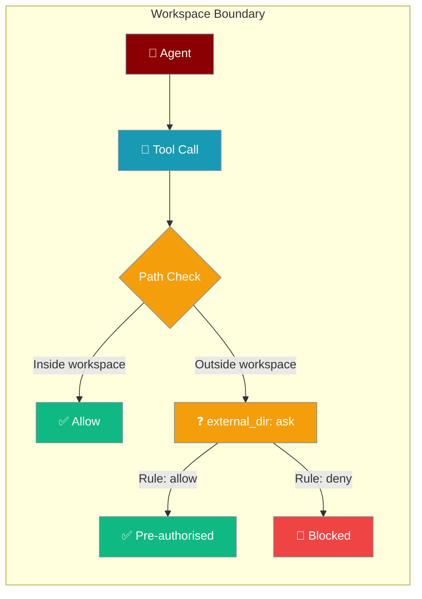
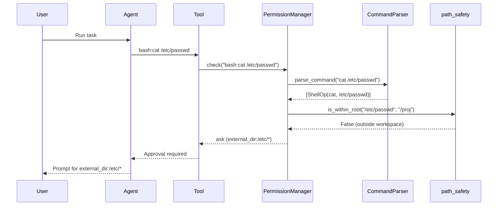

Set a workspace root and any tool call touching a path outside it asks for extra approval — a single broad allow no longer lets the agent reach your whole machine.

<Note>
This feature is introduced in [PraisonAI PR #2575](https://github.com/MervinPraison/PraisonAI/pull/2575). The `workspace_root` parameter is set on `PermissionManager` directly. When `workspace_root=None` (the default), no boundary check runs and existing behaviour is unchanged.
</Note>

The `PermissionManager` boundary described here is complementary to the `EditTools` fallback root introduced in [PR #2981](https://github.com/MervinPraison/PraisonAI/pull/2981) — see [File Editing → Constructor Parameters](/docs/features/file-editing#constructor-parameters-edittools--create_edit_tools).



## Quick Start

<Steps>
<Step title="Enable workspace boundary">

Create a `PermissionManager` with `workspace_root` and the boundary gate activates automatically:

```python
from praisonaiagents.permissions import PermissionManager

manager = PermissionManager(workspace_root="/path/to/project")

result = manager.check("bash:cat /etc/passwd")
print(result.needs_approval)  # True — /etc/passwd is outside workspace
print(result.target)          # bash:cat /etc/passwd
```

When the manager checks `cat /etc/passwd`, it returns `needs_approval=True` — even if a broad `bash:cat *` → allow rule is set.

</Step>

<Step title="Pre-authorise an external directory">

Add a rule to allow a specific external directory without prompting:

```python
from praisonaiagents.permissions import PermissionManager, PermissionRule, PermissionAction

manager = PermissionManager(workspace_root="/proj")
manager.add_rule(PermissionRule(
    pattern="external_dir:/data/*",
    action=PermissionAction.ALLOW,
    description="Allow shared data volume",
))

result = manager.check("bash:cat /data/input.csv")
print(result.action)  # allow — pre-authorised
```

</Step>
</Steps>

---

## How It Works



| Step | Action |
|---|---|
| 1 | Tool call arrives as `bash:<cmd>` or file tool target |
| 2 | `CommandParser` extracts path-like arguments from the command |
| 3 | Each path is checked with `path_safety.is_within_root(path, workspace_root)` |
| 4 | Out-of-workspace paths emit an `external_dir:<parent>/*` sub-target |
| 5 | Sub-target evaluated — defaults to **ask** unless a rule pre-authorises or denies it |

---

## What Triggers the Gate

Any path that resolves outside `workspace_root` triggers an `external_dir:` approval request.

| Path form | Example | Outcome |
|---|---|---|
| Absolute path | `/etc/hosts` | `external_dir:/etc/*` → ask |
| Home-relative | `~/.bashrc` | `external_dir:<home>/*` → ask |
| Explicit relative | `../../etc/passwd` | `external_dir:/etc/*` → ask |
| Env-prefixed | `$HOME/.config/x` | `external_dir:<home>/*` → ask |
| Bare traversal | `sub/../../etc/passwd` | `external_dir:/etc/*` → ask |
| Joined flag value | `--config=/etc/x` | `external_dir:/etc/*` → ask |
| Short-getopt attached | `curl -o/tmp/file` | `external_dir:/tmp/*` → ask |
| Redirect write-target | `echo x > ~/.bashrc` | `external_dir:<home>/*` → ask |
| External executable | `/tmp/tool.sh` | `external_dir:/tmp/*` → ask |

<Note>
Bare PATH-resolved command names like `ls`, `rm`, `cat` are **not** boundary-checked — only tokens that reference the filesystem by path. An executable named `/tmp/tool.sh` is checked; a bare `ls` is not.
</Note>

---

## Aggregation with Existing Rules

The workspace boundary fits into the same deny→ask→allow aggregation as all other permission checks.

| Rule state | Command touches external path | Outcome |
|---|---|---|
| `bash:cat *` → allow | `cat /etc/passwd` | **ask** (boundary gate fires) |
| `external_dir:/data/*` → allow | `cat /data/x.csv` | allow (pre-authorised) |
| `external_dir:*` → deny | `cat /etc/passwd` | deny (hard block) |
| `bash:rm *` → deny | `rm -rf /etc/other` | deny (explicit deny wins first) |

**Deny always wins** — an explicit deny on `bash:rm *` or `external_dir:*` beats the boundary ask, and an explicit deny cannot be overridden by a boundary allow.

---

## Backward Compatibility

When `workspace_root` is `None` (the default), no boundary check runs and behaviour is 100% unchanged. Only opting in to `workspace_root` activates the gate — no existing code breaks.

```python
from praisonaiagents.permissions import PermissionManager

# No workspace_root → old behaviour, no boundary check
manager = PermissionManager()

# With workspace_root → boundary gate active
manager_bounded = PermissionManager(workspace_root="/proj")
```

---

## Fail-Closed Behaviour

<Warning>
If `path_safety` cannot be imported, or if a path cannot be resolved (e.g. broken symlink, permission error), the boundary check **fails closed** — it emits an `external_dir:` → ask rather than silently allowing the operation. This is intentional and tested behaviour. Do not report it as a bug. If you see unexpected ask prompts in edge-case environments, check whether path resolution is failing.
</Warning>

---

## Pre-Authorising External Directories

<Tabs>
<Tab title="CLI">

```bash
praisonai permissions allow "external_dir:/data/*" --description "Shared data volume"
praisonai permissions deny "external_dir:*" --description "Block all external paths"
```

</Tab>
<Tab title="YAML">

```yaml
# agents.yaml
permissions:
  "external_dir:/data/*": allow
  "external_dir:*": deny
  "read:*": allow
  "bash:rm *": deny
```

</Tab>
<Tab title="Python">

```python
from praisonaiagents.permissions import PermissionManager, PermissionRule, PermissionAction

manager = PermissionManager(workspace_root="/proj")
manager.add_rule(PermissionRule(
    pattern="external_dir:/data/*",
    action=PermissionAction.ALLOW,
    description="Allow shared data volume",
))
manager.add_rule(PermissionRule(
    pattern="external_dir:*",
    action=PermissionAction.DENY,
    description="Block all other external paths",
))
manager.add_rule(PermissionRule(
    pattern="read:*",
    action=PermissionAction.ALLOW,
))
```

</Tab>
</Tabs>

---

## Best Practices

<AccordionGroup>
<Accordion title="Set workspace_root to your project root in CI runners">
Point `workspace_root` at your checked-out repository path. The agent can freely read and write within the project; anything outside requires explicit pre-authorisation.
</Accordion>

<Accordion title="Pre-authorise shared data directories">
If your workflow legitimately reads from `/data/` or `/shared/`, add `external_dir:/data/*` → allow. This is safer than using `--approve-all-tools` which bypasses the gate entirely.
</Accordion>

<Accordion title="Combine with external_dir:* → deny for maximum safety">
Set `external_dir:*` → deny to hard-block all out-of-workspace access. No ask prompt appears — the operation is immediately rejected. Use this in high-security CI pipelines.
</Accordion>

<Accordion title="Deny still wins over the boundary gate">
A `bash:rm *` → deny rule fires before the boundary check. You can still hard-block destructive commands regardless of whether the path is inside or outside the workspace.
</Accordion>
</AccordionGroup>

---

## Related

<CardGroup cols={2}>
<Card title="Permissions Module" icon="shield" href="/docs/features/permissions">
  Programmatic PermissionManager API and configuration options
</Card>
<Card title="Command-Aware Permissions" icon="shield-halved" href="/docs/features/command-aware-permissions">
  How compound shell commands are decomposed and checked
</Card>
<Card title="Declarative Permissions" icon="file-code" href="/docs/features/declarative-permissions">
  YAML, CLI, and Python permission policies
</Card>
<Card title="Interactive Approval" icon="check" href="/docs/features/interactive-approval">
  User-facing approval prompts and backends
</Card>
</CardGroup>
