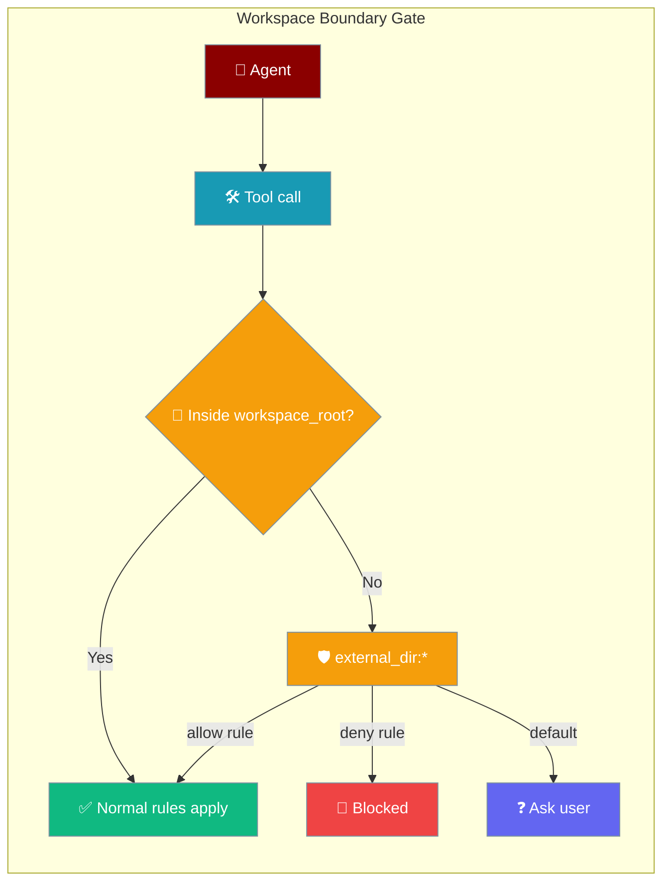
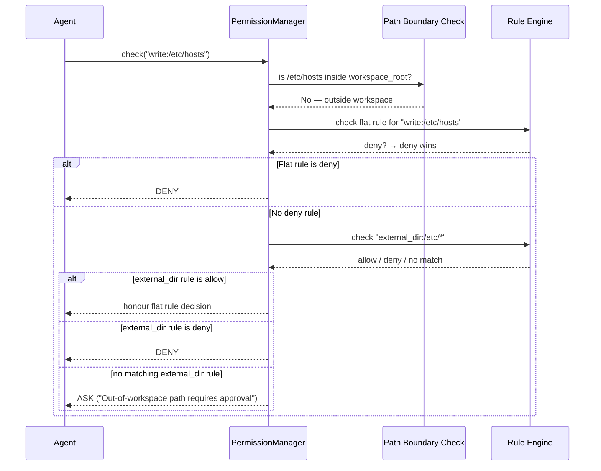

Set a `workspace_root` and any tool call that reads, writes, or executes outside it needs approval — via a distinct `external_dir:*` target.

<Note>
This feature is introduced in [PraisonAI PR #2575](https://github.com/MervinPraison/PraisonAI/pull/2575). The `workspace_root` parameter is set on `PermissionManager` directly. When `workspace_root=None` (the default), no boundary check runs and existing behaviour is unchanged.
</Note>

```python
from praisonaiagents.permissions import PermissionManager

manager = PermissionManager(workspace_root="./my-project")

# Tool operating inside workspace — uses normal rules
result = manager.check("write:./my-project/app.py")

# Tool operating outside workspace — requires approval via external_dir:*
result = manager.check("write:/etc/hosts")
print(result.needs_approval)  # True — reason: "Out-of-workspace path requires approval"
```



## Quick Start

<Steps>
<Step title="Enable the boundary gate">

Pass `workspace_root` to `PermissionManager` to activate the gate:

```python
from praisonaiagents.permissions import PermissionManager

manager = PermissionManager(workspace_root="./my-project")

# Paths inside ./my-project → normal rule flow
# Paths outside → triggers external_dir:* gate (asks by default)
result = manager.check("write:/tmp/debug.log")
print(result.needs_approval)  # True
```

</Step>

<Step title="Combine with explicit rules">

Pre-authorise a known external dir and lock everything else out:

```python
from praisonaiagents.permissions import PermissionManager

manager = PermissionManager(workspace_root="./my-project")
manager.load_rules_from_config({
    "external_dir:/tmp/agent-scratch/*": "allow",   # pre-authorise scratch space
    "external_dir:*": "deny",                        # block all other external access
    "bash:git *": "allow",                           # allow git inside workspace
})

# /tmp/agent-scratch/output.txt → allowed (explicit allow rule)
# /etc/hosts → denied (matches external_dir:* deny)
# ./my-project/app.py → uses bash:git * rule (inside workspace)
```

</Step>
</Steps>

---

## How It Works

Each shell or file tool call passes through two checks when `workspace_root` is set:



### Decision table

| Situation | Result |
|-----------|--------|
| Path inside `workspace_root` | Normal rule flow (unchanged) |
| `external_dir:` matches a **deny** rule | **Deny** |
| Flat file-target matches a **deny** rule | **Deny** (deny still wins) |
| `external_dir:` matches an **allow** rule | Honour the flat file-target's decision |
| No `external_dir:` rule matches | **Ask** — reason: *"Out-of-workspace path requires approval"* |

### What triggers the gate

The boundary check fires for these tool targets when the resolved path escapes `workspace_root`:

**File tools** — any target with these prefixes:

```
write:    write_file:    edit:    edit_file:    apply_patch:
append:   append_file:   delete:  delete_file:
```

**Shell commands** — path-like arguments extracted from the command:

- Absolute paths: `/etc/x`, `/tmp/out`
- Home-relative: `~/config`
- Relative with explicit prefix: `./sub/`, `../sibling/`
- Env-prefixed: `$HOME/data`, `$TMPDIR/work`
- Write redirects: `> /tmp/log`, `>> /var/log/app.log`, `&> /dev/null`
- Joined-flag paths: `--config=/etc/app.conf`, `-o/tmp/out`

Bare command names (e.g. `ls`, `rm`) are **not** boundary-checked — only path-like arguments are.

---

## Configuration Options

| Option | Type | Default | Description |
|--------|------|---------|-------------|
| `workspace_root` | `Optional[str]` | `None` | Root directory for the boundary gate. `None` disables boundary checking entirely. Paths are resolved to real, absolute, symlink-collapsed paths before comparison. |

<Note>
When `workspace_root=None` (the default), the boundary gate is **off**. All existing rules behave exactly as before — no behaviour change for code that does not set `workspace_root`.
</Note>

<Card title="PermissionManager API Reference" icon="code" href="/docs/features/permissions">
  Full `PermissionManager` parameter reference
</Card>

---

## Common Patterns

### Pre-authorise a data directory

Allow the agent to write to a known external scratch directory without prompting:

```python
from praisonaiagents.permissions import PermissionManager

manager = PermissionManager(workspace_root="./project")
manager.load_rules_from_config({
    "external_dir:/data/*": "allow",
    "external_dir:/tmp/agent/*": "allow",
})

# /data/output.csv → allowed
# /tmp/agent/cache.json → allowed
# /etc/hosts → asks user (no matching rule)
```

### Lock down everything outside the workspace

Deny all out-of-workspace access — no prompts, no exceptions:

```python
from praisonaiagents.permissions import PermissionManager

manager = PermissionManager(workspace_root="./project")
manager.load_rules_from_config({
    "external_dir:*": "deny",
})

# Any path outside ./project → denied immediately
```

### Deny wins over the boundary ask

A targeted `deny` rule blocks even when `external_dir:*` might otherwise ask:

```python
from praisonaiagents.permissions import PermissionManager

manager = PermissionManager(workspace_root="./project")
manager.load_rules_from_config({
    "bash:rm *": "deny",   # always deny rm, regardless of path
})

# bash:rm -rf /tmp/other → denied (flat deny rule wins over ask gate)
# bash:rm ./project/tmp → denied (flat deny rule)
```

---

## Best Practices

<AccordionGroup>
<Accordion title="Set workspace_root in production">
Always set `workspace_root` when agents run with file or shell tools in production. Pair it with `external_dir:* -> deny` for defence-in-depth — this blocks unexpected external access rather than asking.
</Accordion>

<Accordion title="Pre-authorise well-known directories">
Instead of blocking everything, pre-authorise directories the agent legitimately needs: `~/.cache`, `/tmp/agent-scratch`, `/var/data/input`. Use specific `external_dir:/path/*` allow rules to grant access only where needed.
</Accordion>

<Accordion title="Deny still wins">
A targeted `deny` rule (e.g. `bash:rm *`) cannot be overridden by an `external_dir:*` allow rule. Deny always takes priority in the aggregation chain.
</Accordion>

<Accordion title="Fail-closed on resolution errors">
If path resolution raises an error (permission issue, broken symlink), the boundary check treats the path as external and emits the `external_dir:` gate (asks, or denies if a deny rule exists) rather than silently allowing. Watch the `praisonaiagents.permissions.manager` logger for `warning` and `error` messages.
</Accordion>
</AccordionGroup>

---

## Related

<CardGroup cols={2}>
<Card title="Permissions" icon="shield-halved" href="/docs/features/permissions">
  Pattern-based permission rules and PermissionManager API
</Card>
<Card title="Command-Aware Permissions" icon="shield" href="/docs/features/command-aware-permissions">
  How compound shell commands are decomposed for rule matching
</Card>
<Card title="Approval" icon="check" href="/docs/features/approval">
  Interactive approval backends (Slack, console, webhook)
</Card>
<Card title="Workspace" icon="folder-lock" href="/docs/features/workspace">
  Agent-level file sandbox (workspace= on Agent)
</Card>
</CardGroup>
