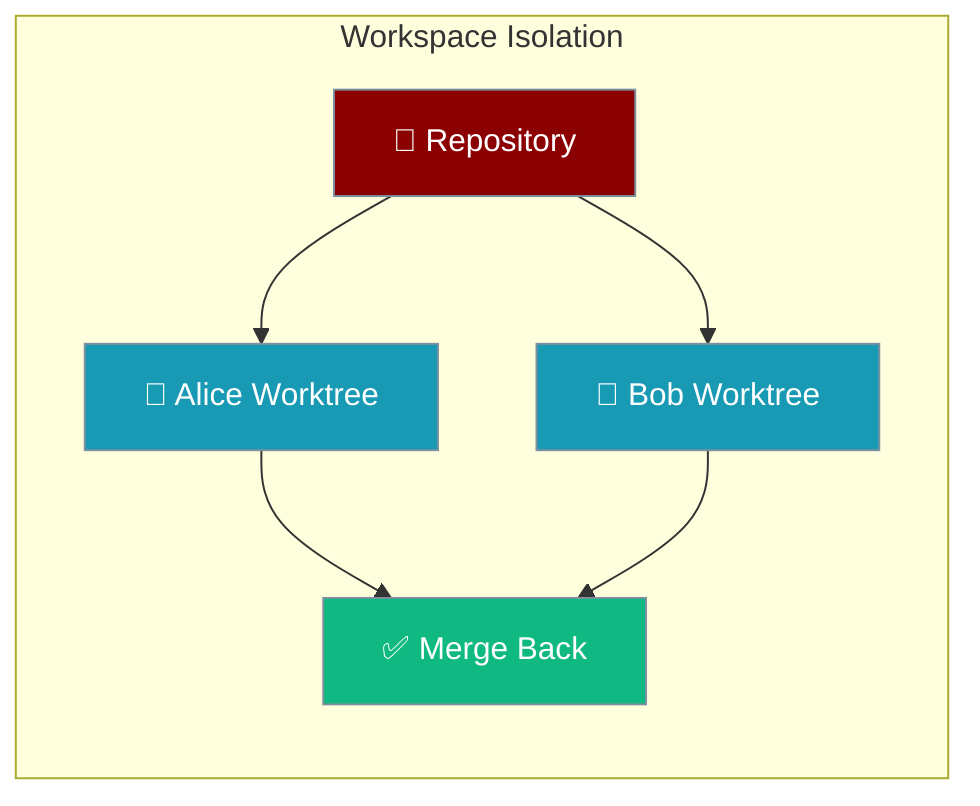
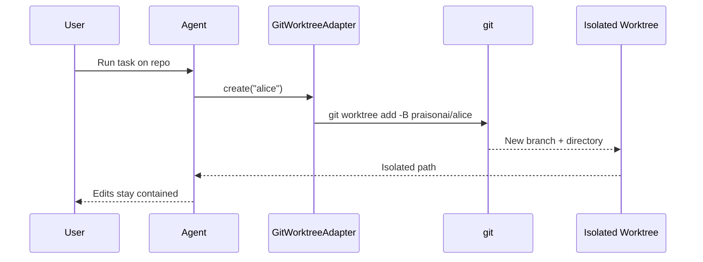
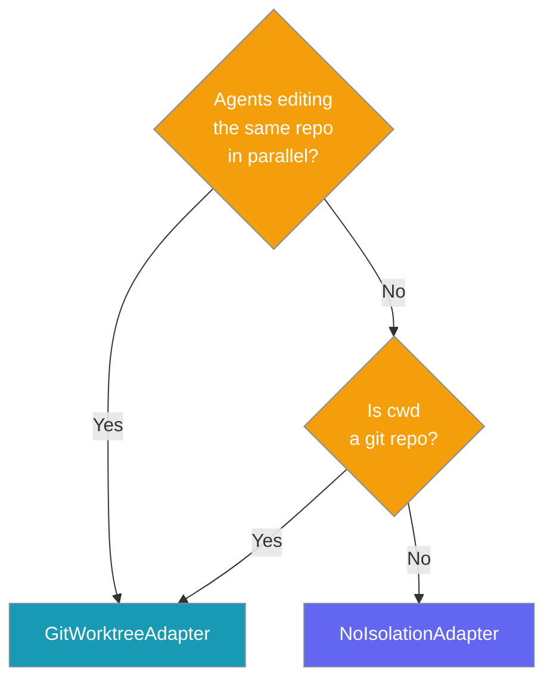

Workspace isolation gives every agent its own working directory on its own branch, so agents editing the same repository never overwrite each other's changes.

<Note>
Three surfaces, one primitive:
- **CLI** — `praisonai run --worktree` ([Isolated Runs](/docs/features/cli-worktree-isolation)) for one-off human-driven runs.
- **Kanban tasks** — `workspace_kind="worktree"` ([Per-Task Worktree Isolation](/docs/features/kanban#per-task-worktree-isolation)) for dispatched workers.
- **Library API** — `GitWorktreeAdapter` (this page) for programmatic isolation.
</Note>

<Note>
This page covers the general-purpose `GitWorktreeAdapter` in `praisonaiagents.workspace`, which gives individual agents their own worktrees at the application layer. Kanban tasks have their **own** built-in worktree isolation — set `workspace_kind="worktree"` on the task instead. See [Kanban → Per-Task Worktree Isolation](/docs/features/kanban#per-task-worktree-isolation).
</Note>

## Using it from the CLI

You don't need to touch the adapter API — the `praisonai run` command has a built-in `--worktree` flag that wires the adapter into your normal run.

```bash
praisonai run "Rework the retry loop" --worktree
```

The agent runs on a fresh branch; your working tree stays clean. Any output is auto-committed to the branch for review, or the branch is pruned if nothing changed.

<Card title="Isolated Runs (CLI)" icon="play" href="/docs/cli/run#isolated-runs">
`praisonai run --worktree` / `--keep` — per-run isolation from the terminal.
</Card>

---



## Quick Start

<Steps>
<Step title="Default (No Isolation)">
Every run shares the same directory — the behaviour you already have.

```python
from praisonaiagents.workspace import NoIsolationAdapter

workspace = NoIsolationAdapter()
workspace.create("alice")  # -> current working directory
```
</Step>

<Step title="Concurrent Agents With Isolation">
Give each agent its own git worktree — edits stay independent.

```python
from praisonaiagents import Agent
from praisonaiagents.workspace import GitWorktreeAdapter

workspace = GitWorktreeAdapter()

alice = Agent(name="Alice", instructions="Edit README.md")
bob = Agent(name="Bob", instructions="Also edit README.md")

alice_dir = workspace.create("alice")  # -> ./.praisonai/worktrees/alice-<hash>
bob_dir = workspace.create("bob")      # -> ./.praisonai/worktrees/bob-<hash>
```
</Step>

<Step title="Reset or Remove">
Restore a worktree to a clean state, or tear it down when the run ends.

```python
workspace.reset("alice")   # git clean + checkout inside alice's worktree
workspace.remove("alice")  # remove the worktree and its branch
```
</Step>
</Steps>

---

## How It Works

`GitWorktreeAdapter` runs real `git worktree` commands to provision a fresh branch and directory per run.



| Method | What it does |
|--------|--------------|
| `create(name)` | Provision the isolated directory and return its path (idempotent — reused if it exists). |
| `path(name)` | Return the directory path for `name` without creating it. |
| `reset(name)` | Restore tracked files and drop untracked files inside the worktree. |
| `remove(name)` | Tear down the worktree and delete its branch. |

When the directory is not a git repository, every method degrades gracefully — `create` and `path` return the original directory, and `reset` and `remove` do nothing.

---

## Choosing an Adapter

Both adapters share the same interface, so you can swap them without changing your code.



`GitWorktreeAdapter` is always safe — if the directory is not a git repo it falls back to `NoIsolationAdapter` behaviour automatically.

---

## Configuration Options

`GitWorktreeAdapter` accepts three options.

| Option | Type | Default | Description |
|--------|------|---------|-------------|
| `root` | `str \| Path \| None` | `Path.cwd()` | Repository root to isolate. |
| `branch_prefix` | `str` | `"praisonai"` | Prefix for worktree branches — branches are named `{branch_prefix}/{slug(name)}`. |
| `worktrees_dir` | `str \| Path \| None` | `{root}/.praisonai/worktrees` | Directory where per-run worktrees are created. |

```python
from praisonaiagents.workspace import GitWorktreeAdapter

workspace = GitWorktreeAdapter(
    root=".",
    branch_prefix="team",
    worktrees_dir=".worktrees",
)

if workspace.available:
    workspace.create("alice")
```

The `available` attribute is `True` only when `root` is inside a git repository and `git` is on the PATH.

`NoIsolationAdapter` accepts a single `root` option (`str | Path | None`, default `Path.cwd()`) that it returns from `create` and `path`.

---

## Common Patterns

Give parallel sub-agents their own worktrees.

```python
from praisonaiagents.workspace import GitWorktreeAdapter

workspace = GitWorktreeAdapter()

for name in ("researcher", "writer", "reviewer"):
    workspace.create(name)  # each gets an independent branch + directory
```

Reuse the same worktree for a named agent — `create` is idempotent.

```python
first = workspace.create("alice")
second = workspace.create("alice")
assert first == second  # same worktree reused, no duplicate created
```

Clean up when the run finishes.

```python
workspace.create("alice")
# ... agent does its work ...
workspace.remove("alice")  # removes worktree and branch
```

---

## Best Practices

<AccordionGroup>
<Accordion title="Use GitWorktreeAdapter unconditionally">
It degrades gracefully outside git repos, so you can always reach for it. No need to detect git yourself — `available` reports the state and non-git directories simply fall back to shared behaviour.
</Accordion>

<Accordion title="Name worktrees by agent or run, not by task">
Names are hashed into collision-resistant slugs, so `"agent one"` and `"agent-one"` never share a worktree. Stable names keep `create` idempotent across retries.
</Accordion>

<Accordion title="Clean up with remove() when the run ends">
Each worktree lives under `.praisonai/worktrees/`. Call `remove()` on completion to stop that directory from growing over long-running sessions.
</Accordion>

<Accordion title="Requires git ≥ 2.5">
`git worktree` was introduced in git 2.5. On older git or non-git directories, isolation is unavailable and the adapter falls back to the shared directory.
</Accordion>
</AccordionGroup>

---

## Related

<CardGroup cols={2}>
<Card title="Multi-Agent Context Safety" icon="shield-check" href="/docs/features/multi-agent-context-safety">
Isolate per-agent runtime and resolver state — the context half of concurrency.
</Card>
<Card title="Code & Workspace Access" icon="code" href="/docs/features/code">
Contain file operations to a workspace with read/write access controls.
</Card>
<Card title="Kanban Worktree Isolation" icon="kanban" href="/docs/features/kanban#per-task-worktree-isolation">
Per-task git worktrees for kanban workers — set `workspace_kind="worktree"`.
</Card>
<Card title="Isolated Runs (--worktree)" icon="code-branch" href="/docs/features/cli-worktree-isolation">
Per-run isolation on `praisonai run` — no Python required.
</Card>
</CardGroup>
