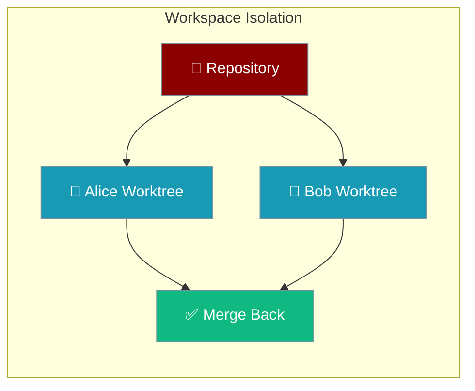
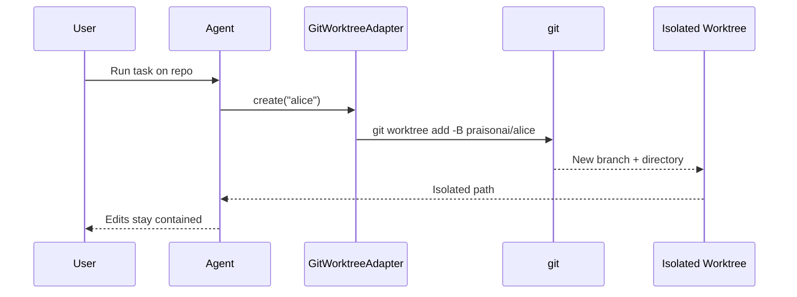
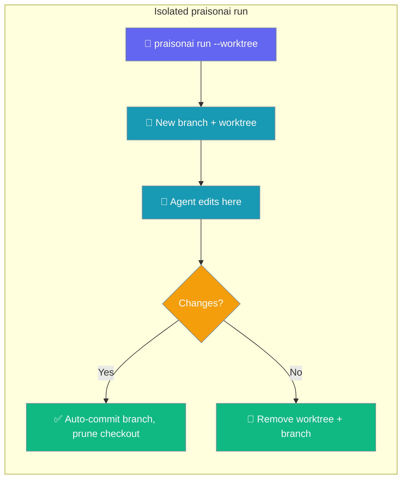
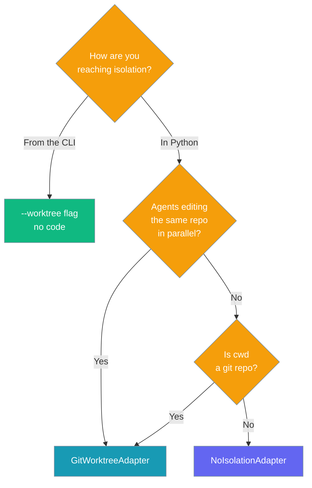

Workspace isolation gives every agent its own working directory on its own branch, so agents editing the same repository never overwrite each other's changes.

<Note>
Three surfaces, one primitive:
- **CLI** — `praisonai run --worktree` ([Isolated Runs](/docs/cli/run#isolated-runs-worktree)) for one-off human-driven runs.
- **Kanban tasks** — `workspace_kind="worktree"` ([Per-Task Worktree Isolation](/docs/features/kanban#per-task-worktree-isolation)) for dispatched workers.
- **Library API** — `GitWorktreeAdapter` (this page) for programmatic isolation.
</Note>

<Note>
This page covers the general-purpose `GitWorktreeAdapter` in `praisonaiagents.workspace` (used programmatically) **and the `praisonai run --worktree` CLI wrapper that provisions one per run.** Kanban tasks have their **own** built-in worktree isolation — set `workspace_kind="worktree"` on the task instead. See [Kanban → Per-Task Worktree Isolation](/docs/features/kanban#per-task-worktree-isolation).
</Note>

## Using it from the CLI

You don't need to touch the adapter API — the `praisonai run` command has a built-in `--worktree` flag that wires the adapter into your normal run.

```bash
praisonai run "Rework the retry loop" --worktree
```

The agent runs on a fresh branch; your working tree stays clean. Any output is auto-committed to the branch for review, or the branch is pruned if nothing changed.

<Card title="Isolated Runs (CLI)" icon="play" href="/docs/cli/run#isolated-runs">
`praisonai run --worktree` / `--keep` — per-run isolation from the terminal.
</Card>

---



## From the CLI

Run any agent on a fresh, disposable branch — no code required.

```bash
# Run any agent on a fresh, disposable branch
praisonai run "refactor auth" --worktree

# Keep the branch checkout in place for review
praisonai run "refactor auth" --worktree --keep
```

The agent edits inside an isolated `praisonai/<task>-<hash>` worktree; on teardown its changes are auto-committed to that branch for review, or the worktree is kept in place with `--keep`. See [`praisonai run --worktree`](/docs/cli/run#isolated-runs-worktree) for the full behaviour.

## Quick Start

<Steps>
<Step title="Isolate a run from the CLI">
Add `--worktree` to any `run` invocation — the agent works on a fresh branch instead of your working tree.

```bash
praisonai run "refactor auth to use bcrypt" --worktree
# > Isolated run on branch 'praisonai/refactor-auth-<uid>' (./.praisonai/worktrees/refactor-auth-<uid>)
# ... agent runs ...
# > Committed changes to branch 'praisonai/refactor-auth-<uid>'.
# > Review/merge with: git merge praisonai/refactor-auth-<uid>
```

Keep the worktree in place for in-place review with `--keep`:

```bash
praisonai run agents.yaml --worktree --keep
```

No-op outside a git repo, so it's always safe to pass. See [`praisonai run --worktree`](/docs/cli/run#isolated-runs-worktree).
</Step>

<Step title="Concurrent Agents With Isolation (Python)">
Give each agent its own git worktree — edits stay independent.

```python
from praisonaiagents import Agent
from praisonaiagents.workspace import GitWorktreeAdapter

workspace = GitWorktreeAdapter()

alice = Agent(name="Alice", instructions="Edit README.md")
bob = Agent(name="Bob", instructions="Also edit README.md")

alice_dir = workspace.create("alice")  # -> ./.praisonai/worktrees/alice-<hash>
bob_dir = workspace.create("bob")      # -> ./.praisonai/worktrees/bob-<hash>
```
</Step>

<Step title="Default, Reset, or Remove">
Opt out of isolation with `NoIsolationAdapter`, or reset and tear down worktrees when a run ends.

```python
from praisonaiagents.workspace import NoIsolationAdapter

workspace = NoIsolationAdapter()
workspace.create("alice")  # -> current working directory
```
</Step>

<Step title="Reset or Remove">
Restore a worktree to a clean state, or tear it down when the run ends.

```python
workspace.reset("alice")   # git clean + checkout inside alice's worktree
workspace.remove("alice")  # remove the worktree and its branch
```
</Step>
</Steps>

---

## How It Works

`GitWorktreeAdapter` runs real `git worktree` commands to provision a fresh branch and directory per run.



| Method | What it does |
|--------|--------------|
| `create(name)` | Provision the isolated directory and return its path (idempotent — reused if it exists). |
| `path(name)` | Return the directory path for `name` without creating it. |
| `reset(name)` | Restore tracked files and drop untracked files inside the worktree. |
| `remove(name)` | Tear down the worktree and delete its branch. |

When the directory is not a git repository, every method degrades gracefully — `create` and `path` return the original directory, and `reset` and `remove` do nothing.

---

## CLI Usage

`praisonai run --worktree` wraps the adapter so a single command runs the agent on a fresh branch — no Python glue required.

```bash
praisonai run "refactor auth to use bcrypt" --worktree
```



The run detects changes with `git status --porcelain`, so brand-new (untracked) files are never lost.

| Situation | Worktree checkout | Branch | Reported |
|-----------|-------------------|--------|----------|
| No changes | Removed | Removed | `No changes on '<branch>'.` |
| Any change (tracked **or** untracked) | Pruned | **Retained** with auto-commit | `Committed changes to branch '<branch>'. Review/merge with: git merge <branch>` |
| `--keep` | **Retained** | **Retained** | `Worktree kept at <path> (branch '<branch>'). Review/merge then remove with: git worktree remove.` |
| Cwd is not a git repo | n/a (no-op) | n/a | Warning: `Not a git repository; running without worktree isolation.` |

<Warning>
`--worktree` never destroys the agent's output. On any change the branch is committed and retained even without `--keep` — only the worktree checkout is pruned.
</Warning>

<Tip>
A short random 8-char token is appended to every branch/worktree name, so two runs of the **same** target never collide — run `praisonai run "..." --worktree` twice in parallel and each gets its own branch and directory.
</Tip>

<Note>
`--worktree` works with a direct prompt or a YAML file. It cannot be combined with `--attach`, `--agent`, `--command`, `--profile`, or `--profile-deep`, and `--keep` requires `--worktree`. See the [`run` CLI reference](/docs/cli/run#isolated-runs-worktree) for the full options table and compatibility matrix.
</Note>

---

## Choosing an Adapter

Both adapters share the same interface, so you can swap them without changing your code.



`GitWorktreeAdapter` is always safe — if the directory is not a git repo it falls back to `NoIsolationAdapter` behaviour automatically.

---

## Configuration Options

`GitWorktreeAdapter` accepts three options.

| Option | Type | Default | Description |
|--------|------|---------|-------------|
| `root` | `str \| Path \| None` | `Path.cwd()` | Repository root to isolate. |
| `branch_prefix` | `str` | `"praisonai"` | Prefix for worktree branches — branches are named `{branch_prefix}/{slug(name)}`. |
| `worktrees_dir` | `str \| Path \| None` | `{root}/.praisonai/worktrees` | Directory where per-run worktrees are created. |

```python
from praisonaiagents.workspace import GitWorktreeAdapter

workspace = GitWorktreeAdapter(
    root=".",
    branch_prefix="team",
    worktrees_dir=".worktrees",
)

if workspace.available:
    workspace.create("alice")
```

The `available` attribute is `True` only when `root` is inside a git repository and `git` is on the PATH.

`NoIsolationAdapter` accepts a single `root` option (`str | Path | None`, default `Path.cwd()`) that it returns from `create` and `path`.

---

## Common Patterns

Give parallel sub-agents their own worktrees.

```python
from praisonaiagents.workspace import GitWorktreeAdapter

workspace = GitWorktreeAdapter()

for name in ("researcher", "writer", "reviewer"):
    workspace.create(name)  # each gets an independent branch + directory
```

Reuse the same worktree for a named agent — `create` is idempotent.

```python
first = workspace.create("alice")
second = workspace.create("alice")
assert first == second  # same worktree reused, no duplicate created
```

Clean up when the run finishes.

```python
workspace.create("alice")
# ... agent does its work ...
workspace.remove("alice")  # removes worktree and branch
```

---

## Best Practices

<AccordionGroup>
<Accordion title="Reach for --worktree before the Python API">
For a one-off isolated agent run there is nothing to install and no Python glue — just append `--worktree`. The programmatic `GitWorktreeAdapter` is only needed when you're orchestrating multiple agents from your own code.
</Accordion>

<Accordion title="Use --keep when you want to inspect in place">
Without `--keep`, the worktree checkout is pruned after each run (the branch is preserved). With `--keep`, both the checkout and the branch stay so you can `cd` into the isolated directory and inspect changes in place.
</Accordion>

<Accordion title="Merge or squash the auto-commit">
The isolated run auto-commits everything (tracked + untracked) with the message `praisonai run: <target>`, so merge or cherry-pick with a plain `git merge praisonai/<name>-<uid>`. To collapse into a single commit, use `git merge --squash`.
</Accordion>

<Accordion title="Use GitWorktreeAdapter unconditionally">
It degrades gracefully outside git repos, so you can always reach for it. No need to detect git yourself — `available` reports the state and non-git directories simply fall back to shared behaviour.
</Accordion>

<Accordion title="Name worktrees by agent or run, not by task">
Names are hashed into collision-resistant slugs, so `"agent one"` and `"agent-one"` never share a worktree. Stable names keep `create` idempotent across retries.
</Accordion>

<Accordion title="Clean up with remove() when the run ends">
Each worktree lives under `.praisonai/worktrees/`. Call `remove()` on completion to stop that directory from growing over long-running sessions.
</Accordion>

<Accordion title="Requires git ≥ 2.5">
`git worktree` was introduced in git 2.5. On older git or non-git directories, isolation is unavailable and the adapter falls back to the shared directory.
</Accordion>
</AccordionGroup>

---

## Also available on the CLI

Run a single `praisonai run` invocation on a fresh worktree/branch with the `--worktree` flag — no Python needed. It commits the run's output to the branch on exit (or keep it in place with `--keep`).

```bash
praisonai run --worktree "Refactor the auth module and add tests"
```

See [Isolated Runs (Git Worktree)](/docs/cli/run#isolated-runs-git-worktree) for the full flag reference and teardown behaviour.

---

## Related

<CardGroup cols={2}>
<Card title="Run CLI" icon="play" href="/docs/cli/run#isolated-runs-worktree">
`praisonai run --worktree` / `--keep` — the CLI wrapper and its full options table.
</Card>
<Card title="Multi-Agent Context Safety" icon="shield-check" href="/docs/features/multi-agent-context-safety">
Isolate per-agent runtime and resolver state — the context half of concurrency.
</Card>
<Card title="Code & Workspace Access" icon="code" href="/docs/features/code">
Contain file operations to a workspace with read/write access controls.
</Card>
<Card title="Kanban Worktree Isolation" icon="kanban" href="/docs/features/kanban#per-task-worktree-isolation">
Per-task git worktrees for kanban workers — set `workspace_kind="worktree"`.
</Card>
<Card title="praisonai run --worktree" icon="play" href="/docs/cli/run#isolated-runs-worktree">
Run any agent on an isolated branch from the CLI — no code required.
</Card>
<Card title="Run --worktree" icon="code-branch" href="/docs/features/run-worktree">
The `praisonai run --worktree` one-liner that wraps this adapter from the CLI.
</Card>
</CardGroup>
