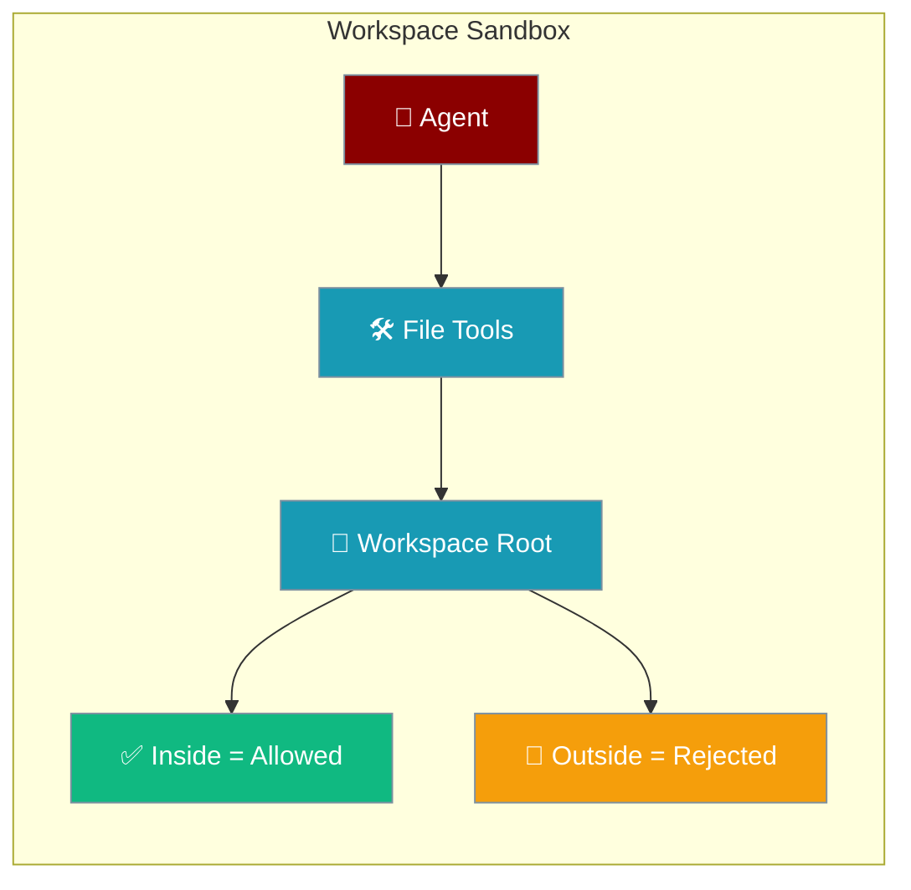
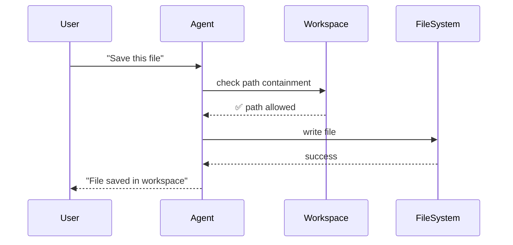
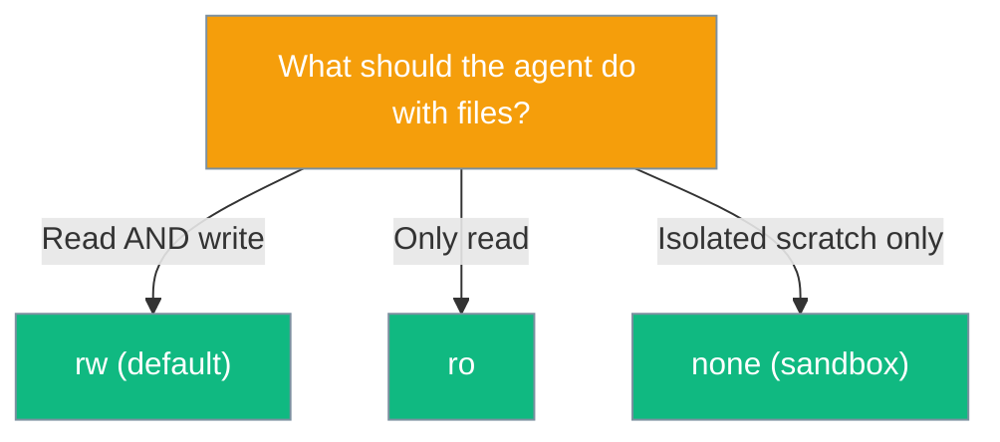

Workspace sandboxing provides secure, isolated file access for agents, ensuring file operations stay within designated boundaries.



## Quick Start

<Steps>
<Step title="Basic Bot with Workspace">
```python
from praisonaiagents import Agent
from praisonai.bots import TelegramBot

agent = Agent(
    name="Assistant",
    instructions="You help users with files and tasks"
)

# Workspace is applied automatically when agent runs as a bot
bot = TelegramBot(token="YOUR_TOKEN", agent=agent)
```
</Step>

<Step title="Custom Workspace Configuration">
```python
from praisonaiagents import Agent
from praisonai.bots import TelegramBot
from praisonaiagents.bots import BotConfig

config = BotConfig(
    token="YOUR_TOKEN",
    workspace_dir="./my-bot-workspace",  # custom path
    workspace_access="rw",                # "rw" | "ro" | "none"
    workspace_scope="session",            # "shared" | "session" | "user" | "agent"
)

bot = TelegramBot(config=config, agent=agent)
```
</Step>
</Steps>

---

## How It Works



Workspace containment operates through three key mechanisms:

| Mechanism | Purpose | Implementation |
|-----------|---------|----------------|
| **Path Resolution** | Resolve paths against workspace root | `workspace.resolve(path)` |
| **Containment Check** | Verify paths stay within boundaries | `workspace.contains(path)` |
| **Access Control** | Enforce read/write permissions | Access mode validation |

---

## Configuration Options

### Workspace Access Modes



### Workspace Configuration

| Option | Type | Default | Description |
|--------|------|---------|-------------|
| `root` | `Path` | required | Absolute workspace directory (auto-created; refuses `/`) |
| `access` | `"rw"`, `"ro"`, `"none"` | `"rw"` | Read-write, read-only, or copy-on-write sandbox |
| `scope` | `"shared"`, `"session"`, `"user"`, `"agent"` | `"session"` | Workspace scope level |
| `session_key` | `Optional[str]` | `None` | Session identifier for scope resolution |

### BotConfig Workspace Fields

| Option | Type | Default | Description |
|--------|------|---------|-------------|
| `workspace_dir` | `Optional[str]` | `None` → `~/.praisonai/workspaces/<scope>/<session_key>` | Override workspace path |
| `workspace_access` | `str` | `"rw"` | Access mode |
| `workspace_scope` | `str` | `"session"` | Scope level |

---

## Common Patterns

### Scope Selection Guide

```python
# Shared workspace (all users/agents share files)
config = BotConfig(workspace_scope="shared")

# Session workspace (isolated per conversation)
config = BotConfig(workspace_scope="session")  # default

# User workspace (isolated per user)
config = BotConfig(workspace_scope="user")

# Agent workspace (isolated per agent instance)
config = BotConfig(workspace_scope="agent")
```

### Advanced Path Operations

```python
from praisonaiagents.workspace import Workspace
from pathlib import Path

workspace = Workspace(
    root=Path("./my-workspace").resolve(),
    access="rw"
)

# Check if path is contained
if workspace.contains("user-file.txt"):
    # Safe to access
    safe_path = workspace.resolve("user-file.txt")

# Handle path traversal attempts
try:
    bad_path = workspace.resolve("../../../etc/passwd")
except ValueError as e:
    print(f"Security violation: {e}")
```

### Read-Only Workspace

```python
# Prevent any file modifications
config = BotConfig(
    workspace_access="ro",
    workspace_dir="./read-only-data"
)
```

---

## Best Practices

<AccordionGroup>
<Accordion title="Choose the Right Scope">
Use `"session"` (default) for most chat bots to isolate conversations. Use `"shared"` only when agents need to collaborate on files. Use `"user"` for personal assistants. Use `"agent"` for specialized single-purpose bots.
</Accordion>

<Accordion title="Security by Construction">
Workspaces reject filesystem root access, resolve symlinks to prevent macOS issues, and validate all path operations. Never bypass workspace containment in production deployments.
</Accordion>

<Accordion title="Default Path Layout">
The default workspace structure is `~/.praisonai/workspaces/<scope>/<session_key>/`. This ensures clean separation and predictable file organization across different deployment scenarios.
</Accordion>

<Accordion title="Backward Compatibility">
File tools fall back to `os.getcwd()` when no workspace is configured, maintaining compatibility with existing code. Bots automatically apply workspace containment for security.
</Accordion>
</AccordionGroup>

---

## Related

<CardGroup cols={2}>
<Card title="Bot Default Tools" icon="toolbox" href="/docs/features/bot-default-tools">
  Auto-injected tools that work with workspaces
</Card>
<Card title="Self-Improving Skills" icon="wand-magic-sparkles" href="/docs/features/skill-manage">
  How skills interact with workspace containment
</Card>
</CardGroup>