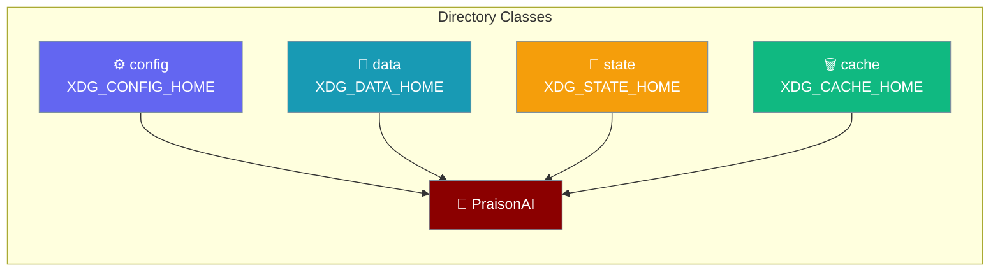
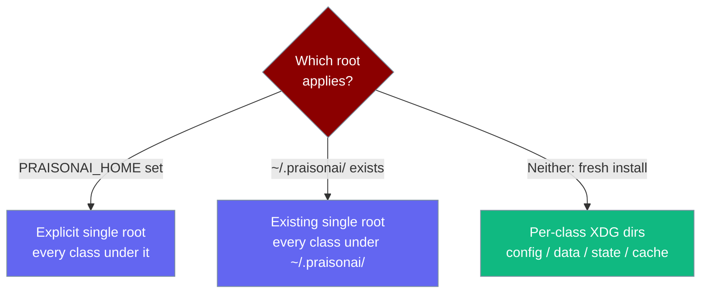

On fresh installs, PraisonAI honours `XDG_{CONFIG,DATA,STATE,CACHE}_HOME` so config, data, state, and cache can live on different volumes. Existing single-root installs (`~/.praisonai/` or `PRAISONAI_HOME`) keep working unchanged.



## Quick Start

<Steps>
<Step title="Default (existing installs, unchanged)">

```python
from praisonaiagents import Agent

agent = Agent(name="assistant", instructions="Be helpful.")
agent.start("Hello")
# Config, data, state, cache all stay under ~/.praisonai/ — nothing to configure.
```

</Step>

<Step title="Split classes onto different volumes">

```bash
export XDG_CONFIG_HOME=/etc/praisonai       # config.yaml, credentials
export XDG_DATA_HOME=/mnt/persistent/data   # sessions, memory, knowledge, plugins
export XDG_STATE_HOME=/var/lib/praisonai    # MRU model, logs, spill
export XDG_CACHE_HOME=/tmp/praisonai-cache  # tmpfs is fine

praisonai run "Summarise this repo"
```

</Step>

<Step title="Explicit single root (PRAISONAI_HOME) still wins">

```bash
export PRAISONAI_HOME=/app/data
praisonai run "..."   # Every class stays under /app/data — XDG is ignored.
```

</Step>
</Steps>

---

## Which directory does what?

Each class has its own purpose, precedence, and helper.

| Class | Purpose | Precedence (fresh install) | XDG fallback default | Helper |
|-------|---------|---------------------------|----------------------|--------|
| **config** | Editable config, credentials, rules | `PRAISONAI_HOME` → existing single root → `$XDG_CONFIG_HOME/praisonai` | `~/.config/praisonai` | `get_config_dir()` |
| **data** | Sessions, memory, knowledge, plugins | `PRAISONAI_HOME` → existing single root → `$XDG_DATA_HOME/praisonai` | `~/.praisonai` *(branded default; only overridden when `XDG_DATA_HOME` is explicitly set)* | `get_data_dir()` |
| **state** | MRU model, logs, session spill | `PRAISONAI_HOME` → existing single root → `$XDG_STATE_HOME/praisonai` | `~/.local/state/praisonai` | `get_state_dir()` |
| **cache** | Disposable caches, transient indexes | `PRAISONAI_HOME` → existing single root → `$XDG_CACHE_HOME/praisonai` | `~/.cache/praisonai` | `get_cache_dir()` |

<Note>
One asymmetry: `get_data_dir()` keeps `~/.praisonai` as the branded fallback (not `~/.local/share/praisonai`) unless you explicitly set `XDG_DATA_HOME`. This is intentional back-compat with existing installs.
</Note>

---

## How It Works

The single-root decision runs once, then per-class XDG dirs apply on a fresh install.



Behaviour notes:

- **Back-compat is preserved.** If `~/.praisonai/` (or `~/.praison/`) already exists, or `PRAISONAI_HOME` is set, every class stays under that single root.
- **The single-root decision is snapshotted once per process.** If PraisonAI later creates `~/.praisonai/` mid-run for data, config/state/cache do **not** retroactively move onto it.
- **Relative XDG paths are ignored, per spec.** `XDG_CONFIG_HOME=relative/path` falls back to `~/.config/praisonai`.
- **`get_session_spill_dir()` now lives under `<state>/state/session_spill/`** — no longer under `~/.praisonai/state/`.
- **`get_config_path()` now returns `<config>/config.yaml`** — no longer `<data>/config.yaml`.
- **Split state ends.** MRU model recency now writes under the canonical state home, so `~/.praison` and `~/.praisonai` no longer disagree.

---

## Configuration Options

| Variable | Type | Default | Description |
|----------|------|---------|-------------|
| `PRAISONAI_HOME` | absolute path | unset | Explicit single root. Wins over everything else; every class stays under it. |
| `XDG_CONFIG_HOME` | absolute path | `~/.config` | Where `get_config_dir()` resolves on fresh installs. |
| `XDG_DATA_HOME` | absolute path | `~/.praisonai` (branded default) | Where `get_data_dir()` resolves on fresh installs. |
| `XDG_STATE_HOME` | absolute path | `~/.local/state` | Where `get_state_dir()` resolves on fresh installs. |
| `XDG_CACHE_HOME` | absolute path | `~/.cache` | Where `get_cache_dir()` resolves on fresh installs. |

### Python API

```python
from praisonaiagents.paths import (
    get_config_dir,   # NEW — editable config, credentials, rules
    get_data_dir,     # sessions, memory, knowledge, plugins  (XDG-aware)
    get_state_dir,    # NEW — MRU model, logs, spill
    get_cache_dir,    # disposable caches                       (XDG-aware)
    get_all_paths,    # dict now includes "config_dir" and "state_dir"
)
```

---

## Common Patterns

<Tabs>
<Tab title="Kubernetes">
Mount a ConfigMap at `$XDG_CONFIG_HOME`, a PVC at `$XDG_DATA_HOME`, and an emptyDir at `$XDG_CACHE_HOME`.

```bash
export XDG_CONFIG_HOME=/config     # ConfigMap (read-only)
export XDG_DATA_HOME=/data         # PersistentVolumeClaim
export XDG_CACHE_HOME=/cache       # emptyDir
```
</Tab>

<Tab title="systemd service">
Set the directory directives and let systemd populate the XDG vars.

```ini
[Service]
ConfigurationDirectory=praisonai
StateDirectory=praisonai
CacheDirectory=praisonai
```
</Tab>

<Tab title="CI runners">
Point state and cache at the workspace so logs and caches don't leak into `$HOME`.

```bash
export XDG_STATE_HOME="$CI_WORKSPACE/state"
export XDG_CACHE_HOME="$CI_WORKSPACE/cache"
```
</Tab>

<Tab title="Existing install">
No action needed; `~/.praisonai/` continues to hold every class.

```bash
praisonai run "Nothing to configure"
```
</Tab>
</Tabs>

---

## Best Practices

<AccordionGroup>
<Accordion title="🗂️ Separate volumes by class">
Back up `$XDG_CONFIG_HOME/praisonai` (small, precious); put `$XDG_CACHE_HOME/praisonai` on tmpfs (disposable); size `$XDG_DATA_HOME/praisonai` for session/memory growth.
</Accordion>

<Accordion title="🧭 Use PRAISONAI_HOME when you want one directory">
It short-circuits XDG entirely and keeps every class under one root.
</Accordion>

<Accordion title="🧾 Check the resolved paths">
Run `praisonai paths show` — the output now includes `config_dir` and `state_dir`.
</Accordion>

<Accordion title="🚫 Don't use relative XDG paths">
Per spec they're ignored and the default applies.
</Accordion>
</AccordionGroup>

---

## Related

<CardGroup cols={2}>
<Card title="Storage Paths" icon="database" href="/concepts/storage-paths">
The full storage-path concept reference.
</Card>
<Card title="CLI Configuration" icon="gear" href="/features/cli-configuration">
Layered config precedence for the CLI.
</Card>
<Card title="Env Config Injection" icon="file-code" href="/features/env-config-injection">
Supply the config layer from the environment.
</Card>
<Card title="Security Environment Variables" icon="shield" href="/features/security-environment-variables">
Zero-disk auth and other security env vars.
</Card>
</CardGroup>
