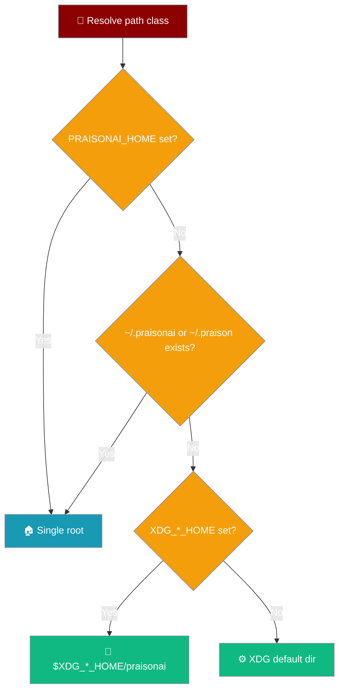

Fresh installs place config, data, state, and cache under the standard XDG Base Directories when the matching `XDG_*` variables are set.



## Quick Start

<Steps>
<Step title="Inspect resolved paths">

Read the resolved directories from Python:

```python
from praisonaiagents.paths import get_config_dir, get_data_dir, get_state_dir, get_cache_dir

print(get_config_dir())  # ~/.config/praisonai on a fresh XDG install
print(get_data_dir())    # ~/.praisonai (branded default)
print(get_state_dir())   # ~/.local/state/praisonai
print(get_cache_dir())   # ~/.cache/praisonai
```

</Step>

<Step title="Route a class with an XDG variable">

Set an `XDG_*_HOME` variable to move that class to a mounted volume:

```bash
export XDG_STATE_HOME=/mnt/state
export XDG_CACHE_HOME=/scratch/cache
praisonai "Run once"
# state -> /mnt/state/praisonai, cache -> /scratch/cache/praisonai
```

</Step>
</Steps>

---

## How It Works

Each path class shares one precedence chain: an explicit single root wins, then legacy detection, then the XDG variable, then the XDG default.

```
PRAISONAI_HOME  >  existing ~/.praisonai or ~/.praison  >  $XDG_*_HOME/praisonai  >  XDG default
```

An existing single-root install (`PRAISONAI_HOME` set, or `~/.praisonai/` present) keeps every class together for full backward compatibility. XDG behaviour only applies to fresh installs.

---

## Path Classes

Each class has its own helper, single-root path, XDG variable, and default.

| Class | Helper | Single-root path | XDG variable | XDG default | Notes |
|-------|--------|------------------|--------------|-------------|-------|
| Config | `get_config_dir()` | `<root>/` | `XDG_CONFIG_HOME` | `~/.config/praisonai` | Editable config, credentials, rules |
| Data | `get_data_dir()` | `<root>/` | `XDG_DATA_HOME` | `~/.praisonai` | Keeps the branded default unless `XDG_DATA_HOME` is explicitly set |
| State | `get_state_dir()` | `<root>/` | `XDG_STATE_HOME` | `~/.local/state/praisonai` | MRU model, logs, session spill |
| Cache | `get_cache_dir()` | `<root>/cache` | `XDG_CACHE_HOME` | `~/.cache/praisonai` | Disposable data |

<Note>
The data class is the exception: it stays at the branded `~/.praisonai` default **unless** `XDG_DATA_HOME` is explicitly set. This prevents branded installs from silently moving. Config, state, and cache follow their XDG defaults on fresh installs.
</Note>

Two helpers are new public functions: `get_config_dir()` and `get_state_dir()`. Session spill routes to the state home via `get_session_spill_dir()`, and `get_config_path()` resolves `<config>/config.yaml`.

---

## Common Patterns

### Server with volume mounts

Point each class at a persistent volume:

```bash
export XDG_CONFIG_HOME=/data/config
export XDG_DATA_HOME=/data/data
export XDG_STATE_HOME=/data/state
export XDG_CACHE_HOME=/data/cache
```

### Ephemeral state on tmpfs

Keep state fast and disposable while config persists:

```bash
export XDG_STATE_HOME=/dev/shm
export XDG_CONFIG_HOME=/etc/praisonai
```

### Read-only config, scratch cache

Serve config from a read-only mount and cache on scratch disk:

```bash
export XDG_CONFIG_HOME=/ro/config   # read-only mount
export XDG_CACHE_HOME=/scratch      # writable scratch
```

---

## Migration

<Note>
Existing installs are unchanged. If `~/.praisonai/` is present or `PRAISONAI_HOME` is set, every class stays under that single root. XDG behaviour only activates for fresh installs with `XDG_*` variables set.
</Note>

---

## Best Practices

<AccordionGroup>
<Accordion title="Set PRAISONAI_HOME for a single-root layout">
When you want everything in one place, `PRAISONAI_HOME` overrides all XDG resolution and keeps classes together.
</Accordion>

<Accordion title="Use XDG_STATE_HOME for disposable state">
State is machine-local (MRU model, logs, spill). Routing it to tmpfs keeps ephemeral runs clean.
</Accordion>

<Accordion title="Set XDG_DATA_HOME explicitly on servers">
Data keeps the branded default unless `XDG_DATA_HOME` is set — point it at a persistent volume in containers.
</Accordion>

<Accordion title="Keep cache on scratch disk">
Cache is disposable; `XDG_CACHE_HOME` on a scratch volume avoids filling persistent storage.
</Accordion>
</AccordionGroup>

---

## Related

<CardGroup cols={2}>
<Card title="Storage Paths" icon="folder" href="/concepts/storage-paths">
  Core storage-path concepts and PRAISONAI_HOME
</Card>
<Card title="Config from Env" icon="gear" href="/features/env-config">
  Inject the full CLI config from an environment variable
</Card>
</CardGroup>
