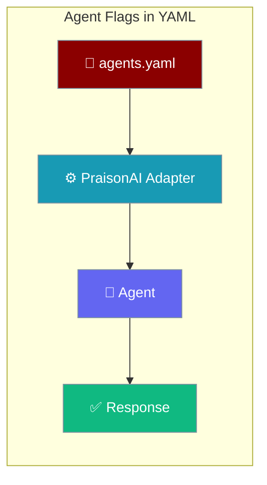
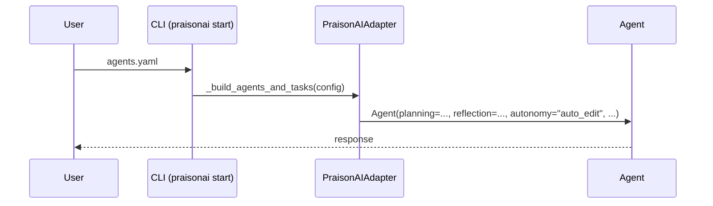

These YAML keys under each `roles:` entry map directly onto the corresponding `Agent(...)` kwargs when you run with `framework: praisonai`.

```python
from praisonaiagents import Agent

agent = Agent(
    name="Coder",
    instructions="Refactor code with a plan and self-review.",
    planning=True,
    reflection=True,
    autonomy="auto_edit",
)
agent.start("Refactor the authentication module.")
```



## Quick Start

<Steps>
<Step title="Simple — one flag on">

Enable a single behaviour flag in `agents.yaml`, then run it.

```yaml
framework: praisonai
roles:
  writer:
    role: "Writer"
    goal: "Draft clear content"
    backstory: "Senior technical writer"
    planning: true
    tasks:
      draft:
        description: "Draft an intro for {{topic}}"
        expected_output: "A short intro paragraph"
```

```bash
praisonai start agents.yaml
```
</Step>

<Step title="All flags">

Combine every behaviour flag on one agent.

```yaml
framework: praisonai
roles:
  coder:
    role: "Autonomous Coder"
    goal: "Complete coding tasks with minimal supervision"
    backstory: "Senior engineer"
    autonomy: 6            # -> "auto_edit" preset in core
    planning: true         # forwarded as-is
    reflection: true       # forwarded as-is
    web: true              # forwarded as-is
    skills: ["python", "testing"]
    guardrails: ["no_prod_writes"]
    tasks:
      write_tests:
        description: "Write pytest tests for {{topic}}"
        expected_output: "A file with pytest test cases"
```
</Step>

<Step title="From code">

The same flags as `Agent(...)` kwargs — identical behaviour, no YAML.

```python
from praisonaiagents import Agent

agent = Agent(
    name="Coder",
    instructions="Complete coding tasks with minimal supervision.",
    planning=True,
    reflection=True,
    web=True,
    skills=["python", "testing"],
    guardrails=["no_prod_writes"],
    autonomy="auto_edit",
)
agent.start("Write pytest tests for the auth module.")
```
</Step>
</Steps>

---

## Flag reference

Each key maps onto one `Agent(...)` kwarg — follow the deep-dive link for the full option set.

| YAML key | Type | Core kwarg | Notes | Deep dive |
|---|---|---|---|---|
| `planning` | `bool` | `planning=` | Enables planning mode. | [Planning](/docs/features/planning-mode) |
| `reflection` | `bool` | `reflection=` | Enables self-reflection. | [Reflection](/docs/features/reflection) |
| `guardrails` | `list[str]` | `guardrails=` | Names of guardrails to apply. | [Guardrails](/docs/features/guardrails) |
| `web` | `bool` | `web=` | Enables built-in web tools. | [Web](/docs/features/web) |
| `skills` | `list[str]` | `skills=` | Skills the agent has. | [Skills](/docs/features/skills) |
| `autonomy` | `int 0-10` | `autonomy=` (preset str) | Wrapper maps 1-3→`suggest`, 4-7→`auto_edit`, 8-10→`full_auto`. Also accepts bool/str/dict passthrough. | [Autonomy](/docs/features/autonomy) |

---

## How It Works

The CLI hands your `agents.yaml` to the adapter, which forwards each flag into the core `Agent` constructor.



---

## Autonomy Levels in YAML

The `autonomy` integer maps onto a core preset before it reaches `Agent(autonomy=…)`.

| YAML `autonomy:` value | Core preset |
|---|---|
| `0` (or omitted) | off |
| `1` – `3` | `suggest` |
| `4` – `7` | `auto_edit` |
| `8` – `10` | `full_auto` |

`bool` / `str` preset / `dict` / `AutonomyConfig` values pass through unchanged, mirroring the Python API.

---

## Best Practices

<AccordionGroup>
<Accordion title="Start with autonomy: 3 and graduate up">
Begin at `autonomy: 3` (the `suggest` preset) so the agent proposes changes for your approval. Raise the level to `auto_edit` (4-7) or `full_auto` (8-10) once you trust its behaviour.
</Accordion>

<Accordion title="Combine planning with reflection">
Set `planning: true` and `reflection: true` together for research-heavy tasks — the agent plans its steps, then self-reviews each result.
</Accordion>

<Accordion title="Use guardrail names, not callables">
`guardrails:` takes a list of registered guardrail names. YAML can't express Python functions, so define callables in code and reference them by name here.
</Accordion>

<Accordion title="Use the dict form for advanced autonomy">
For fine-grained tuning (iteration caps, doom-loop thresholds), use `autonomy: {...}` dict form instead of the 0-10 int — the dict is passed through to `AutonomyConfig` unchanged.
</Accordion>
</AccordionGroup>

---

## Related

<CardGroup cols={2}>
<Card icon="file-code" href="/docs/features/yaml-configuration-reference">
  YAML Configuration Reference — the full field table
</Card>
<Card icon="robot" href="/docs/features/autonomy">
  Autonomy — deep dive into levels, doom-loop protection, and budgets
</Card>
</CardGroup>
