# YAML Configuration Reference

Complete reference for all configuration options in `agents.yaml` and `workflow.yaml` files.

```mermaid
graph TB
    subgraph "Configuration Files"
        A["📄 agents.yaml"]
        W["📄 workflow.yaml"]
    end
    
    subgraph "Shared Features"
        AG["👤 Agents"]
        ST["📋 Steps"]
        VR["📦 Variables"]
        TL["🔧 Tools"]
    end
    
    subgraph "Execution"
        EX["⚡ Execute"]
    end
    
    A --> AG
    A --> ST
    A --> VR
    A --> TL
    W --> AG
    W --> ST
    W --> VR
    W --> TL
    AG --> EX
    ST --> EX
    
    style A fill:#8B0000,stroke:#7C90A0,color:#fff
    style W fill:#8B0000,stroke:#7C90A0,color:#fff
    style AG fill:#189AB4,stroke:#7C90A0,color:#fff
    style ST fill:#189AB4,stroke:#7C90A0,color:#fff
    style VR fill:#189AB4,stroke:#7C90A0,color:#fff
    style TL fill:#189AB4,stroke:#7C90A0,color:#fff
    style EX fill:#2E8B57,stroke:#7C90A0,color:#fff
```



<Info>
**Both files are fully compatible!** PraisonAI accepts both `agents.yaml` and `workflow.yaml` with the same features. The difference is primarily in naming conventions.
</Info>

## Quick Comparison

<Tabs>
  <Tab title="agents.yaml Style">
```yaml
framework: praisonai
topic: "Research AI trends"

roles:
  researcher:
    role: Research Analyst
    backstory: "Expert researcher"
    goal: Research topics
    tools:
      - tavily_search

  researcher:
    tasks:
      research_task:
        description: "Research {{topic}}"
        expected_output: "Research report"
```
  </Tab>
  <Tab title="workflow.yaml Style (Canonical)">
```yaml
name: Research Workflow
input: "Research AI trends"

agents:
  researcher:
    role: Research Analyst
    instructions: "Expert researcher"
    goal: Research topics
    tools:
      - tavily_search

steps:
  - agent: researcher
    action: "Research {{input}}"
    expected_output: "Research report"
```
  </Tab>
</Tabs>

---

## Field Name Mapping

PraisonAI accepts both old and new field names. **Use canonical names for new projects.**

| Canonical (Recommended) | Alias (Also Works) | Purpose |
|-------------------------|-------------------|---------|
| `agents` | `roles` | Define agent personas |
| `instructions` | `backstory` | Agent behavior/persona |
| `action` | `description` | What the step does |
| `steps` | `tasks` (nested in roles) | Define work items |
| `name` | - | Workflow identifier |
| `input` | `topic` | Data passed INTO the workflow |

<Tip>
**A-I-G-S Mnemonic** - Easy to remember:
- **A**gents - Who does the work
- **I**nstructions - How they behave  
- **G**oal - What they achieve
- **S**teps - What they do
</Tip>

---

## Root-Level Options

All options available at the root level of your YAML file.

<AccordionGroup>
  <Accordion title="Workflow Metadata" icon="info-circle">
    | Field | Type | Default | Description |
    |-------|------|---------|-------------|
    | `name` | string | "Workflow" | Workflow identifier |
    | `description` | string | "" | Workflow description |
    | `input` | string | "" | Data passed INTO workflow (use `{{input}}` in steps) |
    | `topic` | string | "" | Alias for `input` (legacy) |
    | `framework` | string | "praisonai" | Framework: `praisonai`, `crewai`, `autogen` |
    | `process` | string | "sequential" | Process type: `sequential`, `hierarchical`, `workflow` |
    | `manager_llm` | string | - | LLM for hierarchical process manager |
  </Accordion>

  <Accordion title="Workflow Settings" icon="gear">
    ```yaml
    workflow:
      planning: true                    # Enable planning mode
      planning_llm: gpt-4o              # LLM for planning
      reasoning: true                   # Enable reasoning mode
      verbose: true                     # Verbose output
      default_llm: gpt-4o-mini          # Default LLM for all agents
      output: verbose                   # Output mode: silent, minimal, normal, verbose, debug
      memory_config:
        provider: chroma
        persist: true
    ```
    
    | Field | Type | Default | Description |
    |-------|------|---------|-------------|
    | `planning` | bool | false | Enable planning mode |
    | `planning_llm` | string | - | LLM for planning |
    | `reasoning` | bool | false | Enable reasoning mode |
    | `verbose` | bool | false | Verbose output |
    | `default_llm` | string | "gpt-4o-mini" | Default LLM for agents |
    | `output` | string | "normal" | Output mode preset |
    | `memory_config` | object | - | Memory configuration |
  </Accordion>

  <Accordion title="Context Management" icon="compress">
    Prevent token overflow errors with automatic context compaction.
    
    ```yaml
    # Simple enable
    context: true
    
    # Detailed configuration
    context:
      auto_compact: true           # Enable auto-compaction
      compact_threshold: 0.8       # Trigger at 80% of context window
      strategy: smart              # smart | truncate | sliding_window | summarize | prune_tools
      tool_output_max: 10000       # Max tokens per tool output
    ```
    
    | Field | Type | Default | Description |
    |-------|------|---------|-------------|
    | `auto_compact` / `enabled` | bool | false | Enable auto-compaction |
    | `compact_threshold` / `threshold` | float | 0.8 | Trigger threshold (0-1) |
    | `strategy` | string | "smart" | Compaction strategy |
    | `tool_output_max` / `max_tool_output_tokens` | int | 10000 | Max tokens per tool |
    
    <Warning>
    **Always enable `context: true`** for workflows with search/crawl tools to prevent "context_length_exceeded" errors.
    </Warning>
  </Accordion>

  <Accordion title="Variables" icon="code">
    ```yaml
    variables:
      topic: AI trends
      max_results: 5
      categories:
        - Machine Learning
        - NLP
        - Computer Vision
    ```
    
    Use variables in steps with `{{variable_name}}` syntax.
    
    | Pattern | Description |
    |---------|-------------|
    | `{{input}}` | Workflow input |
    | `{{topic}}` | Topic field value |
    | `{{previous_output}}` | Previous step result |
    | `{{variable_name}}` | Custom variable |
    | `{{item}}` | Current loop item |
    | `{{item.field}}` | Field in loop item |
  </Accordion>

  <Accordion title="Custom Models" icon="microchip">
    Define custom models for model routing.
    
    ```yaml
    models:
      cheap-fast:
        provider: openai
        complexity: [simple]
        cost_per_1k: 0.0001
        capabilities: [text]
        context_window: 16000
      
      premium:
        provider: anthropic
        complexity: [complex, very_complex]
        cost_per_1k: 0.015
        capabilities: [text, vision, function-calling]
        context_window: 200000
        supports_tools: true
        strengths: [reasoning, analysis]
    ```
    
    | Field | Required | Description |
    |-------|:--------:|-------------|
    | `provider` | ✅ | `openai`, `anthropic`, `google`, `openrouter` |
    | `complexity` | ✅ | List: `simple`, `moderate`, `complex`, `very_complex` |
    | `cost_per_1k` | ✅ | Cost per 1,000 tokens in USD |
    | `capabilities` | ❌ | List: `text`, `vision`, `function-calling` |
    | `context_window` | ❌ | Max context window in tokens |
    | `supports_tools` | ❌ | Supports tool/function calling |
    | `strengths` | ❌ | List: `reasoning`, `code-generation`, etc. |
  </Accordion>

  <Accordion title="Callbacks" icon="bell">
    ```yaml
    callbacks:
      on_workflow_start: log_start
      on_step_start: log_step_start
      on_step_complete: log_step_complete
      on_step_error: handle_error
      on_workflow_complete: log_complete
    ```
    
    Callbacks are resolved from your `tools.py` file.
  </Accordion>
</AccordionGroup>

---

## Agent Options

All options available for agent definitions.

```mermaid
graph LR
    subgraph "Agent Definition"
        A["👤 Agent"]
    end
    
    subgraph "Core Fields"
        R["role"]
        G["goal"]
        I["instructions"]
    end
    
    subgraph "Configuration"
        L["llm"]
        T["tools"]
        M["memory"]
    end
    
    A --> R
    A --> G
    A --> I
    A --> L
    A --> T
    A --> M
    
    style A fill:#8B0000,stroke:#7C90A0,color:#fff
    style R fill:#189AB4,stroke:#7C90A0,color:#fff
    style G fill:#189AB4,stroke:#7C90A0,color:#fff
    style I fill:#189AB4,stroke:#7C90A0,color:#fff
    style L fill:#189AB4,stroke:#7C90A0,color:#fff
    style T fill:#189AB4,stroke:#7C90A0,color:#fff
    style M fill:#189AB4,stroke:#7C90A0,color:#fff
```



<AccordionGroup>
  <Accordion title="Core Fields" icon="user">
    | Field | Required | Default | Description |
    |-------|:--------:|---------|-------------|
    | `role` | ✅ | - | Agent's job title |
    | `name` | ❌ | Agent ID | Display name |
    | `goal` | ❌ | "Complete the task" | Agent's objective |
    | `instructions` | ❌ | Generic | Agent behavior/persona |
    | `backstory` | ❌ | - | Alias for `instructions` |
  </Accordion>

  <Accordion title="LLM Configuration" icon="brain">
    | Field | Default | Description |
    |-------|---------|-------------|
    | `llm` | `gpt-4o-mini` | Model to use |
    | `function_calling_llm` | Same as `llm` | Model for tool calls |
    | `reflect_llm` | Same as `llm` | Model for self-reflection |
    | `system_template` | - | Custom system prompt |
    | `prompt_template` | - | Custom prompt template |
    | `response_template` | - | Custom response template |
  </Accordion>

  <Accordion title="Rate Limiting & Execution" icon="clock">
    | Field | Default | Description |
    |-------|---------|-------------|
    | `max_rpm` | Unlimited | Max requests per minute |
    | `max_execution_time` | 300 | Timeout in seconds |
    | `max_iter` | 3 | Maximum iterations |
    | `min_reflect` | 0 | Minimum reflection iterations |
    | `max_reflect` | 3 | Maximum reflection iterations |
    | `cache` | true | Enable response caching |
  </Accordion>

  <Accordion title="Advanced Features" icon="wand-magic-sparkles">
    | Field | Default | Description |
    |-------|---------|-------------|
    | `planning` | false | Enable agent-level planning |
    | `reasoning` | false | Enable reasoning mode |
    | `allow_delegation` | false | Allow task delegation |
    | `verbose` | false | Verbose output |
    | `tools` | [] | List of tool names |
  </Accordion>

  <Accordion title="Specialized Agent Types" icon="robot">
    Use the `agent:` field to specify specialized agent types:
    
    ```yaml
    agents:
      image_creator:
        agent: ImageAgent          # Specialized type
        role: Image Generator
        llm: dall-e-3
        style: natural
      
      narrator:
        agent: AudioAgent
        role: Audio Narrator
        llm: tts-1
        voice: alloy
      
      video_maker:
        agent: VideoAgent
        role: Video Creator
        llm: openai/sora-2
      
      document_reader:
        agent: OCRAgent
        role: Document Reader
        llm: mistral/mistral-ocr-latest
      
      researcher:
        agent: DeepResearchAgent
        role: Deep Researcher
        llm: o3-deep-research
    ```
    
    | Agent Type | Purpose | Key Options |
    |------------|---------|-------------|
    | `ImageAgent` | Image generation | `style`, `llm` (dall-e-3) |
    | `AudioAgent` | TTS/STT | `voice`, `audio` config |
    | `VideoAgent` | Video generation | `video` config |
    | `OCRAgent` | Text extraction | `ocr` config |
    | `DeepResearchAgent` | Automated research | `instructions` |
  </Accordion>
</AccordionGroup>

---

## Step Options

All options available for step definitions.

```mermaid
graph TB
    subgraph "Step Types"
        BS["Basic Step"]
        PS["Parallel Step"]
        RS["Route Step"]
        LS["Loop Step"]
        RPS["Repeat Step"]
        IS["Include Step"]
    end
    
    subgraph "Execution"
        EX["⚡ Execute"]
    end
    
    BS --> EX
    PS --> EX
    RS --> EX
    LS --> EX
    RPS --> EX
    IS --> EX
    
    style BS fill:#8B0000,stroke:#7C90A0,color:#fff
    style PS fill:#8B0000,stroke:#7C90A0,color:#fff
    style RS fill:#8B0000,stroke:#7C90A0,color:#fff
    style LS fill:#8B0000,stroke:#7C90A0,color:#fff
    style RPS fill:#8B0000,stroke:#7C90A0,color:#fff
    style IS fill:#8B0000,stroke:#7C90A0,color:#fff
    style EX fill:#189AB4,stroke:#7C90A0,color:#fff
```



<AccordionGroup>
  <Accordion title="Basic Step Fields" icon="list-check">
    | Field | Required | Default | Description |
    |-------|:--------:|---------|-------------|
    | `agent` | ✅* | - | Agent to execute (*not needed for patterns) |
    | `action` | ❌ | `{{input}}` | What the step does |
    | `description` | ❌ | - | Alias for `action` |
    | `name` | ❌ | Auto-generated | Step identifier |
    | `expected_output` | ❌ | - | Description of expected output |
  </Accordion>

  <Accordion title="Output Options" icon="file-export">
    | Field | Description |
    |-------|-------------|
    | `output_file` | Save output to file path |
    | `create_directory` | Create output directory if needed |
    | `output_json` | JSON schema for structured output |
    | `output_pydantic` | Pydantic model name from tools.py |
    | `output_variable` | Store output in named variable |
    
    ```yaml
    steps:
      - agent: researcher
        action: "Find topics"
        output_json:
          type: array
          items:
            type: object
            properties:
              title: { type: string }
              url: { type: string }
        output_variable: topics
    ```
  </Accordion>

  <Accordion title="Context & Dependencies" icon="link">
    | Field | Description |
    |-------|-------------|
    | `context` | List of dependent step names |
    
    ```yaml
    steps:
      - name: research_step
        agent: researcher
        action: "Research {{input}}"
      
      - name: writing_step
        agent: writer
        action: "Write based on: {{previous_output}}"
        context:
          - research_step    # Explicit dependency
    ```
  </Accordion>

  <Accordion title="Execution Control" icon="play">
    | Field | Default | Description |
    |-------|---------|-------------|
    | `async_execution` | false | Run asynchronously |
    | `max_retries` | 3 | Maximum retry attempts |
    | `guardrail` | - | Guardrail function name |
    | `callback` | - | Callback function name |
  </Accordion>
</AccordionGroup>

---

## Workflow Patterns

Advanced workflow patterns available in both `agents.yaml` and `workflow.yaml`.

<CardGroup cols={2}>
  <Card title="Parallel" icon="arrows-split-up-and-left">
    Execute multiple agents concurrently
  </Card>
  <Card title="Route" icon="route">
    Classify and route to specialized agents
  </Card>
  <Card title="Loop" icon="repeat">
    Iterate over a list of items
  </Card>
  <Card title="Repeat" icon="rotate">
    Repeat until condition is met
  </Card>
  <Card title="Include" icon="file-import">
    Include modular recipes
  </Card>
</CardGroup>

<Tabs>
  <Tab title="Parallel">
```yaml
steps:
  - name: parallel_research
    parallel:
      - agent: market_analyst
        action: "Research market trends"
      - agent: tech_analyst
        action: "Research technology"
  
  - agent: aggregator
    action: "Combine findings: {{previous_output}}"
```
  </Tab>
  <Tab title="Route">
```yaml
steps:
  - agent: classifier
    action: "Classify: {{input}}"
  
  - name: routing
    route:
      technical: [tech_expert]
      creative: [creative_expert]
      default: [general_agent]
```
  </Tab>
  <Tab title="Loop">
```yaml
variables:
  topics:
    - Machine Learning
    - NLP
    - Computer Vision

steps:
  - agent: researcher
    action: "Research {{item}}"
    loop:
      over: topics
      parallel: true      # Optional: run in parallel
      max_workers: 4      # Optional: limit workers
```
  </Tab>
  <Tab title="Multi-Step Loop">
```yaml
steps:
  - loop:
      over: topics
      parallel: true
    steps:
      - agent: researcher
        action: "Research {{item}}"
      - agent: writer
        action: "Write about: {{previous_output}}"
      - agent: publisher
        action: "Publish: {{previous_output}}"
```
  </Tab>
  <Tab title="Repeat">
```yaml
steps:
  - agent: writer
    action: "Write article about {{topic}}"
    repeat:
      until: "approved"
      max_iterations: 3
```
  </Tab>
  <Tab title="Include">
```yaml
steps:
  - include: ai-topic-gatherer
  
  - include:
      recipe: wordpress-publisher
      input: "{{previous_output}}"
  
  - agent: writer
    action: "Summarize: {{previous_output}}"
```
  </Tab>
</Tabs>

### Loop Options

| Field | Required | Default | Description |
|-------|:--------:|---------|-------------|
| `over` | ✅* | - | Variable name to iterate |
| `from_csv` | ❌ | - | CSV file path to iterate |
| `from_file` | ❌ | - | File path to iterate lines |
| `var_name` | ❌ | "item" | Variable name for current item |
| `parallel` | ❌ | false | Execute iterations in parallel |
| `max_workers` | ❌ | - | Limit parallel workers |
| `output_variable` | ❌ | - | Store all outputs in variable |

### Repeat Options

| Field | Required | Default | Description |
|-------|:--------:|---------|-------------|
| `until` | ✅ | - | Condition string to match in output |
| `max_iterations` | ❌ | 5 | Maximum iterations |

### Include Options

| Field | Required | Default | Description |
|-------|:--------:|---------|-------------|
| `recipe` | ✅ | - | Recipe name or path |
| `input` | ❌ | `{{previous_output}}` | Input for included recipe |

---

## Feature Compatibility Matrix

What works where:

| Feature | agents.yaml | workflow.yaml | Notes |
|---------|:-----------:|:-------------:|-------|
| **Agent Definition** | ✅ | ✅ | Use `agents:` (canonical) or `roles:` |
| **Steps/Tasks** | ✅ | ✅ | Use `steps:` (canonical) |
| **Workflow Patterns** | ✅ | ✅ | `parallel`, `route`, `loop`, `repeat` |
| **Include Recipes** | ✅ | ✅ | `include:` in steps |
| **Variables** | ✅ | ✅ | `variables:` section |
| **Context Management** | ✅ | ✅ | `context:` section |
| **Planning Mode** | ✅ | ✅ | `workflow.planning: true` |
| **Reasoning Mode** | ✅ | ✅ | `workflow.reasoning: true` |
| **Memory Config** | ✅ | ✅ | `workflow.memory_config:` |
| **Custom Models** | ✅ | ✅ | `models:` section |
| **Callbacks** | ✅ | ✅ | `callbacks:` section |
| **Specialized Agents** | ✅ | ✅ | `agent: ImageAgent`, etc. |
| **Structured Output** | ✅ | ✅ | `output_json`, `output_pydantic` |

<Check>
**Full Feature Parity!** Both file formats support all features. The only difference is naming conventions.
</Check>

---

## What's NOT Possible

<Warning>
These limitations apply to both `agents.yaml` and `workflow.yaml`:
</Warning>

| Limitation | Workaround |
|------------|------------|
| **Nested loops** | Use multi-step loop with sequential steps |
| **Conditional branching mid-step** | Use `route:` pattern instead |
| **Dynamic agent creation** | Pre-define all agents in `agents:` section |
| **Cross-workflow state** | Use `include:` with explicit input passing |
| **Real-time streaming in loops** | Streaming works per-step, not across loop |

---

## Migration Guide

### From agents.yaml to workflow.yaml

<Steps>
  <Step title="Rename container">
    `roles:` → `agents:`
  </Step>
  <Step title="Rename agent fields">
    `backstory:` → `instructions:`
  </Step>
  <Step title="Extract tasks to steps">
    Move nested `tasks:` to top-level `steps:`
  </Step>
  <Step title="Rename step fields">
    `description:` → `action:`
  </Step>
  <Step title="Update input reference">
    `topic:` → `input:` (optional but recommended)
  </Step>
</Steps>

<CodeGroup>
```yaml Before (agents.yaml style)
framework: praisonai
topic: "Research AI"

roles:
  researcher:
    role: Analyst
    backstory: "Expert researcher"
    goal: Research
    tasks:
      research_task:
        description: "Research {{topic}}"
```

```yaml After (workflow.yaml style)
name: Research Workflow
input: "Research AI"

agents:
  researcher:
    role: Analyst
    instructions: "Expert researcher"
    goal: Research

steps:
  - agent: researcher
    action: "Research {{input}}"
```
</CodeGroup>

---

## Validation

Validate your YAML configuration:

```bash
praisonai workflow validate my-workflow.yaml
```

Output shows:
- ✅ Valid fields
- 💡 Suggestions for canonical names
- ❌ Errors if invalid

---

## Best Practices

<CardGroup cols={2}>
  <Card title="Use Canonical Names" icon="check">
    `agents`, `instructions`, `action`, `steps`, `input`
  </Card>
  <Card title="Enable Context Management" icon="compress">
    `context: true` for tool-heavy workflows
  </Card>
  <Card title="Define Expected Output" icon="file-lines">
    Always specify `expected_output` for clarity
  </Card>
  <Card title="Use Variables" icon="code">
    Centralize reusable values in `variables:`
  </Card>
</CardGroup>

<Tip>
Run `praisonai workflow validate <file.yaml>` to check for issues and get suggestions for canonical field names.
</Tip>
