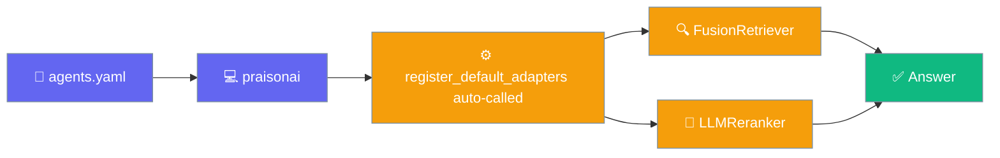
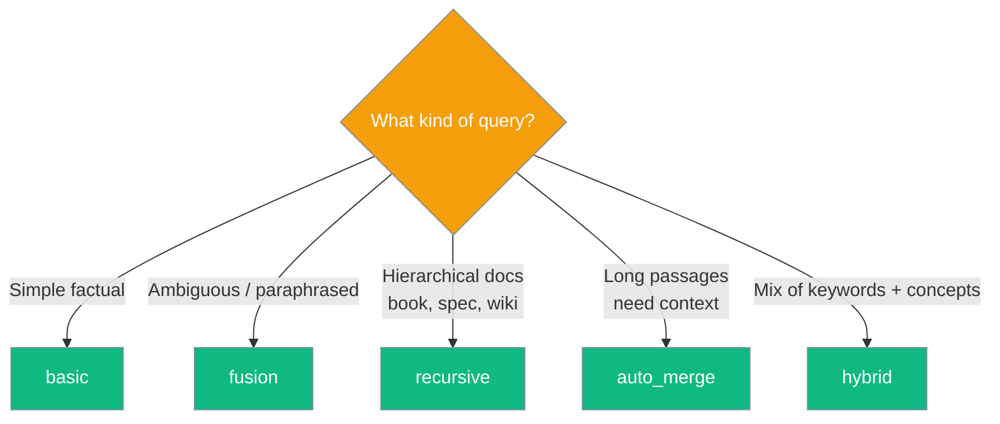
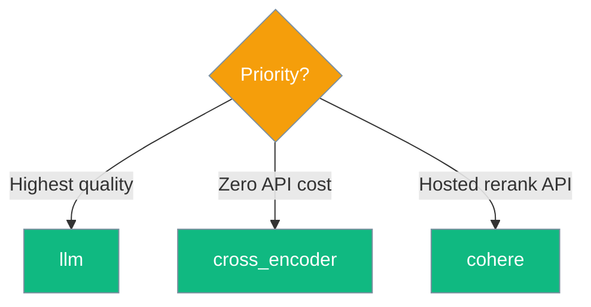

Declare a retriever and reranker by name in your agent YAML and PraisonAI wires them into the knowledge base for you.



## Quick Start

<Steps>
<Step title="Declare the retriever and reranker">
```yaml
# agents.yaml
framework: praisonai
process: sequential
topic: "Answer questions from the docs"

agents:
  researcher:
    role: "Research assistant"
    goal: "Answer questions with the highest-quality retrieved passages"
    instructions: "Expert at finding the exact snippet a user needs."
    knowledge:
      sources: ["./docs/"]
      retriever: fusion       # basic | fusion | recursive | auto_merge | hybrid
      reranker: llm           # llm | cross_encoder | cohere
      retrieval_k: 20
```
</Step>

<Step title="Run it">
```bash
praisonai agents.yaml
```

No Python setup. The `register_default_adapters()` call happens for you before the agent starts (PraisonAI 4.7.9+).
</Step>
</Steps>

---

## Retriever choices

| Name | When to use | Extra install |
|------|-------------|---------------|
| `basic` | Default — simple vector similarity | None |
| `fusion` | Multiple query variations, then RRF merge — better recall on ambiguous questions | None |
| `recursive` | Depth-limited chunk expansion — better for hierarchical content | None |
| `auto_merge` | Merges adjacent chunks from the same document — better for long passages | None |
| `hybrid` | Vector + keyword combined | None |

## Reranker choices

| Name | When to use | Extra install |
|------|-------------|---------------|
| `llm` | Highest quality — an LLM scores each candidate | `OPENAI_API_KEY` |
| `cross_encoder` | Local neural reranker — no API cost | `pip install sentence-transformers` |
| `cohere` | Cohere's hosted rerank API | `COHERE_API_KEY` |

---

## Choosing a retriever



## Choosing a reranker



---

## From the CLI

Same names, one-off from the `praisonai knowledge query` sub-command:

```bash
praisonai knowledge query "How do I authenticate?" \
  --retrieval fusion \
  --reranker llm
```

See [Knowledge CLI](/cli/knowledge) for the full flag reference.

---

## Best Practices

<AccordionGroup>

<Accordion title="Start with basic, upgrade when recall is low">
Use `basic` first — it needs no LLM calls or extra installs. Move to `fusion` only when ambiguous or paraphrased questions miss the right passage.
</Accordion>

<Accordion title="Retrieve wide, rerank narrow">
Set `retrieval_k` higher than the number of passages you actually want, then let the reranker trim to the best few. A common pairing is `retrieval_k: 20` with an `llm` reranker returning the top 5.
</Accordion>

<Accordion title="Match the reranker to your cost budget">
`cross_encoder` runs locally with no API cost; `llm` is highest quality but bills per candidate; `cohere` is a hosted API. Pick based on whether cost, quality, or zero-dependency matters most.
</Accordion>

<Accordion title="No Python setup needed from YAML">
The wrapper entry points auto-wire the built-in adapters, so a name like `retriever: fusion` resolves without any `register_default_adapters()` call. You only call it yourself when using retriever/reranker classes directly from your own Python code.
</Accordion>

<Accordion title="Safe in multi-agent setups">
The retriever and reranker registries are thread-safe. If you're running many agents in parallel (native threads, asyncio, or a worker pool), they all share the same registry safely — no external locks needed, and no duplicate singletons on startup races. Since PraisonAI [#5197](https://github.com/MervinPraison/PraisonAI/pull/5197).
</Accordion>

</AccordionGroup>

---

## Related

<CardGroup cols={2}>
  <Card title="Retrieval from Python" icon="magnifying-glass" href="/rag/retrieval">
    Configure retrieval from Python
  </Card>
  <Card title="Adapter registry" icon="plug" href="/sdk/praisonai/adapters">
    How the adapter registry works
  </Card>
</CardGroup>
