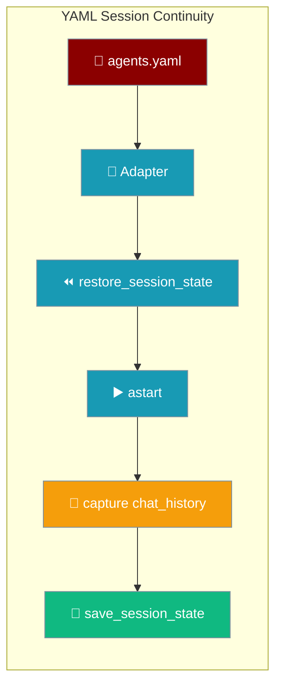

`praisonai run agents.yaml --continue` resumes a whole team exactly where it left off — prior turns and per-agent chat history replay before your new prompt.

```bash
# First run
praisonai run agents.yaml

# Come back tomorrow — team continues where it left off
praisonai run agents.yaml --continue
```



## Quick Start

<Steps>
<Step title="Run your team once">

```bash
praisonai run agents.yaml
```

The run auto-saves to a project-scoped session — no `memory: true` needed in your YAML.
</Step>

<Step title="Continue the team later">

```bash
praisonai run agents.yaml --continue
```

The most recent root session for this project resumes; each agent's prior findings replay before your new prompt.
</Step>
</Steps>

---

## How It Works

The adapter resolves the session, restores team state and per-agent chat history, runs `astart()`, then captures fresh history back into state on save.

```mermaid
sequenceDiagram
    participant User
    participant Adapter
    participant Team as AgentTeam
    participant Store as Session store

    User->>Adapter: praisonai run agents.yaml --continue
    Adapter->>Store: resolve session id
    Adapter->>Team: restore_session_state(id)
    Team->>Team: rehydrate per-agent chat_history (deduped)
    Adapter->>Team: astart()
    Team-->>Adapter: result
    Adapter->>Team: capture chat_history into state
    Adapter->>Store: save_session_state(id)
    Adapter-->>User: response

    classDef actor fill:#8B0000,stroke:#7C90A0,color:#fff
    classDef process fill:#189AB4,stroke:#7C90A0,color:#fff
    classDef result fill:#10B981,stroke:#7C90A0,color:#fff

    class User,Adapter actor
    class Team process
    class Store result
```

YAML/team runs go through the same core APIs as single-agent runs — `AgentTeam.restore_session_state` and `AgentTeam.save_session_state`. No new params, no YAML changes.

| Behavior | Detail |
|---|---|
| Chat history rides along with state | Per-agent history is stashed under the reserved state key `_cli_session_chat_history` so the existing save/restore machinery persists conversation with no new core APIs |
| Shared memory auto-enabled | The team is built with `memory=True` whenever a session is active, so `save_session_state` / `restore_session_state` have the backend they need |
| Rehydrate is deduplicated | Restore skips messages already present on an agent (matched on `(role, content)`), so a resume or fork never doubles prior turns |
| Save never fails a completed run | If save raises after kickoff, it is logged as a warning and the successful result is still returned |
| Opt-in via project sessions | Flags take effect only when the CLI has opted into project sessions — set automatically by `run` / `chat` / `code` when a session flag is present |

---

## Configuration Options

| Flag | Description |
|------|-------------|
| `--continue` | Resume the most recent root session for this project |
| `--session <id>` | Resume a specific session — merges saved team state and re-injects each agent's chat history |
| `--fork --session <id>` | Fork a session via the hierarchical store; history is copied into the fork, deduplicated on `(role, content)` |
| `--no-save` | One-off team run — nothing is persisted after kickoff |

<CardGroup cols={2}>
<Card title="restore_session_state" icon="code" href="/docs/sdk/reference/praisonaiagents/functions/AgentTeam-restore_session_state">
  Core API that rehydrates team state on resume
</Card>
<Card title="save_session_state" icon="code" href="/docs/sdk/reference/praisonaiagents/functions/AgentTeam-save_session_state">
  Core API that persists team state after kickoff
</Card>
</CardGroup>

---

## What Gets Persisted

Team state, per-agent chat history, and shared memory all survive a resume.

| Layer | Persisted | Restored |
|---|---|---|
| `team._state` (task outputs, workflow bookkeeping) | ✅ | ✅ |
| Per-agent `chat_history` (LLM-visible turns) | ✅ (stashed under `_cli_session_chat_history`) | ✅ (deduplicated on `(role, content)`) |
| `shared_memory` (short/long-term memory backend) | ✅ (auto-enabled) | ✅ |

What does **not** persist: running tool subprocesses, in-flight streaming state, InteractiveRuntime (ACP/LSP) sessions, and ephemeral in-memory tool caches.

---

## User Interaction Flow

A research team YAML runs Monday and continues Wednesday with every agent's prior findings intact.

```bash
# Monday — kick off the research team
praisonai run research-team.yaml

# Wednesday — continue; each agent's Monday findings replay first
praisonai run research-team.yaml --continue
```

On Wednesday the adapter resolves Monday's session, restores `team._state`, re-injects each agent's captured chat history, then runs the new prompt — the researcher, analyst, and writer all pick up their earlier context.

---

## Common Patterns

Resume yesterday's team run:

```bash
praisonai run agents.yaml --continue
```

Use an explicit named session:

```bash
praisonai run agents.yaml --session release-checklist-v4
```

Fork to try a variation without touching the main thread:

```bash
praisonai run agents.yaml --fork --session release-checklist-v4
```

Throwaway run for PII-sensitive input:

```bash
praisonai run agents.yaml --no-save
```

---

## Best Practices

<AccordionGroup>
<Accordion title="Run from the project root">
Git-remote / root-commit identity resolves consistently from the repo root, so `--continue` always finds the right session.
</Accordion>

<Accordion title="Fork before risky refactors">
`--fork --session <id>` branches the thread — the parent session is left untouched while you try a variation.
</Accordion>

<Accordion title="Use --no-save for one-off exploration">
Nothing hits disk after kickoff, so PII-sensitive or throwaway prompts leave no session trail.
</Accordion>

<Accordion title="Skip memory: true in agents.yaml">
Session continuity opts the team into shared memory automatically — you do not need to add `memory: true` for resume to work.
</Accordion>
</AccordionGroup>

---

## Related

<CardGroup cols={2}>
<Card title="Project Sessions" icon="folder-tree" href="/docs/features/project-sessions">
  How project identity and the session store resolve `--continue`
</Card>
<Card title="Run Command" icon="play" href="/docs/cli/run">
  Full `praisonai run` reference with session flags
</Card>
<Card title="Run Stream Events" icon="rss" href="/docs/features/run-stream-events">
  Stream YAML / team runs as per-agent NDJSON with `--output stream-json`
</Card>
</CardGroup>
