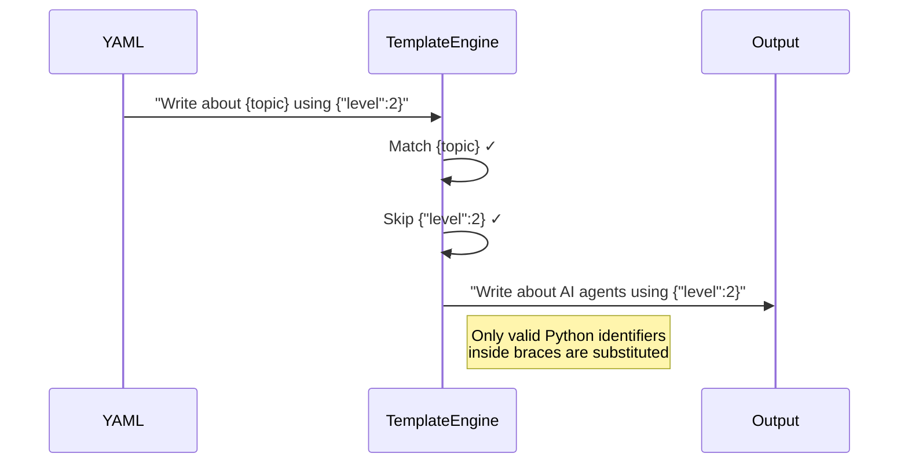

```python
from praisonaiagents import Agent

agent = Agent(name="writer", instructions="Write about {topic} in {style} style.")
agent.start("Write a blog post", topic="AI agents", style="casual")
```

The user passes runtime values; `{topic}` and similar placeholders expand in YAML strings while JSON literals stay intact.

```mermaid
graph LR
    subgraph "Brace-Safe Template System"
        A[📄 YAML String] --> B[🔍 Brace-safe substitutor]
        B --> C[✅ Final Prompt]
    end
    
    subgraph "Processing"
        D["{topic}"] --> E["replaced with input"]
        F["{\"key\":\"value\"}"] --> G["preserved as-is"]
    end
    
    classDef input fill:#6366F1,stroke:#7C90A0,color:#fff
    classDef process fill:#F59E0B,stroke:#7C90A0,color:#fff
    classDef output fill:#10B981,stroke:#7C90A0,color:#fff
    classDef preserve fill:#189AB4,stroke:#7C90A0,color:#fff
    
    class A input
    class B process
    class C output
    class D,F input
    class E preserve
    class G preserve
```

## Quick Start

<Steps>
<Step title="Basic Template Substitution">
Create an `agents.yaml` with a simple `{topic}` placeholder:

```yaml
roles:
  writer:
    role: Content writer for {topic}
    goal: Create engaging content about {topic}
    backstory: You are an expert writer specializing in {topic}.
    
    tasks:
      write_article:
        description: Write about {topic}
        expected_output: A comprehensive article about {topic}
```

Run with: `praisonai "AI agents"`
</Step>

<Step title="JSON Literals + Variables Together">
Mix JSON examples in backstory with `{topic}` placeholders safely:

```yaml
roles:
  writer:
    role: Technical writer for {topic}
    backstory: |
      You write WordPress posts about {topic}. Use blocks like
      <!-- wp:heading {"level":2} --> and return JSON like
      {"status":"ok"} when asked. Focus on {topic} exclusively.
    goal: Produce an article about {topic}.
    
    tasks:
      technical_post:
        description: Write a technical post about {topic} with code examples
        expected_output: |
          Markdown post about {topic} including:
          - Code blocks with {"config": "examples"}
          - JSON snippets like {"result": true}
          - Clear focus on {topic}
```

Both `{topic}` and the JSON literals work correctly.
</Step>
</Steps>

---

## How It Works

The template system uses a precise regex pattern to identify which braces to substitute:

**Pattern:** `\{([a-zA-Z_][a-zA-Z0-9_]*)\}` — only Python-identifier-shaped placeholders are touched.

| Will Substitute | Won't Substitute |
|----------------|------------------|
| `{topic}` | `{"key":"value"}` |
| `{user_input}` | `{1,2,3}` |
| `{task_name}` | `{}` |
| `{model_config}` | `{ spaced }` |



## Where It Applies

The brace-safe substitutor processes these YAML fields:

| Field | Description | Example |
|-------|-------------|---------|
| `role` | Agent role definition | `"Expert in {topic}"` |
| `goal` | Agent objective | `"Research {topic} thoroughly"` |
| `backstory` | Agent background | `"You specialize in {topic}"` |
| `description` | Task description | `"Analyze {topic} data"` |
| `expected_output` | Expected result | `"Report on {topic} findings"` |

**Available variables:**
- `{topic}` — main input from CLI or Python API
- Any other keys passed via `kwargs` in the Python API

---

## Common Patterns

### WordPress/Gutenberg Blocks

```yaml
roles:
  content_creator:
    backstory: |
      You create WordPress content about {topic}. Use Gutenberg blocks:
      <!-- wp:heading {"level":2} -->
      <!-- wp:paragraph -->
      Return structured data like {"publish": true, "category": "tech"}.
```

### API Response Examples

```yaml
roles:
  api_designer:
    goal: Design APIs for {topic}
    backstory: |
      You design REST APIs about {topic}. Example responses:
      {"data": [...], "status": "success", "topic": "{topic}"}
      Always focus on {topic}-related endpoints.
```

### Configuration Snippets

```yaml
roles:
  devops:
    role: DevOps engineer for {topic}
    tasks:
      deploy_config:
        description: |
          Create deployment config for {topic} service.
          Use JSON like {"env": "prod", "replicas": 3}.
        expected_output: |
          YAML deployment manifest for {topic} with:
          {"resources": {"limits": {"cpu": "500m"}}}
```

---

<Note>
**Migration note:** Before the latest release, YAML strings with literal `{...}` could silently leave `{topic}` unsubstituted. Now they work as expected — no YAML changes required.
</Note>

## Best Practices

<AccordionGroup>
<Accordion title="Use {topic} as the canonical input placeholder">
Stick to `{topic}` for the main input variable — it's the standard CLI/API parameter:

```yaml
roles:
  analyst:
    role: Data analyst for {topic}
    goal: Analyze {topic} comprehensively
    # Clear, consistent naming
```
</Accordion>

<Accordion title="Write literal JSON naturally">
No escaping needed for JSON examples in prompts:

```yaml
roles:
  developer:
    backstory: |
      You write APIs that return {"success": true, "data": [...]} 
      and handle errors like {"error": "not found", "code": 404}.
      Focus on {topic} implementations.
```
</Accordion>

<Accordion title="Pass extra variables via Python API">
For variables beyond `{topic}`, use the Python API:

```python
from praisonai import PraisonAI

# Custom variables in addition to {topic}
ai = PraisonAI(agent_file="agents.yaml")
result = ai.run(
    topic="machine learning",
    style="academic",
    deadline="next week"
)
```

Then use `{style}` and `{deadline}` in your YAML.
</Accordion>
</AccordionGroup>

---

## Related

<CardGroup cols={2}>
<Card title="Async Crew Kickoff" icon="play" href="/docs/features/async-crew-kickoff">
  Native async execution with template substitution
</Card>
<Card title="Agent Configuration" icon="robot" href="/docs/features/agent-profiles">
  Complete guide to agent YAML structure
</Card>
<Card title="Workflow Input Resolution" icon="arrow-right-to-bracket" href="/docs/features/yaml-workflows#workflow-input-resolution">
  How the YAML `input:` field fills `{{input}}` and its CLI precedence
</Card>
</CardGroup>