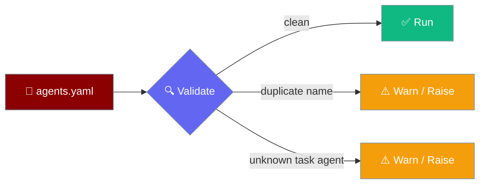
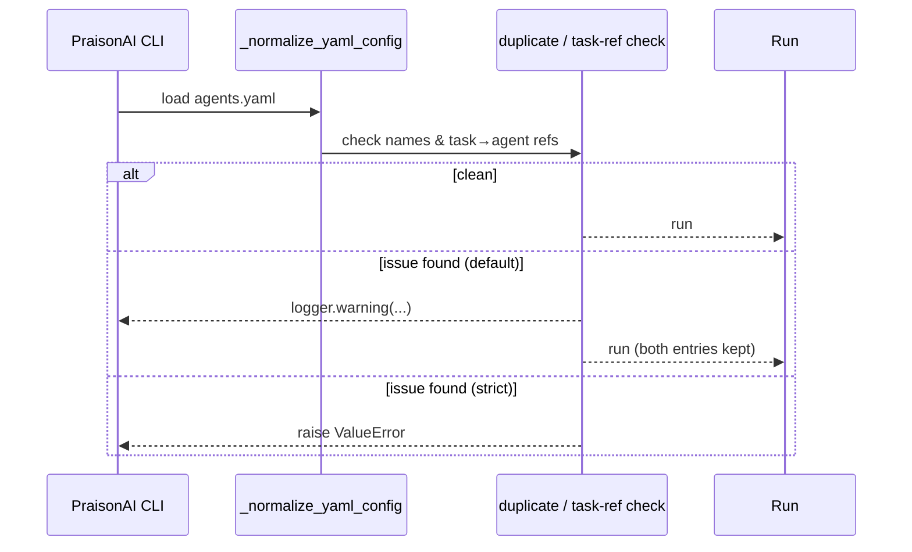
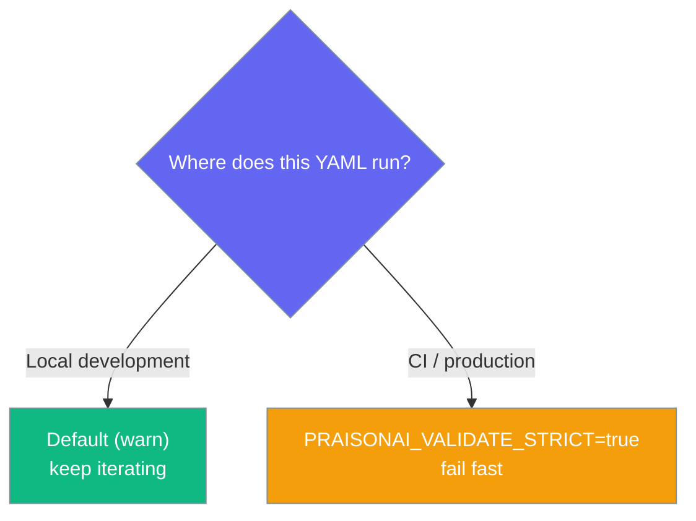

Duplicate agent names or a typo in `task.agent` used to collapse your YAML silently — a 3-agent config could run as 1. Now you get a warning by default, and an exception under `PRAISONAI_VALIDATE_STRICT=true`.



### Why this exists

Before this validation existed, a YAML with a duplicate `name: researcher` on two agents ran as *one* agent — the second silently overwrote the first via a dict-merge collapse. A task typo like `agent: reseacher` (missing an `r`) skipped the task with no message. Both problems look like a broken run with no clear cause.

`PRAISONAI_VALIDATE_STRICT=true` turns those silent collapses into loud failures. In CI, prefer strict. In development, the default warning gives you the same hint without stopping the session.

<Note>
**Backward compatible.** The default stays non-strict — validation issues warn, they don't raise. Set `PRAISONAI_VALIDATE_STRICT=true` to make them raise `ValueError` instead.
</Note>

## Quick Start

<Steps>
<Step title="Default (warn)">

A duplicate `name:` no longer overwrites the first agent — both are kept under suffixed keys and you get a warning.

```yaml
agents:
  - name: researcher
    instructions: "Research the topic"
  - name: researcher
    instructions: "Different researcher, same name"
```

```
WARNING  Duplicate agent name(s) in YAML: ['researcher'] — kept both by suffixing keys; rename to silence.
```

Both entries survive; the colliding one is preserved under `researcher__dup_1` (0-based list index).

</Step>

<Step title="Strict (CI)">

Turn the warning into a hard failure so CI catches the config before an agent starts.

```bash
export PRAISONAI_VALIDATE_STRICT=true
```

```python
ValueError: Duplicate agent name(s) in YAML: ['researcher']
```

</Step>

<Step title="Unknown task agent">

A task whose `agent:` doesn't match any defined agent warns by default, raises under strict.

```yaml
agents:
  - name: researcher
    instructions: "Research the topic"

tasks:
  - name: draft_report
    agent: reseacher   # typo: missing an 'r'
    description: "Draft the report"
```

```
WARNING  Task 'draft_report' references unknown agent 'reseacher'; skipping.
```

Under `PRAISONAI_VALIDATE_STRICT=true`:

```python
ValueError: Task 'draft_report' references unknown agent 'reseacher'; skipping.
```

</Step>
</Steps>

---

## How It Works



| Check | Trigger | Default | `PRAISONAI_VALIDATE_STRICT=true` |
|-------|---------|---------|----------------------------------|
| Duplicate agent name | Same `name:` in `agents:` list | Warn + keep both via `__dup_i` | Raise `ValueError` |
| Duplicate role name | Same `name:` in `roles:` list | Warn + keep both via `__dup_i` | Raise `ValueError` |
| Unknown task agent | `task.agent` matches no agent | Warn + skip task | Raise `ValueError` |

When both `roles:` and `agents:` are present, `roles:` wins for task→agent resolution.

---

## Choosing a mode



---

## Configuration

`PRAISONAI_VALIDATE_STRICT` controls whether validation issues warn or raise.

| Variable | Values | Effect |
|----------|--------|--------|
| `PRAISONAI_VALIDATE_STRICT` | `"true"` (case-insensitive) → strict; **anything else** (unset, `"1"`, `"yes"`, `"on"`, `""`) → non-strict | Under strict, YAML validation issues **raise `ValueError`** instead of warning. Default is non-strict. |

<Warning>
**Only the literal string `"true"` (case-insensitive) enables strict mode.** `PRAISONAI_VALIDATE_STRICT=1`, `=yes`, and `=on` are treated as **non-strict** — the check is `os.getenv("PRAISONAI_VALIDATE_STRICT", "false").lower() == "true"`. Set it to `true`, not `1`, or nothing will change.
</Warning>

```bash
# Strict — raise on any validation issue
export PRAISONAI_VALIDATE_STRICT=true

# Non-strict (default) — warn only. These all count as non-strict:
export PRAISONAI_VALIDATE_STRICT=1     # ⚠️ still non-strict
export PRAISONAI_VALIDATE_STRICT=yes   # ⚠️ still non-strict
unset PRAISONAI_VALIDATE_STRICT        # non-strict
```

### Duplicate-preserved key naming

Under the default (warn) mode, colliding entries are kept — not dropped. The duplicate is stored under a suffixed key so both survive:

```
{name}__dup_{i}
```

`i` is the 0-based list index of the colliding entry. A second agent named `researcher` at list index 1 becomes `researcher__dup_1`.

### Grep-friendly messages

Copy these into your CI log filters:

```
Duplicate agent name(s) in YAML: ['researcher'] — kept both by suffixing keys; rename to silence.
Task 'draft_report' references unknown agent 'reseacher'; skipping.
```

Under `PRAISONAI_VALIDATE_STRICT=true` the same conditions raise:

```
ValueError: Duplicate agent name(s) in YAML: ['researcher']
ValueError: Task 'draft_report' references unknown agent 'reseacher'; skipping.
```

---

## Best Practices

<AccordionGroup>
<Accordion title="Turn on strict mode in CI">
Set `PRAISONAI_VALIDATE_STRICT=true` in your CI environment so a duplicate name or a task typo fails the pipeline instead of silently degrading a run. Keep the default (warn) locally so quick experiments aren't blocked.
</Accordion>

<Accordion title="Set true, not 1">
This variable only recognises the literal string `"true"` (case-insensitive). `PRAISONAI_VALIDATE_STRICT=1` looks enabled but behaves as non-strict. Always use `=true`.
</Accordion>

<Accordion title="Rename duplicates instead of relying on the suffix">
The `__dup_i` suffix keeps both entries so nothing is silently lost, but a name collision is almost always a mistake. Rename the second agent to silence the warning and make the config unambiguous.
</Accordion>

<Accordion title="Fix task→agent typos at the source">
An unknown `agent:` on a task means that task never runs. Match the `agent:` value exactly to a defined agent name — under strict mode the run stops until you do.
</Accordion>
</AccordionGroup>

---

## Related

<CardGroup cols={2}>
<Card title="Tool Timeouts" icon="stopwatch" href="/docs/features/tool-timeout">
  The other silent-collapse fix: per-agent `tool_timeout` now uses the tightest value
</Card>
<Card title="Workflow Validation Loop" icon="rotate" href="/docs/features/workflow-validation">
  Validate inputs and outputs with retry feedback
</Card>
<Card title="YAML Configuration Reference" icon="file-code" href="/docs/features/yaml-configuration-reference">
  Every field for agents, tasks, and workflows
</Card>
<Card title="Skill Manage" icon="wand-magic-sparkles" href="/docs/features/skill-manage">
  Nested skill file paths and the path safety prefilter
</Card>
</CardGroup>
