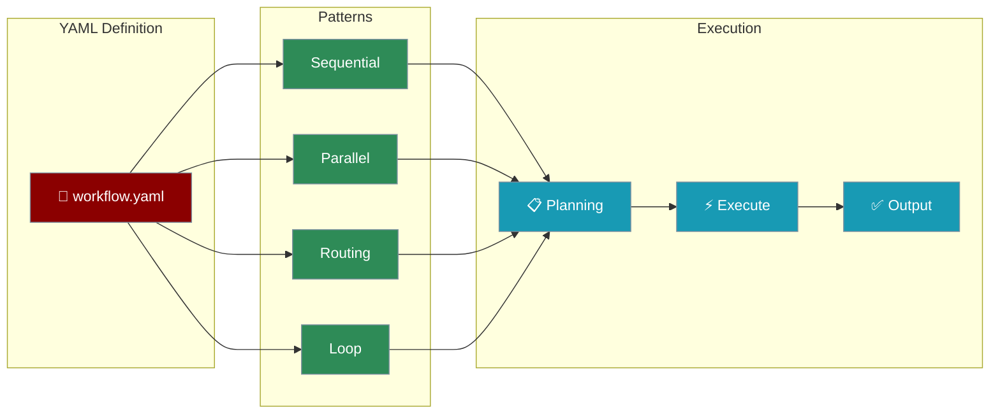

# YAML Workflows

Define complex multi-agent workflows in YAML files with support for advanced patterns like routing, parallel execution, loops, and more.



## Field Names Reference (A-I-G-S)

PraisonAI accepts both old (agents.yaml) and new (workflow.yaml) field names. Use the **canonical names** for new projects:

| Canonical (Recommended) | Alias (Also Works) | Purpose |
|-------------------------|-------------------|---------|
| `agents` | `roles` | Define agent personas |
| `instructions` | `backstory` | Agent behavior/persona |
| `action` | `description` | What the step does |
| `steps` | `tasks` (nested) | Define work items |
| `name` | `topic` | Workflow identifier |

**A-I-G-S Mnemonic** - Easy to remember:
- **A**gents - Who does the work
- **I**nstructions - How they behave  
- **G**oal - What they achieve
- **S**teps - What they do

```yaml
# Quick Reference - Canonical Format
name: My Workflow              # Workflow name (not 'topic')
agents:                        # Define agents (not 'roles')
  my_agent:
    role: Job Title            # Agent's role
    goal: What to achieve      # Agent's goal
    instructions: How to act   # Agent's behavior (not 'backstory')
    
steps:                         # Define steps (not 'tasks')
  - agent: my_agent
    action: What to do         # Step action (not 'description')
```

<Note>
The parser accepts both old and new names. Run `praisonai workflow validate <file.yaml>` to see suggestions for canonical names.
</Note>

## Feature Parity

Both `agents.yaml` and `workflow.yaml` now support the same features:

| Feature | agents.yaml | workflow.yaml |
|---------|:-----------:|:-------------:|
| Workflow patterns (route, parallel, loop, repeat) | ✅ | ✅ |
| All agent fields | ✅ | ✅ |
| All step/task fields | ✅ | ✅ |
| Framework support (praisonai, crewai, autogen) | ✅ | ✅ |
| Process types (sequential, hierarchical, workflow) | ✅ | ✅ |
| Planning & Reasoning | ✅ | ✅ |

## Quick Start

<CodeGroup>
```bash CLI
# Run a YAML workflow
praisonai workflow run research.yaml

# Run with variables
praisonai workflow run research.yaml --var topic="AI trends"

# Validate a workflow
praisonai workflow validate research.yaml

# Create from template
praisonai workflow template routing --output my_workflow.yaml

# Auto-generate a workflow
praisonai workflow auto "Research AI trends" --pattern parallel
```

```python Python
from praisonaiagents.workflows import YAMLWorkflowParser, WorkflowManager

# Option 1: Parse and execute
parser = YAMLWorkflowParser()
workflow = parser.parse_file("research.yaml")
result = workflow.start("Research AI trends")

# Option 2: Use WorkflowManager
manager = WorkflowManager()
result = manager.execute_yaml(
    "research.yaml",
    input_data="Research AI trends",
    variables={"topic": "Machine Learning"}
)
```
</CodeGroup>

## Complete workflow.yaml Reference

```yaml
# workflow.yaml - Full feature reference
name: Complete Workflow
description: Demonstrates all workflow.yaml features
framework: praisonai  # praisonai, crewai, autogen
process: workflow     # sequential, hierarchical, workflow

workflow:
  planning: true
  planning_llm: gpt-4o
  reasoning: true
  verbose: true
  memory_config:
    provider: chroma
    persist: true

variables:
  topic: AI trends
  items: [ML, NLP, Vision]

agents:
  researcher:
    name: Researcher
    role: Research Analyst
    goal: Research topics thoroughly
    instructions: "Provide detailed research findings"
    instructions:  # Canonical: use 'instructions' instead of 'backstory' "Expert researcher with 10 years experience"  # alias for instructions
    llm: gpt-4o-mini
    function_calling_llm: gpt-4o      # For tool calls
    max_rpm: 10                        # Rate limiting
    max_execution_time: 300            # Timeout in seconds
    reflect_llm: gpt-4o               # For self-reflection
    min_reflect: 1
    max_reflect: 3
    system_template: "You are a helpful assistant"
    tools:
      - tavily_search

  writer:
    name: Writer
    role: Content Writer
    goal: Write clear content
    instructions: "Write engaging content"

steps:
  - name: research_step
    agent: researcher
    action: "Research {{topic}}"
    expected_output: "Comprehensive research report"
    output_file: "output/research.md"
    create_directory: true
    
  - name: writing_step
    agent: writer
    action: "Write article based on research"
    context:                          # Task dependencies
      - research_step
    output_json:                      # Structured output
      type: object
      properties:
        title: { type: string }
        content: { type: string }

callbacks:
  on_workflow_start: log_start
  on_step_complete: log_step
  on_workflow_complete: log_complete
```

## Workflow Patterns

### Sequential (Default)

Agents execute one after another, passing context.

```yaml
name: Sequential Workflow
agents:
  researcher:
    name: Researcher
    role: Research Analyst
    goal: Research topics
    instructions: "Provide research findings"
  writer:
    name: Writer
    role: Content Writer
    goal: Write content
    instructions: "Write based on research"

steps:
  - agent: researcher
    action: "Research {{topic}}"
  - agent: writer
    action: "Write summary based on: {{previous_output}}"
```

### Parallel

Multiple agents work concurrently.

```yaml
name: Parallel Workflow
agents:
  market_analyst:
    name: MarketAnalyst
    role: Market Researcher
    goal: Research market trends
    instructions: "Provide market insights"
  tech_analyst:
    name: TechAnalyst
    role: Technology Researcher
    goal: Research technology
    instructions: "Provide tech insights"
  aggregator:
    name: Aggregator
    role: Synthesizer
    goal: Combine findings
    instructions: "Synthesize all research"

steps:
  - name: parallel_research
    parallel:
      - agent: market_analyst
        action: "Research market trends for {{topic}}"
      - agent: tech_analyst
        action: "Research technology trends for {{topic}}"
  - agent: aggregator
    action: "Combine all findings into a report"
```

### Routing

Classifier routes to specialized agents.

```yaml
name: Routing Workflow
agents:
  classifier:
    name: Classifier
    role: Request Classifier
    goal: Classify requests
    instructions: "Respond with ONLY: 'technical', 'creative', or 'general'"
  tech_expert:
    name: TechExpert
    role: Technical Expert
    goal: Handle technical questions
    instructions: "Provide technical answers"
  creative_expert:
    name: CreativeExpert
    role: Creative Expert
    goal: Handle creative requests
    instructions: "Provide creative responses"

steps:
  - agent: classifier
    action: "Classify: {{input}}"
  - name: routing
    route:
      technical: [tech_expert]
      creative: [creative_expert]
      default: [tech_expert]
```

### Loop

Iterate over a list of items.

```yaml
name: Loop Workflow
variables:
  topics:
    - Machine Learning
    - Natural Language Processing
    - Computer Vision

agents:
  researcher:
    name: Researcher
    role: Research Analyst
    goal: Research topics
    instructions: "Provide brief research on each topic"

steps:
  - agent: researcher
    action: "Research {{item}}"
    loop:
      over: topics
```

### Repeat (Evaluator-Optimizer)

Repeat until a condition is met.

```yaml
name: Repeat Workflow
agents:
  writer:
    name: Writer
    role: Content Writer
    goal: Write high-quality content
    instructions: "Write and improve content"
  evaluator:
    name: Evaluator
    role: Quality Checker
    goal: Evaluate content quality
    instructions: "Rate content 1-10. Say 'approved' if >= 8"

steps:
  - agent: writer
    action: "Write article about {{topic}}"
    repeat:
      until: "approved"
      max_iterations: 3
```

## Extended agents.yaml

Use workflow patterns in agents.yaml with `process: workflow`:

```yaml
# agents.yaml with workflow patterns
framework: praisonai
process: workflow  # Enables workflow mode
topic: "Research AI trends"

workflow:
  planning: true
  reasoning: true
  verbose: true

agents:  # Canonical: use 'agents' instead of 'roles'
  classifier:
    role: Request Classifier
    instructions:  # Canonical: use 'instructions' instead of 'backstory' "Classify requests into categories"
    goal: Classify requests
    
  researcher:
    role: Research Analyst
    instructions:  # Canonical: use 'instructions' instead of 'backstory' "Expert researcher"
    goal: Research topics
    tools:
      - tavily_search

steps:
  - agent: classifier
    action: "Classify: {{topic}}"
    
  - name: routing
    route:
      technical: [tech_expert]
      default: [researcher]
      
  - name: parallel_research
    parallel:
      - agent: researcher
        action: "Research market trends"
      - agent: researcher
        action: "Research competitors"
```

Run with:
```bash
praisonai agents.yaml
```

## Auto-Generate Workflows

Generate workflows automatically from a topic description:

```bash
# Sequential workflow (default)
praisonai workflow auto "Research AI trends"

# Parallel workflow
praisonai workflow auto "Research AI trends" --pattern parallel

# Routing workflow
praisonai workflow auto "Build a chatbot" --pattern routing

# Specify output file
praisonai workflow auto "Research AI" --output my_workflow.yaml
```

## CLI Commands

| Command | Description |
|---------|-------------|
| `praisonai workflow run <file.yaml>` | Run a YAML workflow |
| `praisonai workflow run <file.yaml> --var key=value` | Run with variables |
| `praisonai workflow validate <file.yaml>` | Validate a workflow |
| `praisonai workflow template <name>` | Create from template |
| `praisonai workflow auto "topic"` | Auto-generate workflow |
| `praisonai workflow list` | List workflows |
| `praisonai workflow help` | Show help |

## CLI Options

| Flag | Description |
|------|-------------|
| `--var key=value` | Set variable for YAML workflows |
| `--pattern <pattern>` | Pattern for auto-generation (sequential, parallel, routing, loop) |
| `--output <file>` | Output file for auto-generation |
| `--planning` | Enable planning mode |
| `--reasoning` | Enable reasoning mode |
| `--verbose` | Enable verbose output |
| `--save` | Save output to file |

## Progress Indicators

When running workflows, you'll see clear progress indicators:

```
Running YAML workflow: research.yaml
 Workflow: Research Workflow  
┏━━━━━━━━━━━┳━━━━━━━┓
┃ Property  ┃ Value ┃
┡━━━━━━━━━━━╇━━━━━━━┩
│ Steps     │ 3     │
│ Planning  │ True  │
│ Reasoning │ False │
└───────────┴───────┘

Executing workflow...

📋 Execution Plan: [plan description]
⚡ Running 2 steps in parallel...
✅ Parallel complete: 2 results
🔀 Routing to: technical
✅ AgentName: [output preview]

✅ Workflow completed successfully!
```

## Debug Mode

Enable debug logging to see detailed execution:

```bash
LOGLEVEL=debug praisonai workflow run research.yaml
```

This shows:
- Agent parameters (prompt, temperature, tools)
- Messages sent to LLM
- HTTP requests to API
- Full agent/role/goal context
