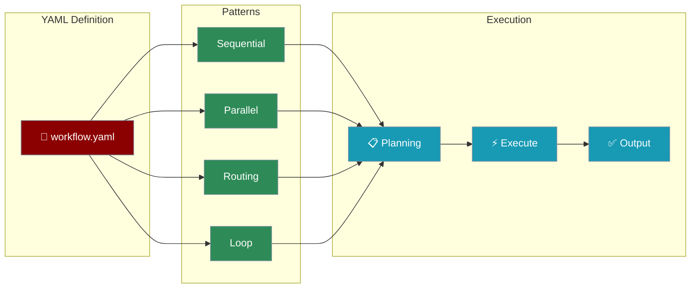

Define complex multi-agent workflows in YAML files with support for advanced patterns like routing, parallel execution, loops, and more.


```mermaid
graph LR
    subgraph "YAML Definition"
        YAML["📄 workflow.yaml"]
    end
    
    subgraph "Patterns"
        SEQ["Sequential"]
        PAR["Parallel"]
        ROUTE["Routing"]
        LOOP["Loop"]
    end
    
    subgraph "Execution"
        PLAN["📋 Planning"]
        EXEC["⚡ Execute"]
        OUT["✅ Output"]
    end
    
    YAML --> SEQ
    YAML --> PAR
    YAML --> ROUTE
    YAML --> LOOP
    SEQ --> PLAN
    PAR --> PLAN
    ROUTE --> PLAN
    LOOP --> PLAN
    PLAN --> EXEC
    EXEC --> OUT
    
    classDef yaml fill:#8B0000,stroke:#7C90A0,color:#fff
    classDef pattern fill:#2E8B57,stroke:#7C90A0,color:#fff
    classDef exec fill:#189AB4,stroke:#7C90A0,color:#fff
    
    class YAML yaml
    class SEQ,PAR,ROUTE,LOOP pattern
    class PLAN,EXEC,OUT exec
```

## Minimum Required Fields

The absolute minimum to run a workflow:

```yaml
agents:
  my_agent:
    role: Assistant        # Required: Agent's job title

steps:
  - agent: my_agent        # Required: Which agent executes
```

**Practical minimum** (recommended):

```yaml
name: My Workflow
input: "Your input here"   # The data passed INTO the workflow (accessed via {{input}})

agents:
  my_agent:
    role: Assistant
    goal: Help with the task
    instructions: "You are a helpful assistant"

steps:
  - agent: my_agent
    action: "Process this: {{input}}"
```

| Field | Required | Default | Description |
|-------|:--------:|---------|-------------|
| `agents` | ✅ | - | At least one agent definition |
| `agents.*.role` | ✅ | - | Agent's job title |
| `steps` | ✅ | - | At least one step |
| `steps.*.agent` | ✅ | - | Agent to execute the step |
| `name` | ❌ | "Workflow" | Workflow identifier |
| `input` | ❌ | "" | Data passed INTO the workflow (accessed via `{{input}}`) |
| `goal` | ❌ | "Complete the task" | Agent's objective |
| `instructions` | ❌ | Generic | Agent behavior/persona |
| `action` | ❌ | `{{input}}` | What the step does |

<Note>
**`input` vs `topic`**: Use `input` (canonical) for clarity. `topic` still works for backward compatibility but `input` better conveys that this is the data going INTO your workflow.
</Note>

<Tip>
**Action templating** — every `action` string supports three placeholders, processed in order:
1. `{{your_variable}}` — replaced with values from `variables:` or earlier `output_variable` fields.
2. `{{previous_output}}` — replaced in place **or auto-appended** as `"Context from previous step: …"` if the token is absent and a previous output exists.
3. `{{input}}` — replaced with the top-level `input:` value, available in every step.

For the full substitution order, auto-append rules, and examples, see [How Action Templating Works](/features/workflows#how-action-templating-works).
</Tip>

## Field Names Reference (A-I-G-S)

PraisonAI accepts both old (agents.yaml) and new (workflow.yaml) field names. Use the **canonical names** for new projects:

| Canonical (Recommended) | Alias (Also Works) | Purpose |
|-------------------------|-------------------|---------|
| `agents` | `roles` | Define agent personas |
| `instructions` | `backstory` | Agent behavior/persona |
| `action` | `description` | What the step does |
| `steps` | `tasks` (nested) | Define work items |
| `name` | - | Workflow identifier |
| `input` | `topic` | Data passed INTO the workflow |

**A-I-G-S Mnemonic** - Easy to remember:
- **A**gents - Who does the work
- **I**nstructions - How they behave  
- **G**oal - What they achieve
- **S**teps - What they do

```yaml
# Quick Reference - Canonical Format
name: My Workflow              # Workflow name
input: What to process         # Data going INTO the workflow (not 'topic')
agents:                        # Define agents (not 'roles')
  my_agent:
    role: Job Title            # Agent's role
    goal: What to achieve      # Agent's goal
    instructions: How to act   # Agent's behavior (not 'backstory')
    
steps:                         # Define steps (not 'tasks')
  - agent: my_agent
    action: "Process: {{input}}"  # Step action (not 'description')
```

<Note>
The parser accepts both old and new names. Run `praisonai workflow validate <file.yaml>` to see suggestions for canonical names.
</Note>

## Feature Parity

Both `agents.yaml` and `workflow.yaml` now support the same features:

| Feature | agents.yaml | workflow.yaml |
|---------|:-----------:|:-------------:|
| Workflow patterns (route, parallel, loop, repeat) | ✅ | ✅ |
| All agent fields | ✅ | ✅ |
| All step/task fields | ✅ | ✅ |
| Framework support (praisonai, crewai, autogen) | ✅ | ✅ |
| Process types (sequential, hierarchical, workflow) | ✅ | ✅ |
| Planning & Reasoning | ✅ | ✅ |

## Quick Start


<Steps>
<Step title="Simple Usage">
<CodeGroup>
```bash CLI
# Run a YAML workflow
praisonai workflow run research.yaml

# Run with variables
praisonai workflow run research.yaml --var topic="AI trends"

# Validate a workflow
praisonai workflow validate research.yaml

# Create from template
praisonai workflow template routing --output my_workflow.yaml

# Auto-generate a workflow
praisonai workflow auto "Research AI trends" --pattern parallel
```
</Step>

<Step title="With Configuration">
```python Python
from praisonaiagents import YAMLWorkflowParser, WorkflowManager

# Option 1: Parse and execute
parser = YAMLWorkflowParser()
workflow = parser.parse_file("research.yaml")
result = workflow.start("Research AI trends")

# Option 2: Use WorkflowManager
manager = WorkflowManager()
result = manager.execute_yaml(
    "research.yaml",
    input_data="Research AI trends",
    variables={"topic": "Machine Learning"}
)
```

```python Programmatic Usage
# Option 3: AgentsGenerator (auto-detects workflow YAML)
from praisonai.agents_generator import AgentsGenerator

# Sync path
gen = AgentsGenerator(agent_file="research.yaml")
result = gen.generate_crew_and_kickoff()

# Async path (works the same as sync)
import asyncio
async def main():
    gen = AgentsGenerator(agent_file="research.yaml")
    return await gen.agenerate_crew_and_kickoff()

result = asyncio.run(main())
```
</CodeGroup>

<Note>
**Programmatic Routing**: The `AgentsGenerator` wrapper auto-detects workflow YAML and routes to the appropriate engine:

| Discriminator in YAML  | Routed to             |
|------------------------|-----------------------|
| `process: workflow`    | `YAMLWorkflowParser`  |
| `steps:` + `workflow:` | `YAMLWorkflowParser`  |
| `type: job`            | `YAMLWorkflowParser`  |
| `type: hybrid`         | `YAMLWorkflowParser`  |
| *(none of the above)*  | Framework adapter     |

This means calling `AgentsGenerator(agent_file="release.yaml").generate_crew_and_kickoff()` with a job/hybrid YAML now routes correctly to the workflow runner instead of falling through to the framework adapter.
</Note>

<Note>
**Async parity:** `agenerate_crew_and_kickoff()` now initializes observability and adapter setup the same way `generate_crew_and_kickoff()` does — Langfuse / AgentOps traces are wired on both paths.
</Note>
</Step>
</Steps>


## Best Practices

<AccordionGroup>
  <Accordion title="Start simple">
    Enable the feature with a single parameter before adding configuration. Verify it works, then layer in options.
  </Accordion>
  <Accordion title="Use environment variables for secrets">
    Never hardcode API keys or tokens. Use `os.getenv("KEY_NAME")` to read from environment variables.
  </Accordion>
  <Accordion title="Test with minimal examples first">
    Copy the Quick Start example, run it, then extend it. This confirms your environment is set up correctly.
  </Accordion>
  <Accordion title="Check the logs">
    Set `verbose=True` on your agent to see detailed execution logs when debugging unexpected behavior.
  </Accordion>
</AccordionGroup>

## Related

<CardGroup cols={2}>
  <Card title="Features Overview" icon="grid-2" href="/docs/features">
    Browse all PraisonAI features
  </Card>
  <Card title="Quick Start" icon="rocket" href="/docs/introduction">
    Get started with PraisonAI agents
  </Card>
</CardGroup>
