# YAML Workflows

Define complex multi-agent workflows in YAML files with support for advanced patterns like routing, parallel execution, loops, and more.

```mermaid
graph LR
    subgraph "YAML Definition"
        YAML["📄 workflow.yaml"]
    end
    
    subgraph "Patterns"
        SEQ["Sequential"]
        PAR["Parallel"]
        ROUTE["Routing"]
        LOOP["Loop"]
    end
    
    subgraph "Execution"
        PLAN["📋 Planning"]
        EXEC["⚡ Execute"]
        OUT["✅ Output"]
    end
    
    YAML --> SEQ
    YAML --> PAR
    YAML --> ROUTE
    YAML --> LOOP
    SEQ --> PLAN
    PAR --> PLAN
    ROUTE --> PLAN
    LOOP --> PLAN
    PLAN --> EXEC
    EXEC --> OUT
    
    classDef yaml fill:#8B0000,stroke:#7C90A0,color:#fff
    classDef pattern fill:#2E8B57,stroke:#7C90A0,color:#fff
    classDef exec fill:#189AB4,stroke:#7C90A0,color:#fff
    
    class YAML yaml
    class SEQ,PAR,ROUTE,LOOP pattern
    class PLAN,EXEC,OUT exec
```



## Minimum Required Fields

The absolute minimum to run a workflow:

```yaml
agents:
  my_agent:
    role: Assistant        # Required: Agent's job title

steps:
  - agent: my_agent        # Required: Which agent executes
```

**Practical minimum** (recommended):

```yaml
name: My Workflow
input: "Your input here"   # The data passed INTO the workflow (accessed via {{input}})

agents:
  my_agent:
    role: Assistant
    goal: Help with the task
    instructions: "You are a helpful assistant"

steps:
  - agent: my_agent
    action: "Process this: {{input}}"
```

| Field | Required | Default | Description |
|-------|:--------:|---------|-------------|
| `agents` | ✅ | - | At least one agent definition |
| `agents.*.role` | ✅ | - | Agent's job title |
| `steps` | ✅ | - | At least one step |
| `steps.*.agent` | ✅ | - | Agent to execute the step |
| `name` | ❌ | "Workflow" | Workflow identifier |
| `input` | ❌ | "" | Data passed INTO the workflow (accessed via `{{input}}`) |
| `goal` | ❌ | "Complete the task" | Agent's objective |
| `instructions` | ❌ | Generic | Agent behavior/persona |
| `action` | ❌ | `{{input}}` | What the step does |

<Note>
**`input` vs `topic`**: Use `input` (canonical) for clarity. `topic` still works for backward compatibility but `input` better conveys that this is the data going INTO your workflow.
</Note>

<Tip>
Use `{{input}}` to reference the workflow input and `{{previous_output}}` to get the result from the previous step.
</Tip>

## Field Names Reference (A-I-G-S)

PraisonAI accepts both old (agents.yaml) and new (workflow.yaml) field names. Use the **canonical names** for new projects:

| Canonical (Recommended) | Alias (Also Works) | Purpose |
|-------------------------|-------------------|---------|
| `agents` | `roles` | Define agent personas |
| `instructions` | `backstory` | Agent behavior/persona |
| `action` | `description` | What the step does |
| `steps` | `tasks` (nested) | Define work items |
| `name` | - | Workflow identifier |
| `input` | `topic` | Data passed INTO the workflow |

**A-I-G-S Mnemonic** - Easy to remember:
- **A**gents - Who does the work
- **I**nstructions - How they behave  
- **G**oal - What they achieve
- **S**teps - What they do

```yaml
# Quick Reference - Canonical Format
name: My Workflow              # Workflow name
input: What to process         # Data going INTO the workflow (not 'topic')
agents:                        # Define agents (not 'roles')
  my_agent:
    role: Job Title            # Agent's role
    goal: What to achieve      # Agent's goal
    instructions: How to act   # Agent's behavior (not 'backstory')
    
steps:                         # Define steps (not 'tasks')
  - agent: my_agent
    action: "Process: {{input}}"  # Step action (not 'description')
```

<Note>
The parser accepts both old and new names. Run `praisonai workflow validate <file.yaml>` to see suggestions for canonical names.
</Note>

## Feature Parity

Both `agents.yaml` and `workflow.yaml` now support the same features:

| Feature | agents.yaml | workflow.yaml |
|---------|:-----------:|:-------------:|
| Workflow patterns (route, parallel, loop, repeat) | ✅ | ✅ |
| All agent fields | ✅ | ✅ |
| All step/task fields | ✅ | ✅ |
| Framework support (praisonai, crewai, autogen) | ✅ | ✅ |
| Process types (sequential, hierarchical, workflow) | ✅ | ✅ |
| Planning & Reasoning | ✅ | ✅ |

## Quick Start

<CodeGroup>
```bash CLI
# Run a YAML workflow
praisonai workflow run research.yaml

# Run with variables
praisonai workflow run research.yaml --var topic="AI trends"

# Validate a workflow
praisonai workflow validate research.yaml

# Create from template
praisonai workflow template routing --output my_workflow.yaml

# Auto-generate a workflow
praisonai workflow auto "Research AI trends" --pattern parallel
```

```python Python
from praisonaiagents import YAMLWorkflowParser, WorkflowManager

# Option 1: Parse and execute
parser = YAMLWorkflowParser()
workflow = parser.parse_file("research.yaml")
result = workflow.start("Research AI trends")

# Option 2: Use WorkflowManager
manager = WorkflowManager()
result = manager.execute_yaml(
    "research.yaml",
    input_data="Research AI trends",
    variables={"topic": "Machine Learning"}
)
```
</CodeGroup>

## Complete workflow.yaml Reference

```yaml
# workflow.yaml - Full feature reference
name: Complete Workflow
description: Demonstrates all workflow.yaml features
framework: praisonai  # praisonai, crewai, autogen
process: workflow     # sequential, hierarchical, workflow
input: "Your input data here"  # Data passed into workflow (accessed via {{input}})

# ============================================================================
# WORKFLOW SETTINGS
# ============================================================================
workflow:
  planning: true                      # Enable planning mode
  planning_llm: gpt-4o                # LLM for planning
  reasoning: true                     # Enable reasoning mode
  verbose: true                       # Verbose output
  router: true                        # Enable model routing
  routing_strategy: cost-optimized    # auto, cost-optimized, performance-optimized
  memory_config:
    provider: chroma
    persist: true

# ============================================================================
# CONTEXT MANAGEMENT (Prevent Token Overflow)
# ============================================================================
context: true  # Enable auto-compaction (recommended for workflows with tools)

# ============================================================================
# CUSTOM MODELS (Optional - for model routing)
# ============================================================================
models:
  cheap-fast:
    provider: openai
    complexity: [simple]              # simple, moderate, complex, very_complex
    cost_per_1k: 0.0001
    capabilities: [text]
    context_window: 16000
  
  balanced:
    provider: openai
    complexity: [moderate]
    cost_per_1k: 0.001
    capabilities: [text, function-calling]
    context_window: 128000
  
  premium:
    provider: anthropic
    complexity: [complex, very_complex]
    cost_per_1k: 0.015
    capabilities: [text, vision, function-calling]
    context_window: 200000
    supports_tools: true
    supports_streaming: true
    strengths: [reasoning, analysis, code-generation]

# ============================================================================
# VARIABLES
# ============================================================================
variables:
  topic: AI trends
  items: [ML, NLP, Vision]

# ============================================================================
# AGENTS
# ============================================================================
agents:
  researcher:
    name: Researcher                  # Display name
    role: Research Analyst            # Required: Agent's job title
    goal: Research topics thoroughly  # Agent's objective
    instructions: "Provide detailed research findings"  # Agent behavior/persona
    
    # LLM Configuration
    llm: gpt-4o-mini                  # Model to use
    llm_routing: auto                 # Enable auto model selection
    llm_models: [balanced, premium]   # Models for auto-routing
    function_calling_llm: gpt-4o      # Model for tool calls
    reflect_llm: gpt-4o               # Model for self-reflection
    
    # Rate Limiting & Timeouts
    max_rpm: 10                       # Max requests per minute
    max_execution_time: 300           # Timeout in seconds
    
    # Self-Reflection
    min_iterations: 1                    # Minimum reflection iterations
    max_iterations: 3                    # Maximum reflection iterations
    
    # System Prompt
    system_template: "You are a helpful assistant"
    
    # Tools
    tools:
      - tavily_search
      - wikipedia_search

  writer:
    name: Writer
    role: Content Writer
    goal: Write clear content
    instructions: "Write engaging content"
    llm: premium                      # Use premium model for quality

# ============================================================================
# STEPS
# ============================================================================
steps:
  # Basic step
  - name: research_step
    agent: researcher
    action: "Research {{input}}"      # Use {{input}} for workflow input
    expected_output: "Comprehensive research report"
    output_file: "output/research.md"
    create_directory: true
    
  # Step with context dependency
  - name: writing_step
    agent: writer
    action: "Write article based on: {{previous_output}}"
    context:                          # Task dependencies
      - research_step
    output_json:                      # Structured output
      type: object
      properties:
        title: { type: string }
        content: { type: string }
  
  # Parallel step
  - name: parallel_research
    parallel:
      - agent: researcher
        action: "Research market trends"
      - agent: researcher
        action: "Research competitors"
  
  # Routing step
  - name: routing
    route:
      technical: [tech_agent]
      creative: [creative_agent]
      default: [researcher]
  
  # Loop step
  - agent: researcher
    action: "Research {{item}}"
    loop:
      over: items                     # Variable to iterate
  
  # Repeat step (evaluator-optimizer)
  - agent: writer
    action: "Write and improve"
    repeat:
      until: "approved"
      max_iterations: 3

# ============================================================================
# CALLBACKS (Optional)
# ============================================================================
callbacks:
  on_workflow_start: log_start
  on_step_complete: log_step
  on_workflow_complete: log_complete
```

### Agent Fields Reference

| Field | Required | Default | Description |
|-------|:--------:|---------|-------------|
| `role` | ✅ | - | Agent's job title |
| `name` | ❌ | Agent ID | Display name |
| `goal` | ❌ | "Complete the task" | Agent's objective |
| `instructions` | ❌ | Generic | Agent behavior/persona (alias: `backstory`) |
| `llm` | ❌ | `gpt-4o-mini` | Model to use |
| `llm_routing` | ❌ | - | Enable auto model selection (`auto`) |
| `llm_models` | ❌ | - | Models for auto-routing |
| `function_calling_llm` | ❌ | Same as `llm` | Model for tool calls |
| `reflect_llm` | ❌ | Same as `llm` | Model for self-reflection |
| `max_rpm` | ❌ | Unlimited | Max requests per minute |
| `max_execution_time` | ❌ | 300 | Timeout in seconds |
| `min_iterations` | ❌ | 0 | Minimum reflection iterations |
| `max_iterations` | ❌ | 3 | Maximum reflection iterations |
| `system_template` | ❌ | - | Custom system prompt |
| `tools` | ❌ | [] | List of tools |

### Step Fields Reference

| Field | Required | Default | Description |
|-------|:--------:|---------|-------------|
| `agent` | ✅* | - | Agent to execute (*not needed for parallel/route/include) |
| `action` | ❌ | `{{input}}` | What the step does |
| `name` | ❌ | Auto-generated | Step identifier |
| `expected_output` | ❌ | - | Description of expected output |
| `output_file` | ❌ | - | Save output to file |
| `create_directory` | ❌ | false | Create output directory |
| `context` | ❌ | - | List of dependent step names |
| `output_json` | ❌ | - | JSON schema for structured output (inline schema) |
| `output_pydantic` | ❌ | - | Pydantic model name from tools.py for structured output |
| `output_variable` | ❌ | - | Store output in named variable for use in subsequent steps |
| `parallel` | ❌ | - | List of parallel sub-steps |
| `route` | ❌ | - | Routing configuration |
| `loop` | ❌ | - | Loop configuration (`over: variable`) |
| `repeat` | ❌ | - | Repeat configuration (`until`, `max_iterations`) |
| `include` | ❌ | - | Include another recipe (`recipe`, `input`, `variables`) |

### Models Fields Reference

| Field | Required | Default | Description |
|-------|:--------:|---------|-------------|
| `provider` | ✅ | - | Provider: `openai`, `anthropic`, `google`, `openrouter` |
| `complexity` | ✅ | - | List: `simple`, `moderate`, `complex`, `very_complex` |
| `cost_per_1k` | ✅ | - | Cost per 1,000 tokens in USD |
| `capabilities` | ❌ | `[text]` | List: `text`, `vision`, `function-calling`, `streaming` |
| `context_window` | ❌ | 128000 | Max context window in tokens |
| `supports_tools` | ❌ | true | Supports tool/function calling |
| `supports_streaming` | ❌ | true | Supports streaming responses |
| `strengths` | ❌ | - | List: `reasoning`, `code-generation`, `analysis`, etc. |

## Context Management (Token Overflow Prevention)

<Tip>
**For tool-heavy workflows (search, crawl, etc.):** Always enable `context: true` to prevent token overflow errors.
</Tip>

Enable automatic context optimization to prevent "context length exceeded" errors:

```yaml
# Simple: Enable with defaults
context: true

# Or detailed configuration
context:
  auto_compact: true       # Automatically compact when threshold reached
  compact_threshold: 0.8   # Trigger at 80% of context window
  strategy: smart          # smart | truncate | sliding_window | summarize | prune_tools
  tool_output_max: 10000   # Max tokens per tool output (e.g., search results)
```

### What Context Management Does

When `context: true` is enabled:

1. **Auto-compaction**: Automatically compresses history when approaching token limits
2. **Tool Output Truncation**: Limits large tool results (e.g., full web page content)
3. **Smart Strategy**: Prioritizes recent/important messages, prunes tool outputs first
4. **Overflow Prevention**: Prevents "context_length_exceeded" errors

### Best Practices

```yaml
# Recommended for workflows with search/crawl tools
name: Research Workflow
context: true  # ← Enable this!

agents:
  researcher:
    role: Researcher
    tools:
      - tavily_search
      - crawl_url

steps:
  - agent: researcher
    action: "Search for {{topic}}"
```

<Warning>
**Without `context: true`**: Tool outputs (especially search with full page content) can easily exceed 128K tokens, causing API errors.
</Warning>

### Context Strategies

| Strategy | Description | Best For |
|----------|-------------|----------|
| `smart` | Adaptive strategy (default) | General use |
| `truncate` | Remove oldest messages | Speed-critical |
| `sliding_window` | Keep last N turns | Conversation agents |
| `summarize` | LLM summarizes old context | Quality preservation |
| `prune_tools` | Truncate tool outputs first | Tool-heavy workflows |

<Info>
For more details, see [Context Management](/features/context-management).
</Info>

## Workflow Patterns

### Sequential (Default)

Agents execute one after another, passing context.

```yaml
name: Sequential Workflow
agents:
  researcher:
    name: Researcher
    role: Research Analyst
    goal: Research topics
    instructions: "Provide research findings"
  writer:
    name: Writer
    role: Content Writer
    goal: Write content
    instructions: "Write based on research"

steps:
  - agent: researcher
    action: "Research {{topic}}"
  - agent: writer
    action: "Write summary based on: {{previous_output}}"
```

### Parallel

Multiple agents work concurrently.

```yaml
name: Parallel Workflow
agents:
  market_analyst:
    name: MarketAnalyst
    role: Market Researcher
    goal: Research market trends
    instructions: "Provide market insights"
  tech_analyst:
    name: TechAnalyst
    role: Technology Researcher
    goal: Research technology
    instructions: "Provide tech insights"
  aggregator:
    name: Aggregator
    role: Synthesizer
    goal: Combine findings
    instructions: "Synthesize all research"

steps:
  - name: parallel_research
    parallel:
      - agent: market_analyst
        action: "Research market trends for {{topic}}"
      - agent: tech_analyst
        action: "Research technology trends for {{topic}}"
  - agent: aggregator
    action: "Combine all findings into a report"
```

### Routing

Classifier routes to specialized agents.

```yaml
name: Routing Workflow
agents:
  classifier:
    name: Classifier
    role: Request Classifier
    goal: Classify requests
    instructions: "Respond with ONLY: 'technical', 'creative', or 'general'"
  tech_expert:
    name: TechExpert
    role: Technical Expert
    goal: Handle technical questions
    instructions: "Provide technical answers"
  creative_expert:
    name: CreativeExpert
    role: Creative Expert
    goal: Handle creative requests
    instructions: "Provide creative responses"

steps:
  - agent: classifier
    action: "Classify: {{input}}"
  - name: routing
    route:
      technical: [tech_expert]
      creative: [creative_expert]
      default: [tech_expert]
```

### Loop

Iterate over a list of items.

```yaml
name: Loop Workflow
variables:
  topics:
    - Machine Learning
    - Natural Language Processing
    - Computer Vision

agents:
  researcher:
    name: Researcher
    role: Research Analyst
    goal: Research topics
    instructions: "Provide brief research on each topic"

steps:
  - agent: researcher
    action: "Research {{item}}"
    loop:
      over: topics
```

### Structured Output

Get structured JSON responses from agents using `output_json` (inline schema) or `output_pydantic` (reference to Pydantic model in tools.py).

<Tabs>
  <Tab title="Inline JSON Schema (Option A)">
```yaml
name: Structured Output Workflow
agents:
  topic_finder:
    role: Topic Finder
    goal: Find AI topics
    instructions: "Return topics as structured JSON"

steps:
  - agent: topic_finder
    action: "Find 3 AI topics"
    output_json:
      type: array
      items:
        type: object
        properties:
          title:
            type: string
          url:
            type: string
        required:
          - title
          - url
    output_variable: topics
  
  # Loop over the structured output
  - agent: researcher
    action: "Research: {{item.title}}"
    loop:
      over: topics
```
  </Tab>
  <Tab title="Pydantic Reference (Option B)">
```yaml
# agents.yaml
name: Structured Output Workflow
agents:
  topic_finder:
    role: Topic Finder
    goal: Find AI topics
    instructions: "Return topics as structured JSON"

steps:
  - agent: topic_finder
    action: "Find 3 AI topics"
    output_pydantic: TopicList  # Reference to class in tools.py
    output_variable: topics
```

```python
# tools.py (in same directory)
from pydantic import BaseModel
from typing import List

class Topic(BaseModel):
    title: str
    url: str

class TopicList(BaseModel):
    items: List[Topic]
```
  </Tab>
</Tabs>

<Note>
**How it works**: When `output_json` or `output_pydantic` is specified, PraisonAI automatically uses the LLM's native structured output feature (`response_format`) for supported models.

**Supported Models**: GPT-4o, GPT-4o-mini, Claude 3.5 Sonnet, Gemini 2.0 Flash

**Flow**:
1. Agent checks if model supports native structured output
2. If supported → uses `response_format` with JSON schema (clean output)
3. If not supported → falls back to prompt injection (schema in prompt)
</Note>

<Tip>
**Force Native Mode**: In Python, use `native_structured_output=True` on the Agent to force native mode:
```python
agent = Agent(llm="custom-model", native_structured_output=True)
```
</Tip>

### Repeat (Evaluator-Optimizer)

Repeat until a condition is met.

```yaml
name: Repeat Workflow
agents:
  writer:
    name: Writer
    role: Content Writer
    goal: Write high-quality content
    instructions: "Write and improve content"
  evaluator:
    name: Evaluator
    role: Quality Checker
    goal: Evaluate content quality
    instructions: "Rate content 1-10. Say 'approved' if >= 8"

steps:
  - agent: writer
    action: "Write article about {{topic}}"
    repeat:
      until: "approved"
      max_iterations: 3
```

### Include (Modular Recipes)

Include reusable recipe files in your workflow.

```yaml
name: Parent Workflow
topic: "AI Code & Tools 2026"

variables:
  today: "January 2026"

agents:
  writer:
    role: Content Writer
    goal: Write content
    instructions: "Write engaging content"

steps:
  # Include a modular recipe - it receives parent's variables
  - include: ai-topic-gatherer
  
  # Or with explicit configuration
  - include:
      recipe: ai-research-pipeline
      input: "{{previous_output}}"
  
  # Continue with local steps
  - agent: writer
    action: "Write blog post about: {{previous_output}}"
```

<Note>
**Variable Passing**: When you include a recipe, the parent's `topic`, `variables`, and other fields are automatically passed to the child recipe. The child can use `{{topic}}` in its actions.
</Note>

### Variables

Define reusable variables for use throughout your workflow.

```yaml
name: Variables Workflow
topic: "AI Development Tools"  # Automatically added to variables

variables:
  today: "January 2026"
  max_results: 5
  categories:
    - "Coding Assistants"
    - "Testing Tools"
    - "Documentation"

agents:
  researcher:
    role: Research Analyst
    goal: Research topics
    instructions: "Research AI development tools"

steps:
  # Use topic variable (from topic: field)
  - agent: researcher
    action: |
      Today is: {{today}}
      Research: {{topic}}
      Find up to {{max_results}} results
    
  # Loop over variable list
  - agent: researcher
    action: "Research {{item}}"
    loop:
      over: categories
```

<Tip>
**Topic Propagation**: The `topic:` field at the root of your YAML is automatically added to the `variables` dict. This means:
- Use `topic:` for the main subject
- Use `variables:` for additional reusable values
- Both are available as `{{topic}}` and `{{variable_name}}` in actions
</Tip>

**Variable Substitution Examples:**

| Pattern | Description | Example |
|---------|-------------|---------|
| `{{input}}` | Workflow input | `"Process: {{input}}"` |
| `{{topic}}` | Topic field value | `"Research {{topic}}"` |
| `{{previous_output}}` | Previous step result | `"Expand on: {{previous_output}}"` |
| `{{variable_name}}` | Custom variable | `"Date: {{today}}"` |
| `{{item}}` | Current loop item | `"Process {{item}}"` |
| `{{item.field}}` | Field in loop item | `"Title: {{item.title}}"` |

## Extended agents.yaml

Use workflow patterns in agents.yaml with `process: workflow`:

```yaml
# agents.yaml with workflow patterns
framework: praisonai
process: workflow  # Enables workflow mode
topic: "Research AI trends"

workflow:
  planning: true
  reasoning: true
  verbose: true

agents:  # Canonical: use 'agents' instead of 'roles'
  classifier:
    role: Request Classifier
    instructions:  # Canonical: use 'instructions' instead of 'backstory' "Classify requests into categories"
    goal: Classify requests
    
  researcher:
    role: Research Analyst
    instructions:  # Canonical: use 'instructions' instead of 'backstory' "Expert researcher"
    goal: Research topics
    tools:
      - tavily_search

steps:
  - agent: classifier
    action: "Classify: {{topic}}"
    
  - name: routing
    route:
      technical: [tech_expert]
      default: [researcher]
      
  - name: parallel_research
    parallel:
      - agent: researcher
        action: "Research market trends"
      - agent: researcher
        action: "Research competitors"
```

Run with:
```bash
praisonai agents.yaml
```

## Auto-Generate Workflows

Generate workflows automatically from a topic description:

```bash
# Sequential workflow (default)
praisonai workflow auto "Research AI trends"

# Parallel workflow
praisonai workflow auto "Research AI trends" --pattern parallel

# Routing workflow
praisonai workflow auto "Build a chatbot" --pattern routing

# Specify output file
praisonai workflow auto "Research AI" --output my_workflow.yaml
```

## CLI Commands

| Command | Description |
|---------|-------------|
| `praisonai workflow run <file.yaml>` | Run a YAML workflow |
| `praisonai workflow run <file.yaml> --var key=value` | Run with variables |
| `praisonai workflow validate <file.yaml>` | Validate a workflow |
| `praisonai workflow template <name>` | Create from template |
| `praisonai workflow auto "topic"` | Auto-generate workflow |
| `praisonai workflow list` | List workflows |
| `praisonai workflow help` | Show help |

## CLI Options

| Flag | Description |
|------|-------------|
| `--var key=value` | Set variable for YAML workflows |
| `--pattern <pattern>` | Pattern for auto-generation (sequential, parallel, routing, loop) |
| `--output <file>` | Output file for auto-generation |
| `--planning` | Enable planning mode |
| `--reasoning` | Enable reasoning mode |
| `--verbose` | Enable verbose output |
| `--save` | Save output to file |

## Progress Indicators

When running workflows, you'll see clear progress indicators:

```
Running YAML workflow: research.yaml
 Workflow: Research Workflow  
┏━━━━━━━━━━━┳━━━━━━━┓
┃ Property  ┃ Value ┃
┡━━━━━━━━━━━╇━━━━━━━┩
│ Steps     │ 3     │
│ Planning  │ True  │
│ Reasoning │ False │
└───────────┴───────┘

Executing workflow...

📋 Execution Plan: [plan description]
⚡ Running 2 steps in parallel...
✅ Parallel complete: 2 results
🔀 Routing to: technical
✅ AgentName: [output preview]

✅ Workflow completed successfully!
```

## Debug Mode

Enable debug logging to see detailed execution:

```bash
LOGLEVEL=debug praisonai workflow run research.yaml
```

This shows:
- Agent parameters (prompt, temperature, tools)
- Messages sent to LLM
- HTTP requests to API
- Full agent/role/goal context
