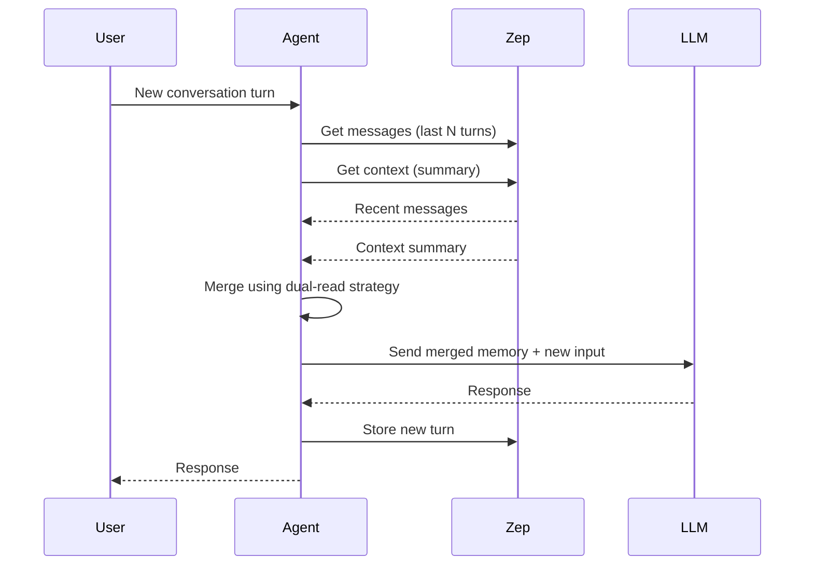

Zep memory APIs provide both recent `messages` and compressed `context` summaries, enabling agents to access both short-term and long-term memory efficiently.

```python
from praisonaiagents import Agent

agent = Agent(
    name="memory-assistant",
    instructions="Remember prior turns using Zep memory.",
    memory={"provider": "zep", "session_id": "demo-session"},
)
agent.start("What did we decide about the roadmap yesterday?")
```

The user continues a thread; Zep returns recent messages and rolled-up context to the agent.

```mermaid
graph LR
    subgraph "Zep Memory Architecture"
        Input[📋 User/Assistant Turns] --> Pipeline[🔄 Zep Ingestion Pipeline]
        Pipeline --> Messages[💬 Message Store]
        Pipeline --> Graph[🕸️ Graph/Episodes]
        Pipeline --> Summarizer[📝 Summarizer Worker]
        
        Messages --> API[🔌 Tool/API Response]
        Summarizer --> API
        
        API --> MessagesOut[📋 "messages": chronological]
        API --> ContextOut[🧠 "context": narrative summary]
    end
    
    classDef input fill:#6366F1,stroke:#7C90A0,color:#fff
    classDef process fill:#F59E0B,stroke:#7C90A0,color:#fff
    classDef output fill:#10B981,stroke:#7C90A0,color:#fff
    
    class Input input
    class Pipeline,Graph,Summarizer process
    class Messages,API,MessagesOut,ContextOut output
```

## Quick Start

<Steps>
<Step title="Install Zep Client">
```python
pip install zep-python
```

<Note>
Set `ZEP_API_URL` and `ZEP_API_KEY` as environment variables. Get your API key from your [Zep dashboard](https://app.getzep.com).
</Note>
</Step>

<Step title="Basic Memory Retrieval">
```python
import os
from praisonaiagents import Agent
from zep_python import ZepClient

# Initialize Zep client
zep_client = ZepClient(api_url=os.environ["ZEP_API_URL"], api_key=os.environ["ZEP_API_KEY"])

def get_memory_context(session_id: str, user_id: str):
    """Retrieve both messages and context from Zep"""
    # Get recent messages (authoritative for short-horizon recall)
    messages = zep_client.memory.get_messages(
        session_id=session_id,
        limit=10  # Last 10 turns
    )
    
    # Get context summary (compressed long-term memory)
    context = zep_client.memory.get_context(
        session_id=session_id,
        user_id=user_id
    )
    
    return messages, context

agent = Agent(
    name="Memory Assistant",
    instructions="Use both recent messages and long-term context effectively"
)
```
</Step>

<Step title="Dual-Read Strategy">
```python
def merge_memory_sources(session_id: str, user_id: str) -> str:
    """Recommended merge policy for Zep memory"""
    messages, context = get_memory_context(session_id, user_id)
    
    # Build deterministic timeline
    memory_prompt = "[system note: chronological messages follow]\n"
    
    # Add recent messages (never silently drop)
    for msg in messages:
        memory_prompt += f"<message author={msg.role}>{msg.content}</message>\n"
    
    # Add long-term context summary
    if context.summary:
        memory_prompt += "\n[system note: long-term distilled context]\n"
        memory_prompt += f"<summary>{context.summary}</summary>\n"
    
    return memory_prompt
```
</Step>
</Steps>

---

## How It Works



| Memory Type | Purpose | Freshness | Use Case |
|-------------|---------|-----------|----------|
| **Messages** | Short-horizon recall | Real-time | Recent conversations, immediate context |
| **Context** | Long-term memory | May lag in cloud | Historical facts, user preferences |

---

## Agent Integration Patterns

<Tabs>
<Tab title="Time Window Strategy">
```python
from datetime import datetime, timedelta

def get_windowed_memory(session_id: str, hours: int = 24):
    """Get messages from specific time window + context"""
    cutoff = datetime.now() - timedelta(hours=hours)
    
    # Recent messages within time window
    messages = zep_client.memory.get_messages(
        session_id=session_id,
        created_after=cutoff
    )
    
    # Context for everything before window
    context = zep_client.memory.get_context(session_id=session_id)
    
    return messages, context

agent = Agent(
    name="Windowed Memory Agent",
    instructions="Use 24-hour message window with historical context"
)
```
</Tab>

<Tab title="Token-Limited Strategy">
```python
def get_token_limited_memory(session_id: str, max_tokens: int = 2000):
    """Balance messages vs context based on token budget"""
    context = zep_client.memory.get_context(session_id=session_id)
    context_tokens = estimate_tokens(context.summary)
    
    # Reserve tokens for context, use remainder for messages
    available_tokens = max_tokens - context_tokens
    message_limit = available_tokens // 50  # ~50 tokens per message
    
    messages = zep_client.memory.get_messages(
        session_id=session_id,
        limit=max(message_limit, 5)  # At least 5 messages
    )
    
    return messages, context

def estimate_tokens(text: str) -> int:
    """Rough token estimation (4 chars ≈ 1 token)"""
    return len(text) // 4 if text else 0
```
</Tab>

<Tab title="Smart Deduplication">
```python
def deduplicated_memory(session_id: str):
    """Handle overlapping content between messages and context"""
    messages = zep_client.memory.get_messages(session_id=session_id)
    context = zep_client.memory.get_context(session_id=session_id)
    
    # Check if context already includes recent messages
    recent_content = " ".join([msg.content for msg in messages[-3:]])
    
    if context.summary and recent_content in context.summary:
        # Context already includes recent messages, use older messages only
        messages = messages[:-3]
    
    return messages, context
```
</Tab>
</Tabs>

---

## Failure Modes & Solutions

<AccordionGroup>
<Accordion title="Summary Lag Issue">
**Symptom:** Agent forgets recent conversation turns

**Cause:** Cloud Zep deployments may have lag between message ingestion and summary generation

**Solution:**
```python
def lag_resistant_memory(session_id: str):
    """Always prioritize raw messages over potentially stale context"""
    messages = zep_client.memory.get_messages(
        session_id=session_id,
        limit=20  # Larger window for safety
    )
    
    context = zep_client.memory.get_context(session_id=session_id)
    
    # Verify context freshness
    if messages and context.last_updated:
        latest_message_time = messages[0].created_at
        if context.last_updated < latest_message_time:
            # Context is stale, rely more on messages
            return messages, None
    
    return messages, context
```
</Accordion>

<Accordion title="High Token Usage">
**Symptom:** Hitting LLM context limits due to verbose memory

**Cause:** Including both full message history and redundant context

**Solution:**
```python
def compressed_memory(session_id: str, target_tokens: int = 1500):
    """Use sliding window + compressed remainder"""
    # Always include last 5 messages (critical recent context)
    recent_messages = zep_client.memory.get_messages(
        session_id=session_id,
        limit=5
    )
    
    # Use context for older history
    context = zep_client.memory.get_context(session_id=session_id)
    
    # Estimate and truncate if needed
    total_tokens = (
        sum(estimate_tokens(msg.content) for msg in recent_messages) +
        estimate_tokens(context.summary or "")
    )
    
    if total_tokens > target_tokens:
        # Reduce context summary length
        max_context_tokens = target_tokens - sum(estimate_tokens(msg.content) for msg in recent_messages)
        truncated_context = truncate_to_tokens(context.summary, max_context_tokens)
        context.summary = truncated_context
    
    return recent_messages, context
```
</Accordion>

<Accordion title="Redundant Verbosity">
**Symptom:** Duplicate information from messages and context overlap

**Cause:** Context summary includes details already present in recent messages

**Solution:**
```python
def non_redundant_memory(session_id: str):
    """Intelligent deduplication of memory sources"""
    messages = zep_client.memory.get_messages(session_id=session_id, limit=10)
    context = zep_client.memory.get_context(session_id=session_id)
    
    if not context.summary:
        return messages, context
    
    # Extract key topics from recent messages
    recent_topics = extract_key_topics([msg.content for msg in messages])
    
    # Filter context to exclude recently covered topics
    filtered_context = filter_context_by_topics(
        context.summary, 
        exclude_topics=recent_topics
    )
    
    context.summary = filtered_context
    return messages, context

def extract_key_topics(messages: list) -> set:
    """Extract key topics/entities from recent messages"""
    # Implementation depends on your NLP approach
    # Could use keyword extraction, NER, etc.
    pass

def filter_context_by_topics(summary: str, exclude_topics: set) -> str:
    """Remove redundant topics from context summary"""
    # Implementation depends on your filtering strategy
    pass
```
</Accordion>
</AccordionGroup>

---

## Configuration Options

| Option | Type | Default | Description |
|--------|------|---------|-------------|
| `api_url` | `str` | Required | Zep server URL |
| `api_key` | `str` | Required | Authentication key |
| `session_id` | `str` | Required | Unique session identifier |
| `user_id` | `str` | Optional | User identifier for context |
| `message_limit` | `int` | `10` | Maximum recent messages to retrieve |
| `context_window_hours` | `int` | `24` | Time window for message retrieval |

---

## Best Practices

<AccordionGroup>
<Accordion title="Memory Strategy Selection">
**Choose the right strategy based on your use case:**

- **Chat Applications**: Use time window strategy (24-48 hours)
- **Task-Oriented Agents**: Use token-limited strategy with higher message priority
- **Long-Running Sessions**: Use smart deduplication to avoid redundancy
- **Real-Time Systems**: Always fetch messages first, context as fallback
</Accordion>

<Accordion title="Error Handling">
**Implement robust fallbacks:**

```python
def robust_memory_retrieval(session_id: str):
    """Fail gracefully when Zep is unavailable"""
    try:
        messages = zep_client.memory.get_messages(session_id=session_id)
        context = zep_client.memory.get_context(session_id=session_id)
        return messages, context
    except Exception as e:
        logger.warning(f"Zep retrieval failed: {e}")
        # Fallback to local cache or simplified memory
        return get_fallback_memory(session_id)
```
</Accordion>

<Accordion title="Performance Optimization">
**Optimize for your deployment:**

- **Batch Operations**: Retrieve memory for multiple sessions at once
- **Caching**: Cache context summaries that don't change frequently
- **Async Operations**: Use async Zep client for better throughput
- **Monitoring**: Track summary lag and adjust strategies accordingly
</Accordion>

<Accordion title="Testing Memory Integration">
**Validate your memory strategy:**

```python
def test_memory_consistency(session_id: str):
    """Test that recent information isn't lost to summary lag"""
    # Add a test message
    test_content = f"Test message at {datetime.now()}"
    zep_client.memory.add_message(session_id, "user", test_content)
    
    # Immediately retrieve memory
    messages, context = get_memory_context(session_id, "test_user")
    
    # Verify test message is in recent messages
    recent_content = [msg.content for msg in messages]
    assert test_content in recent_content, "Recent message lost to summary lag"
```
</Accordion>
</AccordionGroup>

---

## Related

<CardGroup cols={2}>
<Card title="Memory Systems" icon="database" href="/docs/features/advanced-memory">
  Core memory concepts and patterns
</Card>
<Card title="Agent Configuration" icon="user" href="/docs/features/agent-profiles">
  Agent setup and configuration
</Card>
</CardGroup>