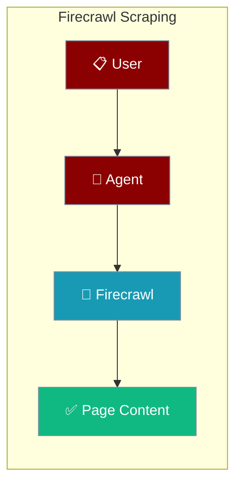
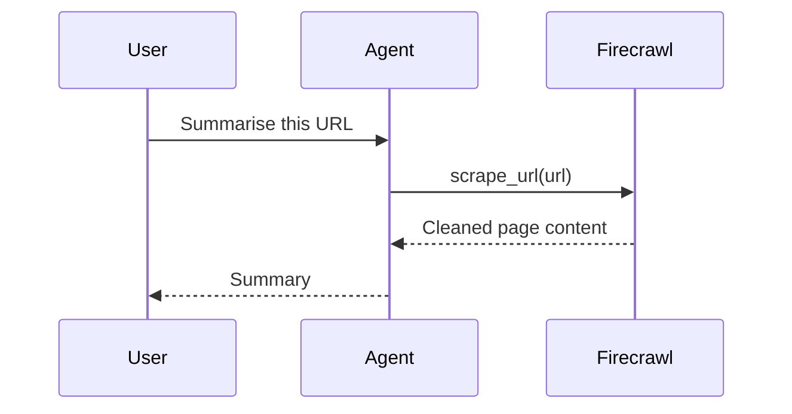

Give an Agent a Firecrawl scraping tool so it can read and summarise any web page.

```python
from praisonaiagents import Agent

def scrape_page(url: str) -> str:
    """Scrape and return the main content of a web page."""
    from firecrawl import FirecrawlApp
    app = FirecrawlApp(api_url="http://localhost:3002")
    return app.scrape_url(url=url)["content"]

agent = Agent(instructions="Summarise web pages", tools=[scrape_page])
agent.start("Summarise https://praison.ai")
```



# Firecrawl PraisonAI Integration

<div className="relative w-full aspect-video">
  <iframe
    className="absolute top-0 left-0 w-full h-full"
    src="https://www.youtube.com/embed/UoqUDcLcOYo"
    title="YouTube video player"
    allow="accelerometer; autoplay; clipboard-write; encrypted-media; gyroscope; picture-in-picture"
    allowFullScreen
  ></iframe>
</div>

## Firecrawl running in Localhost:3002

```python
from firecrawl import FirecrawlApp
from praisonai_tools import BaseTool
import re

class WebPageScraperTool(BaseTool):
    name: str = "Web Page Scraper Tool"
    description: str = "Scrape and extract information from a given web page URL."

    def _run(self, url: str) -> str:
        app = FirecrawlApp(api_url='http://localhost:3002')
        response = app.scrape_url(url=url)
        content = response["content"]
        # Remove all content above the line "========================================================"
        if "========================================================" in content:
            content = content.split("========================================================", 1)[1]

        # Remove all menu items and similar patterns
        content = re.sub(r'\*\s+\[.*?\]\(.*?\)', '', content)
        content = re.sub(r'\[Skip to the content\]\(.*?\)', '', content)
        content = re.sub(r'\[.*?\]\(.*?\)', '', content)
        content = re.sub(r'\s*Menu\s*', '', content)
        content = re.sub(r'\s*Search\s*', '', content)
        content = re.sub(r'Categories\s*', '', content)

        # Remove all URLs
        content = re.sub(r'http\S+', '', content)
        
        # Remove empty lines or lines with only whitespace
        content = '\n'.join([line for line in content.split('\n') if line.strip()])

        # Limit to the first 1000 words
        words = content.split()
        if len(words) > 1000:
            content = ' '.join(words[:1000])
        
        return content
```

## How It Works

The Agent calls the Firecrawl tool with a URL, Firecrawl fetches and cleans the page, and the Agent summarises the result.



## Best Practices

<AccordionGroup>
<Accordion title="Run Firecrawl locally for privacy">
Point `FirecrawlApp(api_url="http://localhost:3002")` at a local Firecrawl instance to keep scraped data on your machine.
</Accordion>

<Accordion title="Trim content before the model reads it">
Strip menus, URLs, and boilerplate and cap the length so the model sees only the relevant text.
</Accordion>

<Accordion title="Type the tool function">
Add a type hint and docstring so the Agent builds the correct tool schema for the model.
</Accordion>
</AccordionGroup>

## Related

<CardGroup cols={2}>
  <Card title="Tools" icon="wrench" href="/docs/tools">
    Learn how agents call tools.
  </Card>
  <Card title="Quick Start" icon="bolt" href="/docs/quickstart">
    Build your first agent.
  </Card>
</CardGroup>