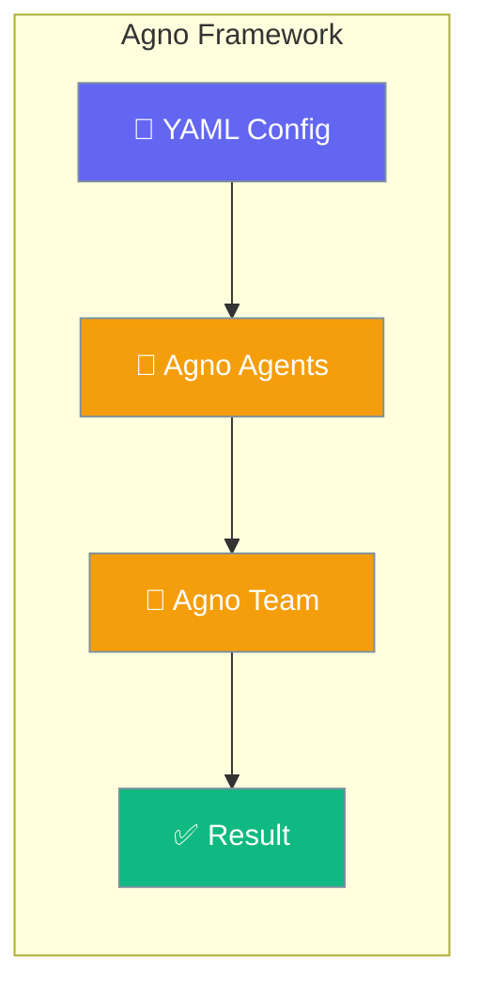

Use `framework: agno` in agents YAML to execute roles and tasks through the [Agno](https://github.com/agno-agi/agno) adapter in `praisonai-frameworks`.



<Note>
Requires `praisonai-frameworks` **0.1.8+**. Install with `pip install "praisonai[agno]"` or `pip install "praisonai-frameworks[agno]"`.
</Note>

## Quick Start

<Steps>

<Step title="Install">
```bash
pip install "praisonai[agno]"
export OPENAI_API_KEY=your-key
```
</Step>

<Step title="Create agents.yaml">
```yaml
framework: agno
topic: Quick task
roles:
  helper:
    role: Helper
    goal: Answer briefly
    backstory: Helpful assistant
    tasks:
      answer:
        description: Reply with exactly OK.
        expected_output: OK
```
</Step>

<Step title="Run">
```bash
praisonai agents.yaml --framework agno
```
</Step>

</Steps>

## Supported patterns

| Phase | Pattern | Status |
|-------|---------|--------|
| 1 | Single role, single task | Supported |
| 2 | Sequential tasks with `context:` | Supported |
| 3 | `handoff.to` (single task → Team route) | Supported |

## Handoffs

Use `handoff.to` with a single router task; specialists are routed via Agno `Team(mode=route)`:

```yaml
framework: agno
topic: language help
roles:
  triage:
    role: Triage Agent
    handoff:
      to:
        - English Agent
    tasks:
      route:
        description: Help with {topic}
  english:
    role: English Agent
    goal: Reply in English only
    backstory: English specialist.
```

Multi-task configs with `handoff.to` fall back to sequential execution.

## Limitations

- Sync `run()` only
- Workflow YAML does not support `framework: agno` — use agents YAML

See also: [Framework Adapter Plugins](/docs/features/framework-adapter-plugins)
