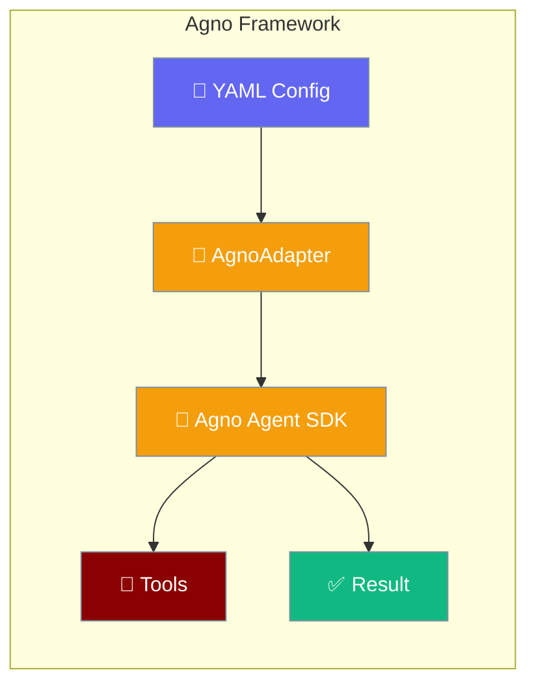
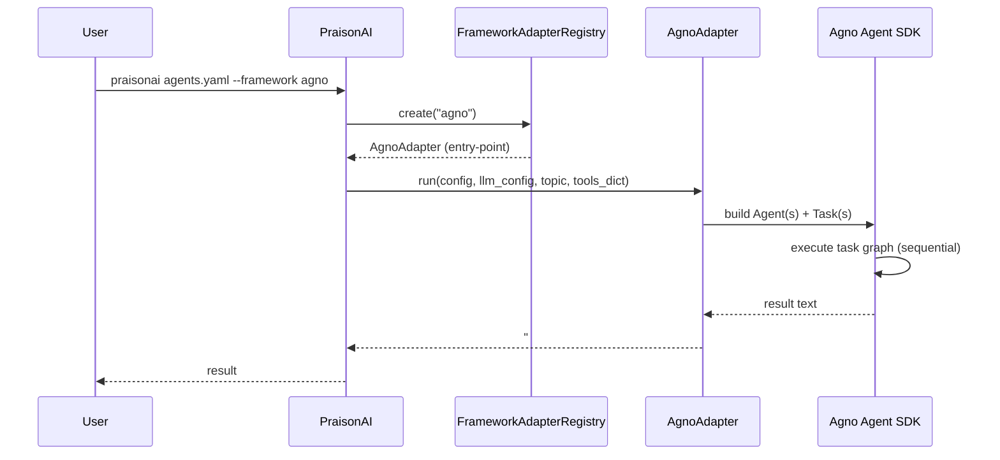

`framework: agno` runs the [Agno](https://docs.agno.com) agent SDK through PraisonAI's YAML and CLI, giving you Agno's sequential task pipeline without changing your YAML workflow.

<Note>
Need a framework that isn't listed here? See [Framework Adapter Plugins](/docs/features/framework-adapter-plugins) to register your own via Python entry points.
</Note>



## Quick Start

<Steps>

<Step title="Install">

<Warning>
`praisonai-frameworks 0.1.6` must be published to PyPI before these install instructions will resolve. If you see a resolver error pinning to an earlier version of `praisonai-frameworks`, the release may not yet have landed — check [https://pypi.org/project/praisonai-frameworks/#history](https://pypi.org/project/praisonai-frameworks/#history).
</Warning>

```bash
pip install "praisonai[agno]"
# pulls praisonai-frameworks[agno]>=0.1.6 transitively
```

</Step>

<Step title="Create agents.yaml">

```yaml
framework: agno
topic: math
roles:
  calculator:
    role: Calculator
    goal: Compute exactly
    backstory: Return only the numeric answer.
    tasks:
      add:
        description: What is 3 + 3?
        expected_output: "6"
```

</Step>

<Step title="Run">

```bash
# Set OPENAI_API_KEY in your shell first — Agno uses LiteLLM internally;
# the default model gpt-4o-mini reads OPENAI_API_KEY from the environment.
export OPENAI_API_KEY=sk-...
praisonai agents.yaml --framework agno
```

<Note>
Pass `--framework agno` **or** set `framework: agno` in the YAML — not both, but at least one.
</Note>

</Step>

</Steps>

---

## How Agno Works



---

## Sequential Task Context

Tasks can reference outputs of earlier tasks via `context: [task_name]`:

```yaml
framework: agno
topic: numbers
roles:
  writer:
    role: Writer
    goal: Write numbers only
    backstory: Concise writer
    tasks:
      draft:
        description: Reply with only the number 3.
        expected_output: "3"
      polish:
        description: Add 3 to the previous result. Reply with only the number.
        expected_output: "6"
        context:
          - draft
```

<Note>
This is the same `context:` semantics as other framework wrappers. The AgnoAdapter converts the dependency list into the SDK's task input wiring. This corresponds to the `sequential_execution` capability flag surfaced by `praisonai doctor` (see below).
</Note>

---

## Handoffs Are Not Supported

<Warning>
**Agno does not support YAML `handoff:` blocks.** The `AgnoAdapter` runtime card declares `supports_handoff=False` (`runtime_checks.py`). If you need multi-agent handoffs in YAML, choose `framework: praisonai`, `autogen_v4`, or another framework that supports handoffs (see [Handoffs](/docs/features/handoffs) for details).
</Warning>

---

## The `sequential_execution` Capability Flag

Agno is the first runtime in PraisonAI to declare an explicit `sequential_execution` capability in its `RuntimeInfo`. The other runtimes (crewai, autogen, langgraph, openai_agents, praisonai) list only `agent_creation` and `tool_execution`; Agno adds `sequential_execution` to formalise that its adapter chains tasks through the SDK's own sequential pipeline.

| Capability flag | Meaning |
|----------------|---------|
| `agent_creation` | Create and manage agents |
| `tool_execution` | Execute tools and functions |
| `sequential_execution` | Sequential task execution (new for Agno) |

Check Agno's runtime info with the doctor command:

```bash
$ praisonai doctor
✓ Runtime 'agno' available
  name: Agno
  capabilities: agent_creation, tool_execution, sequential_execution
  supports_handoff: False
  supports_tool_loop: True
```

---

## Workflow YAML Rejection

<Warning>
`framework: agno` in a workflow YAML (the `steps:` style) raises:

```
ValueError: framework='agno' in workflow YAML is not supported for workflow execution.
```

Confirmed by unit test `test_validate_workflow_framework_rejects_agno`. Use the `roles:` agents.yaml shape shown in Quick Start above.
</Warning>

---

## Direct Adapter Use (Advanced)

Most users should use the CLI / YAML flow above. For programmatic use:

```python
import os
from praisonai_frameworks.agno.adapter import AgnoAdapter

config = {
    "framework": "agno",
    "topic": "Quick test",
    "roles": {
        "helper": {
            "role": "Assistant",
            "goal": "Answer briefly",
            "backstory": "Helpful assistant",
            "tasks": {
                "answer": {
                    "description": "Reply with exactly the word OK.",
                    "expected_output": "OK",
                }
            },
        }
    },
}
llm_config = [{"model": "gpt-4o-mini", "api_key": os.environ["OPENAI_API_KEY"]}]
result = AgnoAdapter().run(config, llm_config, "Quick test", tools_dict={})
# result starts with "### Agno Output ###"
```

---

## Verify Installation

```python
from praisonai._framework_availability import is_available

if is_available("agno"):
    print("Agno is installed and importable")
```

`_agno_probe()` checks three things in order:

1. `importlib.metadata.distribution("agno")` — the PyPI dist must be installed.
2. `importlib.util.find_spec("agno")` — the `agno` import namespace must be discoverable.
3. `from agno.agent import Agent` — the SDK's `Agent` class must import without error.

A `True` from `is_available("agno")` guarantees the adapter can run, not just that the package is on disk.

---

## Pip Extras Reference

| Extra | Installs | Required for |
|-------|----------|--------------|
| `praisonai[agno]` | `praisonai-frameworks[agno]>=0.1.6`, `praisonai-tools>=0.1.0` | Probe + doctor recognition + adapter dispatch for Agno |
| `praisonai-frameworks[agno]` (transitive) | Agno adapter implementation registered via entry-point group, plus the `agno` PyPI dist | Actually executing `framework: agno` |

<Note>
The YAML/CLI/probe key is plain `agno` (no underscore vs hyphen mismatch). Unlike `openai_agents` ↔ `openai-agents`, Agno's PyPI dist name and YAML name are both `agno`.
</Note>

---

## Troubleshooting

**`framework='agno' is not a valid choice`** — older PraisonAI versions hardcoded `choices=["praisonai","crewai","autogen"]` for the `--framework` CLI flag. Upgrade to a version with the dynamic registry-driven choices, or omit `--framework` and rely on the YAML field.

**`Framework 'agno' was requested but is not installed`** — the install-hint is `pip install 'praisonai-frameworks[agno]'`. Use `praisonai[agno]` from your project instead.

**`ValueError: framework='agno' in workflow YAML is not supported for workflow execution`** — surfaced by `validate_workflow_framework`. Switch to the `roles:` agents.yaml shape; the steps-style workflow engine only supports `framework: praisonai`.

**"No framework is installed" with multi-line install hints** — the CLI prints a four-line install menu (crewai / autogen / openai-agents / agno). If you see this, no framework is installed; pick one extra and re-run.

**PyPI: `praisonai-frameworks[agno]>=0.1.6` not found** — if you see a resolver error pinning to an earlier version of `praisonai-frameworks`, the release hasn't landed yet. Check [https://pypi.org/project/praisonai-frameworks/#history](https://pypi.org/project/praisonai-frameworks/#history).

---

## Best Practices

<AccordionGroup>
  <Accordion title="When to pick agno over praisonai / crewai / openai_agents">
    Agno is the right choice when you want the Agno SDK's own sequential task pipeline (formalised as the `sequential_execution` capability) and you don't need handoff routing. For handoffs, use `openai_agents` or `praisonai`.
  </Accordion>

  <Accordion title="Use the roles: format, not steps:">
    The `steps:` workflow format is explicitly rejected at validation with `ValueError`. Always use the `roles:` agents.yaml shape for Agno.
  </Accordion>

  <Accordion title="Use context: to express task dependencies">
    Keep the YAML declarative — use `context: [task_name]` to express dependencies between tasks. The AgnoAdapter wires the Agno sequential pipeline from this declaration.
  </Accordion>

  <Accordion title="Parse results by the output sentinel">
    Every run returns text beginning with `### Agno Output ###`. Downstream parsers can split on this string to extract just the run output.
  </Accordion>
</AccordionGroup>

---

## Related

<CardGroup cols={2}>
  <Card title="AutoGen" icon="robot" href="/docs/framework/autogen">
    AutoGen — adjacent multi-framework wrapper
  </Card>
  <Card title="CrewAI" icon="users" href="/docs/framework/crewai">
    CrewAI framework integration
  </Card>
  <Card title="PraisonAI Agents" icon="user" href="/docs/framework/praisonaiagents">
    PraisonAI Agents native framework
  </Card>
  <Card title="Handoffs" icon="arrow-right-left" href="/docs/features/handoffs">
    Multi-agent handoffs — choose a framework that supports handoffs
  </Card>
  <Card title="Framework Availability" icon="check-circle" href="/docs/features/framework-availability">
    Probe API for checking framework installation
  </Card>
  <Card title="Framework Adapter Plugins" icon="plug" href="/docs/features/framework-adapter-plugins">
    Entry-point registration for custom adapters
  </Card>
</CardGroup>
